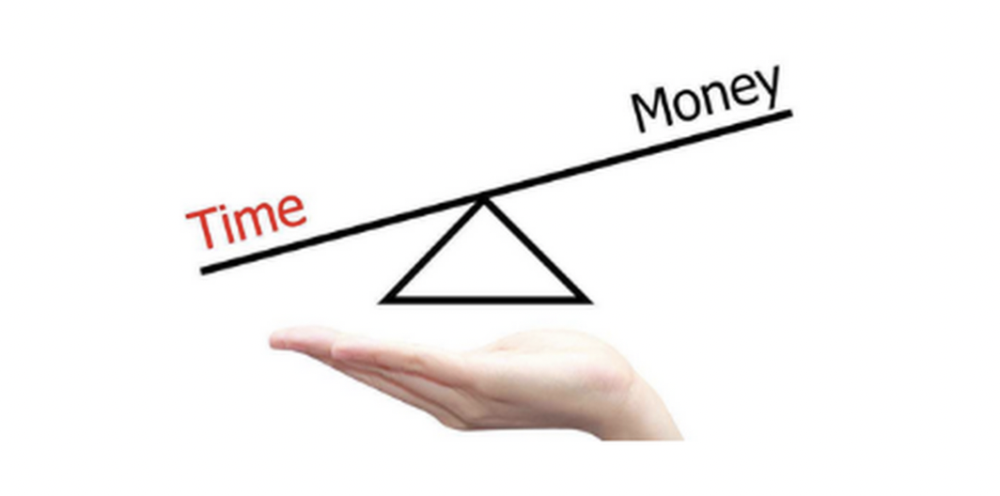

⼀个⼈⼀⽣能积累多少钱, 不是取决于他能够赚多少钱, ⽽是取决于他如何投资理财, ⼈找钱不如钱找钱, 要知道让钱为你⼯作, ⽽不是你为钱⼯作.——来⾃沃伦·巴菲特

## 时间的⾦钱价值

⼤家有没有发现我们在下⾬天的时候很难叫到出租⻋, 天⽓好的时候特别容易叫⻋. 这是为什么呢?

2017 年诺⻉尔经济学奖得主理查德·塞勒的研究团队观察出租⻋司机的⾏为.

发现很多出租⻋司机, 旺季时, 早上 8 点出⻋, 下午 3 点⼀看, 钱赚得差不多了, 于是便收⼯回家了.

但在淡季, 到了晚上 8 点, 也没多少乘客, ⼀想到公司的份⼦钱, 还有油钱, 觉得会亏本. 于是, ⼀直在街上转悠, ⼯作到很晚.

这种⾏为是不是挺傻的?

正确的做法应该是怎样的?

应该是旺季拼命⼯作, 淡季没那么忙了, 可以多休息⼀会⼉, 陪伴家⼈, 养养身体, 做点喜欢的事……

那为什么司机会出现这种错误?

当我们只盯着钱时, 这个世界上的很多维度、很多真相, 我们是看不到的.

于是, 我们很容易做出那种愚蠢的决策.

这就是理查德·塞勒提出来的"狭窄框架效应".

出租⻋司机陷⼊"每天收⼊"的⼩账中, ⽽忘记去算⼤账, 因此从整体收益来看, 他们吃了⼤亏. 在容易赚钱的时候没有赚到钱, 在不容易赚钱的时候浪费了⼤量的时间.

班班看过⼀个⽂章提到这么⼀句话:"⼀个⼈⼀⽣的本质是⼀段时间"

时间可能是上天赐予世⼈最公平的东⻄. 富豪的财产可以⾼出普通⼈数千万倍, 但其拥有的时间(寿命)却⽆法⾼出平均寿命⼀倍以上.

很多⼈不富裕其实就是陷⼊⾃⼰思维的局限性(我们姑且把这种思维称为"穷⼈思维", ⼤家不要介意哈, 穷⼈思维不是指穷⼈才具有的思维, ⽽是阻⽌我们变富的思维局限).

班班再来说⼀个⼩故事~

有⼀次⼩明去游乐场, 最热⻔的云霄⻜⻋已经挂上了"此处排队约需⼀⼩时"的牌⼦.⼩明想了想, 1 个⼩时有点久, 但⾃⼰尚能忍受, 于是加⼊了队伍.

⼀⼩时后, 当⼩明排到队伍的最前⽅时, ⼀位⻛⼀样的男⼦跟他说, 愿意出 200 元购买他的位置.

问题来了~如果你是⼩明, 你会不会让出这个位置?

那我们来看看⼩明该怎么做选择?

假设⼩明的⽉薪约 5000 元, 扣税再除掉休息⽇等, ⽇薪⼤约是 200 元.

排⼀个⼩时队, 已经相当于⼯作了⼋⼩时, 这个条件很诱⼈, 理智的选择应该是接受这笔交易. 因为, 8 ⼩时肯定是⼤于 1 时的.

好了, 班班⼜要问下⼀个问题了, ⼤家觉得出价 200 元的男⼦是不是冤⼤头?

这个问题的关键就是, 我们要思考这个⻛⼀样的男⼦的时薪是多少, 如果⾼于 200 就不是冤⼤头, 如果低于 200 就是冤⼤头.

这就是量化思维, 凡事不依靠感觉, ⽽是先算⼀算. 量化思维在投资和⽣活中的应⽤也⽐较多, 以后有机会班班和⼤家多讲讲.

我们在⽇常⽣活中, 对于开销的理解, 多以⾦钱来量化, 很少有⼈会把时间也计算在内.

举个例⼦, 有段时间班班频频收到微信好友发来的拼多多砍价连接, 为省⼏⼗块钱, 不断在朋友圈⾥求⼈砍价, 转发, 不仅仅打扰了别⼈破坏了⼈脉关系, 也浪费了⾃⼰⼤量的时间.

⼤家想想你每⼩时多少钱呢? 花这个时间去砍价是否值得呢?

还有⼀群⼈, 在每年的双 11 时, 看到很多东⻄都有优惠券, 于是不管⾃⼰⽤不⽤得着, 就⼼潮澎湃地付了钱, 还特别⾼兴, 以为⾃⼰占了商家的便宜.

先别⾼兴的太早, ⾸先, 抢优惠券是需要花时间的, 如果你把抢优惠券的时间⽤在⼯作上, 那你想想是⼯作赚的钱多, 还是抢 10 多天优惠券, 省的钱的多?

其次, 就算是你⽤⽐平常低的价格, 买了某些商品, 可是你有没有想过, 这东⻄真的是你需要的吗?

⽐如说, 你花 200 块买了⼀件平常卖 300 的⾐服, 但是买了之后就没怎么穿过, 那么你是省了 100 块呢, 还是亏了 200 块?

⼤多数⼈在⼯作和⽣活中, 更多地注意⾦钱, ⽽很少注意"时间".

其实每个⼈的时间才是最宝贵的. 你的时间是最有价值的.

前⾯我提到, 富⼈的财产可以⾼出普通⼈数千万倍, 但是他们拥有的时间却⽆法⾼出普通⼈⼀倍

所以事实上来说, 应该是这样的

时间⼤于⾦钱

但当⼀个⼈处于⻓期性的资源稀缺中, ⼤脑中的注意⼒被稀缺资源过分占据, 就会引起认知和判断⼒的全⾯下降, 更加重视短期利益, 忽略⻓期利益.

⽐如你缺钱, 就总觉得时间富余, 但是⾦钱稀缺, 特别当你处于为了满⾜⽣活所需, 不得不精打细算时, 基本会很难⽤理性的⻆度去考虑投资和未来的发展

在⾯临选择的时候, 会经常因为钱, 更看重短期利益

不少⼈总是⼩⼼翼翼地省下⼀笔物质财富, 却浪费了⼤把时间

钱不是省出来的, ⽽是不断利⽤有限的时间快速提⾼⾃⼰的价值, 我们值钱了, 钱才会来.

这⾥不妨问问⾃⼰多久没有提升⾃⼰的能⼒了? 刷朋友圈的时间多? 还是学习的时间多呢? 逛淘宝的时间多? 还是学习的时间多呢?

这就是我们常说的贫穷会限制想象, 其实贫穷真的限制了很多东⻄, 尤其是思维上的"贫穷"

⽹上看过有⼀个让班班印象深刻的故事, ⼤体是⼀个⼈因为⼩时候家⾥很穷, 所以导致他做任何选择时, 都是从钱的⻆度出发.

他在报考⼤学时, 因程序员⼯资⾼, 就去学了计算机. 毕业后⼀直在互联⽹⾏业混, 经常会因为⼀两千的⼯资涨幅⽽跳槽, 很少能在⼀家公司呆很⻓时间.

在他⼯作早期, 有好⼏家公司都给期权和股份, 但他总因为其它公司多给⼏千块的⼯资⽽跳槽, 因此也错失了好多因为公司上市⽽实现财富⾃由的机会.

他不少前同事都已经财务⾃由了, ⽽他在 40 多岁的年纪⾥, ⼯资只有⼩ 1 万, 每天还在打⼯、加班、换⼯作, 就连升职也经常遇到瓶颈.

回头看看, 他明明有很多次改变⼈⽣的机会, 却⼀次⼜⼀次因为⼀点蝇头⼩利⽽错过了.

想想真是好可惜, 但再想⼀想, 这个结果⼜是必然的, 因为决定⼀个⼈贫穷或富有的根本原因就是——思维.

所以, 我们强调, 凡事都是思维先⾏, 技巧其后, 尽量花时间去武装⼤脑, ⽽不是为了节约开⽀⽽浪费⼤把时间, 因为时间才是最珍贵的,

有个⼩伙伴跟我说, 这个⽉给孩⼦报班花了 7000~其实这就是在为孩⼦的⼤脑投资啊~我们培养孩⼦, 曾经⽗⺟培养我们, 都是⼀种投资~

总结: 理财⼀定是思维先⾏, 有了理财的思维, 然后认真学习正确的投资⽅法, 才能事半功倍, 理财的第⼀个思维, 重视时间成本

## ⾦钱的时间价值

我们再来做个选择题, 以下两种情况, 哪种让你更不爽:

第⼀种: 跟同事⼩⽉逛街, 她遇⻅了⼼仪的包包, 可是身上钱没带够, 于是找你借了⼏百块

此后, 她好像⼀直没记起这件事情, 你暗示了好⼏次也没⽤, 最后不了了之, 其实当时那件包包你也很想要, 但你都没舍得花钱买下来

第⼆种: 好友⼩明要买房, ⼀时周转不开找你借了 20 万, 并约定半年后还款

半年后他如约还款, 但是却没有提利息之类的事情, 他既然没有给, 你当然也不好开⼝

来, ⼤家说说看, 哪种情况让你更不开⼼?

哈哈, 能理解⼤家的, 都有⾃⼰的考虑, 好, 我们抛开感情因素, 从量化的⻆度来看⼀下

20 万的半年利息是多少呢? 假设 2.5%的年利率(就是普通的银⾏存款), 200000\*2.5%\*0.5=2500 元

第⼀种情况是损失⼏百元, 第⼆种情况是损失 2500 元

所以, 通过量化⽐较的⽅式, 我们就知道第⼆种情况的损失更⼤, 因为⾦钱是有时间价值的

当然了, 现实中, 第⼆种朋友还是⽐较靠谱的, ⽐第⼀种朋友靠谱地多, 因为他遵守了约定

因此, 体现了⾦钱是有时间价值的

那么问题来了, 什么是⾦钱的时间价值? 为什么⾦钱会有时间价值? 如何计算⾦钱的时间价值?

### 1、什么是⾦钱的时间价值?

⾦钱的时间价值, 就是指当前所持有⼀定数量的货币, ⽐未来同等数量的货币具有更⾼的购买⼒. 说⼈话就是, 现在的钱⽐未来的钱更值钱.

举个⽐较典型的例⼦, 就是 30 年前的万元户.30 年前的⼀万元可以买 100 平⽶的房⼦, 但现在连 1 平⽶都买不到.

### 2、为什么⾦钱会有时间价值?

因为通货膨胀, 货币贬值了.

这个很⼼塞了, 但是如果我们现在只会存钱, 那后果其实是⼀样⼀样滴~

### 3、那我们该如何计算⾦钱的时间价值呢?

对于不同的⼈⽽⾔, ⾦钱的时间价值是不同的, 这取决于他们利⽤这笔钱的预期投资回报率.

说⼈话, 就是你希望这笔钱是换点吃的穿的⼝红包包, 还是给你下⼏个⾦蛋.(⾦蛋的概念参考《⼩狗钱钱》, 理解为利息即可)

如果你的预期投资回报率低于通货膨胀, 那么我相信⼤部分⼈都会选择即时消费.

相反, 如果你的预期投资回报率⾼于通货膨胀, 那么你就可能牺牲即时消费⽽选择投资.

这是⼈的天性, 都喜欢钱, 如果钱会越来越多, 当然会选择投资⽽不是消费.

如果现在你有 1 只鹅, 每天给你下 2 个蛋, 你还舍得宰鹅吃⾁吗?

所以, 对于同等财富积累, 同等收⼊⽔平的⼈来说, 投资能⼒越强, 即时消费的意愿也越低. 也就是说你的鹅越能下蛋, 你就越舍不得宰掉他~

难道传说中的越有钱越抠⻔就是这个原因

班班再⽤⼈话总结⼀下就是, 如果你的钱能帮你⽣钱, 你就舍不得花了, 会拿去⽣钱. 如果你的钱放着也是放着, 你就忍不住花花花~还要⾃我安慰说, 哎呀, 不花也会贬值的啦~

敲重点: 不理财不等于没⻛险, 通货膨胀其实就是最⼤的⻛险.

## 学习的时间成本

资⾦有时间成本, 学习也是有时间成本的,

在这个知识爆炸的年代, ⼤家都不缺知识的来源, 盲⽬地看书、学习是低效率的, 也是很浪费时间的, 如果想要跑赢⼤多数⼈, 我们就要学会清晰、⾼效地学习.

在此, 班班要⾃夸⼀下: 训练营的设⽴就是为了节约⼤家学习理财的时间成本.⽤ 14 天帮⼤家养成理财习惯, ⾛上正确的投资之路.

所以, 想好该如何利⽤好训练营进⾏⾼效的学习, 取得更好的学习效果了吗?

⽐如课前阅读笔记写了不?

读书做笔记, 没有强制⼀定要写的, 但有的⼩伙伴执⾏⼒很强, 效率也很⾼, 已经把笔记发给我了, 为你们点赞

⽽有的⼩伙伴觉得看书好麻烦, 我没什么时间, 不想写读后感, 就等着开营上课就好了

等到开营上课的时候, ⼜会有很多⼩伙伴说, 我⼯作忙、我有其他事, 没时间及时上课, 没时间阅读材料, 没时间听⾳频, 后⾯再补

等到所有课程都讲完了, 别⼈都学完了, 那些⼩伙伴可能已经不想补了... 因为内容太多了

本来训练营两周的课程可能需要⼀个⽉, 两个⽉甚⾄就是不了了之

蔡康永当年在微博上有段很经典的话:15 岁觉得游泳难, 放弃游泳, 到 18 岁遇到⼀个你喜欢的⼈约你去游泳, 你只好说"我不会耶"

18 岁觉得英⽂难, 放弃英⽂, 28 岁出现⼀个很棒但要会英⽂的⼯作, 你只好说"我不会耶"

⼈⽣前期越嫌麻烦, 越懒得学, 后来就越可能错过让你⼼动的⼈和事, 错过新⻛景

班班就话不多说, 时间只会减少, 只会越来越少, 过去这⼀秒, 就再也找不回来了, 既然来到训练营, 就逼迫⾃⼰把时间成本⽤到极致

希望⼤家在这⾥学习到的不仅仅是理财的知识, 更多的是通过此次的学习养成良好的学习习惯, 更好地打理⾃⼰的⽣活和⾃⼰的⼈⽣
