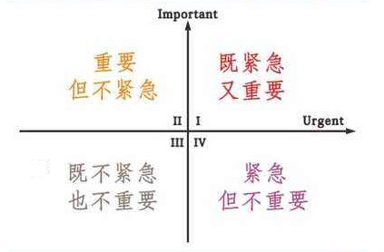

⼈的⼀⽣中, 将近三分之⼀的时间是⽤于睡觉的, 合理规划休息时间和⼯作时间, 有助于身体和头脑清醒, 事半功倍.

时间是这个世界上最公正公平的了, 对于每个⼈都不吝啬也不额外照顾, 每⼀分每⼀秒都不偏不倚的进⾏着.

但是也有的⼈可以充分利⽤好时间, ⼀分钟可以做别⼈两分钟, 甚⾄五分钟才可以完成的事情, 这就需要很好的管理时间.

鉴于⼤部分⼩伙伴都是⼯作之余来给⾃⼰充电的, 时间可能都不是很充裕, 这时候对时间的管理就显得尤为重要了.

所以班班今晚主要给⼤家分享⼏个关于时间管理的⼩窍⻔, 希望⼤家学了之后能够好好管理我们的时间, 最重要的是按时的集中精⼒的学习啦~

班班敲⿊板了哦, 笔记记起来~~~

## ⼀、时间四象限

1. 重要性程度
2. 紧急性程度

按照这两个维度同时进⾏划分, 可分为四个象限

给⼤家 1 分钟看看这个时间四象限哈

那这个⽅法怎么操作呢?

很简单, 我们⾸先要把⼀张纸分为四个象限, 在每个象限分别写下相对应的事情, ⽐如⼤家现在最重要⼜紧急的事情是学习理财课程等等, 然后按照以下原则处理即可.

### 处理原则:

1. 优先解决第⼀象限, 重要紧急赶紧做; ⽐如重要的会议.
2. 投资第⼆象限, 把主要的精⼒有重点地放在重要但不紧急这个"象限"上; ⽐如⼀个⻓期的学习计划.
3. ⾛出第三象限, 不紧急不重要有时间再做, 甚⾄可以不去做; ⽐如闲聊、发呆、刷微博和抖⾳.
4. 区分⼀四象限, 紧急不重要的事情, 第四象限对⼈们的欺骗性是最⼤的, 它很紧急的事实造成了它很重要的假象, 耗费了⼈们⼤量的时间.

我们要注意不要被第四象限的事情占⽤太多时间, ⽐如回复微信上的消息, ⽆谓的电话、打麻将三缺⼀.

## ⼆、⼆⼋原则

⼆⼋原则⼏乎是在所有领域都成⽴的

那什么是⼆⼋原则呢?

举个例⼦:

⽐如整个⾏业, 包括所有⾏业, 我们可以看到只有少部分⼈是能赚到钱的, ⼤部分⼈是赚不到钱的, 也就是 80%的钱被 20%的⼈赚了.

再⽐如, 假如你是⼀个做销售的销售⼈员, 你会发现你有很多客户, 但是少数的⼏个⼤客户, 也就 20%的客户贡献了你 80%的业绩, 这就叫做⼆⼋原则.

那么具体到时间管理领域, ⼈们也跟踪过, 也就是对任何⼀个⼈的整个学习或⼯作来说, 很有可能 70%-80%最重要的效果是从
20%的时间中产出的.

说明⼤部分的时间都被你浪费了, ⽽且可能是⽆意识中发⽣的.

### 两个很⼤的启示

这个⼆⼋原则给了我们两个很⼤的启示:

1. 找到时间浪费点, 然后解决和优化它.
2. 最好的时间放在产出最⼤的事情上.

什么是最好的时间呢?

时间虽然都是时间, 但是时间和时间是不⼀样的, ⽐如说同样是学习 1 个⼩时, 那你觉得早上学习 1 ⼩时和⼯作⼀整天后的晚上学习 1 ⼩时, 什么时候效率更⾼呢?

很明显是早上学习效率最⾼, 所以相对晚上来说, 早上是更好的时间. 当然也有同学晚上的效率⽐较⾼, 那么就把晚上的时间作为最好的时间哈.

什么是产出最⼤的事情呢?

也就是对你来说价值最⼤, 对你最重要的事情.

最好的时间放在产出最⼤的事情上, 是提⾼我们效率⾮常有⽤的⼀个⽅法;

班班来举个⼩栗⼦:

在实际⽣活中, 很多⼈醒来之后的 1-2 个⼩时的时间, 可能是刷刷朋友圈、看看微博、打打游戏, 1 个多⼩时⼀下⼦就过去了.

不是说刷朋友圈、看微博不好, 但是这些事情不需要我们注意⼒⾼度集中, 完全可以把它们挪到状态没那么好的时间点去做, 应该把效率最⾼的时间⽤到最重要、价值最⼤的事情上.

最关键的部分来了哦~~~

## 三、番茄⼯作法

这是弗朗⻄斯科·⻄⾥洛于 1992 年创⽴的⼀种⼯作⽅法. 虽然简单, 但是全世界有⾮常⾮常多的粉丝, 它被⼴泛应⽤且被证明是有效的.

### ⾸先我们来看番茄⼯作法解决什么问题?

其实它核⼼要解决的就是在⼯作时间段⾥⾯的低效问题, ⽽这种低效呢有很多表现, 给⼤家列举⼀些:

1. 缺乏统筹
2. 严重拖延
3. 难⼊状态
4. 想得太多做得太少

### 那番茄⼯作法怎么⽤呢?

番茄⼯作法的设计并不是随意设计出来的, ⽽是根据⼈类的 8 个规律设计的, 包括⼈的⽣物节律、仪式感、多动、⼯作记忆有限、视觉听觉、⼼流(⼀种⾼度专注, ⼀⼼⼀意的状态)、激励、拖延.

接下来⼤家可以试着⼀起做, ⾸先是⼯具准备:

计时⼯具(⽐如潮汐软件、闹钟等), 三张⽩纸, ⼀⽀铅笔或者⽔笔

然后在⼀张⽩纸上列出活动清单, 也就是要做啥事, 记得要简明扼要哦,

例如: 学习理财课程、打扫房间、买书、去公园玩、做饭

可以把⼤⼤⼩⼩的事情都列在上⾯, 当然⼀些鸡⽑蒜⽪的⼩事就不⽤写了, 这样⽐较浪费时间. 这张清单呢是⻓期性维护的, 想到什么就可以写上, 做完了就划掉.

然后每天早上抽出⼀张新的⽩纸, 写上当⽇待办, 从之前的活动清单中找出你准备当⽇要做完的事, 写在当⽇待办的纸上, 叫作当⽇计划.

这⾥很重的⼀个事情是⾃⼰要承诺只要是写在当⽇待办上的事情, 我今天⼀定要把它做完, 我在完成⼀件对⾃⼰对⼈⽣很重要的事, 我在很严肃的对待这件事情, 不是像开玩笑⾛过场⼀样对待这件事情.

注意咯, 活动清单中不⽤写⽇期, 但当⽇待办中要写⽇期!

### 番茄钟:

1、25 分钟⼀个番茄钟

就是 20 分钟内专注⼯作, 然后休息 5 分钟, 4 个循环为⼀组, 也就是 25 ﹡ 4 = 100 分钟, ⼀组循环后可以多休息⼀会⼉, ⼤概 20-30 分钟.

2、不可时间累加计算

就是⼀个番茄钟内只做⼀件事情, 如果做 A 事 15 分钟, ⼜去做 B 事, 再回来做 A 事 5 分钟, 不能算作⼀个番茄钟.

了解了这个概念之后, 我们该怎么做呢?

### ⾸先建⽴仪式感:

1. 时间开始⽴刻做
2. 钟声响起⽴⻢停
3. 番茄钟外只休息
4. 成功完成要表扬

⼩伙伴们可以在⼼⾥默念三遍哦~

### 然后确定执⾏顺序:

1. 当⽇清单⾥⾯找
2. 根据前⾯讲的⼆⼋原则和时间的四象限, 来确定做事情的先后顺序, 慢慢地可以靠⾃⼰的直觉来
3. 完成番茄钟打个 √, 没完成打 Х

注意要点:

1. 培养荣誉感(建⽴激励)
2. 番茄钟内只做⼀件事情(提前做完就强化)
3. 被中断就作废⼀个番茄钟
4. 时间上不能累加计算
5. 尽量保证⾃⼰的番茄钟不被打断

### 每天晚上回去做每⽇简要总结:

1. 完成了⼏个番茄钟
2. 失败了⼏个番茄钟
3. 为啥番茄钟失败了
4. 会不会完成某些事情消耗的番茄钟太多了, 这件事情是本事很难呢? 还是个⼈原因效率低? 或者知识掌握得不够到位? 找到异常消耗, 思考怎么在未来的时间做的好⼀些

## 四、沉浸式⼯作法

我们来回想⼀下, 有时候我们会觉得时间不够⽤, 每天都在忙忙碌碌, 但好像做的事⼜不是特别的多, ⽽有些⼈却好像能做好⼏个⼈的事.

为什么会这样呢?

因为我们可能做事的效率低, 那为什么会效率低呢?

看看下⾯典型的三种⼯作状况你们有没有遇到呢?

1. 经常被打断
2. 总是不专注
3. ⽼是在交叉

这三个问题总是会让⼯作效率下降, 那怎么把这三个问题解决呢? 那就要说到沉浸式⼯作法啦!

沉浸式⼯作法指的是当我们需要⼯作的时间, 能够迅速进⼊到⾼度专注的状态, 完全沉浸在⼯作⾥⾯, ⽽且能够坚持⽐较⻓的⼀段时间

怎么做到这种沉浸式⼯作法呢?

我们需要从四个⽅⾯去努⼒: 环境、⼯具、身体、⽅法

### 环境:

是影响⼯作专注最重要的因素, 我们需要尽⾃⼰的努⼒使周围环境的通⻛性好, 采光充⾜, 整洁, 低噪⾳.

### ⼯具:

可能有时候⼀些事情不是我们所能控制的, 那么我们需要借助于⼀些⼯具来辅助达到⽬标

第一个⼯具: 耳塞

外部环境⽆法改变的时候, 我们可以改变内部环境, 噪⾳⽐较⼤的时候, 可以使⽤防噪⾳⽿塞, 在淘宝搜索 3M1110 防噪⾳带线⽿塞, 我记得这个很便宜好像还不到 2 块钱, 软软的, 可以压缩后塞在⽿朵⾥会慢慢膨胀, 可以起到⼀定的隔⾳效果.

当然如果你使⽤后, 觉得这个还不能满⾜你的需求, 还有⼀种更⽜的主动降噪⽿塞(推荐的牌⼦是 BOSE QuietComfort5@20 有源消噪⽿机), ⽐较便携, 但是这个就⽐较贵了.

这个⽿机⼀个神奇的地⽅就是它会接收噪⾳, 然后发出和噪⾳完全相反的声波, 这个声波和噪⾳声波叠加在⼀起, 结果是什么?

你的世界彻底安静了, 真的基本上什么声⾳都没有了, 所以你在坐⻜机、⾼铁也好, 你戴上这个⽿机会发现, 这个世界都很安静. 可以到淘宝去搜.

第⼆个⼯具: ⽩噪⾳软件

什么叫⽩噪⾳呢?

其实我们⽆论是在⼯作还是休息, 并不是说完全没有任何声⾳就是最好的状态, 有时候模仿的⼀些⼤⾃然的声⾳, 反⽽会让我们感觉到愉悦, 反⽽会让我们的⼯作效率更⾼.

但是⽣活中我们不可能⼀直有这么多⼤⾃然的声⾳, 那么我们可以通过软件模拟来实现, 这种软件叫做⽩噪⾳软件, 在这⾥呢给⼤家重点推荐潮汐这款软件, 可以搜索潮汐下载.

当然这个也要按照⾃⼰个⼈的习惯来, 你⾃⼰喜欢就⽤⽩噪⾳, 你⾃⼰不喜欢就可以⽤之前说的降噪的⼯具.

第三个⼯具: 番茄钟软件

其实潮汐就可以充当番茄钟, 我们说第三个要从身体⽅⾯努⼒:

### 身体:

1. 基础身体素质: 跟你的体质以及是否运动, 作息是否规律、营养状况等有关, 这个只能慢调节
2. 临时身体状态: 我们可以稍微想⼀点办法, 在⼯作之前调整⼀下.

如何调节临时身体状态, 有 4 种⽅法, 简单、 有效, ⼤家可以尝试⼀下: 热⽔澡、泡脚、运动、⼯作准备仪式

### ⽅法:

1、仪式感

简单清理⼯作区, 打开台灯调节亮度, 戴上降噪⽿机, 播放⽩噪⾳, 闭眼深呼吸, 思考接下来要做的事的重要性.

这种仪式感使身体和精神形成⼀种暗示, 暗示效果是⾮常强⼤的, 从⽽形成你的本能.

同学们可以去试试, 坚持半个⽉到⼀个⽉, 你就发现其中的奥秘啦!

2、单线程聚焦

指的是⼀个时间段只做⼀件事, 那么什么叫⼀个时间段呢? 按照番茄钟⼯作法和个⼈的情况, 建议⼤家每 25-35 分钟设计成⼀个时间块, 然后⼀定要强迫⾃⼰⼀个时间块只做⼀件重要的事, 因为并⾏⼯作反⽽会降低你的⼯作效率.

3、降低⾃我⼲扰

其实有时候我们觉得⼯作没法专注, 不是来⾃外界⼲扰, ⽽是来⾃⾃⼰的⼲扰.

⽐如说我们经常拿起⼿机看⼀下, 然后呢我们会看看微信、刷刷微博、看看新闻等, 这种社交媒体上瘾症⼏乎成为影响我们效率最主要的⼀种因素了, 所以呢有效地降低⾃我⼲扰是⼀种提⾼⼯作效率的好⽅法

但是如果你⾃⼰完全控制不了⾃⼰的话, 那就不是⽅法层⾯的问题啦, 这就是⼈有没有基本层⾯上⾃律的事了

我们可以从低要求开始, ⽐如说第⼀个⽉只要有⼀个番茄钟, 不看微信, 刷微博等, 第⼆个⽉ 2 个番茄钟不看微信, 刷微博……

4、⼯作和沟通分块处理

站⽴会议

就是每天上班的前 15 分钟或者半个⼩时, 团队⼏个⼈, ⼤家站着不要坐下, 为什么要站着呢?

第⼀保持专注, 第⼆防⽌会议开的时间过⻓, 每个⼈简单的说⼀下⾃⼰需要沟通的事, 需要解决的问题, ⾯临哪些困难, 需要哪些帮助, 沟通完后, 迅速达成各种沟通的共识. 然后⼤家就回去⼯作.

站会最重要的是把需要沟通的问题集中处理完, ⽽不是⼀想到⼀点就去打断别⼈的深度⼯作.

⾮及时沟通

⾮重要的事最好不要⽤微信的及时沟通⼯具, ⽤电⼦邮件、协同⼯作软件或者项⽬管理的软件, 可以定期批量处理, 重要的事直接过来⾯对⾯沟通.

5、⾃我暗示及⾃我奖励

番茄钟积累卡⽚兑换⼩⼼愿:

拿出⼀张 A4 纸, 画上许多⼩格⼦, 你每完成⼀个⾼度集中的番茄钟的时候, 就在⾥⾯打⼀个勾, 你攒够 100 个番茄钟, 甚⾄是 200 个 1000 个番茄钟, 就奖励⾃⼰⼀些东⻄, 同时把⼀张张的 A4 纸保存下来, 那么以后回顾过去, 也会感到⾃豪.

通过这种⾃我暗示及⾃我奖励和具有仪式感的⾃我表扬, 会让⼈容易产⽣很强的⾃信, 很强的⾃豪感, 以及看到⾃⼰实实在在的进步, 我觉得这是⼀件⾮常幸福的事.

好啦, 今晚关于时间管理分享的⼏个⼩窍⻔就在这⾥了, 相信⼩伙伴们如果采⽤这⼏种⽅法, 好好管理⾃⼰的时间, 每天抽出时间按时的集中精⼒的学习, 是可以学好我们的课程哒~
