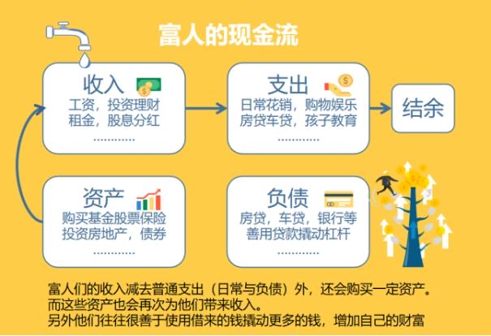
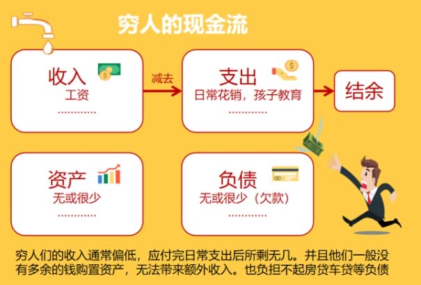
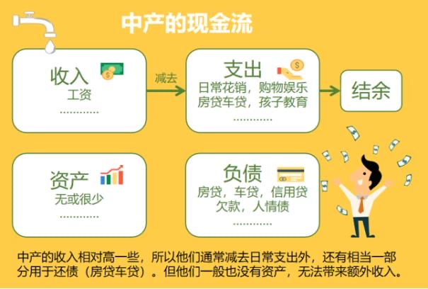

同学们、⼩伙伴们⼤家晚上好~

⼤家来学习理财是为了什么呢? 对号⼊座输出 1 或者 2 或者 3

1. 梳理⽬前的财务状况, 管理好财务问题, 摆脱⽉光, 负债
2. 想⽤⽬前的结余来钱⽣钱, 寻找科学安全的投资⽅式
3. 我就是好奇理财是什么, 进来看看

其实不管是什么情况, 我们⼀辈⼦跟钱打交道, 有钱能解决我们 80%的烦恼, 学点财商知识是⾮常必要的~

还记得刚加班班时候班班让你们办理的学籍嘛? 其实就是为了帮⼤家安排合适的课程内容的, ⽤来帮助⼤家解决财务问题的

我们现在先来看看我们班同学的整体财务概况~

咱们班不到 300 ⼈, 据不完全统计, ⽉光占⽐ 23%, 负债占⽐ 26%, 有积蓄占⽐ 50%

说实话, 看到数据我⼀点都不意外!

但⼤家是不是会疑惑? 这些年⼯资⼀直也都在涨, 我们⼀直都这么努⼒⼯作. 为什么就是⽉光负债了呢?

⽤⽹上⼀个段⼦来形容就是"我⼯作就是为了钱, 为什么我这么努⼒⼯作还是没钱?

到底是哪个中间商赚了差价

其实还真不是

我们每个⼈或每个家庭都会在⼗⼏年的时间⾥过⼿⼏⼗上百万, 怎么去处理这些钱, 怎么让有限的资源带来最⼤的效⽤, 不同的处置⽅式, 在时间的积累下本来相似的⼈会拉开巨⼤的差距

我们说⽐如制定家庭⽇常消费计划、配置保险、制定宝宝教育⾦计划、养⽼⾦计划等等都是理财中的⼀部分, 凡是涉及到跟钱有关的安排, 都是理财.

划重点: 凡是涉及到跟钱有关的安排, 都是理财, ⼩到买⼀件⾐服, ⼤到买房⼦都是理财.

班班⽬前为⽌带班⼀年多了, 陪着很多同学解决了财务问题, 其实⽉光的负债也分很多种. 每个不⼀样的情况解决的⽅式是不⼀样的, 我简单的分类及分享⼏个典型案例:

⼀、⽉光(赚的少, 刚好花完)

⼆、⽉光(赚的多, 花得多)

三、负债(有房贷⻋贷, 但是收⼊可覆盖, 属于良性负债)

四、负债(有房有⻋, 但是收⼊⽆法覆盖⽀出, ⼊不敷出, 压⼒⼭⼤)

五、负债(⽆房⽆⻋, 赚少花多, 买买买⽆节制)

六、负债(投资失败导致负债)

七、积蓄(只会存银⾏和余额宝)

⼋、积蓄(会投资但是收益不理想)

可能还有其他情况哈~占⽐较少, 这⾥我挑典型的讲讲~

## ⼀、 ⽉光(赚的少, 刚好花完)

举个例⼦: 班班的表弟就是这样的情况, ⼩伙⼦刚出来⼯作, ⼲的是房产销售渠道的⼯作, 因为刚开始, 很难销售出房⼦, 前⾯ 4 个⽉都是每个⽉ 3000 块钱的⼯资.

房租 600 元, 剩下的 2400 元, 管个温饱, 好像真的难省. 在他学完理财后, 开始有意识到需要做规划

在伙⻝费上, 给⾃⼰定了标准, 每天 55 元伙⻝费, 因为做销售⼀天都在外⾯跑, ⾃⼰做饭是做不了的, 早餐 10 元, 午餐晚餐各 20 元, 喝⽔ 5 元. 话费 100 元/⽉. 其他杂项预算:250 元

每⽉给⾃⼰定下省 500 元的⼩⽬标. 每个⽉发⼯资第⼀件事, 先把钱放在基⾦定投中. 剩下的才是可⽀配的钱.

好的储蓄习惯是摆脱⽉光的第⼀步. 他坚持了半年, 存下了 3000 元在基⾦定投中, 加上这半年不懈努⼒下也卖出了 5 套房⼦. 平均⼀套⼤概有 5 千的提升, 最后攒下的两万多⽤来投资.

建议: 对赚的少的⽉光族

1. 梳理财务情况, 适当缩减开⽀, 从存 100 元开始养成储蓄习惯
2. 开源, 视情况找开源渠道, 努⼒升职或者是开启第⼆第三份收⼊来源

## ⼆、⽉光(赚的多, 花得多)

举个例⼦: 班班之前带过的⼀个学员, 某机构运营主管, ⽉薪 2 万+, 坐标上海魔都. 年轻姑娘, 漂亮⾐服不能少, 包包⼝红全都要, 旅游啥的不能少, 猛然⼀看卡⾥空捞捞. 怎么搞怎么搞?

如果卡⾥空捞捞, 就意味着我们要⼀直⼯作才能⽣存.⼀但想休息了, 就没收⼊了, ⼩姐姐希望可以存点钱, 在她任性不想⼯作的时候可以休息⼏个⽉

在她学理财后, 开始有意识做规划. 做好了房租⽔电交通伙⻝费等合理预算后, 每⽉计划存 8000-1 万元. 投资在基⾦上, 保障资产跑赢通货膨胀稳步增值.

建议: 赚的多, 花得多⽉光族

1. 梳理财务情况, 适当缩减开⽀, 保障资⾦不浪费 2.⽤投资强制储蓄, 有效的保障资产增值

## 三、负债(有房贷⻋贷, 但是收⼊可覆盖, 属于良性负债)

这类负债问题不⼤, 房贷属于我们个⼈能借到的最低利息的贷款, 贷款年限越⻓对我们好处越⼤. 当下家庭结余的钱越多, 对我们越有利. 学习⼀些科学安全的投资⽅式, 让钱替我我们⽣钱.

建议: 这种负债⽆需焦虑, 但需要做好家庭未来的财务规划. 防范可能的财务⻛险, 做好家庭资产配置, 如保险、债券类基⾦、股票类基⾦等产品配置.

## 四、负债(有房有⻋, 但是收⼊⽆法覆盖⽀出, ⼊不敷出, 压⼒⼭⼤)

举个例⼦: 我们训练营的某位学员, 事业单位员⼯, 有娃, 房贷 130 多万, ⻋位贷款⼗多万, 装修贷款 20 多万, 借亲戚朋友的有五六⼗万, 全部加起来有 220 多万.

⼯作了⼗多年, ⼀直都存不下⼀分钱的, 都是⼀直⽉光负债的, 账⽬也是没理清楚过.⼀直以为⾃⼰买下的两套房⼦, ⻋⼦, ⻋位都是资产, 其实最后都变成了压在身上沉重的负债

学理财后, ⼀⼀梳理了负债情况, 每个负债需要还的时间, ⽬前的收⼊等等, 定下财务策略. 她进⾏了节流, 开源, 只⽤了⼀年的时间, 投资账户攒下了 10 万块钱, ⽬前随着投资实战技能的提⾼在⽬前⽉收⼊ 1.5 万的基础上, 她计划卖掉现在⼀套房⼦, ⼀套成本为 80 万的房⼦, 每年出租收⼊为 2.4 万, 从投资⽽⾔年化仅为收益率 3%. 以她⽬前的投资能⼒⽽⾔, 80 万的本⾦平均⼀年赚来 10 万的投资收益是没有问题的.

对于此类负债⼈群建议: 重新梳理资产负债, 梳理收⼊及开⽀, 在学习完理财知识后适当调整资产分配, 回到盈余状态

## 五、负债(⽆房⽆⻋, 赚少花多, 买买买⽆节制)

举个例⼦: 我们训练营的某位学员, ⼴告公司⼩职员, ⽉薪 6000 元, 负债 6 万的单身⼩⻘年. 花钱⽆规划, 据她所述, 随着收⼊的增加, ⾃⼰不断的提升⾃⼰的消费⽔平, ⽉收⼊ 2 千花 3 千, 收⼊ 6 千花 8 千, 因此负债不断累积. 在⽉薪 6000 元, 负债 6 万每⽉不够还信⽤卡最低还款额情况下异常焦虑. 因此来⽔星学理财.

她幻想的理财是拿个⼏千上万本⾦或者不⽤本⾦, 快速⼏个⽉⼀年内炒股赚⼏万让她还债, 她学习中和我聊到这个想法.

这个说明下哈, 不存在这种事情的, ⼤家也不要有这种幻想. 没有这种歪⻔邪道的~(如果有你带我去围观, 我去看看是何⽅骗⼦在作祟哈哈哈)

最后她沉下⼼学习后, 知道她财务问题就是出现在⾃⼰的消费习惯上. 第⼀步就是给⾃⼰做财务预算, 每⽉租房 700 元, 交通 300 元, 吃饭 1000 元, 话费 100 元, 其他杂项等控制在 600 内. 每⽉结余 3300, 进⼀步算, 加上利息, 哪怕⼀分不多花, 靠结余还掉 6 万也⼤概需要 2 年时间.

她的⽬标是希望⼀年内能清掉负债, 节流不够开源来凑. 她⾃⼰学习理财后找到合适开源⽅式, ⽉收⼊提⾼到 8000 千, 利⽤部分结余投资, 投资开源每⽉ 300-800 区间, 进步⼀提⾼了收⼊.

后⾯更是因为换了⼯作+开源⽅式, 收⼊提升⾄ 1.5 万/⽉, ⼀年内真正解决了负债.

对于此类负债⼈群建议:

1. 梳理财务情况, 适当缩减开⽀
2. 开源, 视情况找开源渠道, 努⼒升职或者是开启第⼆第三份收⼊来源 3.⽤投资强制储蓄, 改变不良财务习惯

如果是有积蓄的⼈就很好了, 直接梳理财务情况, 进⾏资产配置和学习稳健的投资⽅式就可以了. 我们这⾥后⾯会带⼤家学习港股打新、基⾦、债券、保险等投资品的知识. 这些也是我们经过考量后觉得⽐较合适我们这类⼈群的投资品, ⻔槛相对低

其实负债是有很多原因的, 不单单只是以上的案例. 每个⼈的情况也有不同, 解决的⽅式⽅法也因情况⽽定.

所以主张⼤家先跟上学习, 我们会⽤科学的理财⽅法和案例帮助⼤家

这个⼤家如果还是⽐较迷茫, 在后⾯的学习中可以私下来找班班做 1 对 1 的财务规划. 班班会尽⾃⼰所能帮助⼤家的.

有⼀种假设, ⼀夜暴富的话, 是不是就可以解决⽉光负债, 财务⾃由?⼤家有没有曾经幻想过中彩票? 中个 500 万就再也不穷, 我曾经这么想过哈哈哈哈

但是事实的真相也是出乎意料

⽹上有⼈调查过世界上那些彩票中巨奖的⼈最后都怎样了? 答案是 95%中了彩票的⼈, 最后的⽣活都变得穷困潦倒, 甚⾄不如从前.

⼤家知道为什么会是这样的结果吗?

因为财不配位, 才有这种结果

很多⼈对于⻜来横财没有⾜够的能⼒妥善处置, 巨额财富就如过眼云烟⼀般, 到头来还是⼀场空.

除了中彩票之外, NBA 球员也是很典型的例⼦. NBA 联盟球员收⼊在职业体育圈是最⾼的, 但退役球员财务破产的概率⾼达 60%.

有意思的是, 这些破产的球星⼤都是⼩时候困苦, 靠打篮球突然暴富的⿊⼈.⽽从⼩家境富绰的球员, 退役后往往依然过的⻛光体⾯. 这背后依然是财商的问题.

很多拆迁户在政府给予补偿选择时, 只要房⼦, 不敢要太多现⾦

某地政府补偿⼀个冤案受害⼈⼏百万, 结果出狱后不到⼀年就败了⼀半.

为什么暴富的⼈最后最后的⽣活都变得穷困潦倒, 甚⾄不如从前?

因为⼤家没有资产和负债的这种概念, 钱财在⼿的时候更多还是消费, ⽐如买个房, 买个⻋, 全家旅游, 买之前想买的奢饰品. 于是钱财很快挥霍⼀空

很明显, 暴富后容易被挥霍⼀空, ⽽暴贫也不好, 穷怕了的⼈做事⽅式和⾏为逻辑都会有很⼤的局限性

说到底, ⼀个⼈想要保持健康的⾦钱观, 最好还是培养财商以及良好的财务习惯.

所以~来到这⾥的⼩伙伴们. 暴富的⽅法咱们⽔星是不会有的, 稳稳变富的办法咱们还是有的.

## 资产和负债

班班再讲下关于【资产和负债】这个概念. 帮助⼤家更好的建⽴初步的理财观念.

我们今晚讲的资产和负债的定义, 是基于《富爸爸穷爸爸》⾥现⾦流的概念.

【资产】就是能把钱放进你⼝袋⾥的东⻄, 它能给你不断带来收⼊

【负债】则是把钱从你⼝袋⾥取⾛的东⻄

我们来看⼀个富⼈的常⻅现⾦流量表:

富⼈的收⼊⼀般是多样化的, ⽽且有多种资产, 进⼊⼀种良性循环. 富⼈也有⽀出, 但是⼀般光靠被动收⼊完全能够覆盖掉⽀出.

相对应的穷⼈的死⽳就是⼏乎没有任何资产可⾔, ⽣活的唯⼀的经济⽀柱就是⼯资, 不断地买⼊负债或没有可持续利⽤价值的东⻄.

看看下⾯穷⼈的现⾦流量表:

⼀般⽽⾔, 低收⼊群体的⼯作收⼊是偏低的, 对于低收⼊群体来讲, 它的⼯资应付完各种⽀出, 也没有什么结余去买资产或者负债.

所以⼤家学习理财投资以后, 要不时的分析⼀下⾃⼰的花费, 哪些是资产, 哪些是负债, 争取以后多买⼊资产~

那么普通⼈或者说中产阶级的现⾦流⼜是怎么样的呢.

通过调查我们发现, 遭遇财务危机的往往是那些职业和收⼊看起来还不错的⼈. 为什么呢?

往往收⼊良好的⼈, 不会打理财富, 后者觉得⾃⼰的钱够花, 其实造成的浪费和产⽣的负债更多更⼤. 他们通常还以为⾃⼰买了资产, 实际上他们的钱并没有流向真正的资产. 造成的结果就是有时候中产阶级的现⾦流会⽐穷⼈更糟糕.

在这⾥还有涉及到⼀个财务⾃由的概念, 被动收⼊⼤于⽀出, 就可以视为踏⼊财务⾃由的⻔槛了. 因为⽀出是弹性⽐较⼤的, 所以说财务⾃由其实并不算忽悠哦.

其实负债没有想象中那么令⼈讨厌, 合理利⽤良性负债, 是可以更快的积累财富的.

什么是良性负债呢? 就是我们借钱⽤来扩⼤⽣产, ⽐如说我们是⼀家⼩公司, 搞加⼯的, 我们⽬前每年稳定盈利 50 万, 如果我们去和银⾏贷款 200 万来扩张⽣产线, 我们每年盈利还能多 50 万, 那这个就是良性负债.

⽐如是我个⼈的话, 如果学习某个技能是可以让我提⾼能⼒和收⼊的, 那这个学费也算是良性负债.

钱钱想跟⼤家分享⼀下, 拥有富⼈思维的⼈们往往乐意接受新鲜的事物, 并在不断增⻓⻅识的过程中, 提升⾃⼰辨别事物的能⼒, 同时结交更多的朋友, 拓展⾃⼰的圈⼦, 遇到更多的贵⼈, 进⽽良性循环.

很多时候, 观念的转变, ⽐收⼊的转变, 要难很多, ⽽你的思维, 决定了你在什么阶级.

中彩票的⼈⼤多会破产, 就是因为观念未转变, 思维还停留在穷⼈的阶段.

有本书叫《邻家的百万富翁》, 作者经过调查, 发现美国的百万富翁往往都是那些看上去并不起眼的⼈. 他们开中等档次的⻋, 住中等⼤⼩的房⼦, 对⾃⼰消费能分清必要、需要和想要. 他们的钱都花在了投资上, 很少花在不必要的消费上.

因此, 钱钱最后给⼤家⼀点诚恳的建议:

1、先储蓄, 再消费, 先从储蓄 10%的⽉收⼊开始, ⽣活质量不会下降很明显, 同时⽐较容易坚持;

2、投资⾃⼰, 提升个⼈技能, ⾃我增值才是最好的投资;

3、对于零基础同学来说, 可以先培养投资和理财的理念, 再了解各种投资品, 然后再进⼀步学习, 之后再去完善好家庭的资产配置.

⼤家能来学习, 都是明智之⼈, ⼈⽣这场⻓跑, 谁笑到最后或许你还不清楚. 但⼈⽣的财富终值往往取决于你是否有投资的理念, 和你的收⼊等有⼀点关系, 但关系不⼤. 只要别⾛上歪路, 不要想着⼀步登天地超越你的同学, 不出 5 年 10 年必将超越同龄⼈.
