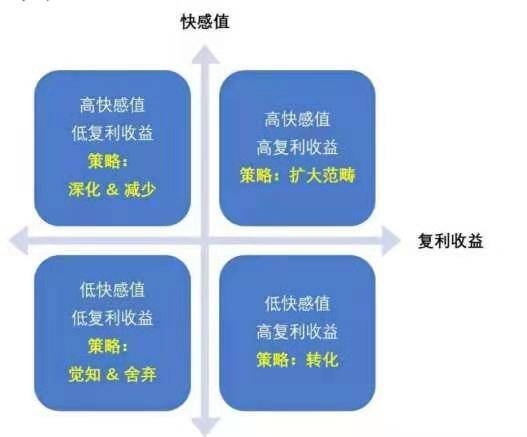
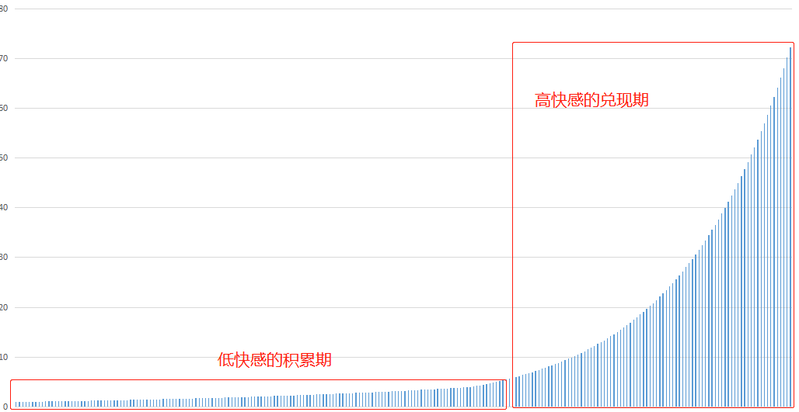

不知你有没有发现, 同样是花 268 元, 如果是吃一顿海鲜自助餐, 你会觉得稀松平常; 如果是买一件衣服, 你会觉得还挺便宜. 然而, 如果是让你用 268 元去听一场 2 小时的 博物馆书画展专业讲解, 你却会觉得太贵了.

为什么?

这就是"心理账户"搞的鬼.

## 什么是"心理账户"?

心理账户是消费心理学中的一个重要概念, 它的意思是, 我们会把钱分门别类地放在 不同的心理账户里. 因为钱这个东西, 在我们心里其实并不是统一存放的, 我们是把 钱分门别类的存放在不同的心理账户里.

比如说, 生活必要的开支账户、购买衣鞋包包账户、孩子教育账户、享乐休闲账户 等. 虽然这些账户看似都处于你的大账户之下, 但其实各个子账户是独立存在的.

## 那心理账户对人生影响是什么呢?

举例来看, 两个有着同样收入且有同样储蓄基础的人, 在支付了基本生活费后, 其中 一人总会将钱花在逛街买衣服、买大牌包包和鞋子上; 而另一个则总是将钱花在看各 种展览、学习新知和技能、以及深度旅行上.

一年之后, 她们二人的区别可能还不太明显, 但不出三年, 二人之间就会产生天壤之 别. 而五年、十年之后, 这两人的人生 6 轨迹就会出现完全不同的走向, 过着完全不同 的人生.

为什么?

道理很简单, 就是一句话: 你的钱流向哪儿, 你的人生就走向哪儿.

对大多数人而言, 购买股票、基金、理财、房产等行为会被视为投资. 然而实际上, 消费才是最大的投资.

那么现在, 你可以开始思考一个问题了: 除了那些必需支出外, 也就是你的每日餐 费、基本服装费、交通费、手机费、房屋租金或房贷这些费用, 你的钱都去了哪里?

是去买了一个当下最火的猫爪杯、最新款的吹风机, 最流行的包, Tiffany 的手镯, 一束花还是报名了一个课程、一次深度体验、一次旅行、一次能帮你解决心理问题的心理咨询、或是能帮你解决困惑、给你带来成长的一对一教练辅导?

同样, 你的时间或注意力消费流向哪儿, 你的人生也会走向哪儿.

这也是一条铁律.

因此可以说, 根本不用算命, 只要你告诉我你的钱和你时间(注意力)的走向, 我就 可以告诉你你未来的走向. 未来一点儿都不虚无, 它非常真切, 它实实在在的存在于 "滴答滴答"的时间里, 存在于一张张钞票的流向里.

那么, 现在就请你来想一想, 你究竟想要怎样的人生? 你又想将你的未来带往何处?

## 请建立正确的"心理账户"

事实上, 有"心理账户"的不只是金钱上的消费, 时间和注意力的分配也有"心理账户".

每个人的时间都是一样的, 每天就 24 小时. 有人一定会把其中一小时分配给阅读, 有 人却觉得这是一种浪费, 不如玩游戏. 有人一定会把其中一小时分配给运动, 有人却 觉得运动不如躺着.

这也是对"心理账户"的选择与分配, 与对金钱的消费一样, 如果想要过上自己想要的 人生, 就得建立正确的"心理账户", 包括金钱的心理账户和时间的心理账户.

## 可是, 怎样的"心理账户"才是正确的呢?

虽然花钱与花时间都是非常主观的事, 但也存在着一些能够帮到我们的重要原则.

我是用"二维四象限"模型来推理这些原则并加以实践的, 每个象限都是一个"心理账 户". 如下图

纵轴代表着"快感值": 是说在当下或消费(包括金钱消费和时间消费)后较短时间内 给你带来的"快感", 包括身体感受到的快感、精神体会到的"快感"以及物质得到满足后 的"快感".

横轴代表着"复利收益": 是说能对你的整个人生产生长期正向影响的消费(包括金钱 消费与时间消费).

这样, 所有消费(必需类消费除外)就能被划分为四种类型: 高快感值、高复利收 益; 高快感值、低复利收益; 低快感值、低复利收益以及低快感值、高复利收益.

这里首先需要说明一点, 一项消费到底是"高快感值"还是"低快感值"是因人而异的. 对 有的人而言, 听音乐会就是高快感值的消费, 但对有的人而言, 听音乐会却是低快感 值, 需要忍耐才能完成的事情.

而一项消费究竟是"高复利收益"还是"低复利收益"则与你想要实现的人生愿景有很大关 系, 也与你的人生价值观有很大关联.

所以, 在思考和实践自己消费观的时候, 也该先思考自己的人生愿景以及价值观.

其次, 当一项消费带来的复利收益是"高复利收益"时, 这项消费才能被当做投资, 不 然它就只能是一种纯粹的消费, 与未来无关.

## 第一象限: 高快感值、高复利收益

听一场你喜欢类型的音乐会、与好友吃饭并进行深度交流, 都是典型的"高快感值、高 复利收益"类消费.

因此, 对于第一象限的消费策略是: 扩大范畴, 让它们成为金钱消费以及时间消费的 主体.

既然此类消费不但能给我们带来很高的快感值, 还能带来很高的复利收益, 那么我们 就该不断增加这类消费的比例, 扩大这类消费的范畴.

打个比方说, 如果以前听一场爵士音乐会对你来说是"高快感值、高复利收益"的消 费, 那么你可以在下个阶段将这个范畴扩大到古典音乐会、音乐剧、舞台剧等, 甚至是画展

不过, 需要强调的是, 像这类消费, 并不能带来直接的收入, 而只是在"审美能力"上 能够产生"高复利"."审美能力"积累了一段时间, 可能会带来直接的收入.

需要面对的现实是, 大多数的"高复利的消费在一开始都不会产生"高快感", 最典型的 例子就是学习.

很多时候, 我们需要把"低快感、高复利"的消费转化为"高快感、高复利"消费, 而这个 过程需要时间.

## 第二象限: 高快感值、低复利收益

去网红店排队买蛋糕、深夜排队买猫爪杯(其实我不能确定这还算高快感值吗?)、在某宝上买一堆衣服, 这些都是能在购买当下产生很大快感, 但复利收益却不高的消 费类型. 这里说的复利收益可能是很低的数值, 可能是零或"负值".

因此, 第二象限的策略是: 区别对待, 对于可以将"低复利收益"转化为"高复利收益"的 消费, 进行转化; 对于无法被转化的消费, 尽量少做.

为什么"低复利收益的消费还能向"高复利收益转化?

### 转化

因为很多消费带来的"复利收益"究竟是低还是高并不取决于这个消费本身, 而是取决 于你在消费时使用的方式, 而使用方式是可以改变的.

因此, 如果想要实现这一转化, 就要增加消费时的体验和实践的深度、增加与之相关 的学习和思考.

比如说: 虽然每个女生都爱美, 很多女生都有化妆、搭配衣服的习惯, 但却只有极少 数人能够成为这方面的专家, 成为博主、做电商、甚至是创立自己的时尚品牌; 而大 多数女生都只能追随其后

因为前者将她的时间、金钱都投入在了这些她有热情的事情中, 而且更重要的是, 她 们走得很深, 她们对这些消费进行体验和实践的深度, 以及与之相关的思考与运用都 远远超越常人.

所以, 虽然消费可能是同样的, 花的钱和带来的快感都差不多, 但前者却能在这些消 费过程中不断增加体验和实践的深度, 不断增加与之相关的学习和思考, 将化妆、穿 搭方法进行深度思考和总结, 形成行之有效的方法论, 并写成文章或拍成视频.

于是, 对这些人而言, 这些消费就不再是一般性的消费, 而是成为了一种投资, 甚至 是她们事业开始的源头. 这就是从"低复利收益"向"高复利收益"的转化.

### 尽量少做

对于某些消费, 如果你无法将它从低快感值转化为高快感值, 我的建议就是"尽量少 做".

在这里, 有两点需要注意:

1)"少做"低复利收益的消费, 但并非"不做".

我们是人, 是人就有情绪, 是人就有懒惰、恐惧、紧张、迷茫的时候, 在这些时候, 通过"高快感值、低复利收益"的消费去获取即时的快乐与满足, 也非常有必要.

2)如果情绪常被影响, 那就需进行觉知与思考.

如果你常需通过做"高快感值、低复利收益"的消费去舒缓自己的情绪, 那可能就是一 个小小的信号: 你可能需要从根本上看看到底是什么总在影响着你的情绪, 又是什么 让你总会感觉到恐惧.

所以, 首先需要在情绪出现时进行觉知, 然后进行"深度思考", 看看如何从根本上解 决它.

## 第三象限: 低快感值、低复利收益

很多人会在出去旅行时买点儿小玩意, 因为大家都会购买.

这些东西价格虽然不高, 却也不算漂亮, 更别提艺术感, 比如设计简单、做工粗劣的 冰箱贴.

这些东西能给我们带来的当下快感本就不高, 等回来后我们又将它们扔到一边, 再也 想不起来, 于是也没产生任何复利收益.

这就是典型的"低快感值、低复利收益"类消费.

可是, 既然是"低快感值、低复利收益"的消费, 为什么还会有很多人去做呢?

原因在于: 大多数人并不知道自己想要的到底是什么, 不想要的又是什么, 所以才会 跟风消费, 做出快感值既低, 复利收益又低的事.

比如: 你不知道自己其实对艺术很感兴趣, 于是在旅行时就跟着网络上的攻略去各个 网红地打卡.

结果不但会有因排队而产生的劳累, 还会有因无趣而产生的颓丧, 这就是低快感值、 低复利收益.

相反, 如果你知道自己喜爱艺术, 想要浸润在艺术里, 旅行时就去那些美术馆看展 览, 于是你的快感值和复利收益都得到了显著提高.

因此, 对第三象限的策略是: 舍弃, 最好不做; 同时, 进行自我觉知.

## 第四象限: 低快感值、高复利收益

花几万元参加一门课, 学的过程不太容易, 花销也很大, 还要跑去另一个城市住一些 天, 非常辛苦, 所费时间颇多.

但这项消费却能对人生产生长远的积极影响, 这就是典型的"低快感值、高复利收益" 类消费.

对它们的策略是: 加深和转化, 保持并加深高复利收益, 同时将低快感值转化为高快 感值或中等快感值

此类消费至关重要, 往往能成为我们人生路上转折发生的起点.

因为我的天赋中有"学习"这项, 所以绝大多数类型的学习于我而言都属于第一象限 (高快感值、高复利收益).

然而, 也有一些类型的"学习"于我而言属于此类, 比如: 学习时间过长的、每天强度 过大的、不是非常感兴趣的、讲授颇为枯燥的.

所以, 对此类学习类消费, 我就需要对它们进行转化, 从"低快感值"转化成"高快感 值".

转化的方法有两种:

1)给自己描绘一个实现后的美好愿景

想要健身但又坚持不下来, 可以给自己勾勒一个美好愿景: 苗条的身材、健康的身 体, 能让自己在 60 岁同学聚会的时候, 备受羡慕, 让自己在 70 岁的时候, 还能拍出美 照, 四处游玩.

2)为这件事赋予重大意义

李笑来当年为了进新东方教书, 要考 TOFEL / GRE, 要背两万多个单词.

开始觉得: 这哪儿是人干的事儿啊?

然后, 他花了一个下午琢磨, 有没有办法把背单词这事儿赋予一个重大意义呢?

很快就想到一个: 考过 TOFEL / GRE, 拿到高分, 在新东方教书, 据说年薪百万, 那个单词就相当于 50 块钱, 这个爽啊!

结果原来计划刚开始先每天背 50 个单词适应一段时间, 想到这一层, 马上决定, 不 行, 第一天就要赚上 5000 元! 到了第二个月, 觉得很不过瘾, 于是开始每天赚 1 万元人 民币, 试了试, 觉得也不是太难. 于是就这样把这件非常枯燥的事情坚持了下来.

3)一直坚持, 坚持到产生快感为止

很多学习一开始是枯燥的, 但是只要你能走过"低快感"的积累期, 就可以到达"高快感" 的兑现期. 到了那个时候, 这类消费就成了"高快感+高复利"的行为了.

最后, 我想说, 看不见的成本才是最贵的. 当你把时间(注意力)和金钱花在了那些 无法带来复利收益的消费上, 你付出的成本就是自我的成长和美好的未来.

请记住这句话: 你的时间和金钱流向哪儿, 你的人生就会走向哪儿.
