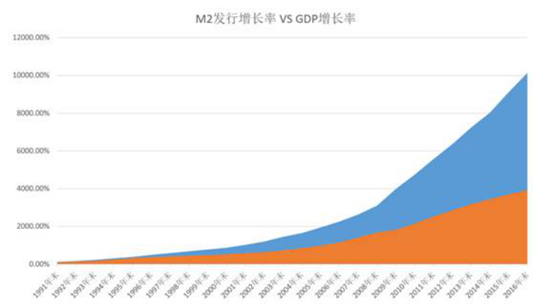

## 晨读

⼩伙伴们早上好~欢迎来到晨读时光, 今天班班给⼤家带来⼀篇关于理财盲区普及的⽂章《余额宝有很⼤的⻛险》, ⼩伙伴们看到标题是不是懵了? 为啥余额宝会有⻛险呢? 让我们⼀起读下去, ⼀探究竟.

### 1 ⼀句话引发的⾼潮

某位同学问我: 我给⾃⼰弟弟推荐了⽔星学堂, 但是他不想学, 因为觉得存余额宝最好, 很安全.

我说: 余额宝很安全吗? 在我看来, 余额宝可是⻛! 险! 最!⼤! 的投资品之⼀了, 仅次于银⾏存款.

相信看到这⾥, ⼤家的表情肯定像这样.

### 2 什么是真正的⻛险?

但你有没有想过, 什么是你真正的⻛险?

我们来假设两种情况:

1. 今年你的存款有 100 元, 那么明年你的存款有 103 元. 这样算⽆⻛险保值了吧.

2. 今年你的 100 元存款可以买三⽄⼩⻰虾, 明年你的 103 元存款只能买⼀⽄⼩⻰虾了. 这个时候你还觉得⽆⻛险保值吗?

货币本身其实没有太⼤的价值, 它只是⼀个数字.

在移动⽀付盛⾏, 买个包⼦都能刷信⽤卡的今天, 好像也不稀奇. 但是在我们这 38 线⼩乡村, 还是没有那么⽅便呀! 不急不急, 灵机⼀动的柠檬⼲, 打开微信找亲爱的妈咪中午回家帮我取 1000 块软妹币.

接过钱数了数, 竟然有 10 张崭新的软妹币.

再仔细⼀开, 竟然是连号的!

天(wu)真(chi)可(zi)爱(lian)的我本能反应, 本宝宝的运⽓也太好了吧. 不能花, 不能花, ⼀定得好好的收藏起来.

然⽽同样做为理财⼩哥哥, 我就意识到另⼀个令⼈⼼痛的真相:⼜是连号的钱, ⺟亲⼤⼤是不是耐不住寂寞, 印钞机⼜开始印钱啦?

这意味着什么? 去年 100 块可以吃 20 个冰激凌, 今年夏天只可以吃 15 ⽀了? 谁吃掉了我的冰激凌?

### 3 中国的真实通货膨胀

于是我去查了⼀下 2018 年 M2 的增⻓数据, 同⽐增⻓ 8.8%, 看图.

解释⼀下.

红⾊的是 GDP 增⻓, 蓝⾊的是 M2 增⻓率.

GDP 为国内⽣产总值, 是衡量⼀个国家经济增⻓的指标. M2 为⼴义货币, 包含流通中的现⾦, 企业活期存款, 准货币. 说⼈话可以简单理解为, 社会中货币的数量.

从 1990 年到 2018 年, 28 年的时间, 中国的 GDP 增⻓了 40 倍, ⽽货币发⾏增⻓了 102 倍. 这多出来的 62 倍就是反映在通货膨胀上了.

另⼀个数字是, 1990 年 1 元钱⼈⺠币, 到 2018 年贬值到只剩下 3 ⽑了. 其中 70%全部损失掉了. 也就是说, 平均每年损失 5%左右.

所以如果你只会投资余额宝的话, 那等于每年被⼈抢掉 2%左右的财产.

⼩时候 5 ⽑钱可以吃⼀个⾁包⼦, ⻓⼤后, ⾁包⼦要 2 块钱⼀个, 阿姨还会亲切的跟你说, 3 块钱可以买两个哟.

看到这⾥, 聪明的你们肯定会想到这就是货币贬值, 也就是【通货膨胀】了. 这究竟是什么⻤?emmm~~还真是不好说.

⺠间数据与统计数据总是差了那么⼀点点, 综合现状考虑, ⼤概在 10%左右.

这是神⻢意思?

你去年银⾏卡⾥的 10 万块钱, ⾃动贬值了⼀万块. 才⼀万块嘛, 那你⼀个⽉的⼯资到⼀万了吗?

如果你还觉得通货膨胀洒洒⽔啦, 有钱任性, 那请你闭上眼睛想象⼀下:

在⼀个阳光暖暖的周六, 你正收拾东⻄准备出去踏踏⻘, ⽼板打电话通知你, ⼩花呀, 今年公司业绩不好, 你也是⽼⼈了, 体谅体谅公司, 今年就给你降薪 10%吧.

你估计想爆⼀句粗⼝, TMD, 业绩好的时候也没⻅你给我涨薪 10%呀! ⽼⼦不⼲了! 辞职!

三秒过后, 想想了银⾏卡余额, 还是算了吧... 不然下个⽉的房租都没了.

⾟苦点灯熬夜, 落得个这么下场肿么破?

到这⾥, 我知道你想到要去投资了.⾚⼿空拳闯荡股海!

中国股市七亏⼆平⼀赚, 谁给你的勇⽓做那个 1 , 梁静茹春晚都跑掉了呢. 那是不是真的⽆解了呢?

别急, 万物存在即合理. 孟⼦也说, 不以规矩, 不成⽅圆. 过⻢路, 红灯停绿灯⾏. 开⻋之前得有驾照, 上⻋之后得系安全带.

投资亦有规则可循.

所以, 从最简单的投资知识开始学起吧.

扎⼼两问:

1、你的⼯资增幅达到每年 10%了吗?

2、 2020 年你的投资收益达到了 10%了吗?

⽊有的话, 放下⼿机去⾯币思过吧.2020 年已经过去了, 2021 你的⽬标是什么呢?

再跟你讲个⻤故事, 中国 2018 年 M2 ⼤约增⻓了 14 万亿, 如果印炒速度是匀速的话.

那么在你⾯币思过以及阅读⽂章的这 4 分钟⾥, 印钞机⼜多印了 1.06 亿……

愿会理财的你们, 都被世界温柔以待.

⼤家可以⽴个⽬标, 然后去⼀点点实现它, 我们就先把跑赢通胀作为⼀个⼩⽬标吧.

## 班班拆读

大家有没有这样的困惑: 明明自己工资高于当地的平均工资, 但是平时消费的时候这也舍不得买, 那也不能花, 哪里是消费升级, 明明就是给国家拖后腿嘛.

其实, 各行业的平均工资比十年前高了不少, 但人们的购买力却没跟上相应的增长速度, 什么原因?

文章告诉了我们一个可怕的事实: 有个家伙在啃你银行里的钱/存余额宝的钱, 从没停止过! 让你的财富一点一点消失……

你以为钱存在银行就是安全的? 你以为放余额宝就是理财? 你以为不投资就不会亏损? 你以为不理财就会富有?

暂且不扎心了, 那啃钱的到底是何方妖孽呢? 仔细一查探, 原来是【通货膨胀】.

你松了一口气~哦, 是这个家伙啊, 人家是上古神兽, 有自然规律撑腰, 我也拿它没办法嘛.

可这个上古神兽正在大口大口地啃着你点灯熬油赚回来的小白鹅, 你真的愿意把你那只瘦了吧唧的小白鹅当贡品吗?

肿么办! 肿么办! 一条鹅腿都要被啃没了!

不要方!!! 机智的班班有妙招!

我们只要好好喂养小白鹅, 让小白鹅多下点蛋, 分一部分给通胀, 还能留一部分给自己. 两全其美~

班班知道有些月光的小伙伴的人生信条: 过一天乐一天, 不留烦恼在心间; 过一年乐一年, 坚决不存一分钱(仿佛当初的班班)

你们不要偷着笑! 你以为你没存款通胀就啃不到你? 物价涨工资不涨, 生病意外, 上有老下有小, 到时候你只能啃自己! 钱到用时方恨无啊!

来, 跟着班班大声说, 我们的目标是: 跑赢通胀! 我们的目标是: 跑赢通胀! 我们的目标是: 跑赢通胀!
