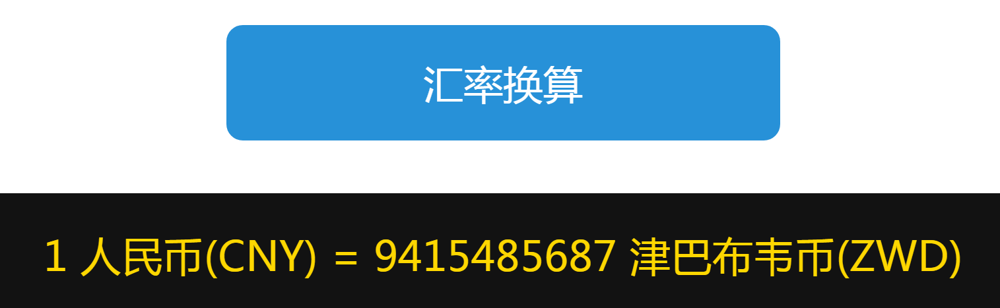
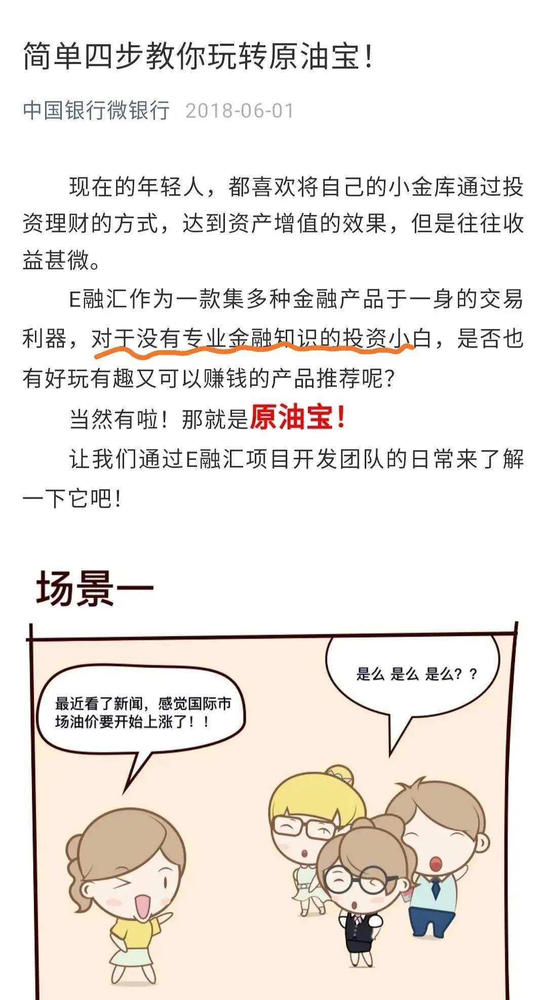

今晚咱们要讲通货膨胀. 不过群⾥学习还是尽量轻松⼀点, 咱们不搞得那么学术化. 班班先来分享⼀个身边发⽣过的真事⼉:

事情发⽣在 20 多年前的时候, 那时候有个亲戚来找我们家借钱, 1000 块钱, 拿去买猪仔, 养猪赚钱. 放在当时来说 1000 块不少了.

我妈给了. 结果这个亲戚⼀直不还钱, 过了差不多⼗年, 才⼜登⻔说要还钱. 还多少呢? 就⼀千.

我妈当时就很不乐意, 因为都过了⼗年了, 当年 1000 块钱能办不少事, 过了 10 年还能⼲啥? 按我妈的话说就是"钱花不着数了".

但是很⽆奈, 最后还是收了 1000 块. 要不然连这 1000 块也收不回来了.

后来搞得亲戚关系都不好了.

当时班班确实为我妈感到不值. 但是因为年龄还⼩, 也不懂得其实这就是"钱不值钱了", 我们⼀家没有考虑通货膨胀是怎么回事, ⼀切说不清不明的.

后来还是这个原因, 另⼀个亲戚找我妈借 4 万块钱买房, 没有利息(我们也不敢要利息). 班班就劝我妈, 不借.

⼤家想啊, 借钱买房, 然后对⽅还要背房贷, 他肯定是优先去还房贷了, 等到还我们家的钱还不知道猴年⻢⽉.

要是再等个⼗年, 钱就更不值钱了, 4 万块也买不着多少东⻄了. 这就是因为班班把通货膨胀考虑了进去, 才这么做决定.

⼤家慢慢会发现, 你了解⼀些理财背后的东⻄, 有了理财头脑, 在平时处理钱的问题上就会变聪明很多, 不会那么优柔寡断, 也不会搞出那么多⽭盾.

说到通货膨胀, 咱们课程⾥讲的⽐较清楚了, 班班这⾥再总结⼀下:

通货膨胀的意思就是流通的货币过多, 超过经济运⾏的需求, 导致钱不值钱, 钱的购买⼒下降了, 相应地物价就上涨了

这个我们都有体会, 也很好理解, 就是钱越来越不值钱了, 同样的, 钱能买的东⻄越来越少了.

你 5 岁的时候存了 10 块钱, 想着⻓⼤买 100 包辣条⼀⼝⽓吃掉爽⼀把, 没想到⻓⼤之后只能买 10 包了, 还是没得过瘾!

举个正经的例⼦:

就⽐如说卖⼤⽶吧. 假设今年市场上只有 1000 ⽄⼤⽶, 市场上流通的钱⼀共是 1000 块钱. 我们不看别的, 就只算⼤⽶的话, 就是 1 块钱⼀⽄.

第⼆年, 国家⼜印了 1000 块钱. 加上去年流通的 1000 块钱⼀共是 2000 块. 但是去年的⼤⽶吃完了, 新的⼀年卯⾜了劲提⾼产量, 只⽣产了 1600 ⽄⼤⽶, 这时候, 2000 块钱对 1600 ⽄⼤⽶, 算下来⼀⽄⼤⽶的价格是 1 块 2 ⽑ 5.

前⼀年 1 元⼀⽄, 后⼀年 1.25 元⼀⽄, ⽆形中⼤⽶价格就上来了.

分析原因的话, 其实就是国家印的钱, 超过了产量增⻓的需要.

换成专业的话就是, 货币发⾏量(M2)超过了 GDP 增⻓.

那班班猜你可能想问: 国家为什么要货币超发, 按照 1:1 发⾏, 不要印多了不就好了吗?

这是因为, 适度的通货膨胀有好处, 能够刺激消费. ⼤家⼿⾥的钱多了, 直观感觉肯定是能买更多东⻄啦, 所以就更愿意去买买买, 这就叫刺激消费.

消费起来了, 那些做买卖的⽣意变好了, 能够赚到更多的钱, GDP 也跟着涨.

买卖忙不过来的时候还要雇⼈, 这就增加了就业.

所以才说, 适度的通货膨胀有好处.

但是⼀定得掌握好⼀个度. 过度的通货膨胀就很可怕了. ⽐如咱们同学刚才提到的津巴布⻙这个国家, 班班给⼤家看⼀下汇率:

你⼿⾥的⼀块钱可以换 94 个亿的津巴布⻙币. 这就是因为津巴布⻙这个国家, 钱印的太多太多啦! 通货膨胀太严重了!

相信津巴布⻙的⼈⺠听到通货膨胀, 钱不值钱了, 都会有⽼铁扎⼼的感觉, 哈哈~

虽然说适度的通货膨胀是有利的, 但那是对整个社会⽽⾔. 对我们个体⽽⾔, 通货膨胀导致钱不值钱, 这⼀点是不会变的, 只是个快慢的区别.

以美国为例, 从未发⽣过恶性通胀, 但从 1800 年以来美元已经贬值了 95%, 今天的 1 美元, 相当于当年的 5 美分.

我们要承认通货膨胀, 这是我们没有办法去控制决定的, 我们⽆法逃避, 只能直⾯这个现实(真正的勇⼠, 敢于直⾯不可抵抗的通胀!)

怎么⾯对呢? 咱们课程⾥说过, 存银⾏是跑不赢通货膨胀的. 这个主要是因为银⾏利率太太太低了, 早晚有⼀天还会负利率……

⽐较普遍的讲法是国内通货膨胀率在 3%~5% 左右, 你可能想, 要是我有⼀个 3% 的定期存款, 不就能跑赢吗?

这样想就太天真了. 因为这个 3%~5% 的数据, 是没有把房地产算进来的. 群⾥估计都知道国内的房地产泡沫有多⼤. 最能让⼈感觉通货膨胀让"钱的购买⼒下降"的, 就是房地产.

如果把房地产算进去, 保守估计 10% 吧~

什么存款能 10% 呢? 如果有的话请拉上班班去看看现场诈骗. 当年 P2P 有过 10% 的承诺, 还不是⼀个接⼀个噼⾥啪啦暴雷了.

想要跑赢通货膨胀, 不会投资理财是万万不能的.

有没有⼈觉得班班接下来要劝⼤家赶紧投资了? No, 班班反倒要劝⼤家先住⼿.

有句话说: 不投资是等死, 乱投资是找死. 班班可不能为了不让你们等死, 让你们扭头去乱投资找死.

和钱相关的都是敏感的, 投资这件事, 不懂的千万先不要碰. 有些理财骗局, 专⻔打外⾏的歪主意.

P2P 就是其中⼀种. 如今国内 P2P 已经全军覆没. 班班讲⼀下为什么 P2P 不可以投: 因为它违背了投资的不可能三⻆.

三⻆指的是三个要素: 收益性、安全性, 流动性. 任何⼀种理财投资品种, 顶多占两个⻆, 不可能把三个⻆占尽.

收益性、安全性⽐较好理解. 解释⼀下流动性:

所谓流动性, 就是指的资⾦周转的快慢, 是投进去可以很快取出来, 还是说投进去要等很久才能取出来.

⽐如, 活期存款, 流动性好, 它占了; 安全性⾼, 它也占了. 但是论收益性, 它就不如其他的了.

再⽐如股票这种投资⼯具, 可以灵活买卖, 流动性好, 它占了; 可以冲刺⾼收益, 收益它也占了. 但是论安全性, 股票就不⾏了.

不可能三⻆, 是业界判断的共识. 班班可以很负责⼈地告诉⼤家:

如果有⼈向你推荐⼀款产品, 告诉你收益很⾼, 安全⽅⾯也⼗万个放⼼, ⽽且存取也⽐较灵活. 那么, 你可以凭"投资的不可能三⻆"直接判断, 这是⼀个骗局.

P2P 的流动性和银⾏存款差不多, 如果按照它⾃称的, 安全性也能媲美银⾏, 那么它的收益就绝对不会⽐银⾏⾼到哪⾥去.

看到 10% 还要多的收益, 基本就可以判断, P2P 是危险的. 本来是个⾼⻛险的产品, 在介绍的时候就被说成了很安全. 呵呵~

有时候介绍中的措辞⾮常微妙, 对⽅也没有承诺绝对安全. 但就是给⼈⼀种买了不会亏的错觉.

⽐如, 中国银⾏推出的"原油宝", 很多⼈稀⾥糊涂地就买了.

既然是个"宝", 没有专业知识的⼩⽩也能玩, 那应该和余额宝⼀样安全吧?

关键是中国银⾏还配上了漫画, ⽤⼀种⽆敌可爱的语⽓来介绍. 这就让⼤家的防备⼼更⼩了.

殊不知, 原油宝是⼀个⾼⻛险的期货产品, 属于⾦融衍⽣品.

⽽余额宝是⼀只货币基⾦, 该基⾦投资的标的都是安全性⾼的债券, 可以说是基⾦中安全性最⾼的品种了.

名字都带"宝", 可本质上是完全不⼀样的两种东⻄.

相信很多⼈都已经听过原油宝后来出现的事故了:

美国国际原油期货合约, 创出了历史性的记录.

美国时间 2020 年 4 ⽉ 20 ⽇, WTI 原油(⻄德克萨斯轻质原油) 5 ⽉期货合约 CME(芝加哥商品交易所)官⽅结算价收报 -37.63 美元/桶, 历史上⾸次收于负值, 震惊市场. ⽆数做多超低原油的投资者纷纷爆仓, 损失惨重.

想象那个爆仓的惨景, 很多投资者恐怕终⽣难忘, 现在想来也是⼼有余悸.

以上说的这种理财⻛险, 还算是⽐较好识别的. 还有⼀些就⽐较严重了, 完全是打着理财的幌⼦搞"传销"啊, 这种叫"庞⽒骗局".

庞⽒骗局, 通过⾼额回报来吸引投资者, 并⽤发展下线的⽅式来⽀付前⾯的投资者.

当没有新⼈加⼊, 或者加⼊的新⼈不够⽀撑之前的⼈的利润时, 这个游戏就玩不下去了, 崩盘是迟早的事.

崩盘了怎么办呢? 它有⼀招很奇葩但很有效的模式——重启.

重启就是这个系统玩不转了, 我们宣布系统要重启, 如果你还想要拿回你原来的钱, 那你要再往⾥⾯投新的钱. 本质上就是继续骗钱.

如果是你, 你会不会再投钱进去?

你觉得不会, 但是肯定有⼈会继续投⼊, 其中有两个⼼理在起作⽤:

⼀是侥幸⼼理. 万⼀我能拿回来呢, 要不试试?

⼆是⽆法舍弃沉没成本. 我已经投了这么多钱了, 如果不试试, 那原来投⼊的钱都拿不回来了.

侥幸⼼理⼤家都懂, 我解释⼀下沉没成本, 是指已经发⽣且不可收回的⽀出, ⽆论现在或未来做什么决策, 都⽆法改变的成本.

⽐如: 很多⼈发现买了错误的保险, 也是这个⼼理, 已经交了这么多钱, 退保就要赔好多呢! 可是不退, 后⾯⼏⼗年还得继续交, 更闹⼼.

那些骗⼦就是利⽤这些⼈的⼼理反复地重启, 反复地骗钱. 执着于沉没成本是投资决策中⼀个⾮常严重的⼲扰⼼理.

关于庞⽒骗局, 咱们也有⼀套应对策略: ⼤家要去想⼀想, 我投资的项⽬, 到底靠什么赚钱的呢?

⼀个公司, 不是靠优质的产品和周到的服务来赚取利润, ⽽是通过不断发展下线来赚取利润, ⼤家觉得靠谱吗?

公司要么得有产品, 要么得有服务. 不能只靠嘴. 我们就检查它的产品和服务这两样.

最后总结⼀下, 投资并不是随随便便就可以赚钱的, 我们⾸先需要通过学习来弄清楚投资背后赚钱的逻辑. ⼤家想想, 咱们学习游泳, 有教练; 开⻋上路, 有驾校; 职场技能, 有蓝翔技校……

那么到了投资这种事情上, 这种事关⼤量钱财的问题上, 不是更应该学习吗?

现在, 班班带领⼤家回顾⼀下今晚的重点内容:

1. 通货膨胀: 流通的货币过多, 超过经济运⾏的需求, 导致钱不值钱
2. 发⽣通货膨胀最直接的原因: 钱印多了.
3. 通货膨胀最直接的影响: 财富的缩⽔
4. 跑赢通货膨胀的⽅法: 投资.
5. 沉没成本是指已经发⽣且不可收回的⽀出, ⽆论现在或未来做什么决策, 都⽆法改变的成本. 骗⼦就是利⽤这些⼈的⼼理反复地重启骗钱.
6. 如何防范投资骗局呢?
   1. 投资的不可能三⻆. 不要相信收益太⾼的⽆⻛险的东⻄.
   2. 弄清楚每⼀个投资背后的原理, 你赚的是谁的钱?
   3. 我们要先学习再投资.

今晚的分享就到这⾥了.
