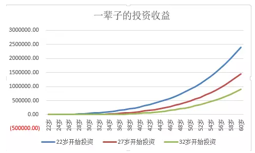
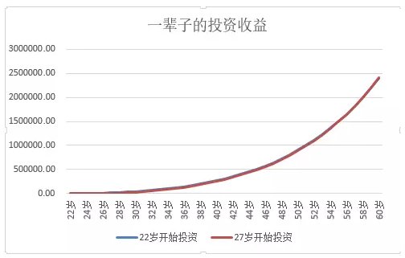
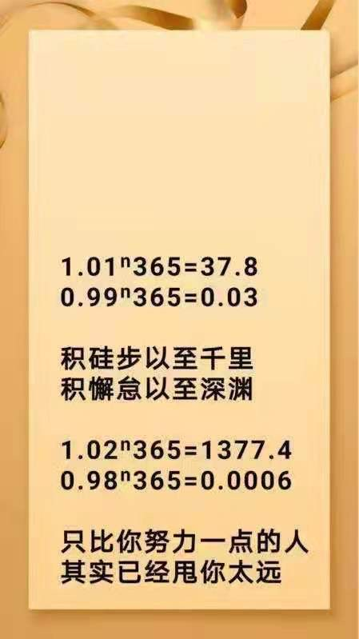

## 晨读

⼩伙伴们, 早上好~欢迎来到晨读时光 ❤, 复利三要素: 时间、利率、本⾦, 这三要素中, 利率随着你的投资技能增加会提⾼, 本⾦随着时间积累和投资技能的提⾼会增多. 唯有时间, 是最珍贵的. 这说明: 如果你⾜够重视时间, 你的投资利率和本⾦都将⻜速增⻓, ⽽你的复利累计到临界值, 让你的⽣活发⽣翻天覆地变化的临界值将会⼤⼤提前, 你的财务⾃由之旅将指⽇可待. 在投资者重视时间价值, ⼀个是复利的体现, 另⼀个是投资机会的把控. 越早投⼊投资, 你在有限的⼈⽣中, 抓住的投资机会也就越多. 这对你的财务规划, 起着⾄关重要的作⽤.

今天的晨读从⼏⽅⾯⼊⼿来分析时间与投资机会、时间与财富值的关系, 适合不同年龄段的⼈阅读, 今⽇晨读感悟思考⽅向: 你之前考虑过投资吗? 你的投资失败深层原因, 到底在哪⾥?

⼀直听到有⼩伙伴们说:"现在还年轻, 先不考虑储蓄/理财/投资, 反正现在这点钱, 实在太少了, 即使拿去投资也赚不了多少呢, 还不如乘着年轻使劲浪呢!"

还记得有⼀次, 班上⼀个⼩伙伴问:"我现在攒下的钱太少了, 投资也赚不来了什么钱, 我能不能先不攒钱出去旅游呢?"

其实, 很多年轻⼈会认为没什么可失去的, 即使做了什么离谱的蠢事, 也有时间挣回来.

不过对于⼀个追求财富⾃由的⼈来说, ⼀旦在投资的起点线上⽐别⼈晚了 5 年, 即使 5 年后, 你投⼊的资⾦和别⼈⼀样, 也有可能⼀辈⼦都赶不上别⼈!

不信?! 来看看今早这篇⽂章吧.

投资起步晚 5 年, 赶上需要 1.5 倍的汗⽔+时间

22 岁、27 岁、32 岁开始投资的人...

相信很多同学都和我⼀样, 是依赖⼯资结余进⾏投资的.⽽我们年轻时最可能犯的⼤错误就是, 总想着还有明天, 想把⼀切责任都交给明天的⾃⼰.

也许你认为 5 年在漫漫⼈⽣路上, 连 1/10 都不到, 即使错过 5 年, 只要抓紧时间, 就能够迎头赶上. 不过, 我们量化⼀下就发现, 事实并⾮如此哦! 复利的可怕之处就在于, 即使你⼀开始的投资量只是少了那么ー点点, ⼏⼗年的"复利效应＂之后, 就会导致巨⼤的差异.

举个例⼦!

假设 A 同学从 22 岁开始, 每个⽉投资 1000 元, 年化收益 8%, 那么到他 60 岁的时候, 他的投资收益将会⾼达 240 万元;

B 同学使⽤同样的投资策略, 然⽽在 27 岁才开始投资, 那么他这辈⼦的投资收益将只有 145 万元;

⽽有⼀个悲催的⼈, 因为他也没有学⽔星学堂课, 就不能列为 C, 到了 32 岁才真正领悟到了投资的重要性, 他也依旧采⽤每个⽉投资 1000 元的策略, 到了 60 岁, 他的收益仅仅只有 90 万元.

即使同样的投资收益, 如果晚 5 年投资, 等到 60 岁的时候. 你的收益会⽐別⼈少 65％呢!

即使起步晚了, 假如你多努力 N％呢?

很多同学会发出怒吼: 我起步晚怎么了? 我多努⼒就是啦!! 好嘛, 宝宝被吓到了, 不过呢, 事实证明, 起步ー旦晚了 5 年, 你就需要付出更多的汗⽔和时间, 即使这样, 也不⼀定能赶上赶早的同学.

假设你⽐別⼈晚 5 年オ意识到投资的重要性, ⽐別⼈晚 5 年开始投资, 那么你需要每个⽉多投资多少钱, 才能够赶上那些⽐你早 5 年的同学呢?

我今天啥也没⼲, 就在⼀直按计算器算算术, 最后, 终于算出来这个值.

如果你 27 岁オ开始投资, 那么如果別⼈ー个⽉投资 1000 元, 那么你需要每个⽉投资 1500 元, オ能够在 60 岁的时候赶得上別⼈.⽽且要注意哦, 你需要在⻓达 33 年的时间中, 每个⽉都⽐別⼈多投⼊ 50％, 才能够在 60 岁的时候勉强赶上.

虽然这两条线看着似乎是重的, 然⽽, 你晚起步了 5 年, 就需要在未来的 33 年中, 每个⽉都多投⼊ 50％, 拼尽全⼒, オ能够好不容易赶上呢!

复利的的魔法在漫⻓的时间中发挥了魔⼒, 如果你⾏动时间晚了ー点, 那么你的投资回报就会少得多, 所以执⾏⼒强的⼈往往会提前⾏动, 争取时间, 让复利发挥出最⼤的⼒量.

要记住: 你推迟投资的每⼀天, 复利都会发挥反向的作⽤.

从储蓄开始, 但并不仅仅是储蓄

为了达成你的财务⾃由⽬标, 从踏⼊职场那天起, 你就必须开始储蓄, 同时开始学习理财的相关知识.

除⾮你运⽓很好, 恰好中了彩票⼤奖, 或者刚好得到⼀笔横财, 否则没有储蓄就⽆法积累相应的财富.⼤部分⼈知道他们应该储蓄, 但是没有意识到应该持续储蓄, 往往都是这个⽉剩多少就存多少.⽽正确的做法, 应当是, 先存钱再消费.

这⾮常困难, 特别是在这个消费主义盛⾏的时代, 我们给商品赋予了很多不同的意义.

你要开始储蓄. 就得先克服⾃⼰的虚荣⼼.⽣活中到处充斥着购物的⼴告, 假如你把看到的东⻄都买下来, 那么你就完蛋了, 再也没办法开始储蓄的第⼀步了.

对于许多⼈来说, 虚荣⼼战胜了⼀切, 节约⽣活的麻烦是没⼈能看到他们的财富, 你⼿上没有名表, 你会买⼀个 iwatch, 告诉别⼈, 你并不是买不起名表, ⽽是更喜欢科技感⼗⾜的苹果⼿表. 如果你⼿腕上空空如也, 也没有挎着名牌包包, ⼈们不会羨募你的财富. 当然, 他们也看不到你正在为财富⾃由所付出的努⼒. 看着账户⾦额不断增⻓, 你能够获得相应的满⾜感, 从⽽对抗内⼼滋⻓的"买买买".

不过在现实中, 你会看到很多⼈擅⻓过节俭的⽣活, 并且从尽可能削减每⼀项开⽀中得到满⾜. 然⽽, 节俭是美德, 但是也要记住, 仅仅只是节俭, 你是⽆法富裕的. 我发现很多节俭的⼈, 却只把节约下来的钱放在银⾏⾥, 获取每年不到 5％的收益, 这实在是太太太蠢了.

从削减开⽀到建⽴真正的财富, 你必须找到⼀种⽅式, 让⾦钱变得更有效率, 从⽽不断増加收⼊.

⽐如, 你可以通过花钱学习ー⻔新职业技能, 获得更⾼的收⼊; 或者, 通过学习投资理财的知识, 让你每年的收益变得更⾼⼀些; 也或者, 给⾃⼰买⼀份必要的保险, 以避免突如其来的变故, 让你之前的努⼒化为虚有.

记住, 你需要制定⼀分专属于你个⼈的财富⾃由计划, 并且尽快起步.⽆论你计划每个⽉存多少钱⽤于投资理财, 最好就从这个⽉开始.

也许你已经不是 22 岁了, 已经⽐別⼈慢了⼀拍了, 但是在投资路上, ⽔星学堂的⼩伙伴都和你⼀起加油哦! 希望⼤家都能实现⾃⼰的财富梦想!

## 班班拆读

时间的力量是非常可怕的, 而复利就是依靠着时间这个强硬的"后台". 此消彼长, 那么结果就是天壤之别了

这张图很多同学应该都见过, 每天进步 1%. 那一年之后就会是现在的 37.8 倍

而每天退步 1%, 一年之后是现在的 3%

每天进或退都是不起眼的一丁点, 只需要一年的时间就天差地别了

所以, 你只要原地踏步一天, 那些比你努力一点点的人, 很快随时间甩你一大截哦

不进则退~

班班举个小例子

你小学一年级的时候 1.2 米, 是班里的身高担当, 到了二年级, 你没长, 可别的小朋友都长到了 1.3 米, 那是不是擦黑板都轮不到你了

同一片蓝天, 同一个班班, 差距是怎么拉开的呢?

这里还没有算上知识和技能的遗忘~

老话说, 拳不离手曲不离口

不持续学习和进步, 不应用学到的知识, 最后学到的东西也可能会忘光光

我们之前的分享也提到了, 我们要学会用钱换时间, 因为时间真是太太宝贵了

现在通过量化, 大家切切实实感受到【时间的威力】了吗?

是不是有 20 刚出头的小家伙在偷着笑?!

真是看不惯你, 又干不掉你, 只好原谅你~

这里特别表扬咱们班的很多在校学生们~

在学校的你, 已经开启理财学习, 不知道要甩同龄人多少步呢

但是! 请你们一定要坚持, 这样才能把自己的时间发挥最大效用~

至于那些已经跟班班一样早已经过了 22 岁的小伙伴, 已经晚了 N 年, 班班只想说一句: 没时间解释了! 快上车吧!

年轻时最可能犯的大错误就是, 总想着还有明天, 想把一切责任都交给明天的自己

但是复利的魔法在漫长的时间中发挥了魔力, 如果你行动时间晚了一点, 那么你投资的最终回报就会少得多

所以执行力强的人往往会提前行动, 争取时间, 让复利发挥出最大的力量

我们要从储蓄开始理财, 但又不仅仅是储蓄~

切记: 千万不要养不会下蛋的"死鹅"!

所谓理财是: 如何有效管理自己有限的财务资源, 而达到最大的幸福! 这个定义才比较合理准确~这其实与钱多钱少关系不大哦~

钱越少越需要理财!!! 越早开始越好~

还有个特别逗的现象, 我们要特别注意:

人们对自己不擅长干的事情有特殊的处理手段——最终会通过包装进行自我保护

比如:"谈钱不就俗了嘛" 、"我才不想成为天天只会算计的人呢"

千万不要用这样的言论来自欺欺人啦~

这其实是对自己的大脑实施"永久性的伤害", 很难恢复的

就是我们常说的, 谎话说多了连自己都会相信的

看过《小狗钱钱》我们就知道, 钱是中性的, 没有善恶, 取决于使用它的人, 我们总以为年轻的时候, 有更多的可能, 其实是赚钱以后, 才有更多的可能

不要觉得赚钱很庸俗, 而你的梦想很伟大

一个人的能力, 是在赚钱中提高的, 而不只是在兴趣里提高的

从另外一个角度来说, 理财这事儿肯定是越早开始越好

年轻的时候理财虽然难, 但即便发生风险, 损失的不会太多——因为本来就没有太多

等可管理的财富多了, 才开始理财, 一旦遭遇亏损, 那肯定就损失惨重了

在那种情况下, 尤为可怕的是: 剩下的时间不多了!!! 重头再来吗? 未免太残酷!

由于偏见, 很多人把一个原本从很早就应该开始干的事情, 当作无所谓的事情处理了......

在整个大环境下我们从小就缺乏财商教育

所以班班努力学理财, 给自己、给孩子建立正确的理财观, 进行财商教育, 希望孩子赢在起跑线上
