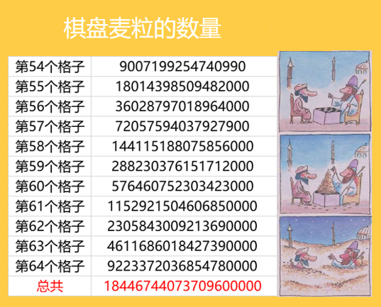
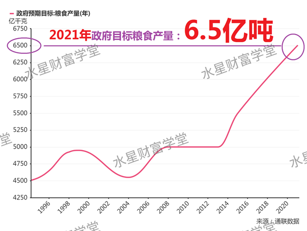
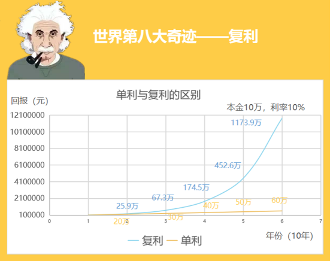
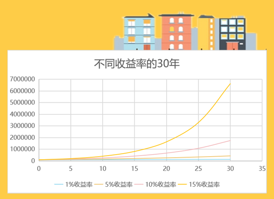
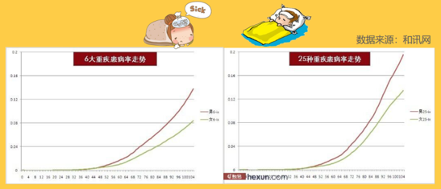
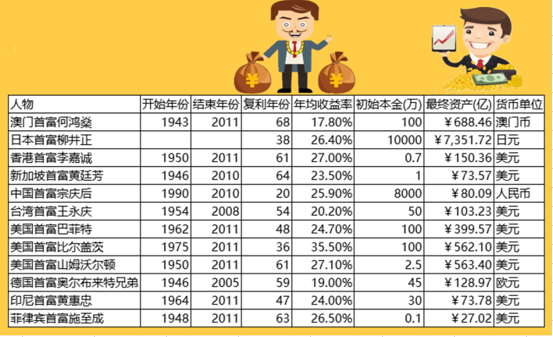
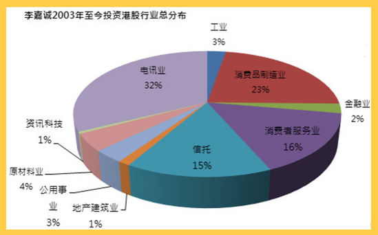
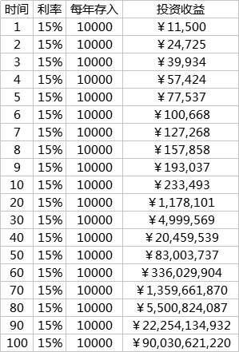

今天我们来说说普通⼈变成富⼈的捷径.

班班先出道题考考你们, 不⽤计算哦, 凭感觉回答就⾏:

⼀张纸厚 1 毫⽶, 假设它⾜够⼤, 能够⽆限次对折, 请问, 对折多少次之后能够超过珠穆朗玛峰的⾼度? 班班给⼤家三个选项:

A. 24 次 B. 240 次 C. 2400 次

班班公布答案啦, 答案是 A.

对折 24 次就可以超过珠穆朗玛峰的⾼度了. 有⽊有很震惊鸭?

珠穆朗玛峰⾼是 8844 ⽶.⼀张纸对折 23 次的时候就已经 8388 ⽶, 很接近啦; 等到对折 24 次的时候, ⾼度是 16777 ⽶, 快赶上两座珠穆朗玛峰摞起来的⾼度了.

折纸 24 次超过珠峰, 其中的奥秘就是复利

2500 年前, 腓尼基(古代居住在叙利亚地中海沿岸、黎巴嫩⼭以⻄的⺠族)旅⾏家昂蒂帕克写下了炫⼈⽿⽬的七⼤奇迹清单: 埃及吉札⾦字塔、奥林匹亚宙斯巨像、阿⽿忒弥斯神庙、摩索拉斯陵墓、亚历⼭⼤灯塔、巴⽐伦空中花园和罗德港巨⼈雕像.

⽽被爱因斯坦称为第⼋⼤奇迹的, 是"复利".

你或许听过这个名词, 或许没有.

但你⼀定听过这个故事: 舍罕王打算奖赏国际象棋的发明⼈——宰相西萨·班·达依尔. 国王问他想要什么, 他对国王说:

陛下, 请您在这张棋盘的第 1 个⼩格⾥, 赏给我 1 粒麦⼦, 在第 2 个⼩格⾥给 2 粒, 第 3 ⼩格给 4 粒, 以后每⼀⼩格都⽐前⼀⼩格加⼀倍. 请您把这样摆满了棋盘上所有 64 个格的麦粒, 都赏给您的仆⼈吧!

国王觉得这要求太容易满⾜了, 就命令给他这些麦粒.

当⼈们把⼀袋⼀袋的麦⼦搬来开始计数时, 国王才发现: 就是把全国甚⾄全世界的麦粒全拿来, 也满⾜不了那位宰相的要求.

今天我们还是从⼀个⼩故事开始, 有个很多⼈听过的故事, 有⼀个农⺠, 给地主打⼯, 地主说: 你帮我⼲活, 我每个⽉给你⼀旦⽶; 农⺠就说: 我有⼀个⼤胆的想法, 你这样吧, 我们弄⼀个棋盘, 你第⼀天给我⼀粒⽶, 第⼆天给我两粒, 第三天给我四粒, 第四天给我 8 粒, 后⾯就是隔⼀天翻⼀倍; 地主想: 农⺠傻了吧, 要这么少, ⼀粒、 两粒、 四粒的要, 就答应了.

你们觉得谁更机智, 是农⺠更机智, 还是地主更机智? 很多⼈觉得农⺠更机智是吧?

这个故事的结局是这样⼦的, 农⺠在坚持了七天之后就饿死了. 你们都知道复利嘛, 但是坚持了七天这也才⼏百粒⽶啊, 他饿死了.

所以, 事情并没有那么简单. 投资的事情也是这样⼦的, 没有⼤家想的那么简单. 很多时候不是我们以为怎么样就会怎么样的.

这个故事告诉⼤家, 做事情不要只有⼀个模式,

要多想⼀想, 冷静下来, 要考虑到各种场景以及各种因素.

我们都知道, 这⾥⾯的知识点⼤家关注的都是⼀粒、两粒、四粒的复利增⻓上, 却忘了这⾥⾯有个场景, 就是农⺠是要靠⽶吃饭的啊.

所以, 应急⾦很重要, ⽽固定思维不可要.

我们来说第⼆个结局. 假设农⺠⾃⼰本身有⽶, 顺利的度过了前期. 很快地主就发现, 即使将⾃⼰所有的粮⻝都给他, 也不够百分之⼀.

这个故事往往到这⾥就结束了. 然后说什么这就是复利的⼒量巴拉巴拉.

但是, 我们搞投资的⼈, 喜欢讲数据! 谁知道你地主有多少粮⻝呢? 是不是放满真的要很多呢? 我们来算⼀下.

前⾯的就忽略了哈, 看结果.

⼤家看最后⼀⾏, 18446744073709600000 这个数字是多少呢? 1844 亿亿, 是不是没什么概念? 没关系, 我们来换算成重量.

1 公⽄⻨⼦约 4 万粒. 把这个换算成吨的话, 约 4611 亿吨!

⼤家知道我国⼀年粮⻝产量是多少呢?

班班找来了最新的数据. 我国 2021 年的粮⾷产量⽬标: 6.5 亿吨. 4611 亿吨的话, 就相当于我国 710 年的粮⾷总产量, 还真的是整个国家的粮⾷都不够啊.

复利的公式是 最终收益=本⾦\*(1+收益率)^时间

这个棋盘故事⾥⾯, 后⼀个格⼦是前⼀个的⼀倍. 相当于就是利息 100%, 所以, 你要是听到什么投资⼀年翻好⼏倍的, 肯定是骗⼈的.

这个图, 就充分说明了复利和单利的巨⼤区别.

单看复利和单利, 在初期的时候, 差别还不是很⼤.

同样是投资 10 万元, 到第 10 年的时候, 也只是相差 5.9 万, 可是随着时间的拉⻓, 差别越来越⼤, 第 50 年的时候, 单利是 60 万, ⽽复利是 1174 万, 简直是天壤之别.

这就是复利的神奇之处: 在刚开始的时候复利效应是很微⼩的、不易察觉的, 但当发展到⼀定阶段就会产⽣⾮常惊⼈的效果.

复利是指数型增⻓, 好多同学说, 我本⾦少, 我去定投根本赚不到多少钱啊, 但是开始⼀段时间, 我们的资⾦就会呈指数增⻓, 如果不开始, 永远是 0 哦

⼤家都知道复利很⽜逼, 那么影响复利的因素有哪些?

第⼀个是本⾦. 本⾦越多, 最终收益越⼤, 但是本⾦的影响其实没有那么⼤.

第⼆个因素, 影响⾮常⼤, 就是收益率. ⼀年赚 3% 和⼀年赚 10%, 差别是显⽽易⻅的, 我们在本⾦不多的情况下, 就要努⼒提⾼⾃⼰的投资能⼒, 提⾼⾃⼰的收益率啦.

如上图所示, 从 100 万开始, 收益率 5%、10%、15%, 30 年后的差异, ⼤家应该都能从曲线就可以看到.

第三个因素其实影响更⼤, 就是时间. 年复利和每天复利, 后者要⾼很多, 迭代的次数越多, 复利威⼒越⼤, 真是恨不得每⼀秒都在复利.

我们再说回时间, 相信⼤多数普通⼈是依赖⼯资结余进⾏投资的. ⽽我们年轻时最可能犯的⼤错误就是, 总想着还有明天, 想把⼀切责任都交给明天的⾃⼰.

22 岁、27 岁、32 岁开始投资的⼈到底有多⼤区别呢?

复利的魔法在漫⻓的时间中发挥了魔⼒, 如果你⾏动时间晚了⼀点, 那么你的投资回报就会少得多.

所以执⾏⼒强的⼈往往会提前⾏动, 争取时间, 让复利发挥出最⼤的⼒量.

复利既然有正, 也有反向的影响. 我们推迟投资的每⼀天, 复利都会发挥反向的作⽤. 原因就是通货膨胀.

我们的资产⼀直在被通胀吞噬着, 还是⽤最典型的例⼦来说明, 90 年代的万元户是有钱⼈, 现在只有⼀万元就是扶贫对象.

你推迟投资的每⼀天, 通货膨胀都会发挥复利的反向作⽤, 你与别⼈的差距也会越来越⼤.

很多年轻⼈说, 我没钱, 或是没钱理财, 错! 年轻⼈最⼤的资本就是时间.

20 岁的 100 块, 和 30 岁的 100 块能⼀样么? 20 岁的 100 块可以多积累 10 年的复利, 越早开始越轻松.

投资成本就是作⽤在你资产上的复利, 因为投资是⼀⽣的事情, 你要投⼗年, ⼆⼗年, 三⼗年.

还有同学觉得⾃⼰本⾦少, 所以是不是⼏块钱的收益对⾃⼰影响不⼤呢? 这⼏块钱也体现了你的投资能⼒, 必须现在开始锻炼. 不积跬步⽆以⾄千⾥.

(强调⼀点, ⼤家现在刚开始学习理财知识, 不要想着⼀步登天⽴刻就去下载什么理财 APP 啊, 投资这投资那的. 有句话是这么说的, 不投资是等死, 乱投资是找死. "不懂的不要碰", 希望⼤家记住这句⾄理名⾔)

再拿准备养⽼⾦为例

如果从年轻的时候就开始, 其实是很轻松的. 等到到了 40 岁, 50 岁的时候, 再想着准备养⽼⾦, 那就很吃⼒了.

那么复利就仅仅是在投资么? 不, 我认为复利是这个世界上最重要的法则, 在很多地⽅都发挥着重要的作⽤. 就拿身体健康做例⼦好了.

你的每⼀次饮⻝, 每⼀次锻炼, 每⼀个与健康有关的选择, 其实都是加在你健康上的复利因⼦. 有正的, 也有负的

为什么这么说呢? 复利有什么特点? 就是最开始毫⽆声息, 后⾯就爆发了. 你们看这个图.

这个是常⻅重疾的发病率, 是不是跟复利曲线⼀模⼀样的呢?

⼀些作⽤在你身上对健康不利的因⼦, 常年累⽉, 按照复利的规律影响你的健康, 这也就是为什么很多⼈, 平时很健康啊, 突然不知道怎么就垮了.

⼤部分年轻⼈很少有想到买保险的, 觉得⾃⼰身体倍棒, 因为他还在这个曲线的前⾯, 不知道⾃⼰总归是会⾛到曲线后⾯的.

因此我在这⾥郑重提醒:

⼤家既然来到了训练营, 就要具备复利的思维, 要有⻓远的眼光, ⼀定要配置保险.

身体健康、投资都是按照复利规律发展的.

以前有个学员很有意思, 她和我说, 听你讲了复利之后, 我今天默默地在脸上多涂了⼀层防晒霜~这也是学以致⽤啊!

所以, ⼤家看, 学理财真的能应⽤到⽣活的⽅⽅⾯⾯的啊!

那么, ⼈⽣呢? 为什么⼩学同学都是差不多的, 但到了中年以后却千差万别.

因为你的每⼀个选择, 都是作⽤在你⼈⽣上的复利因⼦, 有正的, 有负的, 起初看不出来变化. 就像棋盘⾥⾯第⼀格, 第⼆格的⻨粒

但是后⾯巨⼤的收获如果没有前⾯这第⼀格, 第⼆格⻨粒, ⼜从何谈起呢?

⼈通常看不起, 或者不在意微⼩的进步, 其实, 正是这些点点滴滴的进步, 才能给你想要的未来. 这个世界从来没有什么⼀步登天, 我相信复利的⼒量, 也相信投资的必要.

有的⼈说, 我已经晚了, 怎么办呢? 那就要想办法利⽤复利来缩短差距.

要么你有⾜够的本⾦, 要么你开始要⽐别⼈早.

如果这两个都没有, 那么你就只能提⾼⾃⼰的投资能⼒.

相对增加本⾦和趁早开始来说, 我们已经错过了太多. 那提⾼⾃⼰的收益率, 才是我们可以快速赶超别⼈的⽅法.

我们来看⼀下各个地区的⾸富, 他们的收益率.

⼤家看⼀下他们的初始本⾦, 菲律宾⾸富施⾄成的本⾦是最少的, 只有 0.1 万, 李嘉诚的本⾦也只有 0.7 万, 但是这并不妨碍他们成为世界⾸富, 所以, 本⾦的影响并没有你想象地那么⼤.

这些世界⾸富身处各⾏各业, 有零售业, 有科技业, 有开赌场的, 也有投资的.

很多⼈认为巴菲特是炒股的, 其实这位投资⼤师也是⼀位企业家, 他经营的企业就是伯克希尔哈撒⻙.

很多⼈认为李嘉诚是企业家, 但其实他也是投资家, 投资了很多⾏业和公司.

所以, 他们本质上做的都是同⼀件事, 那就是投资. 为什么有钱⼈越来越有钱呢, 就是因为他们理解复利法则, 懂得⽤投资来使⾃⼰的财富增值.

再看⼀下上⾯的表格, 收益率最⾼的是⽐尔盖茨, 达到了 35.5%, 最低的是何鸿燊, 只有 17.8%. ⼤部分都是 20% ～ 30%之间.

这些收益率不是很⾼吧, 我们努努⼒, 20%可能做不到, 10%还是可以达到的吧. 10%意味着什么呢? 意味着地区⾸富!

穷⼈和中产为什么不能跨越阶层呢? 因为他们懒, 懒得学习, 懒得⾏动, 懒得努⼒, 懒得接受新鲜事物.

贫穷的原因很⼤⼀部分是因为思维的懒惰.

他们虽然知道钱放在银⾏会贬值, 会让通货膨胀吃掉, 但是他们懒得⾏动, 不愿意花费⼀些时间去改变⾃⼰, 每天躺在舒适区, 有天⽗⺟需要养⽼⾦, 孩⼦需要⼀⼤笔教育⾦, ⾃⼰⽣病需要⼀⼤笔钱的时候, 难道只能怪⾃⼰穷吗?

有些⼩伙伴说, 就那么⼀点钱, 都没有本⾦哪来的钱投资? 等我有钱了再说.

的确, 如果你真的还吃不饱, 穿不暖的话, 的确还是应该先解决温饱问题, 投资咱们就先不想了.

不过你吃不饱穿不暖的时候, ⼤概也没钱淘宝, 没钱逛街了吧? 所以事实是什么? 不是你没钱, ⽽是你宁愿吃喝玩乐也不愿意投资~

但凡你能挤出⼀丁点结余, 你都应该⽴刻开始投资. 除了复利的时间因素之外, 还有⼀个更重要的原因就是积累投资经验.

趁年轻有精⼒多学习理财知识, 并尝试各种理财产品, 找到适合⾃⼰的理财品种, 多学习多实践, ⽤较低的试错成本换回正确的投资技能和过硬的投资⼼态.

有个⼩伙伴的输出⾮常好, 他说, 我知道投资是⼀⻔实践的技能, 所以我会尽早开始实践的. 这才是正确的态度~

投资技能和投资⼼态都是需要锻炼的. 站在岸边是学不会游泳的. 所以必须尽早开始投资, 哪怕你⼀开始的投资只有⼀两百元呢, 但是积累到的经验是⾮常宝贵的. 远⽐你的收益宝贵.

积累投资经验⼀定是从学习后⽴刻开始的.

举个很简单的例⼦, 你打算 6 点吃饭, 肯定要 5 点就开始准备吧? 你就算点个外卖也要错个⾼峰吧?

投资也是⼀样, 想要赚钱, 要学习, 要积累投资经验, 建⽴⾃⼰的投资体系, 才能获得持续稳定的收益. ⽜市熊市都赚钱.

完全不是你今天需要钱了, ⻢上去投资就有钱的, 这个道理⼤家得明⽩.

更不要说晚投资可能错过的机会了~ 这个我们后⾯还会再讲讲~

来到训练营的⼩伙伴都是希望学会投资, 最终能够财富⾃由的. 你是希望⾃⼰和家⼈成为富⼈呢还是穷⼈呢? 这都取决于你现在的决定.

所以, 不要把投资当做⼀个可有可⽆的选修课了, 这件事在我看来, 甚⾄是⽐⾼考科⽬还要重要的必修课, 真的会关系到你家庭未来⼗年甚⾄⼀⽣的幸福.

之前⼤家也在说, 身边的⼈觉得理财投资是骗⼈的, 或者说, 在你身边的⼈⼤部分觉得投资是选修课的时代.

那你看到了这个机会, 你看透了这件事情, 抓住了机会, 你就会过得更好. 其实复利没那么难理解, 后⾯我们讲到基⾦的时候会给⼤家展示复利在基⾦上的最佳展现, 以及它为什么可以使我们定投基⾦成为千万富翁.

最后送给⼤家⼀条复利的公式: 1.15^100=1174313

这条公式有什么意义呢?

当我的年化收益率是 15%, 复利 100 年, 就是 100 万倍.

只要我每年增加 1 万元的原始本⾦, 通过不断的复利, 100 年之后, 将会变成 900 亿.

这就是⼀个实现家族资产百万倍增⻓的计划, 这条复利的公式就是改写家族的命运之公式, 班班是决⼼从我这⼀代开始努⼒, 改变整个家族的命运了, 你呢.

嗯, 我要开始升华了!!! 今天晚上给⼤家讲那么多, 就是为了指出⼀个投资⼈都会犯的致命的错误: 就是"追求⾼收益"! 学投资, 是为了追求合理收益, 绝对不是追求⾼收益.

学完今晚的内容, 你们应该知道的是: 投资的正确姿势是: ⽤合理的收益+复利去赚钱. 不是追求⾼收益. ⼤多数追求⾼收益的, 都死在半路上了, 最后成了⾲菜. 所以, 记住复利的⼒量, 然后踏踏实实的通过学习去赚取我们的合理收益, 这才是持续稳定赚钱的投资⽅式.

最后送⼀句话给⼤家: 种⼀棵树, 最好的时间是在⼗年前, 其次, 就是现在!

今天的分享就到这⾥啦, 谢谢⼤家~
