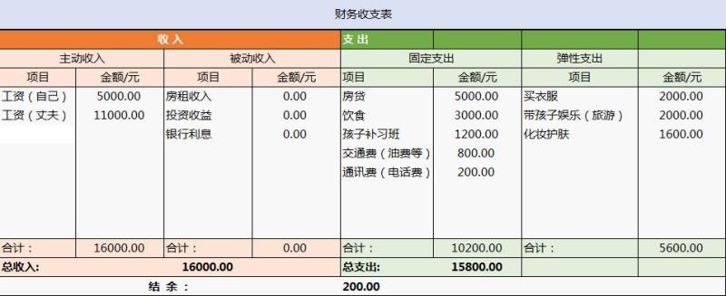

最近群⾥发现, 好多⼩伙伴都在问记账的事, 咱们就展开讲⼀下.

## 第⼀个问题: 我负债怎么理财

第一: 你应该梳理你⼿中的负债情况, 是⾼息, 低息, 还是⽆息. 先把⾼息变成低息的, 低息的变成⽆息的.

悄咪咪告诉你们⼀个鸡贼操作: 试着找亲戚朋友借款, 并承诺什么时间归还然后变成⼈情, ⽆息借款.

第⼆: 提⾼你⼿中现⾦周转能⼒和速度.

⽐如利⽤⾼额的信⽤卡中最⻓ 50 天的免息期套⽤更多现⾦周转, 然后还最低. 前天我们讲了如何利⽤信⽤卡褥⽺⽑, 不清楚的可以⾃⼰去复习哈

把贷款周期拉⻓, 把短期变成⻓期的. 利⽤时间差提⾼⾃⼰赚钱能⼒和开源, 多⼏份收⼊.

⽐如房贷 20 年变成 30 年, 有没有可能做到?

消费贷款, 虽然消费贷款, 信⽤卡要还利息, ⽐如⽇息万五. 但是假如账期拉⻓, 每个⽉少还点, 能让收⼊覆盖掉负债, 这样也是好的呀

虽然整体还的钱多⼀点, 但是收⼊覆盖掉负债后, ⽣活没有那么喘不过来⽓, ⼼理没有那么多压⼒负累, 还结余⼀点钱还能做点别点事情, 也是好的.

还有⼀点要考虑的是通货膨胀.

先讲⼀个概念: 通货膨胀和货币贬值.

⼤家知道 20 年前⼤部分⼈的⼯资每个⽉是百来块, ⽽现在⼤部分⼈的⼯资是每个⽉⼏千块

⼯资多了并不代表富裕了, 甚⾄代表的是差不多的⽣活⽔平, 这点⼤家应该深有体会.

也就是说⼆⼗年前的⼏百块和现在的⼏千块是等值的, 说明货币贬值了, 钱不值钱了.

通胀对于存款⼈是不利的, 因为钱在贬值, 但对于贷款⼈却是有利的, 因为要还的钱也在贬值, 还款额不变但是钱却⼀直在贬值, 不就是还的越来越少了嘛~

所以拉⻓贷款, 作为贷款⼈可以享受到货币贬值的好处

第⼆个就是, ⾃⼰学习了投资理财, 有钱在⼿上, 通过⾃⼰投资理财, 收益率很容易就超过这些贷款的利率, 这样也能慢慢养⼤⾃⼰的⾦鹅.

班班⾃⼰就是这么做的哦

当⼀个⼈每次收⼊都拿去还债, 永远都养不⼤⾃⼰的鹅, 也就陷⼊了⽉光负债的死循环, 其实这是⼀次很崩溃的事情.

更重要的是, 贷款透⽀了你投资⾃⼰的⾦钱, 让你不敢留钱投资⾃⼰, 这也是⼀个巨⼤的损失.

反过来说, 每次先还⼀部分, 然后留⼀部分, 当你的投资能⼒越来越好的时候, 再去回看, 你会发现, 负债的池⼦越来越少, 投资账户越来越⾼, 你的⼼态会发⽣变化, 会重新看到⽣活赚钱的意义.

《⼩狗钱钱》的作者博多舍费尔, 就是 26 岁破产, 然后摸索出如何⾛出困境, 7 年后赚到了⾃⼰的第⼀个⼀千万~

他在传记中也有关于这个情况的阐述, 其实和⼩狗钱钱中的结论是⼀样的~

## 第⼆个问题, 如何科学的记账?

其实这个问题延伸出来就是, 我们要不要花很多时间去记账, 怎么记账, 记账真的有⽤吗?

其实, 在班班看来, 记账不是单纯的记今天家⾥买菜花了多少钱, 买了⽔果花了多少钱, 更多的是⼀个梳理过程.

第⼀个, 梳理⾃⼰的收⽀情况, 看看⾃⼰的钱都花在哪⾥, 这些是不是都是必要的开销, 对于不是必要的花费, 尽量控制.

⽐如和朋友去消费, 吃饭, K 歌这些都属于可控制的拿铁因⼦.

所以, 记账的⽬的是节流, 但是单纯的节流⼀定是不对的, 并且节省也是个痛苦的过程~

我们继续上⾯的话题: 假设你有⼯资 5000/⽉, 每个⽉各项开⽀除掉还有余下 1000 积蓄.

假如我们每个⽉积蓄 1000 存⼊银⾏, 按照通货膨胀 5%, 每年缩⽔, 你的钱每年不⻅ 50 块. 如果⼀万存银⾏, 每年不⻅了 500 块.

假如你稍微懂⼀点, 把钱放在货币基⾦, 如⽀付宝.⽀付宝⽐银⾏收益⾼, 但是年化率现在也是 2.0%以下了. 跑不赢通货膨胀. 还是在缩⽔, 购买⼒下降.

假如你学了理财投资, 去投资基⾦, 基⾦普遍收益有 12%, 打理的好就有 15%左右

同样的每个⽉存 1000, 你拿来定投指数基⾦, 10 年后收益多少, ⼤家算下?

[基金定投收益率计算器](http://www.cebbank.com/site/gryw/jsq/jjsyljsq/jjdtsyljsq/index.html#md_01)

有兴趣的⾃⼰算下.

不投资是等通货膨胀啃⻝你的钱

乱投资那就是相当于找死

买股票也是要经过系统学习的. 股票收益⽐基⾦⾼, 在 15%-20%. 还记得我们督导允⼉吗, 她就是开源加股票基⾦投资, 收益 60 万.

但是每个⼈⻛险承受能⼒不同, 所以要系统学习. 不要乱投资.

没有系统学习就闯进股市, 那就是⾲菜任⼈宰割.

股神巴菲特⽼爷爷说过: 投资第⼀要素保证本⾦的安全. 第⼆要素, 牢记第⼀条.

所以, 不要盲⽬投资

同时, 节流是有天花板的, 我们要把更多的⼼思花在另⼀个途径, 开源上

开源其实并没有我们想象中那么难的, 把⾃⼰的爱好、技能变现, 但是也是需要⼀些⽅向的

⽐如班班⾃⼰除了带⼤家学习理财还有其他的收⼊

## 案例分析

下⾯给⼤家分析财务账单:

班班拿班⾥⼀位⼩伙伴(经过同意, 但不透露姓名)的案例来给⼤家讲讲, 我们的收⽀表要如何做

怎么合理的理清⾃⼰的消费结构, 我们理财第⼀步就是捋清收⽀.

那么接下来就以这位同学的收⽀表, 班班来带⼤家分析⼀下.

那么这位⼩伙伴存在的最⼤问题是什么呢? 有没有知道的?

第⼀个问题就是他的被动收⼊项是 0

我们⼯作就是为了⼯资, 为了⽣活, 但同时也最怕兜兜转转, ⾟苦耕耘了多年, 最终只得到了⼀点⼯资.

⼯作, 其实就是⼀场⾦钱与⻘春的交易. 说⽩了, 就是公司和⽼板花点钱买⾛你的⻘春.

还记的《三⼗⽽已》⾥⾯的王漫妮吗? 没有了⼯作只能离开⼤上海

很多⼈会发现⼯作了⼏年, 发现⾃⼰个⼈能⼒没有提升多少, 积累的⼈脉没有, 获取的资源也没有, 只得到每个⽉固定的⼯资, 在我看来是很失败的.

原因就是收⼊太单⼀了

这也是为什么有些⼈年轻的时候喊着要在⼤城市闯⼀番, 到最后还是隐退故⾥的原因

其实⼤城市也是⼀个筛选器, 不停的筛选, 跟我们训练营⼀样的道理, ⼀步步⾛下去, ⼤家会发现越来越少的⼈能坚持

曾经有朋友讨论⼀个问题"⽣孩⼦多痛". 其中有⼀个回答我印象深刻, 她这样回我"很痛 很痛, 但是这是顺其⾃然的事."

"就跟学理才需要坚持⼀样顺其⾃然的事"可是这么痛的事, 坚持下来会怎么样呢?

问当妈的会不会后悔⾃⼰当初⽣下孩⼦?

现在不吃学习的苦, 将来就要吃⽣活的苦.

不知道⼤家有没有听过『⼆⼋定律』, 就是说⼀个公司 80%的业绩是由公司⾥ 20%的⼈创造的, 当然这 20%的⼈⾃然就成了核⼼成员.

有⼀个段⼦是这样说的, 你不要⼤声责骂年轻⼈, 他们会⽴刻辞职的, 但是你可以往死⾥骂那些中年⼈, 尤其是有⻋有房有娃的那些.

虽然只是⼀个段⼦, 但是不也从侧⾯反映了⼀个现象中年危机.

⽽职场也注定了百分之 80%以上的职位是有严重瓶颈期的, 对于⼤部分⼈来说要突破这个瓶颈是相当难的.

特别是随着年龄的上浮, 不知道⼤家有没有发现现在很多企业的招聘会挂着 30 周岁以下, 就连公务员准考年龄也是 35 岁.⽽且很多⼯作随着年龄的上浮, 我们会越来越⼒不从⼼.

综上所述, 被动收⼊、财商的提升是我们增加个⼈财富的关键, 单靠死⼯资, 没有⼈能够实现财富的积累, 只能⽇复⼀⽇⽉复⼀⽉的上班挣钱, 来覆盖⾃⼰的花销. 就像上表的⼩伙伴⼀样.

所以解决的办法可以从两⽅⾯⼊⼿, 第⼀开源, 第⼆学好理财增加被收收⼊.

开源相信⼤家都明⽩什么意思, 那我们来说说被动收⼊.

但是如果⼀个⼈的被动收⼊能够⼤于总⽀出, 就相当于不⼯作也有钱花~

想想那些在⼤城市当房东的⼈, 每个⽉把房⼦租出去, 就能获得⼀⽐相当可观的收⼊, 那他们⼯不⼯作其实都⽆所谓的

所以第⼀个问题就是要想办法开源, 以及增加被动收⼊.

⽐如没有房产能拿来进⾏出租, 那可以通过系统的学习理财知识, ⼀点⼀点的开始理财, 实现被动收⼊的增⻓, 就像班班学姐学⻓⼀样, 就是通过投资来实现⾃⼰的被动收⼊, 掌握钱⽣钱的能⼒.

第⼆个问题, 弹性⽀出.

如果是平时记账, 可能并不会区分什么是弹性和⾮弹性⽀出, 弹性⽀出是我们可调整可控制可根据情况来调控的.

为什么班班说⼤家去记账不要记流⽔账呢?

因为我们强调记账是为了理清消费结构

按⽇常流⽔账来看, 我们买⼀件⾐服, 当他换季打折了, 你买⼊的时候, 会觉得他物超所值, 但是单你合计来看⼀个⽉的⽀时, 今天⼀件打折, 过⼏天⼜⼀件打折, 钱就是这样不经意间流⾛

⽤收⽀表⼀⽬了然, 每个⽉⾐物⽀出竟 2000, 占⽐个⼈过三分之⼀, 这显然是不合理的花销⽐例

所以这部分可以通过有意的规范消费习惯, 也就是我们常说的刻意练习来逐渐调整, 进⽽减少这部分弹性⽀出.

第三个问题, 这位⼩伙伴虽然基本达到收⽀平衡, 但是⼤家有没有留意到结余 200, 是不是有⼩伙伴有同样的境遇, 感觉每个⽉也没花什么, 不知不觉就⽉光了~

这种⻓期循环往复的财务结构是⼗分危险的, 因为经受不住⼀点⻛险, 稍不甚就陷⼊负债, 然后就进⼊另⼀种循环, 负债还款循环.

所以要怎么解决呢?

定投来帮你, 不知道⼤家⼩的时候有没有存零钱的习惯

巧⽤复利, 那么每个⽉从⼯资中强制取出百分之 10 出来做定投, ⻓年累⽉下来的结果绝对是⼀笔你意想不到的财富哦

定投可以解决的不仅有孩⼦的教育⾦还有我们⾃⼰的养⽼⾦, 喜欢旅游的⼩可爱还可以定投旅游⾦哦~⽅式多种多样, 就看你想⽤哪⼀样啦~

各位赶快算下⾃⼰的⽉⼯资, 每个⽉余下多少, 定投的话有多少收益.⽤上⾯我发的定投计算器, 看看⾃⼰存 10 年有多少收益.

第四个问题, 其实刚刚上⼀点有提到了, 单独列开来讲是因为班班觉得这个问题很重要, 需要引起重视.

从收⽀表中, 可以看到这位⼩可爱的⽀出中, 没有保障类⽀出, 全是消费.

想象⼀下这位⼩可爱的丈夫万⼀要是⽣病住院了, 那整个家庭的经济会⽴⻢陷⼊⼊不敷出的境界, 更别提住院需要的费⽤

班班的朋友经历过'裸奔'的伤害, 当年家境还是⼩康但是因为妈妈患⼤病不仅掏光了家⾥的积蓄, 结果⾼考结束后连⼤学都没法⼊学

所以对于这⼀块, 我给到的建议是配置保险

因为保险的核⼼的保障, 为家庭提供⾜够抵御⻛险的屏障

像这位⼩可爱的家庭收⽀结构来说, 我们可以简单看为是没有积蓄的.

所以⽤⼩资⾦撬动杠杆为家庭提供⾜够的保障是⾮常必要的

班班曾经遇到不少年轻的学员, 对保险这⼀块真的不够重视, 觉得⻛险离⾃⼰很遥远, 其实有没有想过这也是⼀种赌?

对⾃⼰⽣命的赌博.

赌上⾃⼰不出意外不⽣病不花能⼒之外的钱, 说实话这种想法跟做法都很危险

⽽且很多险种其实越早买保费越便宜, 限制也越少, 等到四五⼗五六⼗的时候, 很多保险会出现保费倒挂的现象, 那个时候你觉得需要了, 保险公司会给你设置很多关卡了.

综上所述, 经过分析, 相信⼩可爱也对⾃⼰的消费结果有所认识, 分清想要必要和需要的前提, 做到理性消费, 合理规划.
