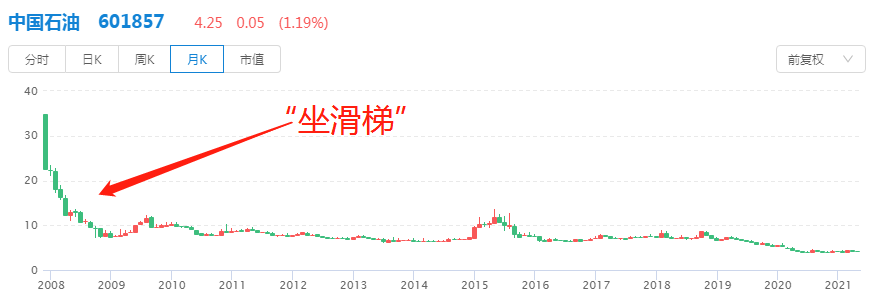
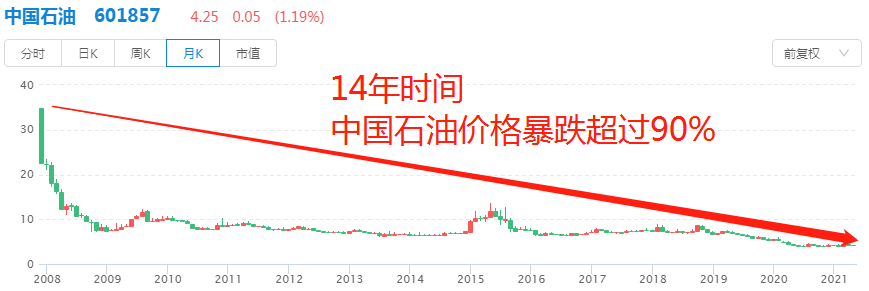

选股还是选基这个话题, ⼀直被争论不休.

股⺠认为基⾦不靠谱, 买基⾦收益低, 还收管理费, 不如⾃⼰亲⾃上阵买股票.

基⺠认为炒股是个"⼤坑", 个⼈投资者很容易被⼤机构"玩死", 不如选择基⾦公司, 跟着机构⼀起赚钱.

当然, 股⺠和基⺠也是经常转换身份的.

很多基⺠⻓期收益不理想, 看着股市⼤涨⼼⾥痒, 所以成了股⺠.

很多股⺠被股市毒打, 亏得"爹妈不认", 最后还是⽼⽼实实买基⾦, 安安分分做⼀个基⺠.

那么班班的建议呢? 我在这⾥说⼀下: 班班还是更建议⼤家选择基⾦, ⽽不是股票.

当然, 我知道咱班肯定有⼈很向往股市. 根据班班的带班经验, 以前进来学习的同学中, 想来学习炒股的⼈不少, ⼤家都觉得股市能赚更多, 毕竟有⼈靠着股票, 资产翻了⼗倍⼋倍.

但是咱们得⼼中有数, 股市波动⼤, 有⼈翻⼗倍, 也有⼈亏光全部家当的. 其中⼀个典型的例⼦就是"中国⽯油".

巴菲特买中国⽯油, 收益翻⼗倍; 国内散户买中国⽯油, ⼏乎亏光全部本⾦.

都是投资中国⽯油, 为什么⼀个天上, ⼀个地下? 其实这就是股市的⻛险所在. 班班给⼤家细说⼀下.

## ⼀、"中国⽯油", ⽼⾲菜⼼中永远的痛

事情还得从 2007 年说起. 2007 年 11 ⽉ 5 ⽇, 中国⽯油, 闪亮登陆 A 股. 当天, 股价最⾼达到了 48.62 元.

就在上市前, 中国⽯油曾经反复强调⾃⼰过去的业绩, 如何如何霸⽓, 赚了很多钱啊, 等等.

更是套上了"亚洲最赚钱的公司"的光环, ⼀遍⼜⼀遍地宣传.

很多股⺠就信这⼀套啊, ⽣怕错过, 所以就疯狂买买买.

⽽且, 在中国⽯油上市之前, 股神巴菲特曾经重⾦买下中国⽯油 1.3%的股权, 到 2007 年它上市的时候, 巴菲特赚了将近 10 倍!

连股神都看好的公司, ⼤家都觉得⼼⾥有底了. 就算达不到和股神⼀样赚 10 倍, 赚个 3 倍也挺好吧?

但是!!⼴⼤股⺠意想不到, 中国⽯油开局就是巅峰, 之后迅速暴跌.

⼤部分⼈在 08 年暴跌的时候就被吓退了. 那时候退出, 亏损已经达到了 80%. ⼀万块进去, 两千块出来.

然后发⽣个什么现象呢?

很多⼈觉得, 暴跌之后, 机会就来了呀! 投资就是要低买⾼卖, 赚差价呀, 趁着暴跌, 赶紧⼊⼿, 等中国⽯油涨起来了, ⼀定能赚不少吧!

于是很多⼈开始"低位布局", 坐等中国⽯油再次雄起. ⼤家都觉得, 这么⼤品牌的公司, 家⼤业⼤的, 股价不可能⼀直趴着不动吧?

但是很遗憾, 它还就⼀直趴着不动了.

这⼀趴, 就是⼗⼏年, ⽽且还⼜跌了差不多 10%

前前后后 14 年, 中国⽯油价格暴跌超过 90%! 投资者相当于裹着⽻绒服进场, 最后裸着⾛出来, 本⾦接近全部亏光~

14 年啊, 当年祖国的花朵现在都上班挣钱了, 当年买中国⽯油的股⺠现在还被套牢着呢.

所谓的"永⽆翻身之⽇", 说的⼤概就是这种感觉吧.

有⼈还专⻔给中国⽯油创作了⼀⾸打油诗: 问君能有⼏多愁, 恰似满仓中⽯油. 如若当初没割⾁, ⽽今想来愁更愁.

那么, 为什么巴菲特投资中⽯油, 就能赚得盆满钵满, 中国散户投资中⽯油, 最后亏得底裤都不剩了呢?

## ⼆、为什么股神翻⼗倍, ⼴⼤散户亏光本⾦?

最直接的原因就是, 巴菲特是基于⾃⼰的分析在做投资, ⽽国内的散户们基本都在听消息、跟⻛.

巴菲特当年买⼊中⽯油的时候, 是进⾏了详细的估值的. 他估算中⽯油的真实价值应该在 1000 亿美元, 但是当时中⽯油的实际价值只有 370 亿美元, 显然是被⼤家低估了~

⽽且⼈家很了解中⽯油当初上涨的原因. ⼀是因为油价显著上升, ⼆是因为中国⽯油的管理层, 在⽯油和天然⽓储备上下了很⼤功夫~

既要分析国际油价, ⼜要分析公司管理层的能⼒, 还要进⾏估值, 这些都是巴菲特赚钱的真本事.

但是散户呢? 听中国⽯油吹业绩, 然后看到⼤家都在买, 别的就什么也不管了, 直接跟⻛搞起!

国内散户买⼊的时候, 其实刚好到了巴菲特撤退的时候. 巴菲特分析后觉得估值⾼了, 所以开始卖出中国⽯油.

可是国内散户有勇⽆谋啊, 个个觉得⾃⼰是"⼗⼋线巴菲特", 其实除了胆⼦⽐巴菲特⼤, 可以说⼏乎什么也不会.

这就是⼴⼤散户的现状. 到今天也没有特别⼤的转变.

有⼈说, 那是因为这帮投资者都太傻了, 错误太低级了, 才去选择中国⽯油, 如果我好好投资股票, 肯定是不会亏的.

那么班班要反问⼀下: 当初这么多⼈买⼊中国⽯油的时候, 有⼏个⼈认为⾃⼰未来会亏呢?

进场之前, 最忌讳盲⽬⾃信.

这么说吧, 如果⼤家想买股票赚钱, 很多相关的研究分析肯定少不了.

先不说⼤家有没有⾜够的时间和精⼒去研究, 就算⼤家时间够, 精⼒够, 还有"三座⼤⼭"摆在⾯前.

## 三、散户投资股票的"三座⼤⼭"

### 散户投资股票的第⼀座⼤⼭:⾏业研究

就⽐如中⽯油, 它是属于能源⾏业, 能源⾥⾯还可以细分出⽯油化⼯, 煤炭, 煤⽓, 天然⽓, 电⼒……

再⽐如⽩酒, 很多⼈感觉都很熟悉, 但是⽩酒⾥⾯还分⾼端酒、次⾼端酒、低端酒, 它们的分销渠道都不⼀样, 很多⼈就说不上来了.

俗话说"隔⾏如隔⼭", 外⾏想要真正了解⼀个⾏业, 很难的.

有些机构投资者, ⽐如基⾦公司, 在投资股市的时候, 都会配备专业的⾏业研究团队.

很多时候是⼀整个团队在专攻⼀个⾏业. 甚⾄会坐着⽕⻋⻜机全国跑, 就为了实地考察公司和市场.

这个投⼊, 有⼏个散户敢说凭⾃⼰就能做到?

⽽且, 基⾦经理很多是⾏业科班出身, ⽐如, 擅⻓投资医药⾏业的基⾦经理葛兰, 是美国⻄北⼤学⽣物医学⼯程专业博⼠.

再⽐如, 擅⻓投资半导体(也就是芯⽚)的蔡嵩松, 是芯⽚设计博⼠, ⽽且曾经在中科院⼯作过.

他们对本⾏业都很熟悉, 选择本⾏业的股票进⾏投资, 可以说驾轻就熟.

散户如果⾃⼰选股票, 在⾏业分析⽅⾯是很难匹敌的.

与其单打独⽃, 只身闯股市, 不如跟着专业的基⾦经理⼀起赚钱.

### 散户投资股票的第⼆座⼤⼭: 财务知识

投资股票, 得看财务报表. 各种数据, 各种公式计算, 都少不了.

只有分析公司的财务, 才能知道这家公司赚不赚钱, ⽋了多少债, 未来还能不能成⻓. 这是投资股票的基础.

股神巴菲特说, 他读财报就像读报纸⼀样, 每年要读⼏千份.

相⽐之下, 国内的散户们, ⼤多数都没有完完整整地读过⼀份财报.

⼤家以前上数学课早就受够了数据和计算, 现在⼀看财务报表就头⽪发麻, 那么枯燥, 那么复杂……

⽽基⾦公司呢, 投研⼈员很多都是⾦融、财务专业出身, ⼤都具备 CPA(注册会计师), CFA(特许⾦融分析师)等专业资质所认定的能⼒.

雇个基⾦经理帮咱们搞, 不需要全部⾃⼰钻研, 这就是投资基⾦的优势.

就好⽐家⾥的汽⻋出问题了, 你是选择⾃⼰研究说明书, ⾃⼰修理呢, 还是去 4S 店呢?

如果家⾥⽼⼈⽣病了, 你是选择⾃⼰现学医术呢, 还是去找医院⾥的医⽣呢?

社会分⼯是有理由的. 让专业的⼈做专业的事, 投资也不例外.

### 散户投资股票的第三座⼤⼭: 信息获取

做投资, 得紧跟时事吧? 各种新闻、内部消息, 都有可能影响股价波动的.

所以肯定需要⼤家具备获取信息的能⼒.

但是, ⼤部分散户, 获取的信息基本都是"⼩道消息", 或者不知道转了⼏⼿的消息. 有些甚⾄是朋友圈看到的, 或者浏览器推送的, 相当于吃别⼈的"嚼⻝"~

即使你在很多官⽅媒体看到的消息, 都是经过编辑, 有时间延迟的. 等到你了解到了这个消息, 股价早就反应过去了.

这⽅⾯, 专业机构现在都是运⽤⼤数据和算法, 获取⼀⼿信息. 机构在这⽅⾯每年都要砸很多钱, 购买软件和数据信息.

⽽且机构会配备专业的团队, 有分析师研判信息的价值, 甚⾄有渠道聘请⾏业专家来做助攻.

科技⼿段+专业团队, 这些对于散户来说是⼏乎不可能独⽴做到的.

总的来说, 班班是不太建议普通⼈直接参与股市投资的, 尤其是新⼿, 更加不建议.

还是那句话, 选择基⾦, 让专业的⼈帮咱们做专业的事. 这也是投资领域未来发展的⼀个⼤⽅向.

班班不建议⼤家投资股票, 但是不代表咱们就不学习股票, 毕竟很多基⾦的成分股也都是股票

可以不做, 但是不能不懂, 不⽤深⼊研究, 但要有基本了解

本次分享到此结束.
