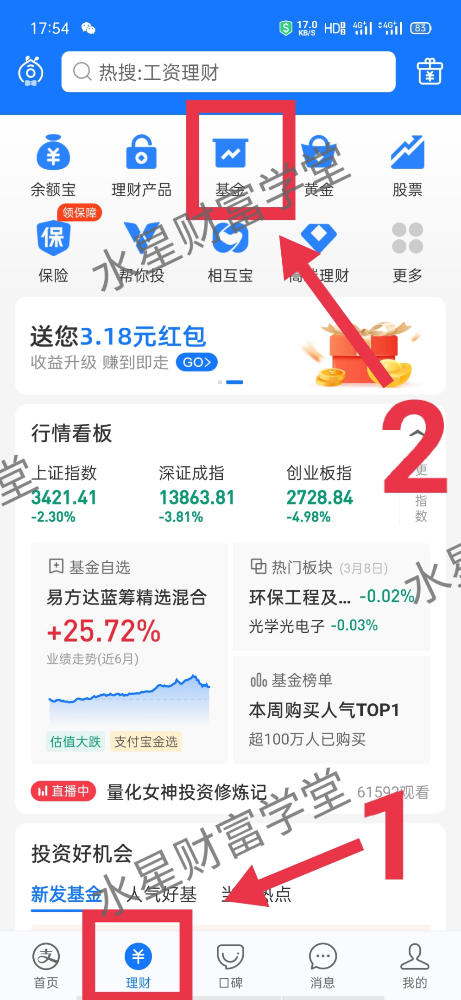
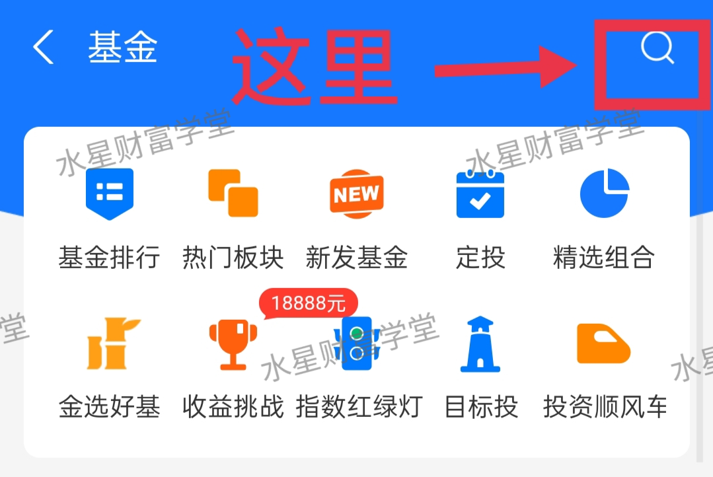
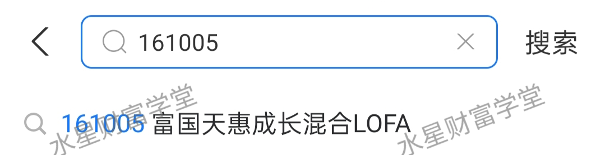
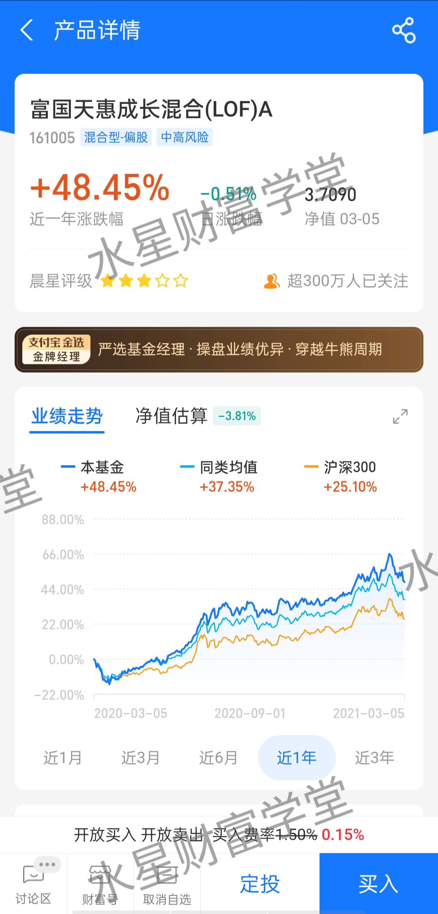
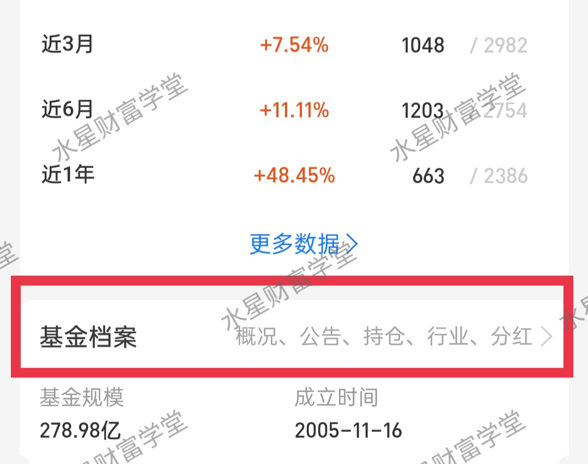
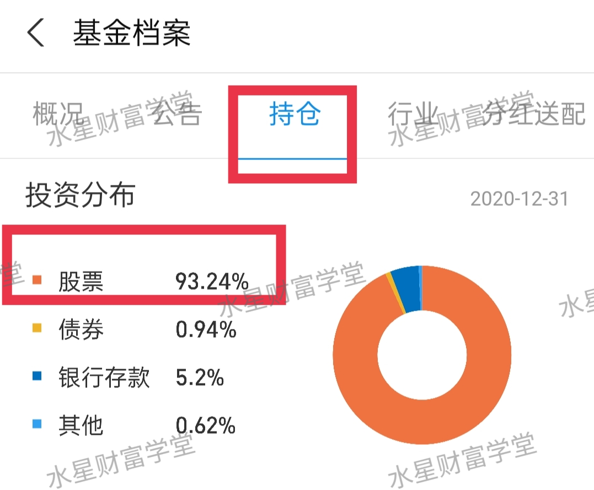
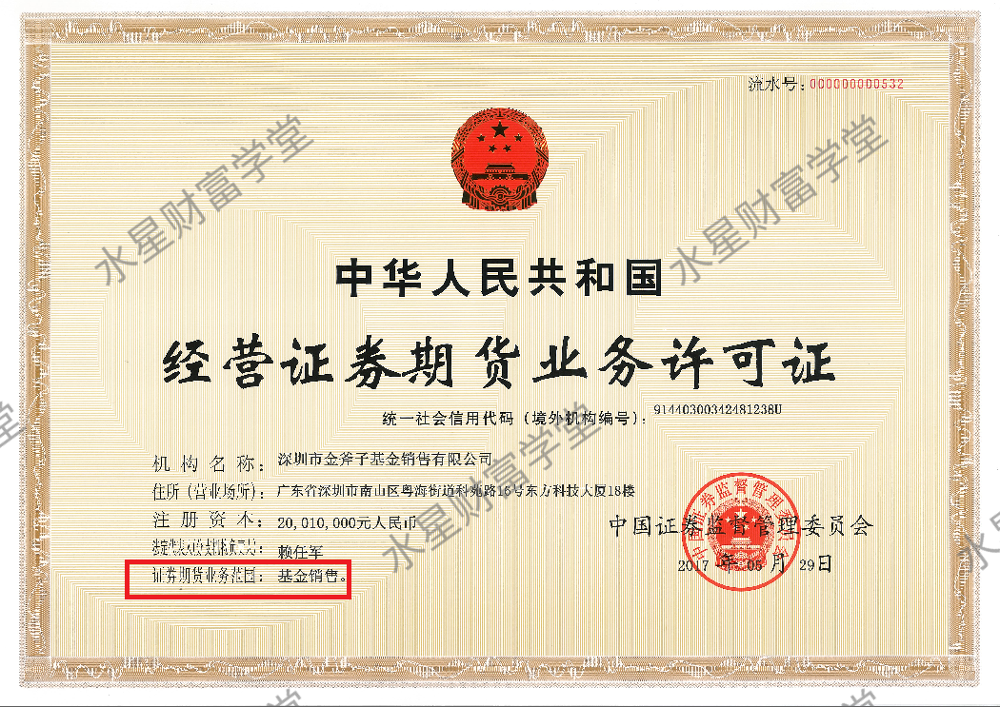
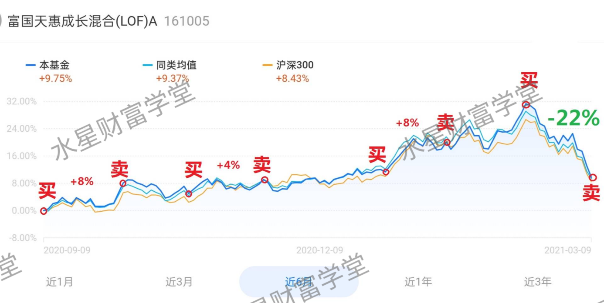
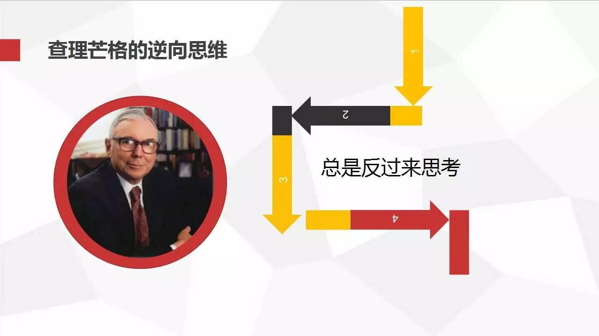

今天的⾳频课讲了股票和基⾦. 相信听课的⼩伙伴都知道它们是怎么赚钱的了. 班班两句话给⼤家总结⼀下:

买股票, 就是做公司的股东, 可以赚公司的分红, 另外我们还可以把股票转卖给别⼈, 低买⾼卖赚差价.

买基⾦, 就是找了⼀位专业的基⾦经理, 让他帮我们决定投资什么, 盈利以后, 我们再拿回属于⾃⼰的收益.

既然股票和基⾦都可以赚钱, 那么⼤家知不知道, 投资它们分别需要多少钱呢?

先说股票. 股票的价格有⾼有低, 相差很多, 低价的股票只要⼏百块⼀⼿, ⾼价的股票可以达到⼗⼏万⼀⼿.

我们买股票, 最起码也要⼀⼿起步, 买⼀⼿低价股⼏百块就够了. 但是班班实话告诉⼤家, 如果你只准备拿⼏百块去闯荡股市, 那还不如趁早死⼼.

⾸先, 便宜股的数量很有限, ⼏百块能买到的股票没⼏只, 本⾦少的话没那么多选择.⽽且这些便宜股的背后, 不少是因为经营不善, 连年亏损, 已经被发出退市警告的公司.

咱们投资是为了赚钱的, 不能为了便宜⽽便宜. 就算买得再便宜, ⼀只趴着不涨咱们也赚不到钱, ⼤家说对不对?

其次呢, 如果遇到股价下跌, 咱们钱多的话可以趁着更低价格, 补上⼏⼿; 但是钱太少的话, 只能眼睁睁看着它下跌, 没有钱再补了. 所以说, 本⾦太少, 在操作上也束⼿束脚.

根据班班的经验, 建议⼤家起码能拿出两三万元, 再考虑投资股票.

接着咱们再说说, 买基⾦需要多少钱.

买基⾦的⻔槛就⾮常低了. 不少基⾦销售平台都是 10 元起投, 100 元起投. 也就是说你哪怕只拿出 10 块钱, 也可以投资基⾦.

⽽且我们建议⼤家选择定投策略, 也就是每⽉定期投⼊⼀笔钱, 可以是⼆三⼗块钱, 也可以是两三百, 资⾦宽裕的话也可以每⽉定投两三千. 这⽅案不但减轻了⼤家的本⾦压⼒, ⽽且⽐⼀次性投⼊⼀⼤笔钱的效果要更好.

我们明天会具体讲定投, 这⾥先不展开.⼤家只需要知道, 你只要能每个⽉拿出⼏⼗块钱, 这就⾜够你开启投资基⾦的旅程啦.

本⾦的疑惑搞定了, 那么下⼀步, 就是拿着本⾦买买买了. 买的时候咱们必须得知道, 基⾦的⻛险到底⼤不⼤, 有没有超出我们的⻛险承受能⼒.

如果⻛险太⼤, 搞得咱们⼩⼼脏砰砰跳, 晚上睡不着觉, 那就得不偿失了. 怎么看基⾦的⻛险⼤⼩呢? 班班今晚教给⼤家⼀招.

咱们的⾳频课程⾥提到过, 基⾦就像⼀辆购物⻋, 基⾦经理推着这辆⻋, 就像逛超市⼀样, 可以往⾥添加各种各样的投资品. 可以添加股票, 也可以添加债券, 还可以是银⾏存款, 等等.

这些投资品直接决定了咱们投资基⾦的⻛险⼤⼩.⽐如说, 基⾦经理添加的全部是股票, 股票本身⻛险很⼤, 就会导致这只基⾦的⻛险也很⼤.

如果基⾦经理只添加债券和银⾏存款, 不添加股票, 那么⻛险就低多了.

这⾥班班给⼤家补充⼀个⼩知识点: 债券可以理解为借条, 国债就是国家找我们借钱打的借条, 公司债就是公司找我们借钱打的借条. 只要债券不违约, 借条到期就得还钱. 哪怕有⼀两只债券违约了, 咱们基⾦的购物⻋⾥还有很多只债券, 会帮我们分散⻛险.

总的来说, 基⾦⻛险⼤不⼤, 就⼀句话: 要看基⾦的成分是什么, 股票越多, ⻛险越⼤; 债券和银⾏存款越多, ⻛险越⼩, 当然, 不能⼀概⽽论.

怎么看基⾦的成分是什么呢?⼤家好好记⼀下, 下⾯是实操步骤, 四步搞定:

第⼀步, 打开⽀付宝, 底部菜单找到"理财", 点击它, 然后找到"基⾦"⼀栏, 点击.(看下图)

第⼆步, 点击右上⻆的放⼤镜搜索, 输⼊基⾦名字或者代码. 这⾥我们以富国天惠成⻓混合基⾦为例, 代码 161005, 看⼀下具体怎么操作.

注意!!! 班班只是随便说⼀只基⾦作为例⼦, ⽅便⼤家练习步骤, 不作为投资建议!!

第三步, 看到上⾯这个⻚⾯之后, 往下拉, 找到"基⾦档案", 点开它.

第四步, 点击"持仓", 就找到我们要的东⻄啦.

我们可以看到, 这只基⾦的投资分布⾥⾯, 有 93.24%是股票, 这个⽐例肯定是很⾼了. 这说明, 这只基⾦的投资⻛险相对会⽐较⾼.

班班提醒⼀下哦, ⻛险⾼并不是说不好, 它的预期回报也会更可观. 有些投资⻛格偏激进的⼩伙伴可以配置这⼀类⾼⻛险、强进攻的基⾦.⽽且我们还可以⻛险⾼的、低的搭配着投资, 进可攻退可守, 也是不错的选择.

前提是, 我们必须知道, 我们买的基⾦到底⻛险⾼还是低.⼤家⽤上⾯班班讲的这个⽅法, 可以分析绝⼤部分基⾦.

刚才班班讲了在⽀付宝上查看基⾦. 那么⼩伙伴们有没有思考过: 这些基⾦和⽀付宝的关系是什么? 难道是⽀付宝⾃⼰⽣产的, 有⾃⼰专⻔的管理团队吗?

真相并⾮如此.⽀付宝其实只是⼀个第三⽅的基⾦代销平台. 基⾦本身是由各⼤基⾦公司发⾏的, 但是呢, 基⾦发⾏以后, 卖不出去的话也没⽤. 关键得有咱们这些投资者买它, 它才有意义.

咱们普通⼈很少直接和基⾦公司打交道, 这就需要⼀个第三⽅的平台, 把各家基⾦公司发⾏的基⾦, 统⼀放到这⼀个平台上. 咱们只需要在平台上挑选购买就可以了.

⼩伙伴们可以把⽀付宝理解成淘宝, 基⾦公司就是⼀个个⼊驻的店铺, 在平台上卖⾃家的基⾦产品. 咱们投资者不⽤各家店到处跑, 只需要在这⼀个平台上就能解决买卖的问题.

班班拿⽀付宝举例⼦, 并不是说在⽀付宝上买是最好的选择. 主要是为了⽅便举例⼦, 因为⼤家⽇常都在⽤这个软件. 但其实, 销售基⾦的平台不只⼀个.⽐如还有很多⼈在⽤天天基⾦购买, 也是可以的.

这⾥班班必须⾼调⼀下: 咱们⽔星财富学堂的⺟公司——⾦斧⼦, 就拥有基⾦销售的正式牌照!

⽽且还有⾃⼰独⽴的基⾦销售平台"⾦斧⼦基⾦"App.⼤家可以下载体验, 但不推荐现阶段的⼤家直接买基⾦. 咱们是学习群, 不推具体的投资产品, 不懂的暂时不碰, 技能学到家了再开始投资也不晚.

PS. 刚才咱们讲到⽀付宝查看基⾦持仓判断基⾦⻛险⼤⼩, 其实"⾦斧⼦基⾦"也可以实现, 步骤都类似, ⼤家可以⾃⼰摸索⼀下.

⾦斧⼦的基⾦销售资格, 是 2016 年 1 ⽉由中国证监会核准通过的.

这块牌照有多珍贵呢? 班班这么说吧, 国内除了银⾏、证券、保险、期货公司等, 有基⾦销售资格的独⽴基⾦销售机构, 只有 100 家左右, ⾦斧⼦就是其中之⼀. 这个和天天基⾦、⽀付宝的蚂蚁基⾦等都是并列的.

⽽且⾦斧⼦有 300 多个理财顾问, 可以给⼤家做投资建议, 提供售后的答疑等等. 这是其他平台不具备的哦~

总之⼤家买基⾦时, ⼀定先确认⼀下平台是否有销售资格. 在证监会的官⽹, 搜索"公开募集基⾦销售机构名录"就可以找到平台名单.

以上咱们了解了基⾦的⻛险, 也了解了平台, 接下来就到下单这⼀步了. 买基⾦的⽅式有两种, ⼀种是申购, 另⼀种认购. 只有⼀字之差, 但是其中的差别很⼤.

如果基⾦已经发⾏过⼀段时间了, 基⾦每天都在涨跌, 投资者随时可以买卖, 那么我们买这种基⾦就叫"申购".

如果是最新发⾏的基⾦, 我们买它就叫"认购".

班班总结: 买⽼基, 叫申购; 买新基, 叫认购.

那么到底是⽼的好, 还是新的好呢?

其实它们各有优缺点.⼀般来说, ⽼基⾦可以随时买卖, 灵活性很强, 但是申购的⼿续费会⽐认购新基⾦要⾼⼀些.

认购新基⾦的⼿续费更低, 但是⼀旦认购成功之后, 往往⾯对⼀段时间的封闭期, ⼏个⽉到⼗⼏个⽉不等. 在这段封闭期⾥, 我们什么也做不了. 如果不喜欢这只基⾦了, 我们的钱取不回来; 如果越来越喜欢这只基⾦了, 我们也没法追加资⾦.

⼀切只能等到封闭期过去了, 我们才能进⾏操作. 在灵活性上, 认购新基⾦确实不如申购⽼基⾦.

其实不管是认购还是申购, 对收益来说都不是最重要的. 最重要的是选择对的基⾦, ⻓期持有.

⼤家也看到了, 班班持有基⾦的周期都是按年算的, 很少在⼀年之内频繁买卖. 只要做好了⻓期持有的准备, 哪怕有半年封闭期不能动它, 也不算什么⼤问题.

很多新⼈喜欢频繁操作, ⽐如买了之后连跌三天, ⼼⾥紧张拿不住了, 赶紧卖掉; 或者涨了⼀点点就害怕跌回去, 也赶紧卖掉, 错过了后续的⼤涨. 这都是⼀些"⾲菜"级的操作.

正确的姿势, 应该是⻓期持有. 不经常看它, 也不经常碰它, 反倒⽐那些"⼀顿操作猛如⻁"的⼈要强⼀百倍.

班班这么说的道理在哪呢?⼤家看图:

咱们还是以【富国天惠成⻓混合】来举例⼦. 图上标了 4 次买卖的位置.

(只是为了教学. 不构成投资建议, 不构成投资建议, 不构成投资建议!)

A 同学按照图上标的, 分 4 次买卖, ⼤家看图, 第⼀次买卖, 赚 8%, 第⼆次买卖, 赚 4%, 第三次买卖, 再赚 8%~

3 次操作下来就赚了 20%. 看起来是不是很不错?

但是!!!3 次上涨导致 A 同学盲⽬乐观, 第三次买在了⾼点, ⼀把亏了 22%左右. 三次加起来, A 同学亏了 2%.

同样的⼀段时间⾥, B 同学最开始和 A 同学⼀起买, 最后⼀次再和 A ⼀起卖掉, 中间不做任何操作. 总体来看, B 同学赚了 10%的收益.

这还只是 6 个⽉之内的差别.⻓期来看, 收益相差更明显.

现实总是这样的: 那个天天盯着基⾦频繁交易的⼈, 还不如那个忘记了账号密码的⼈赚得多.

给⼤家⼀句忠告: 投资基⾦的正确姿势是⻓期持有, 买⼊之后持有期限甚⾄可以⻓达 3 年、5 年.

千万不要指望短期内频繁交易赚钱. 频繁交易只是让⼈感觉⾃⼰很聪明, 其实对收益没有什么帮助, 还有可能帮倒忙, 降低我们的收益.

班班再给⼤家分享⼀个有趣的事情:

咱们⽔星财富学堂的⺟公司⾦斧⼦, 也同时在销售私募基⾦. 有⼀年期的, 也有三年期的, 甚⾄五年期的.⼏年期的含义和前⾯的"封闭期"类似, 就是这段时间内钱是不能取出来的.

有意思的是, 买⼀年期的⼈, 收益永远不如买三年期、五年期的⼈⾼.

因为有些买⼀年期的投资者, 看到⼀年过去了, 赚钱效果不明显, 都纷纷选择了赎回, 不再持有.

但是买三年期和五年期产品的⼈, 赚钱概率 100%, 全员赚钱. 为什么呢?

因为哪怕第⼀年赚不到钱, ⼤家着急也没⽤, 钱还赎不回来. 等到五年过去了, 钱可以赎回了, 基⾦也反弹了, 收益也涨起来了, 很多⼈就不舍得赎回了.

⻓期来看, 基⾦赚钱的概率要变⼤很多. 所以现在, ⾦斧⼦⼀直给客户传递⻓期投资的理念, ⽽且也把"⻓期主义"写进了公司的价值观⾥⾯.

赚快钱是⼈性, ⻓期投资是反⼈性. 你会发现, 投资永远是反⼈性的⼈才能赚到钱.

投资⼤师查理·芒格就曾说过:"反过来想, 总是反过来想."

班班希望咱们⼩伙伴们也能够转换思维, 践⾏"⻓期主义", 做⻓远的投资, 不做⼀次性的交易.

今晚的分享就到这⾥啦. 最后班班总结⼀下今晚的⼲货, ⼩伙伴们可以抽空记在⼩本本上哦~

第⼀, 股票投资的⻔槛⽐较⾼, 建议⼤家起码能拿出两三万元, 再考虑投资股票. 基⾦投资的⻔槛很低, 只要能每个⽉拿出⼏⼗块钱, 就⾜够开启投资基⾦的旅程啦.

第⼆, 基⾦⻛险⼤不⼤, 就⼀句话: 要看基⾦的成分是什么, 股票越多, ⻛险越⼤; 债券和银⾏存款越多, ⻛险越⼩, 不能⼀概⽽论.

⽤⽀付宝查看基⾦成分的步骤, 可以详⻅今晚的分享内容. 稍后班班也会整理成⽂档, 分享给⼤家, ⽅便⼤家回看.

第三, ⽀付宝其实只是⼀个第三⽅的基⾦代销平台. 销售基⾦的平台不只⼀个.⽐如还有很多⼈在⽤天天基⾦购买, 也是可以的. 咱们⽔星财富学堂的⺟公司——⾦斧⼦, 就拥有基⾦销售的正式牌照, 是⼀家独⽴基⾦销售机构. 全国只有 107 家独⽴基⾦销售机构.

第四, 买⽼基⾦, 叫申购; 买新基⾦, 叫认购. 买⽼基⾦⼿续费⾼, 但是⼀般可以随时买; 买新基⾦⼿续费低, 但是要⾯对封闭期.

第五, 投资基⾦的正确姿势是⻓期持有, 买⼊之后持有期限甚⾄可以⻓达 3 年、5 年. 千万不要指望短期内频繁交易赚钱. 频繁交易只是让⼈感觉⾃⼰很聪明, 其实对收益没有什么帮助, 还有可能帮倒忙, 降低我们的收益.

今晚的内容⽐较多.⼤家好好消化, 有什么问题可以直接提问哈, 也可以私聊班班, 我来为你开⼩灶~
