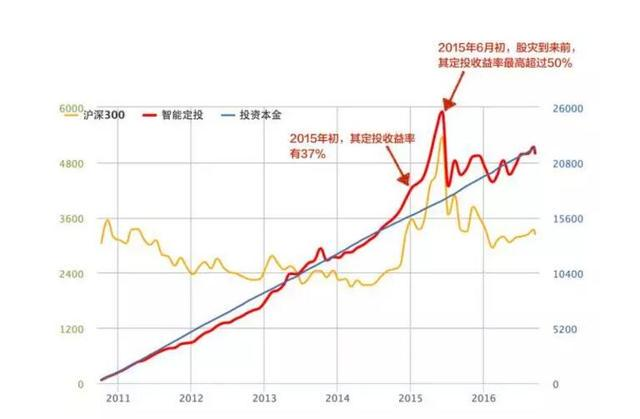

## 晨读

今天听了⼀个惨烈的故事. 球仔⼀同学, 从 2010 年开始定投某只基⾦, 每个⽉ 8 号投 300 块钱, 坚持了整整六年, 后来全部赎回, 以净亏损 200 多收场. 她⾃⼰觉得还挺⾼兴的, 觉得每个⽉省 300 块钱, 坚持下来竟然在基⾦账户⾥⾯攒了⼏万.(⼼态不错, 能⼒⽋费呀)

球仔却不以为然. 这明显是⼀个很凄凉的故事嘛!

因为她的定投, 收益率曾经⾼达 50%以上. 可惜她没有取出, 眼睁睁看着收益全部跌没了.

哦! 不对! 还不是眼睁睁, 她是设定了定投之后, 每个⽉就让它从银⾏卡扣钱, 六年时间都没去管收益如何. 球仔听她讲了之后, 觉得完全不可理喻.

这操作, 简直太烂了!!

她犯了个很⼤的错误. 错在哪⾥呢?

基⾦定投, 可以没有⽌损, 但是⼀定要有⽌盈.

### 基⾦定投也要⽌盈.

照理说, 任何投资都需要有⽌盈和⽌损, 不过基⾦定投, ⽌损不那么重要, 但是⼀定得⽌盈. 你们知道, 股市是周期性⽜熊转换的. 如果定投多年积累的收益, 在⽜市到来的时候没有⽌盈, 你的收益终究会随着熊市的离去⽽化为乌有.

球仔的同学定投的这只基⾦叫博时平衡配置混合(代码:050007), 这是⼀只混合基⾦, 有⼗年历史了. 同学在定投的过程中, 2015 年年初, 定投收益达到 37%, 2015 年 6 ⽉股灾前定投收益率最⾼超过 50%, 可惜这段时间她⼀直没有⽌盈赎回, 直到所有收益消失殆尽.

哪怕是第⼀次暴跌的之后, 其定投收益也还有 20%以上, 依然没有赎回, 错过了⼀次⼜⼀次机会.

怎么⽌盈? 你可以给⾃⼰设定⼀个⽬标, ⼀旦受益达到预期⽬标, ⻢上抛出.

▲ 该同学的定投⾛势

### 基⾦也要密切关注市场波动

有些⼈觉得, 定投就是设定好投资策略之后, 不管基⾦当前的净值如何, 每个⽉⾃动存钱进去就⾏了.

我同学就是这样⼦对待定投的.⼤错特错!

定投可以代替储蓄, 但是不等于储蓄. 定投也是投资, 是为了在控制⻛险的前提下, 让收益最⼤化.⼀般我们定投的周期设定为三到五年. 定投的前期, 基⾦亏了也不⽤慌. 但是我们要关注, 现在是不是已经到⽜市了, 如果到了⽜市相对⾼点, 或者达到了⾃⼰的⽌盈线, 就抛了吧.

在定投过程中, 如果股市⼤幅下挫, 还可以加⼤该周期定投的⾦额, 以更便宜的价格获得更多的基⾦份额. 这个也是基⾦定投的常⽤技巧之⼀, 成熟的定投者都应该学会这点.

### 什么类型的基⾦适合定投?

球仔那位同学做定投, 选了⼀只混合型基⾦. 混合基⾦可不可以定投? 当然可以, 但是, 并不是最好的选择.

⾸先, 债券市场的⽜熊周期更明显, 更容易判断, ⼀次性投资⽐通常定投的效率和收益都更⾼; 其次, 债券市场的波动⽐股市弱很多, 定投的预期收益也低很多. 混合型基⾦⾥⾯有不少的债券⽐例, 当然不如股票型基⾦给⼒.

当然, 如果你直接定投债券基⾦, 那是最愚蠢的.

波动越⼤的基⾦越适合定投, 所以定投股票基⾦⽐较合适, 指数基⾦更佳.

下图为基⾦定投的微笑曲线, 越深越好, 波动越⼤的基⾦越适合定投.

### 什么时候开始基⾦定投?

答: 现在. 种⼀棵树最好的时间是⼗年前, 其次是现在.

## 班班拆读

很多小伙伴在没有学习之前就已经蠢蠢欲动, 觉得基金定投好简单, 貌似人人都能上手

其实这样的感觉没有错的, 基金定投简单好理解易上手适用于多数人, 但是并不是任何基金任何时候都可以定投

基金定投就是定期的进行投资, 又被称之为"懒人投资法", 基金定投就好比银行的零存整取方式

也能有效帮助我们在市场价格便宜的时候买到更多单位的基金, 从而平摊投资成本, 降低整体风险, 以此来获取不错的回报

虽然定投是一种简单的投资方式, 也适合很多小伙伴去做安排, 但是也存在很多误区的, 不通过学习很容易走进歧途

基金定投是适合上班族和大学生们的投资方式, 定投本来是一种非常适合普通人的方法, 但如果没有策略, 只是无脑定投, 最终也是会发生亏损的!

不懂得不碰, 不要看着简单, 其实也有风险, 而且有时候风险不小

今早晨读文章的球仔同学, 接下来班班趁这会来给大家分析下, 很多像球仔同学这样的宝宝的共同特点

人会有两种不同的心态: 一种是固定心态, 另一种是成长心态

班班有一个化妆师学员, 她跟我说就是一个看似很简单的韩式半久纹眉, 也特意花钱报名了 3 个机构学习. 为什么呢? 当时她跟我讲, 一个机构和另一个机构麻药的不同用法啊~

虽然大部分课程内容都是一样的, 但是她一直抱着成长的心态去学习其中的精华

有些同学问班班, 买股票基金亏损, 但是已经买了就那么着吧. 她还害怕不学完课程自己更后悔

我想说, 回避不是解决问题的好办法, 因为你终将还会遇见同样的问题, 你还是不知道如何才是正确的选择, 再一次的被无知左右

还有同学问:"原行业工资低. 但舒适安稳不敢跳出原行业. 但是又不想在本岗位继续工作. 觉得自己未来上升空间少, 迷茫怎么办?", 这就像在问"我既不想节食, 又不想运动, 但是我非常想把我的 300 斤的体重削减一半, 班班你有什么好办法吗?"

那抱歉, 我的回答只能是"你接着胖吧..."

之前我们学习了死胖子定投实现了财务自由, 但是同样的定投, 还是大家"觉得"风险低的基金, 却发生了亏损

有很多损失都是对事情的似懂非懂, 一知半解造成的

赚钱很多时候是需要违背人性的, 我们需要数据支撑自己的投资逻辑, 用理性去判断买入或者卖出

生活中也不乏这样的例子, 就是因为看似简单, 所以把不少人带入了歧途. 比如文中的主人公

他只知道有定投这么个东西就一个猛子扎进了市场, 这样还不亏~怎么对得起认真学习的我们

同一只基金不同的时间买入, 不同的操作策略, 依然会有人有亏有赚, 所谓的牛市熊市, 其实很多时候我们根本判断不了, 都是时间过去以后, 我们回头看, 才知道哦, 原来当时是牛市/熊市

好了, 拆读就到这里, 请小伙伴们一起加油
