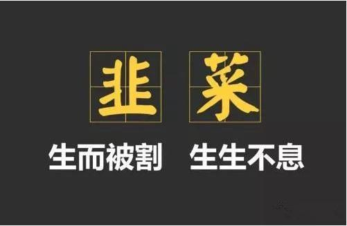
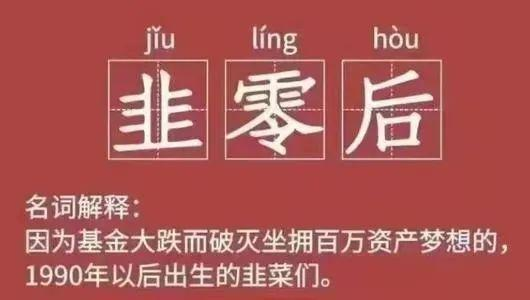
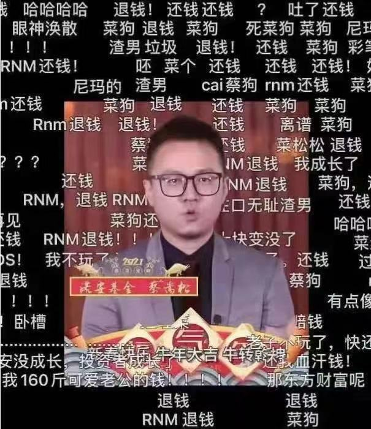
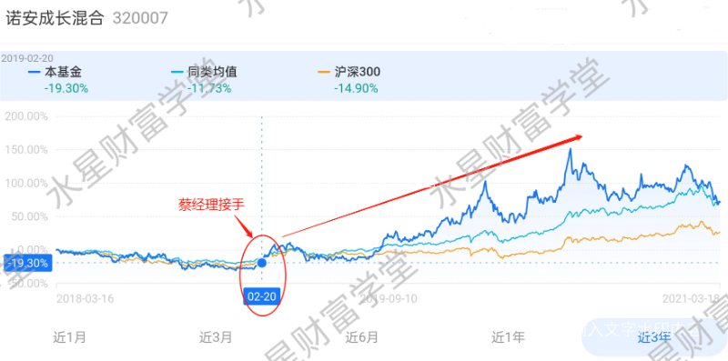
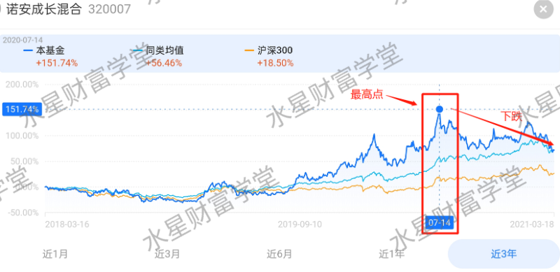
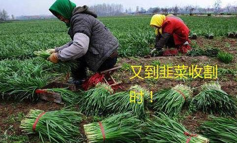
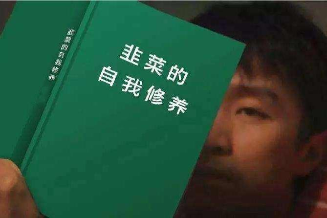

今天咱们说⼀个投资中的庞⼤族群: ⾲菜~

⾲菜, ⽣⽽被收割, ⽣⽣不息, 割完⼀茬⼜⼀茬, 永远割不完.

中国投资市场⼏⼗年了, 到现在依然流传着"七亏两平⼀赚"的说法. 七亏, 就是庞⼤的⾲菜族群撑起来的.

为什么⾲菜这么容易亏呢? 今天咱们就来聊聊这个问题. 我们不扯虚的道理, 直接看⼀个真实的例⼦.

诺安成⻓混合, 代码 320007, 基⾦经理蔡嵩松(仅作为示例, 不作为投资建议)

当时骂这位基⾦经理的声⾳⼀⼤⽚, 动不动就喊"垃圾"、"还钱"~

发⽣肾么事了? 肯定是⼤家买了他管理的基⾦, 亏了. 好像责怪他也没什么错. 但是具体的情况咱往下看:

蔡嵩松从 2019 年 2 ⽉ 20 ⽇开始管理"诺安成⻓混合"这只基⾦.

在此之前, 这只基⾦⼀直没有好业绩, 没⼈瞧得上. 但是蔡经理⼀接⼿, 收益直接起⻜了!

当时那叫⼀个众星拱⽉啊. 随便聊⼏句基⾦就有⼈说, 买诺安好! 不管你有没有经验, 好像买诺安就是最正确的. 毕竟别⼈买了都赚钱了啊, 我⼜不⽐别⼈少什么, 我怎么会不赚钱呢?

⼤部分⼈是什么时候有这个意识的呢? 是 2020 年 7 ⽉份前后~

⼀起看图吧:

2020 年 7 ⽉份上旬, 股市有⼀波⼩⾼潮, 带动着基⾦收益往上涨. 涨得那叫⼀个快, 很多⼈都在呼唤:⽜市来了, ⽜市来了……

平⼼⽽论, ⼤家听到这种⽜市的声⾳, ⼼⾥痒不? 很多⼈之前没有布局, 但是就害怕错过⽜市的好机会, 决定不掉队, 开启买买买模式.

买啥呢? ⼤家都说诺安好, 那就买诺安. 具体诺安是⼲啥的, 他也不知道, 他也不敢问……

了解多⼀点的⼈能说上来, 诺安的成分都是科技股, 搞半导体的. 但是半导体是个啥东⻄? 为什么要投资半导体? 现在投资半导体是好时候吗? 他就⼀问三不知了.

然后, 灾难来了. 7 ⽉这波上涨⾏情过后, 很快就迎来了下跌. 那些最后⼀批买⼊的⼈, 都留在⾼位"站岗"了.

这时候很多⼈就想啊: 我也不求赚钱了, 起码你不能让我亏吧, 等到和我的买⼊价⼀样的位置, 我就卖掉, 起码保住本⾦, 不亏不赚, 就当从来没参与过.

然后, 这⼀路, 就再也没有到过最⾼点那个位置. 拿着的⼈⼀直亏到现在, 还有⼀些拿不住的, 中间就卖掉了, 以亏损出局.

骂蔡经理的, ⼤部分都是去年 7 ⽉份左右⼊⼿的这⼀波⼈.

班班说句⼤实话, 这批⼈⾛过的路, 完美演绎了⾲菜的投资过程.

为什么说这就是⾲菜呢? 因为⾲菜最容易犯的三⼤错误, 他们都犯了. 咱们来梳理⼀下:

## 第⼀个错误, ⼤部分⼈都赚钱了的时候⼊场.

道理很简单, 投资讲究的是低买⾼卖, 如果⼤部分⼈都赚到钱了, 说明市场已经处在⾼位了.

⼈家在低位的时候, 低买进来的, 所以到了⾼位赚到钱了. 但是⾲菜并不懂得别⼈赚钱的道理啊, 只是觉得买同⼀只基⾦的话, 就是和别⼈⼀样, 就能赚钱, 赚钱是因为这只基⾦好.

但是, ⾲菜忽略了买卖位置. 同样的基⾦, 买卖位置不⼀样, 结果是差别很⼤的.

因为买⼊位置不⼀样, 你和别⼈的成本价就不⼀样. 这就像刻⾈求剑, 你的位置都变了, 还想找到同⼀把剑, 怎么可能呢?

所以班班给⼤家⼀句忠告: 当你发现⼤部分⼈都赚到钱了的时候, 恰恰是你应该警惕、保守的时候.

相反, 当你发现⼤部分⼈都在吐槽不赚钱的时候, 反倒是因为价格处在低位, 容易低买的时候. 这时候不要跟着吐槽, 你应该⾼兴才对.

就像 2021 年开始的⼏个⽉, 基⾦⼀路下跌, 很多⼈再也不相信投资了, 这就是⾲菜思维. 真正的内⾏都知道, 这样的下跌反倒是加码的好时机, 这给了我们低买的机会. 低买, 才容易⾼卖.

投资就是这么反⼈性, 越是顺着情绪来, 就越赚不到钱. 大部分散户都是在情绪化投资, 所以才有"七亏两平⼀赚", 才有这么多⾲菜.

当你学会了和⼈性反着来, 和情绪反着来, 你就已经跑赢⼤部分投资者了.

## 接下来咱们再说⾲菜容易犯的第⼆个错误: 不懂的还要碰.

就⽐如诺安成⻓混合, 是⼀只混合基⾦. 也就是成分可以杂七杂⼋, 可以投资各种投资品, 也可以投资各种⾏业. 基⾦经理的选择范围很⼴.

但是, 诺安的基⾦经理并没有按套路出牌. 他虽然可以选择各个⾏业的投资品, 但是⼈家就不这么⼲, 就要聚焦在单⼀的⾏业: 半导体. 反正选择⾃由, 咱也不能说⼈家有什么错.

稍微解释⼀下: 半导体, 理解为芯⽚就⾏~ 这玩意⼉是⾼科技中的⾼科技. ⾃主研发芯⽚可是中国的痛点~

之所以聚焦半导体, 和蔡嵩松个⼈的履历有关系. 他在做基⾦经理之前, 可是芯⽚设计的博⼠毕业, 然后还在中国科学院计算技术研究所待过. 可以说对这个⾏业有⾜够的认识和了解, 所以才敢押注在这上⾯.

⼈家玩的是⾃⼰擅⻓的领域, ⽆可厚⾮.

可是, ⼤部分诺安的投资者, 只看基⾦过去涨没涨, 压根不看⾃⼰投资的是什么. 半导体? 不关⼼. 中国半导体的未来? 也和我关系不⼤, 反正只要赚钱就⾏.

这就是典型的⾲菜⼼理, 不懂的还要硬投. 这样操作很少有⼈能赚钱的.

实操课⾥会给⼤家讲解, 你买的基⾦是投资多种⾏业, 还是聚焦某⼀个⾏业. 不同⾏业的表现不同, 投资多个⾏业的话可以分散⻛险, 所以波动没那么⼤, 聚焦单⼀⾏业的话波动⽐较⼤, 但是如果押对了⾏业, 可以获得超预期的回报.

进阶课会讲到多个⾏业分散的基⾦, ⾼阶课会讲聚焦单⼀⾏业的基⾦, 尤其是很多⼈⽐较关⼼的新能源、⽩酒、医药三个⾏业, 会重点讲. 这⾥我们不展开.

## 最后我们来说⼀下, ⾲菜容易犯的第三个错误: 只看短期的赚钱效应.

⽐如, 同样是⾯对诺安成⻓混合, 蔡经理和投资者之间, 对诺安的期待根本不⼀样.

投资者⼤都是这么想的:

我今天投了, 最好这个⽉就能看到收益, 最多三个⽉或者半年. 如果买了半年你⼀直在亏钱, 那⼀定是你这只基⾦的问题.

但是, 国内绝⼤多数基⾦经理, 都是看⻓期收益的. 这个⻓期可以⻓达三到五年. 半年之内的涨跌没那么重要, 经理很少因此改变策略.

就拿芯⽚来说, 赚芯⽚⾏业的钱, 肯定是要吃芯⽚⾏业发展的红利嘛. 芯⽚发展肯定是多年积累起来的, 不会是半年之内突然研究出来⼀个芯⽚. 这个周期是很⻓的. 我们投资也要跟着这个周期⾛.

蔡嵩松经理布局芯⽚⾏业, 应该是按照⻓期利好的逻辑. 但问题是投资者不吃这⼀套, ⼤家都想赚快钱. 你让我赚不到快钱, 我就骂你.

⻓期来看, 基⾦赚钱的概率很⼤, 但是短期内永远是未知数. ⼤部分基⺠喜欢盯着短期收益看, 短期不赚钱就卖掉了, 之后基⾦赚钱也与他⽆关了.

基⾦圈⾥流传着⼀句话叫"基⾦赚钱, 基⺠不赚钱", 其实就是在说这个道理. ⼤家懂得坚持⻓期主义, 才能赚到钱.

本次分享就到这⾥了. 咱们拿诺安成⻓混合作为例⼦, 总结了⾲菜容易犯的三个典型错误, 分别是:

(1)⼤部分⼈都赚钱了的时候⼊场.

(2)不懂的还要碰.

(3)只看短期的赚钱效应.

希望⼤家远离⾲菜思维. 咱们不做⾲菜, 咱们要做割⾲菜的~
