股神巴菲特⼤家都认识吧? 为了照顾不认识巴菲特的同学, 班班⾸先简单介绍⼀下这位传奇的⽼头⼦, 先放上⼀张⽼头⼦的靓照.

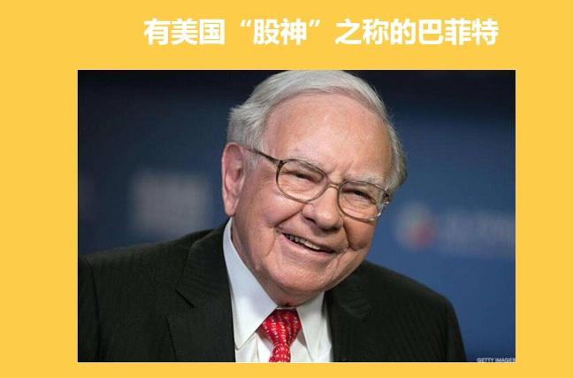

他最⼤的成就, 是在 50 多年间不断投资收购好公司的股票, 让⾃⼰公司的股票增值了超过 3.7 万倍! 他的公司, 伯克希尔哈撒⻙, 也成为了股票界的⼀股清流, 每股股价⾼达约 31 万美元, 折合⼈⺠币是 213 万. ⼀份股票, 就⾜够我们在⼆三线城市买套房⼦了.

话说巴菲特在 17 年致股东的⼀封信⾥⾯讲了⼀个关于赌注的故事:

2005 年, 巴菲特向所有主动股票基⾦经理下了⼀个战书, 以 10 年为限, 赌没有⼀个主动基⾦能够打败标普 500 指数基⾦, 赌注是 50 万美⾦.

赌局⼀开, 整个华尔街居然沉默了, 没有⼈敢来应战.

直到 2008 年, 普罗蒂杰公司的投资经理泰德·⻄德斯精选了 5 只基⾦, 要在未来 10 年与巴菲特的标普 500 指数基⾦⼀决⾼下.

截⽌到 2017 年, 9 年过去了, 巴菲特的标普 500 指数基⾦收益为 85.4%; ⽽同期泰德.⻄德斯的五只基⾦收益率从 2.9%到 62.8%不等, 组合收益率只有 22%.

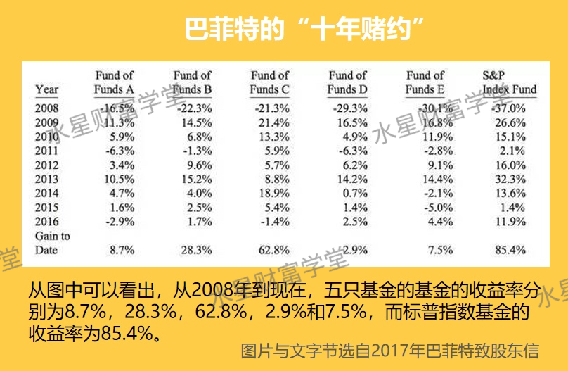

⻄德斯在 2017 年 5 ⽉ 5 ⽇也主动认输了. 他说:"虽然赌局还有⼋个⽉, 但本质上⼀切都结束了, 我输了."

⼤家觉得为何巴菲特敢挑起这个赌局呢? 下⾯, 我们就来揭开指数基⾦的神秘⾯纱.

## 第⼀部分、什么是指数基⾦?

### 1、什么是股票基⾦

我们先来了解什么是股票型基⾦.

货币基⾦是专⻔投资于银⾏间存款, 债券基⾦是专⻔投资债券, 那股票基⾦就是专⻔投资股票的基⾦.

现在 A 股共有三千多只股票, ⼤部分⼈是分辨不出来好坏的. 于是基⾦经理出场了, ⼤家把钱交给他, 他来帮我们买股票.

所以股票型基⾦就是买了⼀揽⼦的股票, 我们买基⾦, 就是在买这只基⾦的持仓股票.

也就是说, 我们买股票型基⾦, 本质就是买股票.

相对来说股票型基⾦⽐我们直接买股票⻛险⼩⼀点, 因为我们买了很多只股票嘛, 即使其中⼀只出了很严重的问题, 也不⾄于太惨.

基⾦可以分成主动型基⾦和被动型基⾦, 通常我们说的股票基⾦都是指主动型基⾦, ⽽被动型基⾦就是指数基⾦

### 2、主动基⾦ vs 被动基⾦(指数基⾦)

主动基⾦就是由基⾦经理⾃⼰选股的基⾦, 基⾦的业绩取决于基⾦经理的能⼒.

⽽被动基⾦呢, 就是不由基⾦经理来选股, 那怎么决定持仓股呢? 答案是指数.

指数是⼀个通常由交易所制定的指标, ⽤来反映市场的平均⽔平.

⼤家刚接触到它可能有点懵, 班班来给⼤家举个例⼦.

⽐如我们现在要在市⾥选 300 个优秀学⽣, ⾸先定个标准, 考试成绩在全市前 300 名. 再定个标准, 体育成绩在 80 分以上, 德智体美劳嘛. 再根据每个学校的⽔平(⽐如全市第⼀中学的名额多于第⼆中学), 以及⽂理分科(⽐如⽂理占⽐为 4:6)等等标准. 然后就能选出来我们想要的这⼀批优秀学⽣.

那么, 这⼀系列的标准就叫指数, 通过⼀系列的标准选出来的股票(学⽣)就叫成分股. 去追踪购买这些成分股的基⾦, 就叫做指数基⾦.

放到股市的实例中, ⽐如沪深 300 指数.

沪深 300 指数就是从上海和深圳证券交易所, 选出了 300 只规模最⼤、流动性最好的股票, 再通过⼀定的加权标准, 组成了沪深 300 指数的成分股.

沪深 300 指数所包含的 300 只成分股, 每年会分两次重新进⾏选拔, 去掉已经不符合条件的公司, 再把其他符合条件的公司加进来.

有同学⼜问了, 追踪沪深 300 指数的基⾦不⽌⼀只(⽐如 AA300、BB300 等等), 那它们有什么不同之处呢?

还是继续我们刚刚的例⼦, 我们通过⼀系列的指标选出来了 300 名优秀学⽣. 因为标准很⾼, 公认的优秀. ABCDEFG 学校都想招揽他们(不同基⾦公司的指数基⾦都追踪这个指数).

但是由于不同学校的成⽴时间不同(基⾦的成⽴时间不同)以及招揽的条件不同(基⾦经理有时候会增加或减少⼀些内容)最后导致招揽的对象未必是这 300 个学⽣

所以虽然是追踪同⼀个指数, 还是会有些许不同的~

历史数据证明, 将近 80%的主动基⾦都跑不过指数基⾦.

所以巴菲特这个从来不推荐任何具体投资标的的⽼头⼦, 20 年间⼀共向普通投资者推荐过⼗⼏次指数基⾦

### 3、指数基⾦的优势

为何巴菲特笃信指数基⾦会战胜主动基⾦呢?

⾸先是由于主动基⾦的缺点——⽆法摆脱⼈性的弱点. 按道理, 投资要在熊市买进, 在⽜市卖出.

基⾦经理明⽩这个道理, 但是他们表示:⾂妾做不到啊. 因为客户做不到. 那些基⺠都是在⽜市申购, 熊市赎回, 基⾦经理也不得不在熊市卖出, ⽜市买进. 所以 80%的基⾦跑不赢指数也就不⾜为奇了. 这也是为什么有⼈定投了好多年基⾦, 还是亏损的

其次则是指数基⾦的优点:

①. 灭绝⼈性.

指数每年根据规则定期调整成分股, 指数基⾦也机械地跟着调整持仓股票, 所以能够摆脱恐惧和贪婪的影响, 不会⼲追涨杀跌这种事情.

②.⻓⽣不⽼.

公司会死亡, 会消失, 但是指数不会, 它通过定期调整成分股, 通过引⼊新公司, 剔除⽼公司的⽅式实现了真正意义上的⻓⽣不⽼.

举个栗⼦, 美国的道琼斯指数:

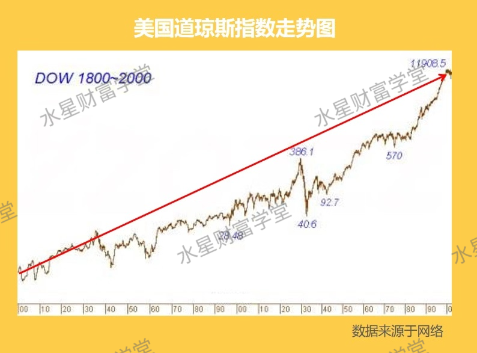

但是, 这个指数(上图)也是经历了很多曲折和磨难的. 最初⼤量的财报作假, 安然公司丑闻, 因为战争的休市, 以及 08 年⾦融危机等等, 然⽽经过了九九⼋⼗⼀难的指数依然在茁壮成⻓.

真正是铁打的营盘流⽔的兵, 我们买指数, 相当于买营盘, 买具体股票, 就等于买某个⼠兵, ⼠兵可能阵亡, 但是营盘会在那⼉.

③. 永远上涨.

这是在 200 年间, 各个资产的涨幅. 股票从 1 美元涨到了 755163 美元, 也就是涨了 755163 倍.

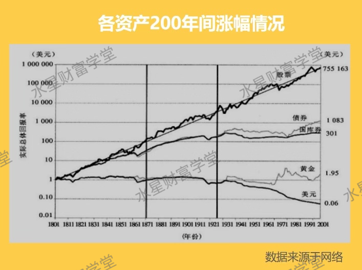

我们来看看中国的情况.

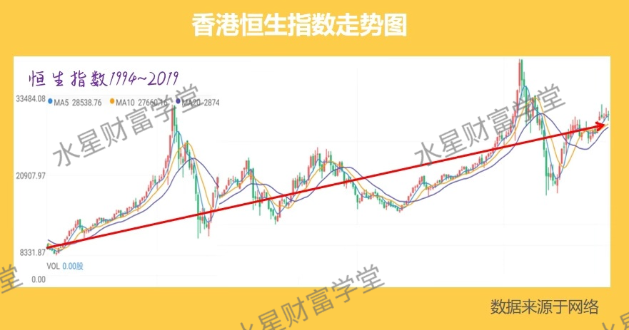

这是恒⽣指数近 25 年的⾛势(也就是港指).

恒⽣指数诞⽣于 1964 年, 最初是 100 点, 现在已经 28000 多点了, 50 多年上涨 270 倍.

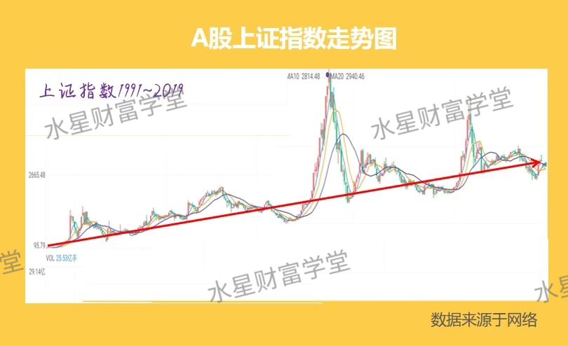

这是上证指数近 30 年的⾛势, 说到这我不得不为 A 股来正名了, 谁说 A 股不赚钱了.

尽管只诞⽣了 30 年, 中间也经历了起起落落, 但从 1991 年初的 100 点, 上涨到 2019 年的 3000 点左右, 28 年上涨了约 30 倍. 年化收益率达到 12%+.

### 指数为什么会永远上涨呢?

因为指数的背后是公司, 指数会定期调仓, 把赚钱能⼒强的公司选⼊指数, 淘汰赚钱能⼒弱的公司, 所以, 指数必然是⻓期上涨的.

巴菲特说过(⼜把巴菲特拎出来了), 买指数基⾦就是买国运. 只要相信国家经济能继续发展, 指数基⾦就能⻓期上涨, 我们就能分享国家经济增⻓带来的收益了.

## 第⼆部分、定投

我们了解了指数基⾦, 接下来我们讲讲我们的千万富翁计划.

[计算器](http://www.cebbank.com/site/gryw/jsq/jjsyljsq/jjdtsyljsq/index.html)

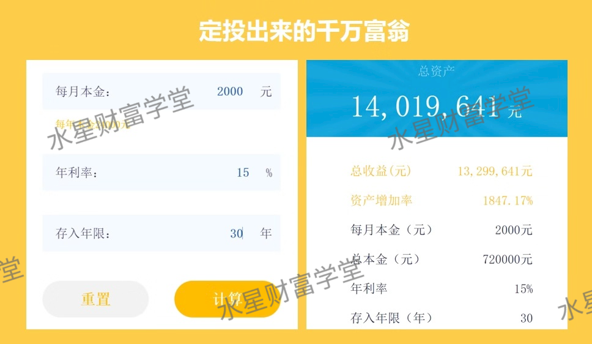

先来给⼤家放班班这张千万富翁计划, ⼤家能看出班班的千万富翁是利⽤什么样的投资⽅式达成⽬标吗?

基⾦定投, 确切的说是指数基⾦定投.

那么是不是所有的基⾦定投都可以获得这么好的收益呢? 有的⼩伙伴说, 我现在知道要选择指数基⾦了, 那么我就选择⼀个指数基⾦投就好了.

有⼈说: 每⽉固定投资额, 按时定投, 不管⼤盘. 我们把这种定投成为傻⽠式定投, 简称"⽆脑定投".

我们来看⽆脑定投的效果. 我们来看图. 这个是班班随意选取的⼀个指数基⾦ 510500 , 我们从 2014 年 11 ⽉开始去定投, ⼀直到 2017 年 7 ⽉.

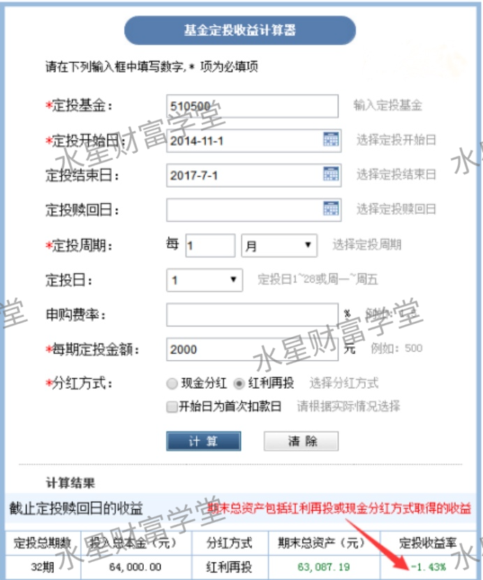

是谁说指数基⾦定投就⼀定可以赚钱的? 没有跑赢通货膨胀就算了, 还亏啦! 那么为什么亏了呢? 因为⾛过了⼀个哭泣路径. 如下图

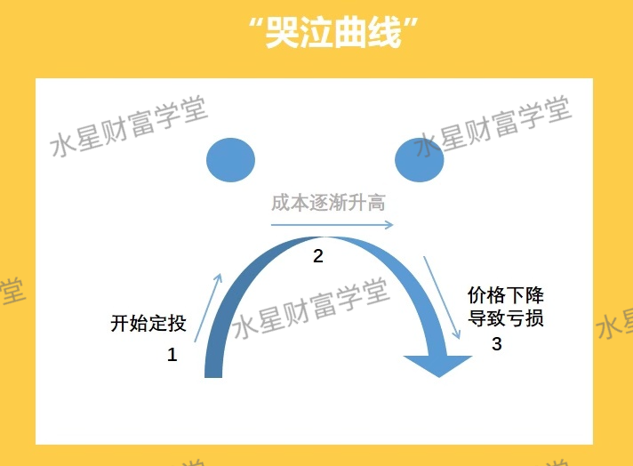

是从 1 到 2, 再到 3 的!

那么指数基⾦怎么赚钱? 其实指数基⾦赚钱的最好的路径是⾛⼀个微笑曲线的路径.

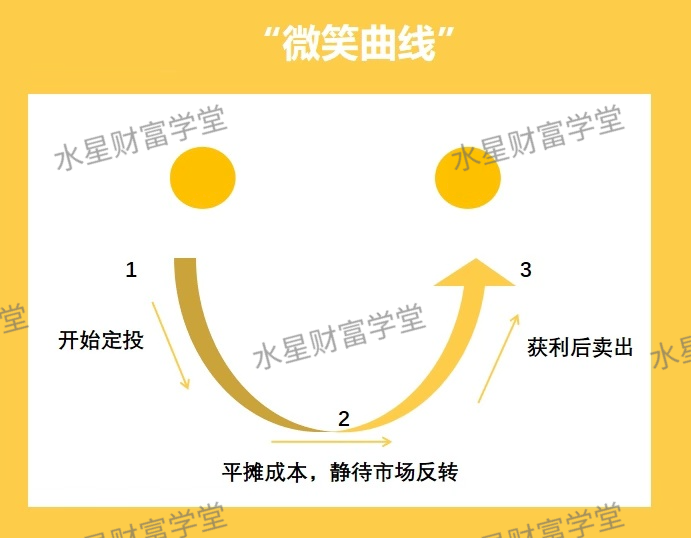

从 1 开始投, 经历 2, 再到 3 , ⾛出来⼀个笑脸. 如下图这就是⼀个笑脸路径的结果

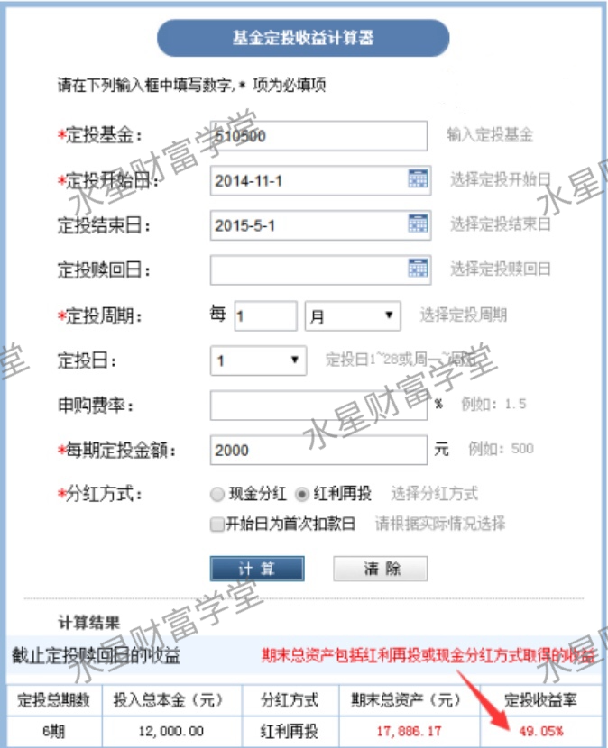

定投同⼀只基⾦, 半年收益 49%! 有没有羡慕嫉妒恨?

好, 现在⼤家知道了定投的微笑曲线, 我们放⼀个⼤盘⾛势图, ⼤家来判断⼀下, 从哪⾥到哪⾥是微笑曲线, 哪里到哪里是哭泣曲线呢?

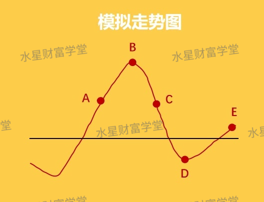

ABC 是哭泣, BCDE 是微笑.⼤家看着图都知道, 这个叫上帝视⻆, 开了挂的当然知道了.

现实情况下, 我们怎么能知道接下来⾛的是微笑曲线还是悲伤曲线?

也就是说我们怎么知道是处在 A 点还是处在 B 点? 我们怎么判断? 根据指数涨跌吗? 还是根据指数点位? 3000 点进场, 6000 点离场?

答案是⽆法判断, 谁也不能预测市场

连股神巴菲特⽼⼈家都说, 我们永远不要去预测股市

所以我们不判断它!

在过去⻓达 6 年的时间⾥, 指数点位⼤部分时间都在 3000 点以下, 如果真的 3000 点进场, ⼤部分时间都是亏损的.

所以, 正确答案是: 估值. 我们要做的是学会估值, 根据估值来决定是否进场!

如果当前的估值⽐较低, 也就是说价格是低于基⾦的内在价值的, 那么我们这个时候就要买⼊.

打个⽐⽅, ⼀篮⼦打包好的菜, 价值 100 元, 某⼀天市场冷清菜卖不了, 降价处理为 80 元, 这个时候价格 80 ⼩于价值 100, 就要果断买⼊!

关于如何辨认⾼估和低估, 有⼀些估值指标, ⽐如市净率, 市盈率, 指数温度等. 波动越⼤的指数越容易出现低估和⾼估.

这是因为波动来⾃于两个⽅⾯.

⼀个是业绩的波动, ⼀个是⼈⼼的波动.

两个叠加, 就会出现低估买⼊的机会和⾼估卖出的机会

⼀下⼦看不懂也没事, 可以先把笔记记下来慢慢理解, 另外基⾦实操课也会⼿把⼿教⼤家根据估值和策略定投的. 更重要还在于找到最便宜的的指数买, 也就是当前价格远远低于其内在价值的指数基⾦去买.

A 股的⻓期历史回报率在 10%左右, 也就是说, 从⻓期来看, 就算⽆脑定投, 也能获得⼀个 10%的平均收益.

那你可能说, 那我⾃⼰定投好啦, ⼲嘛要花这学费呢, 10%我就满⾜了.

那我们就要说到复利三因素了: 本⾦、时间、收益率.

1、我们的本⾦, 是因⼈⽽异的, 没办法选择, 只能在后⾯两项下功夫.

2、再来看收益率的影响. 我们先假设⼤家⾃⼰定投, 去选基⾦, 去选买⼊和卖出的点, 没有买到⽜市顶点, 能获得年化 10%的收益.

那么每⽉定投 2000, 那么 30 年后, 我们将有多少资⾦? 456 万

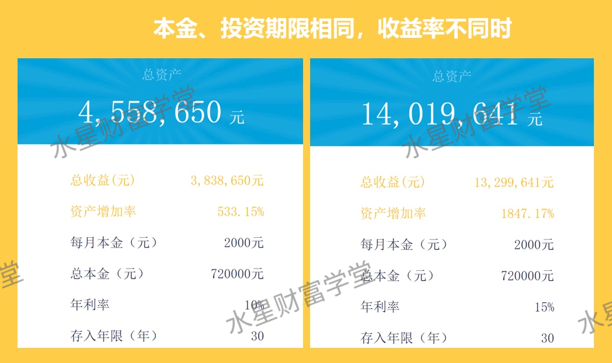

如果是 15%年化收益呢? 1402 万

5%的差异, 30 年后我们的收益会相差 1000%+哦

还有同学说, 我⾃⼰也可以投资, 每年达到 7%的收益, 我也很满⾜了. 那么我们来看看

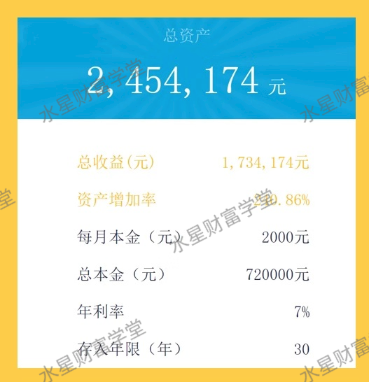

怎么样? 7% 收益, 30 年后, 才有 245 万, ⽽ 15% 的收益, 30 年后, 有了 1402 万. 8% 的差异, 30 年后我们的收益会相差好⼏倍哦, ⽽之所以有这么⼤的差距, 也仅仅是因为我 30 年前⽐你多系统学习了⼀些⽽已.

所以这钱值不值得⽤来提升这 8%的收益, ⼤家⾃⼰会衡量啦. 假设投资这项技还能⽤ 40 年, 那量化思维, 每天只需要⼀⽑钱.

另外, ⼤部分⼈⾃⼰定投是凭感觉的, 凭感觉的定投缺点是什么呢? 就是你不知道⾃⼰做对没有, 很可能⼀次⼤跌, 你是定投不下去的, 最后能获得 7%的收益就不错了.

3、再来看下时间因素.

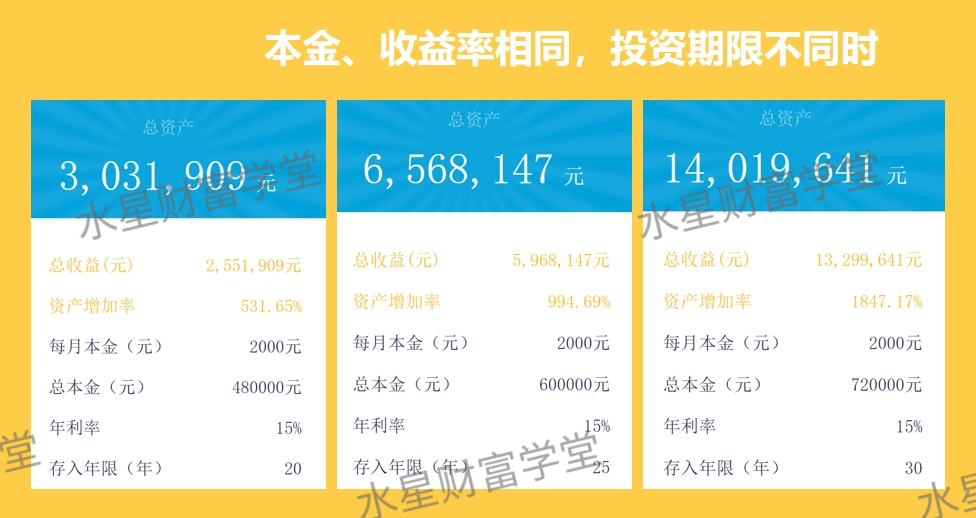

每相差 5 年, 最终收益都会相差 2 倍以上, 仅仅 5 年⽽已.

⼈的寿命是有限的, 20 岁就开始投资的⼈必定会⽐ 30 岁才开始的⼈累积更多的财富. 那么, 你今天还不开始, 还在等别⼈把你甩得更远吗?

有时候⼈和⼈的差别, 就在于当初的选择.

今天来参加训练营的⼩伙伴, 很⼤⼀部分只会成为⼀个过客, 毕业后依然回到⾃⼰原来的⽣活轨道中去. 因为他很难⾛出⾃⼰的舒适区域, 也不愿意相信⾃⼰可以改变.

⽽另⼀少部分⼈, 会选择⼀条新的道路, 认识新的朋友, 看到新的世界.

在很多时候, 我们⼤多数⼈的精⼒要放在升职加薪, 在职场上获得更多⼯资上. 如果选择定投指数基⾦, 那么在达到市场平均收益的情况下, 这时候实际上⽐很多⼈都要⾼了, 也可以让⾃⼰变得更加轻松.

那么, 我们说回来, 什么样⼈的适合定投?

如果⼤家⾃⼰或家⼈属于那种平常带孩⼦⽐较忙的妈妈们、经常加班的上班族们, 以及喜好中低⻛险的投资者, 那么基⾦定投都是⾮常优秀的投资⽅式.

当然还有⽉光族, 对于想要摆脱⽉光⼀族的朋友, 基⾦定投可以充当强制我们储蓄的管家, 以此来培养我们良好的理财习惯.

今晚的分享就要结束了, 班班先带领⼤家回顾⼀下今晚的重点内容:

1、基⾦分为主动基⾦和被动基⾦(指数基⾦), 指数基⾦曾被股神巴菲特设赌, 最终, 指数基⾦获利极⼤的胜利;

2、指数基⾦的特点为: 灭绝⼈性、⻓⽣不⽼、永远上涨, 买指数就是买国运;

3、定投指数基⾦要选择微笑曲线, ⽽决定何时⼊场, 就得学会估值;

4、相同本⾦及相同定投的情况下, 每年投资收益与⼈相差 5%, 在复利的作⽤下, 30 年后的差距可能相关近千万.

班班最后唠叨⼀句: ⽣活中很多事情, 并没有那么多的"刚好合适", 也不存在什么"伺机⽽动".

⽣活的真相是: 只有⾏动才会创造机会, 要想改变, 从⾏动开始! 有很多同学已经开始⾏动, 剩下的同学, 你们准备等到什么时候呢?

今晚的分享就到这⾥啦
