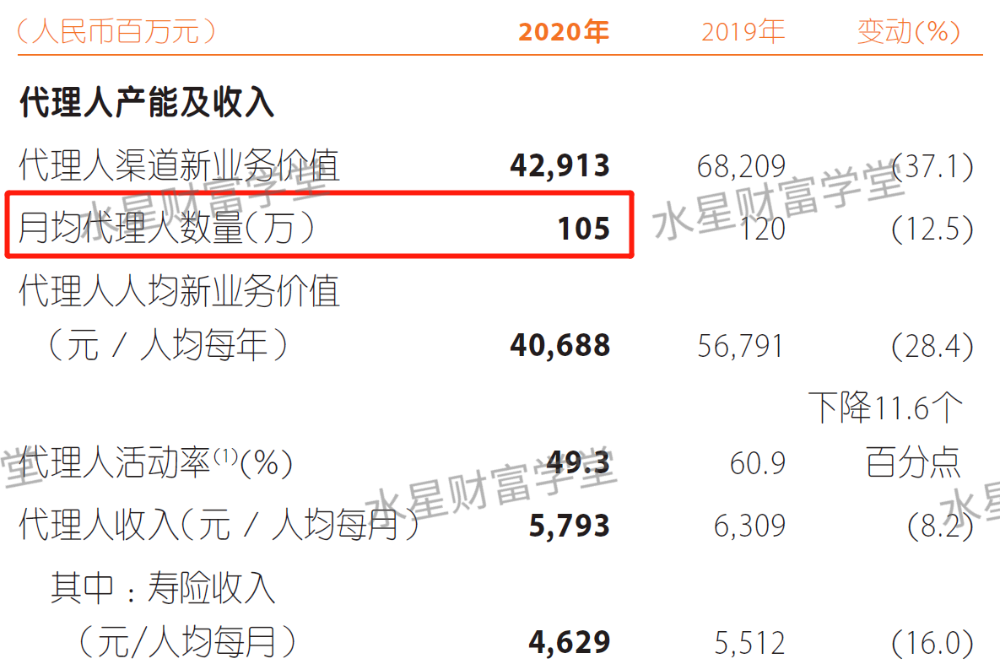
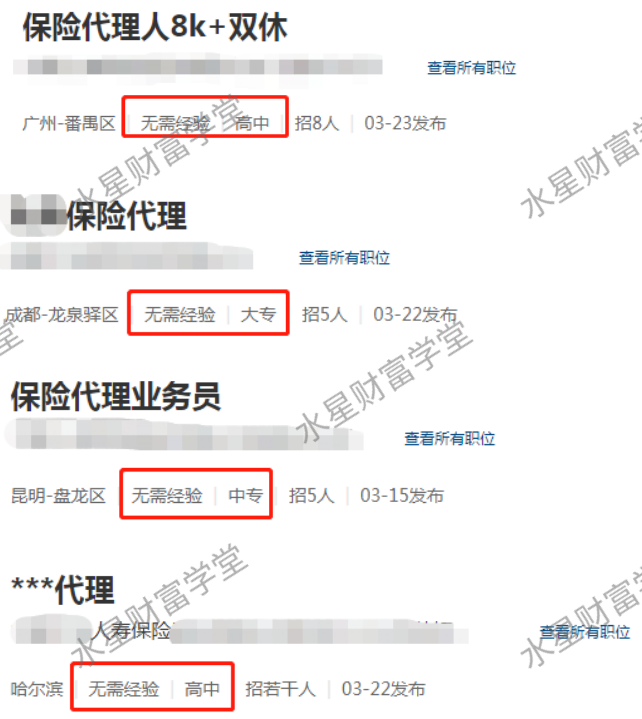
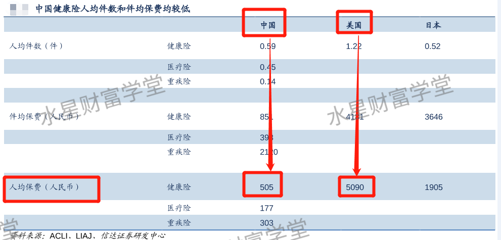

很多⼈都有这样的经历: 当你问⼀个⼈是做什么⼯作的, 如果对⽅回答——我是卖保险的——估计你要跟他保持两⽶距离, ⼼⾥还会默念着: 休想忽悠我掏⼀分钱.

在咱们国家, ⽼百姓抵触保险销售已经有了默契. 在⼈们的认知⾥, 保险代理⼈基本都是⼤忽悠, 他们靠着三⼨不烂之⾆, 把我不需要的东⻄卖给我, 然后赚提成.

⽽且很多⼈相信, 代理⼈背后的保险公司也是骗⼦, 没病没灾的时候互不联系, ⼀旦出事了, 就告诉我这也不保那也不保, 搞不好还要打官司.

不⽤猜, 咱们班⾥很多⼩伙伴现在就是这么想的. 这样想太正常了.

⾸先夸夸⼤家, 防骗意识⾮常到位, 不⽤学姐专⻔普及防骗了~以上担⼼⾮常有道理. 毕竟电视上、⼿机上拒赔的新闻太多了, 看着就让⼈害怕.

保险仿佛⼀个"渣男", 当初甜⾔蜜语很多承诺, 最后需要他的时候他却离你⽽去, 伤了爱他的⼈的⼼.

学姐肯定不打算给渣男洗⽩. 我们今天主要来掰扯掰扯前因后果, 看看"被保险渣了"的结果是怎么产⽣的.

在上世纪⼋九⼗年代, 保险⾏业刚刚在国内兴起. 因为⾏业刚萌芽嘛, 各⽅⾯监管都不完善, 于是就产⽣了⼀批不负责任的保险推销员.⾏业内称呼卖保险的叫"代理⼈".

这⼀批代理⼈主要任务就是搞钱, 让⼤家买保险, 交保费.⽐如说保险公司出了⼀款保险产品 A, 那么所有代理⼈的任务就是把 A 产品卖出去, 不管是卖给张三, 李四, 还是王麻⼦, 只要卖出去就算完成任务, 就能赚提成.

所以这批代理⼈卖保险的时候, 不择⼿段, 把保险产品说的天花乱坠. 结果真正出了事以后, 投保⼈发现这份保险压根就不适合⾃⼰的情况, 想要赔偿⽐登天还难.

另外其实这批保险代理⼈可能他⾃⼰也不那么的专业, 他们在帮客户去投保的时候, 也并不会关⼼客户的身体状况怎么样, 所以在核保那⼀块⼉的话, 也没有严格的为客户去把关, 所以到后⾯会出现理赔纠纷, ⼈家保险合同上⾯有写到免责条款, 但是他们可能⾃⼰也不太清楚, 所以就导致了保险拒赔的⼀个情况, 这个时候⼤家就会觉得保险是骗⼦

但是保险合同是永远不会骗⼈的, 能骗⼈的只会是⼈, ⼈的嘴才能骗⼈, 保险合同是受到法律保护的, 如果合同上写到的情况要理赔, 要如果发⽣了, 就⼀定会理赔. 所以找到专业的, 良⼼的保险销售⼈员是⾮常重要的事

那怎么样才能够去找到专业的, 有良⼼的保险销售⼈员呢, 那⾸先的话还是需要我们⾃⼰能够去学习和了解, 我们才能够有分辨的这种能⼒

咱们假设⼀个今年 65 岁的⼈, 得了重疾. 她在 30 岁的时候买了⼀份重疾险.⼤家算⼀算, 30 岁正好是 1985 年. 也就是说, 现在⽤得上保险赔偿的主要⼈群(⽼⼈), ⼤部分是在上世纪⼋九⼗年代, 保险⾏业刚起步的时候配置的.

当初踩了坑但没意识到的那批⼈, 逐渐发现了⾃⼰身在坑⾥.

那么, ⾏业发展到今天, 保险代理⼈的整体⽔平提⾼了没有? 说实话有提⾼, 但还没有达到让所有⼈百分百信任的程度.(这点⼤家都感同身受)

为什么这么说呢? 因为⽬前保险⾏业的代理⼈数量太多了, 不管是学历, ⼯作经验, 专业性等等各⽅⾯, ⽔平都参差不⻬, ⻥⻰混杂. 就拿某上市保险公司来说, 学姐翻了他们家公布的 2020 年度报告, ⽉均代理⼈数量达到了 105 万⼈.

注意啊, 是单独⼀家保险公司, 每个⽉就养活了 105 万个代理⼈. 放到整个⾏业来看, 全国保险代理⼈的数量估计在千万级别.

⽣活在三四线城市的⼈都有切身体会, 你接触的 100 个⼈⾥, 得有好⼏个是卖保险的, 不限于你的同学、亲戚和朋友. 他们有本科毕业的, 也有⼩学毕业的, 有⼲了三五年的, 也有才⼊⾏⼀两个⽉的.

那为什么代理⼈数量要按照"⽉均"统计呢?

这是因为, 代理⼈跳槽太快了. 很多⼈⼲了两个星期就不⼲了. 学姐给⼤家揭露⼀些⾏业内幕:

很多保险公司招聘代理⼈, 只是⼀个名义, 并⾮真的招代理⼈. 他们真正的⽬的, 是让代理⼈买⾃家的保险.

你去应聘代理⼈, 很容易⼊选, 然后你得冲销售业绩吧, 这时候⾸先你得给⾃⼰买⼀份, 不然怎么去说服你的客户? 然后, 客户哪⾥来呢? 你⼀般优先选择对身边的亲戚、朋友、⽼同学下⼿. 等身边⼈买得差不多了, 这份代理⼯作也很难继续了, 你就离职了. 然后, 会有新⼈⼊职, 重复你做过的动作.

招⼀个代理⼈, 能卖出去好⼏份保险, 这个招聘实质不是招员⼯, 是招客户啊. 所以⼈家怎么会在乎你的职业素养、专业知识这些⽅⾯.

国内千万名代理⼈, 不少是上⾯这种情况. 如果你遇到了这样的销售, 那么很可能要倒霉, 被推荐错误的、不适合⾃⼰的保险.

学姐聊这么多是想说, 现在⼤家看到的拒赔案例, 很⼤原因是⾏业发展不成熟造成的.

但是咱们得知道, ⾏业发展不成熟, 不代表这个⾏业就是万恶的. 世界各国都在发展保险⾏业, 肯定有其中的道理. 美国保险⾏业发展到现在, 居⺠保险意识已经⼤幅提⾼, ⼈均保费是中国的 10 倍.

咱们国家的有些保险代理⼈不负责任, 不代表保险这个东⻄本身不负责任. 好⽐渣男拿"钻戒"骗你, 最后你发现戒指是不锈钢和玻璃做的. 这是被渣男骗了, 钻戒可不背这个锅.

不专业的保险代理⼈, 把不适合我们的产品卖给我们, 这才是造成各种问题的病根. 这是代理⼈的专业性和职业素养的问题.

⽐如市⺠王美丽, 有某个疾病, 投保产品 A 不影响保障, 投保产品 B 可能就会拒赔. 正常情况下, 保险顾问给王美丽推荐产品 A, 就不会有任何问题.

但是有些代理⼈为了冲业绩, 可能向王美丽隐藏事实, 故意推荐产品 B, 最终就会导致王美丽遭到拒赔.

有没有适合王美丽的保险呢? 有. 但她就是让销售给忽悠了, 错过了. 归根结底这不是保险的问题, 这是销售的问题.

每⼀个保险产品上架都要符合银保监会的规定, 受到银保监会的监督, 轻易不会出差错.⽽且在出现纠纷的时候, 也就是说保险合同⾥写得很模糊的时候, 《保险法》是照顾咱们投保⼈这⼀边的.

说⽩了就是, 对于合同⾥可以多种解释的地⽅, 哪种解释对我们投保⼈有利, 就要按哪种解释来判.

保险本身是中⽴和⽆辜的. 我们最最需要解决的, 是找到专业的保险顾问, 选对产品~

那么, 当我们确实需要保险的时候, 有没有可能避开这些不专业的保险代理⼈, 避开买错的⻛险呢? 学姐给⼤家⽀两招:

第⼀招, 亲⾃审⼀审代理⼈, 看他整个过程的表现.

不专业的代理⼈, 不管你是张三李四王五, ⽆差别推荐单⼀产品. 因为这款产品是他重点要卖出去的, 可能是公司任务, 也可能是因为这款产品提成最⾼, 他最想卖.

不管怎么说, 他最优先考虑的问题是⾃⼰尽可能多赚钱, ⽽不是为了你好, 进⽽实现互利双赢.

专业的保险顾问, 注意啊, 学姐⽤了"保险顾问"这个名头, 重点就在于"顾问"两个字. 他会在推荐产品之前, 先问清楚你的各种背景情况.

⽐如说家庭成员构成, 年收⼊, 身体健康状况, 等等. 问清楚后, 根据你的实际情况, 给出个性化的推荐. 张三李四王五, 每个⼈的配置⽅案都不⼀样.

可能有些⼈觉得收⼊、健康等等都是个⼈隐私, 这⾥学姐解释⼀下, 为什么保险顾问要问你这些情况:

问家庭成员构成, 是为了确定家⾥哪些⼈需要配置保险, 哪些⼈不需要, 谁要优先配置, 谁配置的优先级可以往后排.

问年龄, 主要是为了让你对保费数字有个初步的把握, 因为不同年龄的保费不同.

问收⼊, ⻋贷房贷等等, 主要是为了确定配置多⼤保额, ⼀⽅⾯要在经济允许的范围内, 保障充分; 另⼀⽅⾯保险顾问也要劝你量⼒⽽⾏, 不能因为配置太⼤保额造成缴费压⼒过重, 影响家庭经济运转.

问健康状况, 是为了排除有些带病的情况⽆法投保, 或者忽视之后影响理赔. 提前问清楚, 把拒赔的情况排除在外.

每⼀问, 都是有理有据的. 专业的保险顾问不但给你⽅案, 还会⽤专业知识告诉你, 为什么是这样配置, 道理在哪⾥. 我们不⽤羞于说出隐私, 也不⽤虚报, 如实说出以上情况, 才能得到适合⾃⼰的保险配置⽅案.

以上就是学姐的第⼀招, 看对⽅整个过程的表现, 是不是⼀上来就夸产品? 有没有询问我们的背景情况? 有没有为我们解释⽅案为什么这样做?

这就需要我们先学习⼀定的保险知识, 辅助我们判断保险顾问的话到底有没有道理.

如果我们发现经济承受能⼒确实有限, 对⽅还⼀直在⽆底线推荐我们配置最⾼保额, 这种代理⼈直接拉⿊就⾏.

学姐的第⼆招: 寻找第三⽅平台.

如果你接触的是 A 保险公司的代理⼈, 那么他只会推荐给你 A 公司的保险产品. 只要你问到 B 公司、C 公司的保险产品, 那么不管实际产品好不好, 他的第⼀反应肯定是说这不好那不好.

反正, ⾃家产品就夸⼤优势, 其他公司产品就夸⼤缺陷. 因为他说别的产品好是打⾃⼰脸啊, 帮别⼈家推荐他不会赚钱.

所以找保险公司的代理⼈, 缺陷很明显, 你很难通过他理性对⽐同类产品的优劣. 这时候, 第三⽅平台的优势就凸显出来了.

第三⽅平台就像个超市, 既有这个牌⼦的产品, ⼜有那个牌⼦的产品, 不会只卖⼀家公司的产品.⼤家可以更容易对⽐出每家公司的产品优势和劣势, ⽽且可以⽐价, 选择性价⽐⾼的配置.

⼤家可以类⽐⼀下淘宝, 淘宝就是个第三⽅平台. 我们不⽤听⼀家店铺主⼈吹嘘⾃⼰的东⻄如何如何好. 我们就在淘宝上对⽐对⽐, 他是真便宜还是假便宜, 是真好还是假好, ⼀⽐就知道了.

通过对⽐你会发现, 获得同样的保障, 不同保险产品之间价格可能相差上千元. 我们综合⽐较, 选择同类中便宜的就好.

以上就是学姐的两个建议:

第⼀, 亲⾃审⼀审代理⼈, 看他整个过程的表现.

第⼆, 寻找第三⽅平台.

不管哪⼀条建议, 有⼀点前提是不变的, 那就是我们⾃身必须具备⼀定的保险知识, 这就需要我们学习保险知识, 明⽩怎么配置保险是合理的选择.

只有⾃⼰懂了, 才能很快识破销售话⾥的真假; 只有⾃⼰懂了, 才能和保险顾问做更好的沟通; 只有⾃⼰懂了, 才能在⾯对琳琅满⽬的保险产品的时候, 分析出它们的优劣, 找到性价⽐⾼的产品.

本次分享就到这⾥啦.
