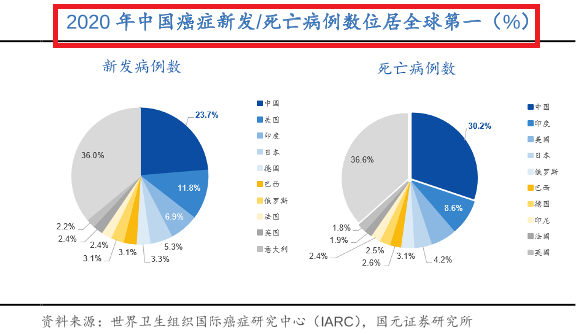
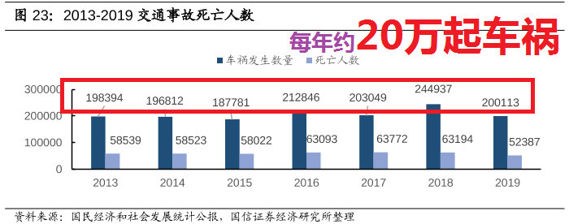

今天主要讲的是保险~学姐再来唠叨⼏句:

保险是我们每个⼈都需要的, 但是⾮常多的⼈不重视.

我给⼤家算⼀笔账, 如果你现在⼿⾥有 30 万, 年收益率 30%(已经很⾼了), ⼀年赚到 9 万. 先别忙着为 9 万激动, 3 年还不到 30 万.

对于重疾来说, 30 万光治疗都不够, 更别说营养和康复了, 还有失业导致的经济损失.

如果你能拿出来三四千块为⾃⼰配置⼀份保险, 那情况就⼤不相同了~⽽且如果你还年轻, 那么保费还会更低~

所以咱们不能只盯着赚钱, 更要想办法让⾃⼰可能受到的损失降低:⽐如避开投资陷阱, ⽐如为⾃⼰和家⼈配置⼀份保险.

这样才能⽤少量的钱稳固⾃⼰的⼤后⽅, 让你的⼦弹在股市⾥尽情地⻜~

愿认真学习理财的我们: 活着是台印钞机, 倒下是堆⼈⺠币!

好啦, 我们进⼊今晚的正题: 保险~

可能有⼈会想, 理财怎么和保险扯上关系了呢? 殊不知, 保险才是你能够安⼼理财的重要保障啊!

## 保险是防守, 股票基⾦是进攻, 缺⼀不可!

提到保险, 很多⼩伙伴可能觉得保险不太靠谱, 特别是各种保险推销电话, 让⼤家对保险避之唯恐不及.

我们经常会在朋友圈⾥看到轻松筹⼀类的众筹信息、某某亲⼈重病, 急需帮助, 请求⼤家献个爱⼼或者被身边的亲戚朋友同事的事件触动, 才恍然意识到, 好像疾病和意外离⾃⼰这么近.

所以⼤家能来到这⾥, 希望⼤家能够真的对保险重视起来, 这是⼀把伞, 阳光灿烂的时候想不起来, 但是下⾬的时候它真的很有⽤.

咱班⾥有多少⼈是追过《欢乐颂》的呢? 有多少⼈还记得下⾯这张图?

樊胜美的⽗亲中⻛住院, 急需 10 万元做⼿术.

由于平时没有积蓄, 她只能求爷爷告奶奶地找⼈借钱, 但⽆⼈肯借, 最后只好卖房⼦, 想想还真是悲哀. 樊胜美的家庭没有保险规划, 遇到了重⼤疾病的⻛险, 只能靠借钱或卖房⼦来解决燃眉之急.(再说了能卖房⼦的前提是你得有⼀套房⼦啊)

但如果她配置了保险的话, 只需要花少量的保费, 就可以把⻛险转移到保险公司, 完全不⽤⾛到卖房⼦这⼀步.

好了请再次给刷剧都不忘吸取经验教训的学姐点赞!

## 第⼀个问题, 什么是保险?

保险其实就是⼀份商业合同~它不是护身符, 也不能保平安, 也⽆法避免⻛险的发⽣.

强调⼀下, 保险并不能避免⻛险.

但是, 保险能够转移财务⻛险. 保险的核⼼作⽤就是⻛险事故【发⽣后】的家庭收⼊【损失补偿】.

说⽩了, 就是当⼀个⼈发⽣意外或者疾病, 需要⼀⼤笔钱的时候, 能有⼈(保险公司)帮忙出钱. 不⾄于让本不富裕的家庭陷⼊经济危机.

爱讲故事的学姐⼜来啦~

话说有个有志⻘年⼩ A, 30 ⽽⽴~努⼒上进, ⼯作做得棒棒哒! 虽然还是⼀枚单身狗, 但是也有⼗⼏万的积蓄啦(不算太少吧)~听说下⽉要升经理了, 升值加薪迎娶⽩富美的美好⽣活简直是唾⼿可得~

可是, 天有不测⻛云!

就在这个时候, ⼩ A 不幸查出患上了某重⼤疾病, 需要 50 万的医疗费(在⼤城市够不够还是个问题). 他⾃⼰的⼗⼏万扔进医院都听不到个响!⼩ A 爸妈当然不会看着⼉⼦等死, 于是拿出了他们⾟⾟苦苦攒下的 30 多万养⽼钱给⼉⼦治病~(上⼀辈能攒这么多钱也真是不容易了)

⼤概是苍天垂怜, ⼩ A 的病竟然有得治(根据数据统计, 重⼤疾病 5 年存活率可以达到 70%.). 可是还没来得及⾼兴呢, 医⽣说了, 要痊愈, 得花个三五年.

这⼏年的花销、营养费, ⼜是⼀笔不⼩的开⽀.

同时⼩ A 因为治病耽误的⼀年多的⼯作, 在养病期间是没有收⼊的. 公司在得知他患重⼤疾病之后劝其在家"安⼼休养", 等于是变相劝退. 虽然很⽆情, 但这就是现实, 公司是不会养闲⼈的, ⼤家都懂.

升职加薪迎娶⽩富美的美好⽣活瞬间成了泡影!

失业的打击、经济的压⼒让他⽆法安⼼休养, 他的病情开始恶化, 最终上演了⼀场⽩发⼈送⿊发⼈的⼈间悲剧.

到这⾥, 我知道你已经站起来抹着眼泪准备离场了, 可是故事并没有结束~坐下坐下都坐下~

两位⽼⼈不仅送⾛了⾃⼰的孩⼦, 他们的积蓄也没有了, ⽽此时, 上了年纪的⽗⺟已经失去了赚很多钱的能⼒, 可以预⻅, 他们惨淡的⽼年⽣活才刚刚开始~

如果⼩ A 再有孩⼦, 此时孩⼦的境况……他如何⻓⼤都是个问题, 更不要说受到良好的照顾和教育了. 简直不敢想了, 也不愿意想了, 太惨了!

所以, 就让⼩ A 永远活在故事⾥吧~

因病⽋债、因病返贫的例⼦不胜枚举~我预计如果给⼤家机会讲⾃⼰身边的例⼦, 我们这个群能讲⼀晚上~如果时光可以倒流, ⼩ A 缺的, 可能仅仅是在此之前, 买⼀份重⼤疾病保险.

好了, ⼩伙伴们从悲伤的情绪中缓⼀缓, 继续回到我们的课堂上来~

通过上⾯的故事我们可以明⽩, 保险的核⼼作⽤就是在⻛险事故发⽣后, 对家庭收⼊的损失进⾏补偿, 避免发⽣财务危机, 进⽽避免⼀个家庭的悲剧的产⽣~

## 第⼆个问题, 为何要买保险?

有些⼩伙伴可能说了, 我作息饮⻝规律, ⽣活习惯健康, 不会有什么病的, 为什么要买保险啊学姐那不是浪费钱吗?

⼤家可以从上⾯的图中可以看出, 意外和疾病离我们并不远.

因为世事⽆常, ⻛险⽆处不在, 对于⽣活中的不幸, 我们⽆法预测, 只能应对.

有的⼩伙伴可能会说, 我有社保, 不也是保险吗? 有就⾏了呗.

那学姐只能说, 图样图森破~社保只能应对⼀些⼩病⼩灾, 遇到重疾和死亡这样的⼤ BOSS, 他就 hold 不住了~

因受起付线、封顶线、社保报销⽬录的限制, 社会医保的实际报销⽐例不⾼, 很多情况下不超过 50%.

如果你看到上⾯的话头⼤如⽃, 你只需要记住⼀句话, ⼀旦重疾发⽣, 社保局就会告诉你: 这个药不能报, 那个检查不能报!⽽这些药和检查往往都是很贵很贵滴~

直接记住结论: 想有全⾯的保障, 最佳配置⽅案就是社保+商业保险!

## 第三个问题: 怎么买保险?

上有⽼, 下有⼩, 我们应该先保谁? 答案是家庭经济⽀柱.

⽐如, ⼀个 40 岁的⽗亲, 不幸意外去世, 如果他购买了⾜额的保险. 即使他离开了, 但是因为有了⾜额的保险⾦, 他的妻⼉就可以靠着这笔钱继续⽣活下去.

这⾥, 保险就起到了顶梁柱的作⽤, 虽然⽆法⻓时间⽀撑整个家庭, 但是短期内顶⼀顶还是可以的, ⾜够让这个家庭重新⾛上正轨.

学姐发个视频更能帮助⼤家理解~

[保险广告](http://m.iqiyi.com/v_19rr9p1tm4.html?fromvsogou=1)

如果我们优先保障了孩⼦, ⼀旦孩⼦发⽣意外, 没错我们是可以⽤到保险. 不过即使没有保险, 家⾥还有⼀对年轻的夫妇可以赚钱养家, 家庭经济不会受到致命的打击, 灾难过后还能很快再继续站起来.

但是如果很不幸, 这对年轻的夫妇出了意外, 还没有保险, 这个家庭的财务状况瞬间就崩溃了. 家⾥的⽼⼈和孩⼦的⽣活就不能得到保障了, 如果这时候还有⼀份孩⼦的教育险需要交纳, 就更是雪上加霜了.

如果退保吧, 只能拿回很少的⼀点钱了, 跟当初交的根本⽆法⽐, 不退吧, ⽣活都成困难了, 还怎么交保险?

⼤家现在明⽩了吗? 保险不能转移⻛险, ⽽是在作为家庭经济⽀柱的我们倒下之后能够给剩下的家⼈留⼀笔钱, 帮他们渡过经济的困难期~

这就是保险的第⼀原则: 先⼤⼈后⼩孩, 优先家庭经济⽀柱!

第⼆个原则是: 保险需要组合配置, ⽽不是单独只买⼀种.

举个例⼦, 如果出了意外重疾险不给报销, 如果⽣了病, 意外险也不会给报销的. 如果是猝死, 那很可能意外和重疾都不报. 所以每种保险各有各的作⽤~

这就是配置保险的第⼆个原则, 保障要全⾯. 保险组合配置才能发挥出保险应有的作⽤.

最后关于保险学姐再唠叨⼏句:

1、保险不是有了, 买了就万事⼤吉了, ⼀定要切切实实起到保障作⽤.

举个例⼦, 我朋友过年和我说她买了保险, 我⼀看, 保额 5 万. 要是真出了什么事, 5 万够⼲嘛的? 这份保险其实根本起不到保障的作⽤.

2、买保险就跟买⾐服⼀样的, 要根据【不同家庭的经济和⻛险情况】, 量体裁⾐, 合理设计.

再举个例⼦, 你的朋友和你说, 她最近⽤的某某精华效果特别好. 你看看她的⽪肤, 好像是好了不少. 于是兴冲冲去买了回来, 结果爆了满脸痘~咋回事? 朋友⼲性⽪肤, 你是油性⽪肤.

保险其实也⼀样, 最忌讳的就是听说别⼈买什么, 你也买什么, 每个⼈的情况不同, 需要⾃⼰学会如何配置. 必须结合⾃身当前的情况来考虑.

所以说, 没有最好的保险, ⽽只有最适合⾃⼰的保险.

3、保险的配置不是⼀劳永逸的.⽽是⼀个【动态的过程】.

继续举例⼦. 假设你今年刚⼤学毕业, ⼀⼈吃饱全家不饿. 你买了⼀套保险.

那等你成家之后呢? 有孩⼦之后呢? 买房⼦背着房贷呢? 房贷还完孩⼦⻓⼤呢? 还有, 通货膨胀呢?

还有些同学会问我, 学姐你跟我说说, XX 保险好吗?

这样的问题其实没有什么意义. 就像病⼈去医院看病, 没有哪个病⼈会⼀开⼝就问医⽣某某药好吗, 肯定是要先知道⾃⼰的情况, 再对症下药.

可能不少⼈都遇到过不靠谱的保险代理⼈, 也买到了根本不适合⾃⼰的险产品, 进⽽对保险产⽣了⼀些误解, 其实还是因为我们⾃⼰【不具备辨别的能⼒】罢了.

不要盲⽬的听从⼀些理论讲解, 偏听偏信, 不管是保险配置还是投资理财甚⾄是其他的决断, 都应该独⽴⾃主, 从⾃身的需求出发去选择, 千万不能⼈云亦云, 浪费了钱不说, 没达到保障⽬的就惨了~

能够来到训练营学习的⼩伙伴们, 相信⼤家都是⾮常理性, ⾮常正能量, 有很强学习能⼒的. 所以如果⼤家要想要科学合理的配置⾃⼰的保险, 就需要做到⾃身能够懂得保险的正确理念和正统的基础知识, 不说做到精深, ⾄少要做到有概念会识别吧? 如果我们⾃⼰⼀脸懵逼, 那就是保险代理眼⾥的软柿⼦~

但是只要我们知道⾃⼰需要买哪⼏类保险, 怎么缴费, 多少保额, 需要在什么⽅⾯取得保障~分别应对的是什么⻛险~

当保险代理⼈再想要忽悠你的时候, 你就可以⽤你犀利的眼神告诉他:⼩样, 你当我真是软柿⼦么?!

今天最后再问⼤家⼀个问题: 你觉得⼤公司的保险好, 还是⼩公司的保险好?

相信⼤多数⼈都喜欢⼤公司, ⼤品牌, ⽽且感觉⼩公司不保险, 万⼀倒闭了, 保障给咱们停了怎么办.

学姐给⼤家⼀个准话: 保险⾏业⾥⾯, 就没有哪⼀家公司是⼩公司.

《保险法》明确规定: 凡是注册保险公司的, 注册资本不能少于两个亿.⽽且是实缴资本哦!

所谓的⼤公司, 说⽩了就是⼴告打得响的公司⽽已.

然后很多⼈害怕⼩公司倒闭, 这个其实也没有必要担⼼. 同样是《保险法》有严格规定(第九⼗⼆条). 说成⽩话就是: 保险公司如果破产, 保险合同会转让给其他保险公司, 保单继续有效.

所以说, 保险公司⼀来都是家⼤业⼤, 基本不会倒闭, ⼆来就算倒闭了, 对我们的保障也没有任何影响.

买保险着重看保单的保障内容, 保障好坏跟公司⼤⼩⽆关, 不是说谁家⼴告打得响, 谁家知名度⾼, 谁家的产品就更好.

今天的分享就到这啦, 最最重要的就是希望⼤家记住⼀点: 商业保险是对社保的必要补充, 必须配置起来.

最后愿认真学习理财的我们: 活着是台印钞机, 倒下是堆⼈⺠币
