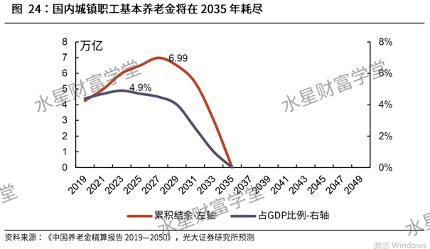
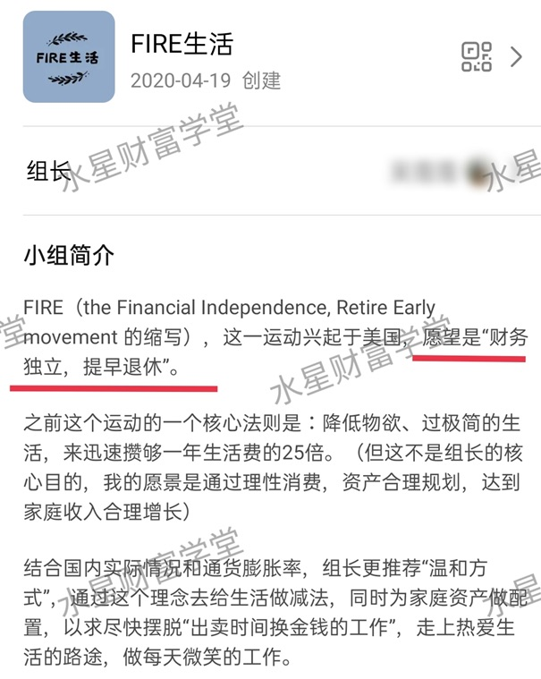

80 后、90 后这两代⼈经常吐槽:

九年义务教育毕业了, 义务教育开始免学费了;

到了结婚买房的年纪了, 正好赶上房价涨上天了;

以前毕业包分配⼯作, 到了 80、90 后就没了;

以前政策宣传"政府来养⽼", 到了 80、90 后这也成悬念了.

所以很多⾃媒体经常出现这样的话:80 后、90 后是点最背的两代⼈. 这两代⼈正好处在国家发展的过渡期, 往前⽐, 往后⽐, 很多好事都没赶上.

尤其是养⽼这件事. 我们简单看⼀下:80 年出⽣的⼈, 今年 41 岁; 90 年出⽣的⼈, 今年 31 岁. 距离 60 岁也就是 20~30 年的事⼉.

那时候养⽼压⼒有多⼤? 给⼤家分享⼀个券商研究的结论: 国内城镇职⼯基本养⽼⾦将在 2035 年耗尽.

这个不是危⾔耸听, 是券商正式公布的研究报告⾥⾯的结论, 乱写的话会被证监会请喝茶的. 可信度还是⽐较⾼的.

2035 年, 80 后这⼀波正好到了退休的时候, 正好是需要领退休⾦的时候, 90 后也就差个 10 年的事⼉, 很快要⾯临同样的问题. 养⽼⾦耗尽了, 还能怎么办?

很多⼈对于以后的问题漠不关⼼, 只要现在过得去就⾏, ⻋到⼭前必有路, 不是我等普通⼈该操⼼的问题. 但如果我告诉你养⽼⾦耗尽的问题已经来了呢?

国内有些地⽅的养⽼⾦已经⼊不敷出了. 拿⿊⻰江来说, 严重⽼龄化, ⽣育率低, 养⽼⾦早就已经耗尽. 早在 2016 年的时候, ⿊⻰江政府养⽼保险池累计结余已经"穿底", 并"负债"232 亿元.

穿底、负债是个什么概念呢? 就是你去领养⽼⾦的时候, 得到的答复是: 没钱了, 你得等着. 你是有退休⾦的, 但现在就是没钱给你了.

不是不给你, 就是没有钱, 给不出来, 排队等着吧. 谁也没招. 哪怕国库出钱把社保的坑填上, 但其实钱也是从税收来的, ⽺⽑出在⽺身上, 你懂得.

养⽼不早做打算的话, 将来⾯对这种局⾯的可能就是⾃⼰了.

这也是为什么, 国家"⼗四五"开始提⼀个说法, 叫"渐进式延迟退休".

渐进式, 很好理解, 就是慢慢往后延迟, ⽐如⼀年延迟⼏个⽉, ⼩步慢⾛, 渐进到位. 经过⼀个相当⻓的时间, 再达到法定退休的⽬标年龄.

延迟退休⽬前还在提前"吹⻛", 具体政策还没下来, 但是⼈社部在 2021 年 2 ⽉已经公开表态了: 实施渐进式延迟法定退休年龄, 将是我国退休制度实施 70 年来最⼤的⼀次变⾰.

延迟退休有什么作⽤呢? 最直接的作⽤就是:⼲活的多了, 领退休⾦的少了; 养⽼的多了, 被养着的少了.

背后意思也很明⽩, 就是⽼龄化问题变严重啦, 养⽼⾦压⼒太⼤, 需要通过延迟退休缓⼀缓.

⼤⽅向上, 咱们点到为⽌. 更多的同学可能更关⼼⾃⼰的未来: 我们 80 后、90 后这⼀路⾛来已经这么不容易了, 难不成还要在养⽼的问题上将我们⼀军, 太⽓⼈了吧……

但是咱们对⽐⼀下国外发达国家会发现, 我们国家⽬前的退休年龄绝对算早的了. 发达国家⾯对⼈⼝⽼龄化的时候, 基本上都搞延迟退休. 咱们看两个典型的国家:

美国: 退休政策分三个层次

美国于 1983 年颁布《社会保障法案》, 提出实施渐进式延迟退休制度, 计划将退休年龄由 65 岁延迟到 67 岁.(注意也是渐进式, 可以对照作为参考)

⽬前, 美国的退休分三个层次. 提前退休, 年满 62 岁是最早申领退休⾦的年龄, 但要打 7 折.

正常退休, 根据出⽣⽇期的不同, 美国社会保障局设定了不同的正常退休年龄, 如 1937 年及 1937 年以前出⽣者, 退休年龄是 65 岁; 1943 年到 1954 年间出⽣者, 退休年龄是 66 岁; 1960 年和 1960 年后出⽣的⼈, 退休年龄是 67 岁.

在正常年龄退休的⼈, 可以领取全额退休⾦. 延迟退休, 选择延迟退休的⼈在原有的退休⾦基础上还能获得奖励性的收益.

再来看看隔壁⽇本的情况:

2020 年 3 ⽉ 13 ⽇, ⽇本政府经内阁会议敲定《国家公务员法》修正案, 将国家公务员退休年龄从 60 岁延⻓⾄ 65 岁, 从 2022 年度起每两年上调 1 岁, 到 2030 年度推迟⾄ 65 岁.

另外, 在 2018 年通过的⼀项法令中规定, 劳动者可以在 60 到 70 岁之间⾃选退休年龄, 但是选择 65 岁以上年龄, 退休⾦有适当的提⾼.

如果⼤家去⽇本旅游会发现: 在⽇本开出租⻋的, ⼤量都是 70 岁上下的⽼⼈, 到了如此"⾼龄"了还在⼲活, 真实演绎"活到⽼, 忙到⽼".

其他国家咱们就不⼀个⼀个说了. 总之延迟退休年龄是普遍选择, ⼈⼝⽼龄化是⼤问题, 咱们抱怨也没⽤.

趁着还年轻有⼒, 提前筹划, ⽐抱怨强⼀百倍. 这⾥给⼤家提供两个思路:

第⼀, 在聪明⼈看来, 所有的"危", 都是"机".⽼龄化是"危", 但养⽼需求是"机". 未来⽼⼈那么多, 养⽼肯定是个庞⼤的需求, 养⽼产业会迎来蓬勃发展.⽐如说医疗、养⽼院、⽼年⽂化中⼼, 可能⽐现在做婴幼⼉产业(教育培训、⺟婴等等)更赚钱.

更进⼀步说, ⼈⽼必有⼀死, 很多投资者已经开始布局"墓地"产业了. 未来"坟地产"可能⽐"房地产"还要值钱.

这就是穷⼈思维和富⼈思维之间的区别. 同样⼀件事, 穷⼈眼⾥是焦虑, 富⼈眼⾥是机会.

这让班班想起了⼀个⽐喻:⼀个墨⽔瓶打翻了, 有⼈为了地板被弄脏了⽽⼼烦, 有⼈看到墨⽔的图案像⼀朵花⽽惊喜. 关键是⼤家看问题的⻆度.

现在很多养⽼主题基⾦, 专⻔布局养⽼产业链上的公司, 未来获益空间很⼤.⼤家学过实操课以后, 可以根据选基的⽅法, 把这类基⾦拎出来分析⼀下, 选择性地配置⼀部分.

⽽且⼤家通过投资, 通过财富的复利增⻓, 是有可能提前存够退休后需要的钱的. 现在很多年轻⼈已经把"提前退休"作为⽬标了.

⾖瓣上有个⼩组"FIRE ⽣活"(FIRE 的意思就是"财务独⽴, 提早退休"), ⾥⾯ 6 万⼈正在往这⽅⾯努⼒.

毕竟没有⼈拿着⼑架在咱脖⼦上, 逼咱不到 65 岁坚决不准退休, 早退休晚退休还是有个⼈选择的余地的.

再来看第⼆个思路: 个⼈积攒养⽼⾦.

80 后、90 后⼤部分都到了为⽗⺟养⽼的阶段, 不少已婚⼈⼠都是两⼝⼦养着 4 个⽼⼈, 很清楚"养⼉防⽼"这种观念给后代造成巨⼤的压⼒."养⼉防⽼"这个观念肯定过时了.

完全靠国家养⽼呢? 看了前⾯的分析, 我想你⼼⾥也有数了, 可以有所指望, 但完全寄托在这上⾯绝对不踏实.

那么, 剩下的就是靠我们⾃⼰积攒养⽼⾦了.

个⼈积攒养⽼⾦, ⼀定要⾸先保证不亏!⾼⻛险的品种绝对不适合⽤来积攒养⽼⾦.

⼀⽅⾯⼤家可以关注养⽼⽬标基⾦, 另⼀⽅⾯也可以关注⼀下年⾦险.

先来说养⽼⽬标基⾦: 它指的是以追求养⽼资产的⻓期稳健增值为⽬的, ⿎励投资者⻓期持有, 采⽤成熟的资产配置策略, 合理控制投资组合波动⻛险的公开募集证券投资基⾦.

总结成⼀句话就是: 怎么稳怎么来.

当然, 养⽼⽬标基⾦只能说⾮常稳健, ⽬前国内发⾏的此类基⾦都是正收益, 但是绝对没有⼈能保证它以后永远不亏损.

相⽐之下, 我更推荐⼤家去关注年⾦险. 主要是⽬前这个环境⾥, 如果不提它, 还真找不出更合适的品种了.

年⾦险包括两⼤账户: 年⾦账户+万能账户.

年⾦账户每年定点发钱.

万能账户再次把发的钱进⾏复利增值.

⽬前好⼀点的年⾦险, 保底利率可以达到 3%, ⽩纸⿊字写进合同⾥. 不管经济再怎么下⾏, 合同⾥承诺的部分不会不给.

⽽且是复利增值哦, 堪称"养⽼友好型"理财⼯具. 放在国内很难再找到和年⾦险媲美的了.

讲了这么多, 最后留给⼤家⼀个⼩⼩的思考吧:

咱们姑且假设延迟退休是到 65 岁, 请你算⼀下⾃⼰距离 65 岁还有多少年? 在这些年⾥, 你将如何做⾃⼰的养⽼规划?

这次分享就到这⾥啦.
