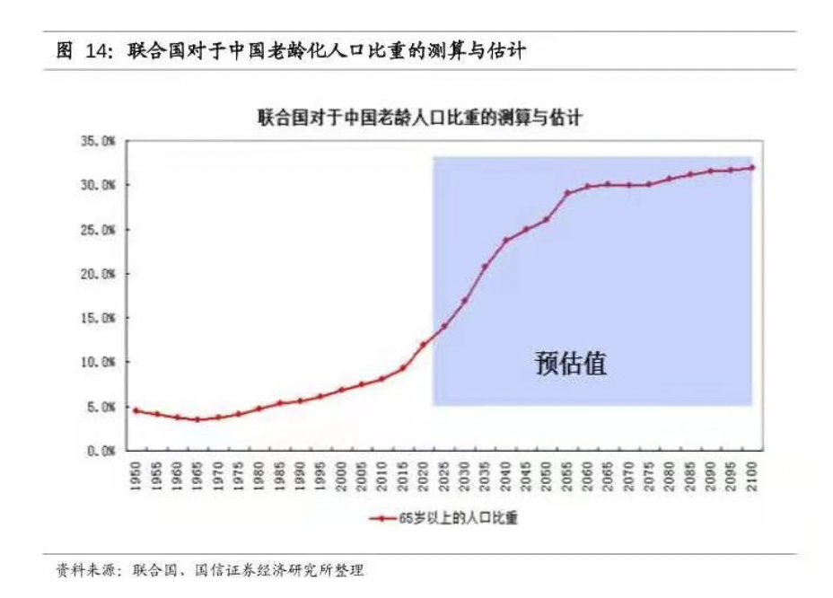

小伙伴们你们好, 欢迎来到水星财富学堂. 今天我们继续理财训练营的学习.

上节课我们讲到了社保中的医疗保险, 而且说到, 配置商业保险, 可以弥补医保的短板.

我们都知道, 社保中除了医疗保险, 还有一项大家普遍关注的保险, 那就是养老保险.

今天我们就来说说养老这件事.

有些年轻的小伙伴可能心想: 我们年轻人都是今朝有酒今朝醉, 烧烤火锅 KTV, 离退休还有几十年呢, 干嘛要考虑养老的问题?

其实大家理解反了. 越是年轻一代, 养老压力反而越大.

这和我国的老龄化趋势有很大关系. 下面这张图是联合国对于中国老龄化人口比重的测算和估计, 统计的是 60 岁以上人口的占比.

假设小芳是 1990 年出生的, 她将在 2050 年达到 60 岁. 对照联合国的预估可以发现, 到 2050 年的时候, 60 岁以上的人口比例超过了我国人口的四分之一.

等到小芳 60 岁了, 全国上下有大约 3 亿人和她同时去领养老金.

另一方面, 随着现在的年轻人不愿意生孩子, 出生率一年比一年低, 未来缴纳养老金的年轻人越来越少.

僧越来越多, 粥越来越少. 国家的养老金可不是"千斤顶", 这么大的压力怎么抗呢?

在国家的"十四五"规划中, 已经正式提出了"实施渐进式延迟法定退休年龄"这个说法. 延迟退休的方案还在制定当中, 但是这项政策已经被人社部落锤定音, 成了板上钉钉的事

我们已经走过了养儿防老的时代, 也走过了国家养老的时代. 未来, 养老大概率还要靠自己. 年轻一代只有提前规划, 才能给自己留下一个幸福的老年生活.

那么, 我们有哪些办法可以积攒养老金呢?

本节课, 我们就一起来学习一下, 积攒养老金的五种方法.

## 第一个方法: 按时缴纳社保.

社保中的养老保险, 为我们提供了最基础的养老金. 虽然这笔钱难以完全覆盖我们的养老需求, 但是作为社会福利, 它一定是值得配置的.

## 第二个方法: 企业年金保险.

个人与企业固定提拨一笔钱, 用来投资累积养老金, 退休后按规定方式支付

企业年金是对社保的一种补充, 通常是国企主动提供的一种福利, 所以不是所有人都能享有.

另外, 就算公司为咱们配置了企业年金, 具体的支取办法也是由公司单方面敲定的. 比如工作年限的要求、支取额度的限制等.

所以, 企业年金并不是必须要有的, 但是配置了会更好, 属于锦上添花的方法.

## 第三个方法: 商业养老保险.

商业养老保险一般由保险公司提供. 它和社保的养老保险形式类似, 缴费方式很简单, 每个月缴费到一个养老账户中, 等到合同约定的年龄, 就可以持续、定期地领到一定的养老金.

国家为了缓解养老金压力, 本身也是推荐大家积极配置商业养老保险的.

需要提醒大家的是, 如今的商业养老保险, 已经不再局限于单一的养老功能, 还增添了储蓄功能、分红功能, 并且设立了投资账户.

而且, 商业养老保险在购买时, 还可以附加很多其他功能的附加险, 比如健康、意外、医疗等, 在满足养老需求的同时, 也可以兼顾我们上节课说到的健康保障.

建议大家在投保前, 咨询专业的保险顾问, 根据自己的实际需求进行配置.

## 第四个方法: 配置养老目标基金.

在前面的课程中, 我们已经学习过基金是什么了. 简单来说, 就是让基金经理帮着我们打理资产.

那么, 养老目标基金又是什么独特的品种呢?

顾名思义, 这种基金设立的目标就是为了攒养老金. 既然是为了养老, 那起码得符合两个条件:

第一, 风险肯定不能太高, 波动不能太剧烈. 否则人还没有老去, 小心脏先受不了了.

第二, 一定要长期配置, 毕竟大部分投资养老目标基金的人, 离真正的老去还有几十年呢. 只有几十年如一日地增值, 才能达到养老的目标.

所以, 养老目标基金都需要一套成熟的资产配置策略, 严格控制波动, 而且建议投资者长期持有, 从而达到长期稳健增值的目的.

从 2018 年第一批养老目标基金获批发行到现在, 这种基金已经发行了近百只. 只要大家掌握了投资基金的实操方法, 懂得了筛选基金的原则, 就可以从中选出心怡的那只"基"啦.

## 第五个方法: 自筹养老金.

除了借助于保险、基金等等各种工具, 我们还有最后一个方法, 那就是依靠我们自己.

首先, 巧妇难为无米之炊, 任何的财富增值都离不开本金. 想要足够的养老金, 一定要学会开源节流, 努力攒钱, 增加本金, 把下金蛋的鹅养大养肥.

其次, 我们还需要学习各种实用的理财方法, 选择合适的投资工具, 做好资产配置, 实现财富增值.

依靠自己扎实的投资知识, 无论是亲自上阵实战, 还是选择财富管理方帮助我们打理资产, 都有机会冲刺更加丰厚的回报.

把这份回报作为自筹的养老金, 也是一个非常不错的选择.

今天的内容就是这么多啦. 下面我们一起来回顾一下本课的知识点.

第一, 养老问题不只是老人面对的问题. 越是年轻一代, 养老压力反而越大. 只有提前规划, 才能留给自己一个幸福的老年生活.

第二, 我们学习了积攒养老金的五种方法, 分别是: 按时缴纳社保、企业年金保险、商业养老保险、养老目标基金和自筹养老金

下一节课是我们整个训练营课程的重中之重, 我们将一起来学习理财中最重要的事: 资产配置.

经济学家研究发现, 资产配置对投资组合收益的贡献度最大, 达到了 91.5%!

到底如何把资产配置做到位呢? 一起期待下一节课的内容吧
