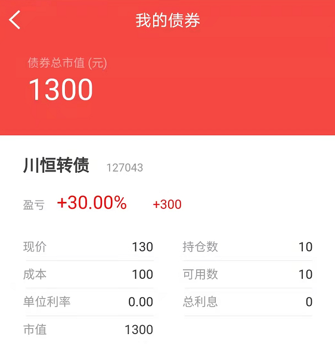
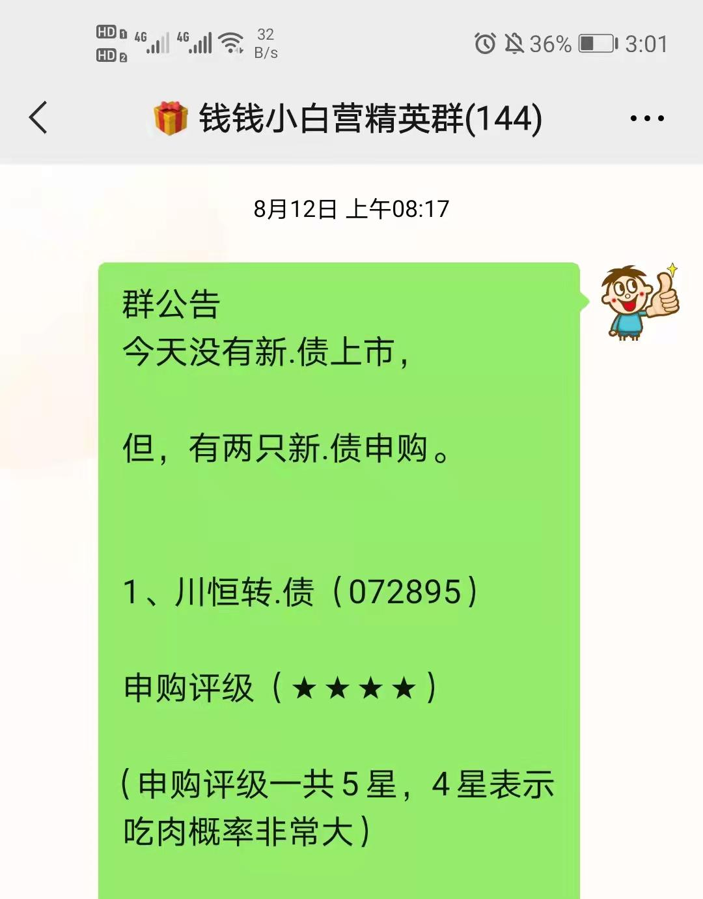
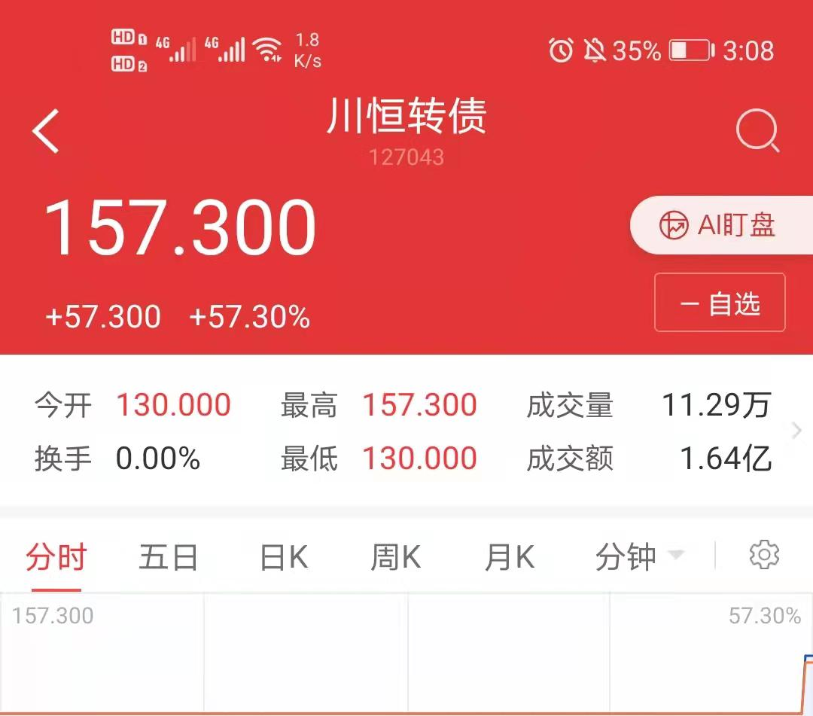
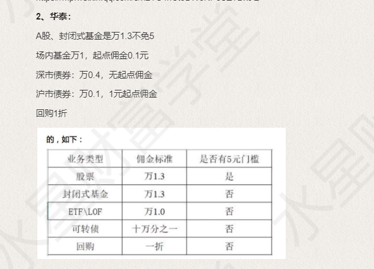
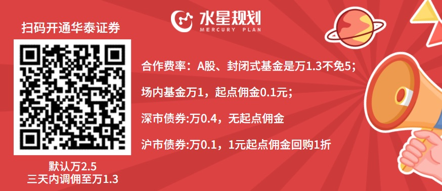
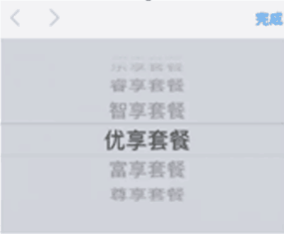

这是今天上市的可转债: 川恒转债

上面说的一切, 都是过去时了

8 月 12 日提醒申购

9 月 23 日上市

一千块钱本金, 40 天, 今天早上开盘 130, 尾盘 573

这个债你钱钱也有

稍等一下

今天如果卖的话, 咱们就可以赚 573

但是不急

这种基本无风险的操作, 班班如果不给大家讲, 就太不够意思了

但是咱们一步步来

打新债很简单, 但是需要开户, 先讲开户

## 开户避坑, 实战必备

开户和可转债、国债逆回购的部分, 本来呢, 这个部分应该是实操课给大家讲到的, 我想要提前带同学们薅羊毛, 所以需要用到券商账户

实操, 先要有券商戶, 说到这个开戶呢, 其实也有很多坑的

有小伙伴说, 开户不就是到证券公司开个账户么, 有什么坑的?

稍安勿躁, 慢慢看下去

开户, 可以选择你喜欢的证券公司, 家门口的也可以

我们常说的开户, 一般指开设证券账户.

它相当于我们的证券存折, 用于记录我们所持有的证券种类和数量

比如购买股票、场内基金, 操作国债逆回购, 打新债, 都需要用的, 就像我们的身份证一样~

## 为什么要开户

开立券商账户是投资者进入股市进行操作的先决条件

里面还可以买场内基金、国债、企业债、可转债、国债逆回购、银行理财产品、免费跨行转账、融资融券、参与新三板等

真的是"一户在手, 天下我有"的赶脚

2016 年 10 月, 中国结算已经出台新政, 包括每个投资者证券账户只能有 3 个

## 去哪儿可以开户?

1、就近到证券公司营业厅

2、网上开户(券商的 PC 网站或手机 APP)

我们来讲最便捷的, 就是使用券商手机 APP 开户

你需要准备:

1、身份证(证明自己的身份)

2、一个有摄像头的手机(本人手持身份证录一段视频, 以确定本人身份、是本人自愿开户)

3、银行卡(为了转入资金)

4、当然要有流量或者 wifi

开户后, 是需要券商审核的, 今天开, 大约两天就通过了, 开通就可以打新债了

这个开户啊, 就跟注册淘宝账户差不多, 淘宝账户大家会注册, 那开证券账户也一定没问题, 页面都有提示的, 大家按照提示一步一步来就好啦

## 如何挑选券商?

1、比佣金(手续费): 同样购买 1 万元的股票, 佣金越低, 说明你买的股票份额越多, 损失越少

2、比品牌/规模/行业水平, 一般大牌子的券商, 都还可以

3、比服务客户经理的服务是否到位等

下面来看开户中的坑

## 第一大坑: 高佣金

先说说开户的佣金, 佣金就是手续费的意思, 我们在股市上操作, 每交易一次都是要给证券公司交手续费的.

服务费、佣金、手续费, 说法不同, 但意思都是一样的

所以开户时候的佣金越便宜, 我们的交易成本就越低, 越划算~

开户主要关系到两方面的佣金: 股票和基金.

先说股票, 证监会规定股票佣金最低门槛 5 元, 每笔交易不足 5 元按 5 元交

解释一下股票最低门槛 5 元什么意思哈, 就是不管交易额有多少, 都有个最低佣金额, 哪怕你买 100 股呢, 只花了两百多块钱, 你的手续费最低也要五元

现在由于各券商之间竞争激烈, 一般不会高于万三, 当然万六万八也有, 千三的就是耍流氓了.

说完股票的手续费, 再来说基金的手续费, 场内基金的佣金跟股票的佣金是相似的, 一般是万 3 起步, 最高可以到千分之三, 并且跟股票一样, 大部分券商有最低 5 元的限制

但是, 重点来了, 水星学堂目前和华泰证券合作, 通过我们的方式开户, 佣金超低

华泰证券: 股票万 1.3, 基金万 1【基金没有 5 元最低门槛!!!】

大家想一想, 没有 5 元门槛是什么概念.

那一般的小伙伴, 每个月定投 500 左右, 就收取 5 元的手续费. 这相当于 1%的费用啊.

正常有 5 块手续费, 但是, 通过水星学堂的合作券商开户, 只收取 0.1 元, 差距 50 倍, 你心不心疼? 反正我是心疼的

## 第二大坑: 杂费

在我们的交易中, 除了佣金, 还有经手费和监管费, 这个被称为规费.

有的有诚意的券商会把这些费用包含在万 3 的手续费中, 很多则另外收取, 并且也不告诉你, 默默地扣钱.

我们在交易软件中看到的杂费, 很多就是指的经手费和监管费.

所以在开户的时候, 不妨问一下客户经理, 佣金是否包含规费.

一般而言, 如果你问了, 客户经理都会据实回答的, 只要你问, 客户经理就会觉得你懂

一般我们要选择没有这些杂费的券商

## 第三大坑: 叠加套餐

叠加套餐是比较鸡肋的, 这些叠加套餐会赠送一些资讯等等, 但是获得这些资讯, 往往就意味着你的佣金会贵好多!

比如尊享套餐, 居然需要千三的手续费, 最好的就是不要这些什么套餐

注意事项

一个证券公司的客户经理是你在这个证券公司有且仅有的唯一经理! 不可更换, 即使你销户重新再开通, 依然还是以前的客户经理的!

所以, 不建议自己去开户, 没有佣金优惠, 且不可更换客户经理!

再提醒一下:

水星学堂从国内服务一流的券商华泰证券那里为大家争取到了福利, 从我们指定的二维码新开户, 开户享受低佣金, 股票万分之 1.3, 起点 5 元, 基金万分之一, 起点 0.1 元.

大家在没有拿到我们的优惠前, 千万不要自己去开户, 这样是无法享受低佣金福利的!! 所以, 不要轻举妄动, 不要自己去开户.

敲重点, 只有从指定二维码新开户才可以享受哦, 如果以前已经有了华泰账户, 只能拿家人的帐号重新开了.
