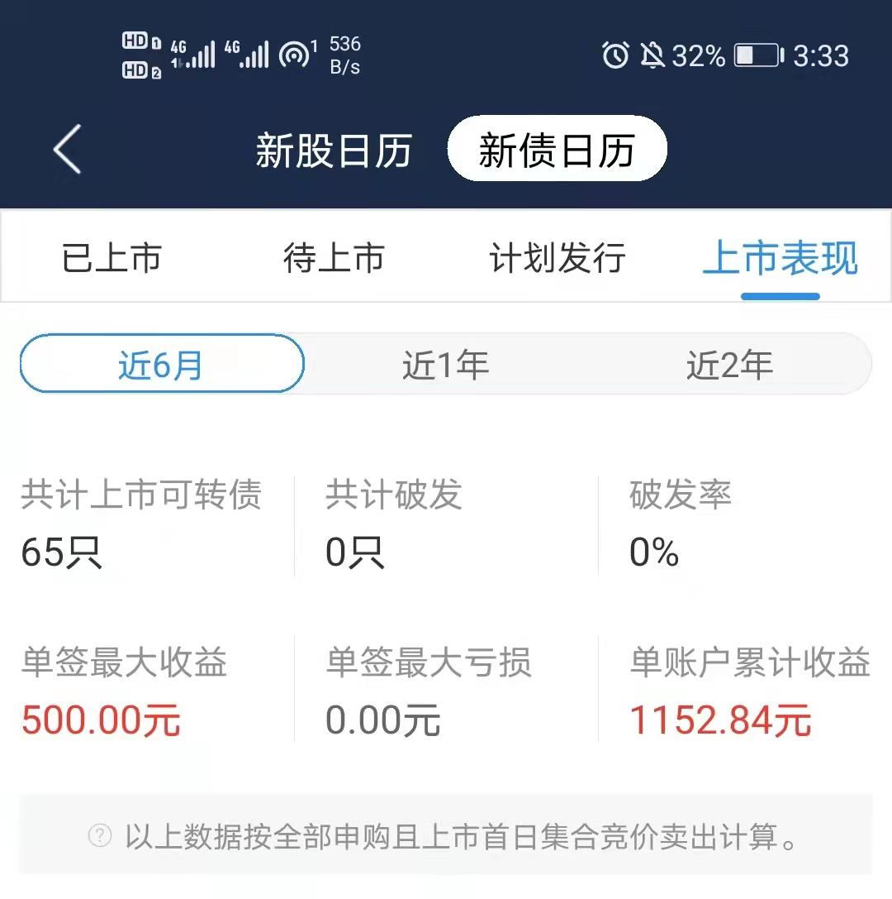
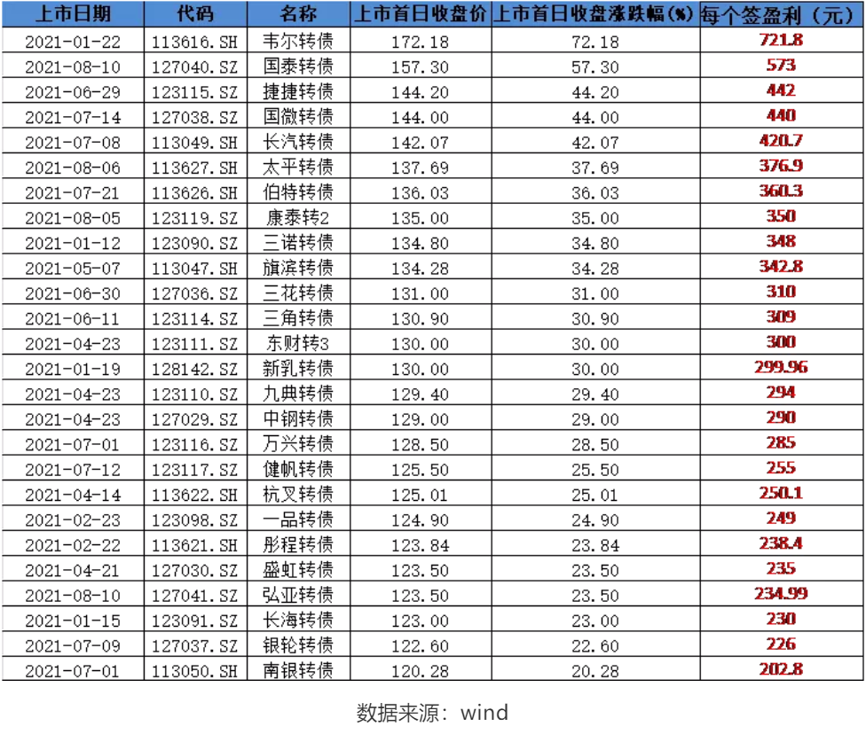
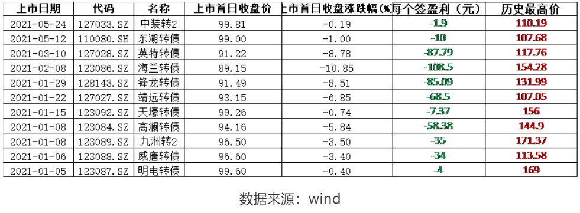
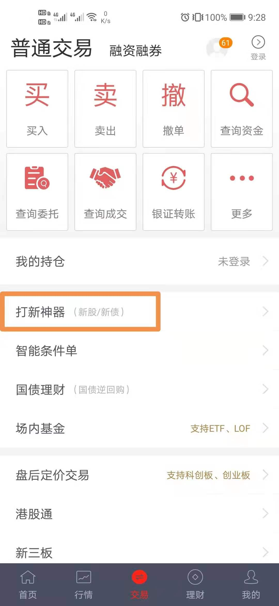
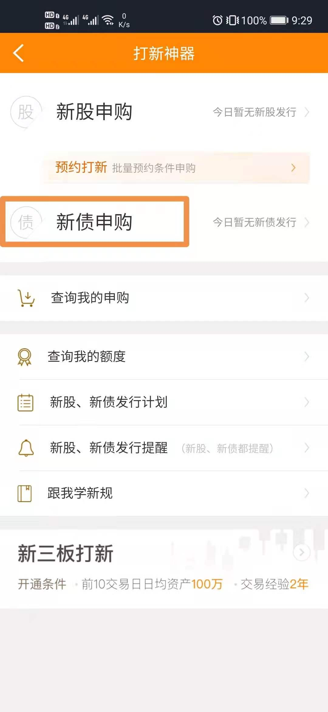
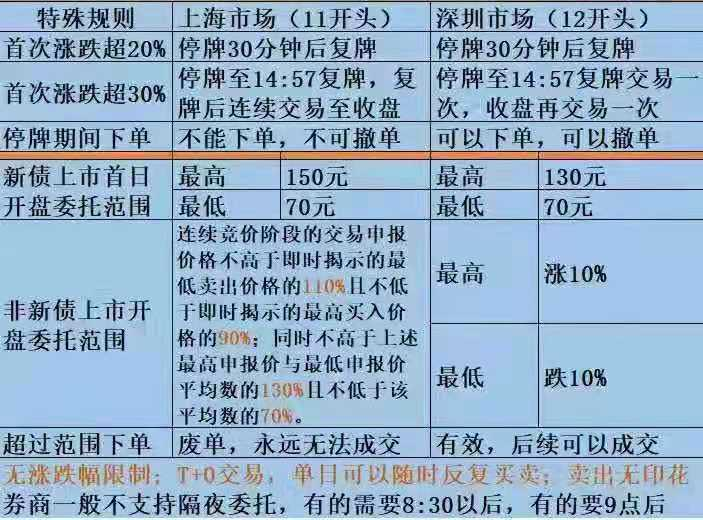
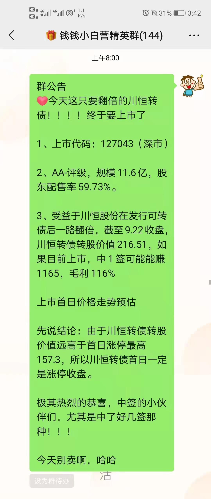
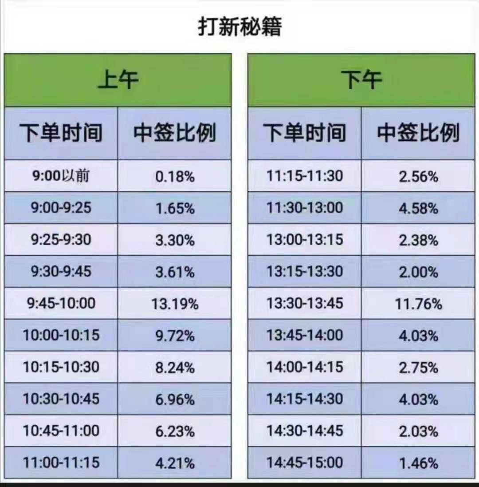

开户完成后, 我们接下来讲打新可转债

打新债指的是申购即将上市的可转债。

今天钱钱带⼤家⼀起了解⼀下这种薅⽺⽑的⽅法的具体操作流程

## 可转债打新

特别适合新手参与的投资品种

在全球流动性大泛滥的大背景下, 资本市场越来越受到资金关注, 大家理财意识不断增强. 据我了解, 咱们很多同学都开过证券账户了

但传统意义的证券账户就是被大家用来炒股的, 但殊不知证券账户还潜藏着这个功能, 一年能为你增加少则上千、多则上万的收益, 下面且听我细细道来

说说大家关心的问题:

## 什么是可转债打新?

可转债全称叫可转换公司债券, 是上市公司发行的一种债券, 允许持有人在规定时间范围内按照特定价格将债券转换为该上市公司股票.

可转债本质上是⼀张债券，但它可以享受股 票的优势，股 票下跌的候，你可以把它当债券，到期之后返本付息，股 票上涨的时候，可以转换成股 票，受股 票上涨的收益，你可以把它视为，债券+看涨期权的结合

因此, 可转债拥有债性、股性双重属性. 而可转债打新就是申购上市公司新发行的可转债.

## “发债”和“转债”有啥不⼀样？

转债发⾏之前叫发债，发⾏之后就叫转债，转债发⾏之后，发债的名字就被没收了，所以，这个就跟曾⽤名是⼀样的，你之前叫张三，就算改名叫李四，本质上也还是那个⼈，只是不同时期的名字不⼀样。

## 为啥我的新债中签后，名字变成了⼀串代码。

这个其实很好理解，就是张三打算把名字改成李四，在派出所提出了申请，旧名字被注销了，新名字还没审批下来，这个时候就只能⽤身份证号了，所以⼩伙伴们不需要担⼼，等它上市就有名字了。

## 可转债打新如何赚钱?

可转债打新中签后(中签一手金额是 1000), 待转债上市卖出即可. 因为打新中签的可转债持有成本都是 100 元(10 张一手), 只要上市交易以后价格超过 100 元即可盈利.

## 可转债打新收益率如何?

近 6 个月以来, 可转债共上市交易 65 只, 单账户累计收益 1152.84 元

这是开盘卖出的统计, 实际上, 咱们都不是开盘卖, 比如今天的川恒, 如果开盘买, 就只能赚 300, 尾盘可以赚 573

第二天会更好

所以这里着重讲两点:

(1)今年上市的新债, 如果你每只都打, 每只都中签, 能赚多少钱呢?

答案是: 盈利 11794 元. 也许你觉得这点收益算不上什么, 但这占用的本金少

当然, 我们不可能每只都能中签, 但可转债的中签率要比新股高很多

(2)可转债打新稳赚不赔, 真的假的?

答案是: 假的.

在今年上市交易的 83 只可转债中, 有 11 只上市首日收盘价是低于 100 元的, 也就是我们说的"破发", 如果上市首日直接卖出会造成轻微亏损

如果一个人运气极差, 这 11 只破发的都中了, 会亏多少钱呢?

答案是, 一共亏损 500.53 元.

相比一年几千、上万元的收益, 这 500.53 多元(极端情况)的小成本就不值一提了

况且在随后的日子里, 破发的可转债都回到了 100 元以上, 尤其像九洲转 2 最高涨到 171.37 元, 涨幅高达 71.37%

## 可转债打新需要什么资格?

(1)已开立沪深 A 股账户

(2)已开通转债权限

(3)可转债采用信用申购, 不用股票市值、不用资金、零成本即可申购

## 顶格申购是啥？为啥要顶格申购？

顶格的意思，就是按照可以申购的最⼤额度进⾏申购，顶格申购可以提升中签的⼏率，如果不顶格的话，中签率会⾮常低。

## 要是顶格申购全中了怎么办呀？

全中的概率是⾮常低，基本上相当于巴菲特、⽐尔盖茨同时把全部的资产送给你，与其思考全中了交不起钱，不如想想继承了⼤佬们资 产怎么花吧，起码这个的概率⾼⼀点

## 中签之后，我反悔了、没钱了、忘交钱了，怎么办？

不⽤咋办，不交钱就不交钱咯，⼀次不交没啥影响，只有你⼀年内三次不交钱，才会被处罚，所以划重点：前两次是可以随便⽪⼀下，第三次就不要⽪了，不然半年内就不能打新了。

## 中签缴款

T 日: 申购日

信用申购, 无需预缴款, 零资金也能顶格申购

T+1 日: 摇号日

公布中签率及中签配号

T+2 日: 公布中签日

公布中签结果.

中签后, 请确保账户在中签日 16:00 前有足额认购资金用于缴款, 在资金充足的情况下, 系统在晚上清算自动扣款, 无需手动操作

## 新债中签之后，什么时候上市？

新债上市⼀般需要15-30天的时间，个别新债会有所例外，效率快⼀点的，从发⾏到上市⼀共⽤了⼀周，效率慢⼀点的，从发⾏到上市⽤了40-50天。

具体时间请留意上市公司公告

## 上市交易

可转债上市后, 投资者有三种选择:

(1)二级市场直接卖出

(2)选择在发行结束后 6 个月之后转换成股票

(3)持有到期, 获取公司还本付息

我们单纯只是为了打新, 获取上市首日的市场溢价, 选择在上市首日择机卖出

注: 有时候咱们在上市首日会遇到委托不了的情况, 先看看是不是触发了盘中临时停牌, 规则如下

1. 盘中成交价较前收盘价(上市首日为 100 元), 首次上涨或下跌达到或超过 20%的, 临时停牌时间为 30 分钟;

2. 盘中成交价较前收盘价(上市首日为 100 元), 首次上涨或下跌达到或超过 30%的, 临时停牌至 14:57

## 如何提高可转债打新收益?

这个先让钱钱卖个关子

可转债的市场价格与转股溢价率、债券评级、市场情绪等诸多因素有关, 会存在上市后破发导致亏损的情况. 所以每次在申购前我会帮大家做好投资分析!

这是今天精英群的提醒

## 如何提高中签率

这是每个时段中签率的分布图, 大家可以在中签率高到时段申购
