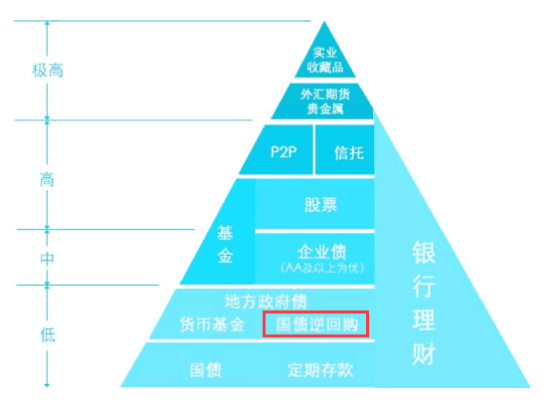
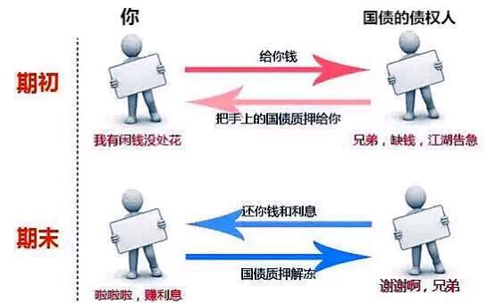
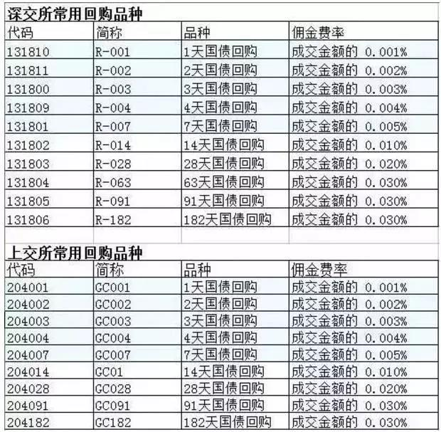
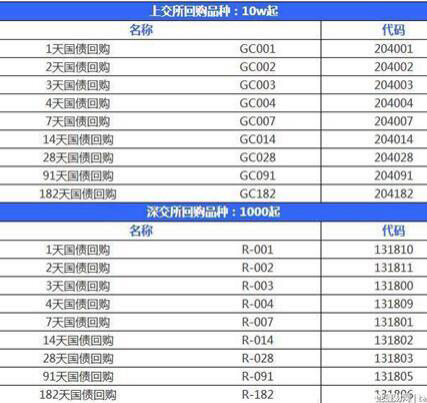
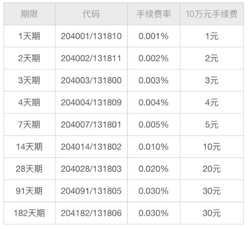
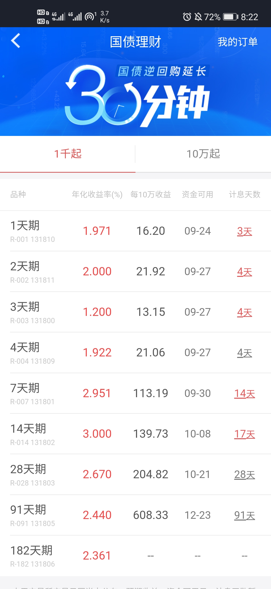
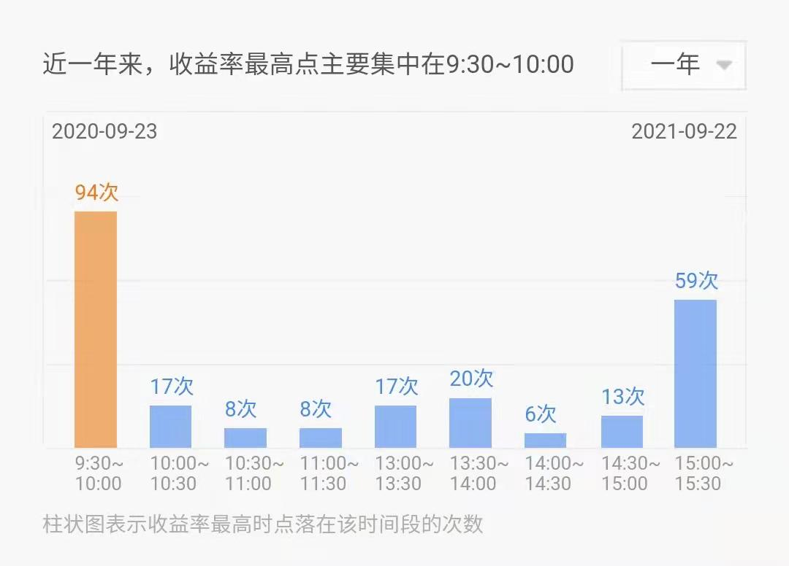
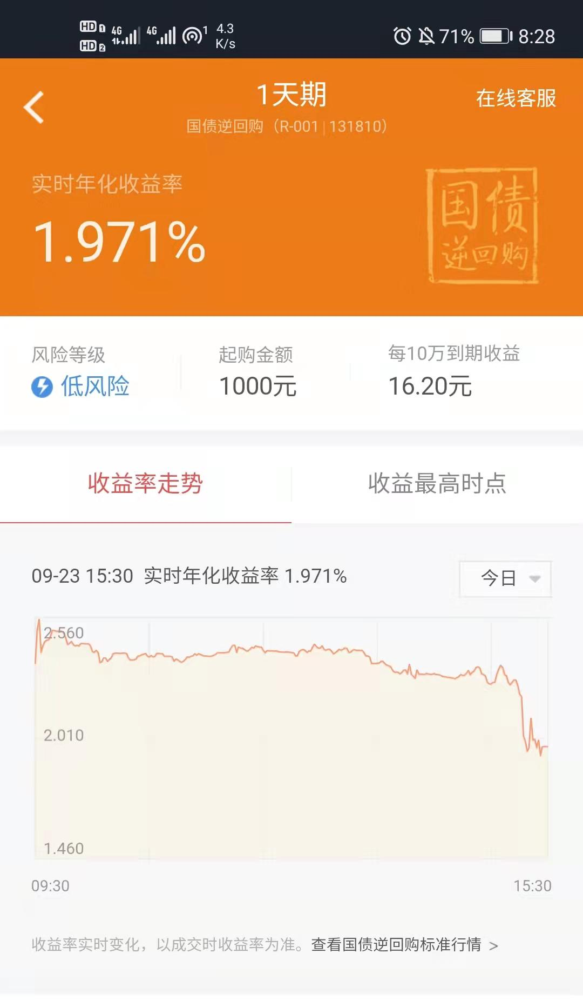

## 什么是国债逆回购?

图中可知国债逆回购处于金字塔底端, 是一种低风险、高流动性的投资品种

今天我们就来详细说说国债逆回购----最好的新手试水产品.

它特别适合初学投资理财的童鞋来练手哦, 最适合薅羊毛赚点儿零花钱了, 那我们先来了解一下逆回购是什么鬼.

国债逆回购, 其实说白了就是借钱给别人, 是一种短期贷款. 个人把自己的资金借出去, 获得固定的利息收益. 借款人(一般都是大企业)用自己的国债(或达到一定评级的债券)作为抵押获得这笔借款, 到期后还本付息.

借款人都是谁?

买国债逆回购的都是公司行为, 短期过夜拆借, 实际借款数额很大.

正回购门槛 300 万起, 也就是说向你抵押国债借钱的人, 至少都有 300 万的资产.

这里国债其实是个抵押品, 大家知道国债的风险是很低的, 所以用国债作抵押也是很安全的.

大家不要看到债权债务就感觉不安全哦. 那么为什么有企业会花高利息来借钱呢?

当市场缺钱(银行系统冲业绩、企业公司短期拆借)的时候, 企业就会在各种渠道通过高额利息来借钱, 国债逆回购就是其中一个渠道.

所以, 国债逆回购利率高的时候, 就是一个市场缺钱的信号.

比如年末月末, 大家了解一下, 只要知道我们可以薅羊毛就 OK 了.

那我们来看看国债逆回购的优点:

## 国债逆回购的优点

### ① 安全, 永不亏本

因为既有国债作为抵押, 中间还有中国证券登记结算有限公司(简称中登公司) 在监督管理, 如果借款人还不出来钱, 中登公司会帮你把钱要回来.

### ② 低风险, 有时间段的高收益

逆回购的收益率跟市场的资金面有关, 资金面越紧张, 市场越需要钱, 逆回购的收益率越高.

### ③ 操作方便

有证券账户(需要开户)就可以直接操作, 输入代码即可, 操作快捷, 到期资金自动到账.

### ④ 手续费低

每 10 万元收费 1-30 元, 每 1 千元收费 0.01-0.3 元

我们先来看看适合哪些人群.

## 适合哪些人群

貌似国债逆回购的名气较小, 会不会因为太复杂所以小众?

是不是只适合有钱又专业的人参与?

不是的哦, 大家都可以尝试, 尤其是这些人:

① 只会存银行、余额宝的小伙伴

② 股民(我们券商账户里的钱, 没有投资的话, 白白放着也是没有收益的, 但是通过一天逆回购, 过夜有收益, 第二天钱还能用来买股票) ;

③ 家中有闲钱的人;

④ 想学习理财又怕蚀本的人, 适合新手投资初期试水

## 国债逆回购的品种

国债逆回购的品种一共有 18 种, 沪、深两市各 9 种

沪市为国债逆回购, 深市为企业债逆回购.

我们从名称和代码上就可以看出是什么品种了

GC 代表上海交易所的品种, R 代表深圳交易所的品种, 后面的数字代表的是借钱的天数, 001 代表一天, 002 代表两天.... 以此类推.

我们要记住的是, 借 1 天就是一天逆回购, 借 7 天就是七天逆回购, 目前市场上成交较活跃的是 1 天、3 天、7 天等短期性产品.

## 购买门槛

另外, 沪深两市的购买门槛区别很大哦.

沪市比较高: 1000 元为 1 手, 100 手起, 也就是说操作一次至少需要 10 万元.

如果想多卖, 要按照 10 万的整数倍来加数额, 20 万、30 万... 最高不超过 1000 万.

深市亲民很多: 100 元为 1 手, 10 手起. 如果想多卖, 要按照 1000 的整数倍来累加, 2000、3000... 上不封顶.

## 交易时间

国债逆回购的交易时间是在每周一到周五上午时段 9:30-11:30, 下午时段 13:00-15:30

国家法定节假日不可以操作哦

借出去的钱什么时候回来呢?

逆回购资金的到账日是 T+1, 提现日是 T+2.

什么意思呢?

以逆回购 1 天为例, 当天买入, 下一个交易日开盘前到账, 也就是说不会影响股民第二天的股票交易, 再下一个交易日可以提现转出到自己银行卡上.

这里需要注意: 一般周末不开市, 到账的日期就要顺延!

比如你要是周五买 1 天的逆回购, 那就要到下周一钱才会回到你的账户~如果要取现则是要等到下周二..

## 交易费用

接下来说说一下交易的费用

逆回购也是有手续费的, 不过非常低, 每 10 万元收费 1-30 元

操作一千块钱的国债逆回购, 只需要 0.01-0.3 元手续费

具体收费标准如下表:

## 收益

说了这么多, 那国债逆回购收益大概是多少呢?

这里有个计算公式: 利息收入=交易金额\*利率/365\*实际占款天数

实得收益=利息收入-本金\*手续费率

对于实际占款天数这里要解释一下, 计息天数为资金实际占用天数

以周四做一天的逆回购为例, 周四买入一天期逆回购, 周五资金到账, 到了周一这笔钱才能取出, 实际占用天数是 3 天, 则按 3 天来计算利息

所以周四操作逆回购还是比较划算的

自己算有点懵嘛?

教大家一个偷懒的方法

券商每次交易时看软件表示的计息天数就可以啦!

是不是感觉收益不算太高呢?

这是由短期内的资金需求决定的, 平日收益并不会太出彩, 但在一些特殊的时间, 比如年 12 月底, 可以达到日均年化 10% +的收益.

虽然只能短短的赚一两天的钱, 但是也是一种很好的现金管理工具.

无风险高收益的投资机会, 不是天天都有的.

那什么时候收益会比较高呢?

从一年时间来看, 月末、季末、年中、年终钱荒的时候, 利率会飙升.

虽然开市期间都可以交易逆回购, 但是上午一般高一些, 因为很多人还观望着想买股票, 愿意借钱出去的人相对较少, 国债逆回购利率就高;

而越是到收盘的时候, 当天没买股票, 还有闲置资金的股民越是想去操作逆回购, 供大于求, 所以尾盘的收益是一天中最低的, 比如这样子.

另外, 时间长的逆回购利率也相对低些, 一般一天逆回购交易量最大, 所以也就能获得一个更高的利率.

这里有一点要注意, 不建议交易长时间的逆回购, 因为一旦成交, 不到期钱是拿不出来的. 这点不同于银行的定期存款哈, 定期存款如果你确实急需, 又肯承担定期利息的损失, 还是可以提前取出来的.

好了, 国债逆回购就讲到这里, 小伙伴们都听明白了吗?

如果有闲置资金, 又开了股票帐户的话, 不妨试试水哦.

还需要补充一点: 国债逆回购以成交利率为准, 成交以后的逆回购的利率变动不影响你已有的收益哦

操作国债逆回购需要注意几点:

1、长期的国债逆回购性价比不高

一般情况下, 14 天、28 天、91 天、182 天这样长周期的国债逆回购收益率不太高, 大多低于同期的银行理财, 所以不太建议大家投资长期的逆回购

2、什么时候做国债逆回购比较合适: 月末季末年末高, 钱荒高峰期.

月末、季末、年末这几天短期国债逆回购的收益率开始大幅上升.

而平时主要是在 3%徘徊.

为什么这几天价格高呢?

因为月末、季度末、半年末、年末. 这些特殊的时点, 资金面会比较紧张, 逆回购的收益率会高一些, 借钱的人也就愿意出更高的利率来借钱

平时的时候, 没有意外情况下, 国债逆回购收益率一般般~性价比不高.

所以这个品种是等到有机会的时候再参与

一天期的国债逆回购, 会在第二个交易日的早上回款. 回款是全自动的, 不需要我们进行任何操作. 也就是今天做了一天期逆回购, 即使你是 3 点前"卖出"的, 明天早上 9 点前资金就重新在证券账户上了, 可以拿来买卖股票或继续做逆回购, 但到了第三个交易日, 这个钱才可以取出来.

以上就是今晚的内容啦~
