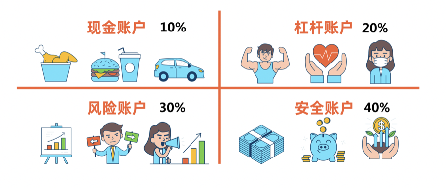

小伙伴们你们好, 欢迎来到水星财富学堂.

课程一开始, 先请大家思考一个问题: 我们理财收益的多与少, 到底是由什么决定的?

有的同学说, 那要看选择什么投资品. 投资股票的收益有很多, 投资基金就少一点. 所以决定收益的是投资品.

还有的同学说, 那要看我们买卖的时机. 不管什么投资品, 越低买, 越高卖, 就会赚越多. 所以决定收益的是买卖时机.

事实上, 不管是投资品, 还是买卖时机, 都会影响我们的收益. 但是, 它们都不能起到决定性的作用.

经济学家曾经研究过这个问题, 最后发现, 资产配置对收益的贡献度最大, 达到了 91.5%!

这么重要的资产配置, 却被大多数投资者忽略了.

接下来, 我们就好好做一下功课, 看看强大的资产配置到底应该怎么做.

## 资产配置总结起来就一句话: 不要把鸡蛋放在同一个篮子里.

摊开来说就是, 我们理财投资的时候, 要把本金分散开, 放在不同的领域, 选择不同的投资品.

哪怕其中之一跌了, 我们也不用担心, 因为还有其他投资品可以上涨. 这样就降低了总收益的波动, 分散了投资风险.

那么, 到底如何分散才算合格的资产配置呢?

这里, 我们把资产配置分成了三个层级.

## 资产配置的第一层级: 股债平衡.

意思就是, 股票和债券混合搭配. 股票的攻击性很强, 可以博取高收益; 债券更加保守, 虽然收益不高, 但好在稳中有涨.

所以, 我们把本金分成两半, 一半投资股票, 一半投资债券, 做成一个可攻可守的组合. 这就是最基本的一种资产配置方法.

但是我们要注意, 股票、债券都有自己的短板. 股票投资需要复杂的分析, 对入门投资者来说难度比较大. 而债券呢, 有些债券的购买渠道不是特别方便.

考虑到这两个问题, 我们推荐大家转换思路, 配置股票型基金和债券型基金, 同样能达到股债平衡的目的.

我们在前面的课程中学过, 基金就像一辆购物车, 基金经理可以往车里添加各种各样的投资品.

股票型基金的购物车里, 80%以上的成分都是股票; 债券型基金的购物车里, 80%以上的成分都是债券.

我们可以一半的钱投资股票型基金, 一半的钱投资债券型基金, 这样就相当于间接投资了股票和债券, 实现了股债平衡.

在《基金训练营》中, 大家可以学习到更加详细的股债平衡策略.

## 资产配置的第二层级: 海内、海外资产混合搭配.

如果我们只投资大陆的市场, 万一遇到一项利空政策, 那么很可能整个市场都在下跌.

这时候, 配置其他市场的资产能起到很好的缓冲作用. 不同国家和地区的市场受到不同政策的影响, 它们的相关性比较低.

比如说, 美国市场下跌, 对我们国内市场的影响就很有限. 我们在两边都配置一些资产, 也属于"不把鸡蛋放在同一个篮子里", 能达到降低收益波动、分散风险的效果.

有的同学可能会纠结: 配置海外资产很麻烦吧? 是不是要开通海外账户才可以配置?

其实不是的. 海外资产的配置也可以通过基金来实现.

在《基金进阶训练营》中, 大家会学到一种专门用来配置海外资产的基金. 通过这种基金, 我们不用开通海外账户, 直接就可以实现投资海外市场的心愿.

小小基金, 看似普通, 其实不仅可以用来实现股债平衡, 还能实现海内外资产的混合搭配, 功能是非常强大的!

## 资产配置的第三层级: 建立家庭资产配置的四个账户.

关于家庭资产配置, 流传最广的是标准普尔家庭资产四象限图.

标准普尔, 是全球最具影响力的信用评级机构. 他调查了全球 10 万个资产稳健增长的家庭, 从中得到标准普尔家庭资产象限图.

这张图根据钱的用途, 分成了四个账户.

### 第一个账户: 现金账户.

指的是日常开销账户, 大约划分出 3~6 个月的家庭开销. 现金账户最主要的特点是存取灵活, 建议大家使用余额宝等理财工具, 或者是银行的活期存款.

### 第二个账户: 杠杆账户.

杠杆的特点就是以小博大. 所以, 杠杆账户指的是, 平时只需花一点小钱, 关键时刻能变成一大笔钱的账户.

这个账户主要用于为家庭成员配置保险, 为我们的财富增值做坚实后盾, 避免因为任何的疾病、意外、死亡等事件, 让一个原本富裕的家庭重返贫穷.

### 第三个账户: 风险账户.

这个账户主要用于博取高收益, 跑赢通货膨胀, 可以适当投资一些风险、回报等级较高的工具, 比如股票、基金等等.

### 第四个账户: 安全账户.

所谓的安全, 简单来说就是保本增值. 所以, 安全账户中的资产要优先考虑不亏本, 在这个前提下, 再去实现一定的增值效果. 这个账户可以配置年金险, 或者一些固定收益类的债券.

以上四个账户, 就像桌子的四条腿, 少了任何一个, 随时都有倒下的危险. 所以, 小伙伴们一定要合理配置.

同时提醒一下大家, 图中四个账户的配置比例仅供参考, 不要生搬硬套, 大家可以根据自己的实际情况, 灵活地调整每个账户的配置比例.

今天的课程就到这里了, 一起来回顾一下吧:

这节课我们学习了三个不同层级的资产配置方案. 它们分别是: 股债平衡、海内外资产混合搭配, 以及建立家庭资产配置的四个账户.

其中, 家庭资产配置的四个账户指的是: 现金账户、杠杆账户、风险账户和安全账户.

最后和大家分享一句话:

诺贝尔经济学奖得主马科维茨曾说过, 资产配置多元化是投资中唯一的免费午餐.

资产配置这么重要的事情, 大家一定要牢记呀!
