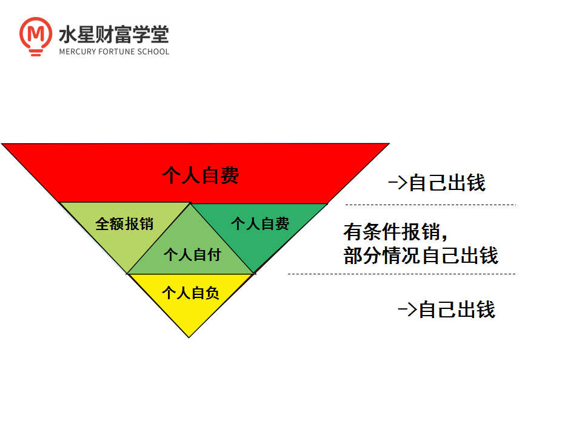

今晚班班要讲⼀下, 理财中最最最最最最最重要的, 资产配置!!

咱们的课程⾥提到过, 资产配置对收益的贡献度最⼤, 达到了 90%多.

每次学到这⾥, 总有⼩伙伴来问班班, 说这个重要性夸张了, 贡献度最⼤的应该是股票这种⾼波动的品种.

毕竟富贵险中求嘛~股市博⼀博, 单⻋变摩托. 班班估计不少⼩伙伴是这样想的.

今晚班班就来解释⼀下, 凭什么说对收益贡献最⼤的是资产配置, ⽽不是股票. 原因恰恰就出在波动上.

股票⾼波动, 可能是向上波动, 也可能是向下波动. 它是个中性的概念. 我们不能⼀想到波动, 天然地就想着是向上⾛, 这是⼀种盲⽬乐观.

万⼀是向下波动呢, ⼤家想过没有, 跌多少⾃⼰能承受?

班班带你们算笔账, ⼀看就明⽩了:

假设说我们的本⾦先跌 50%, 再涨 50%, ⼤家说最后的收益是正的还是负的?

答案是负的.

假设本⾦ 1 万元, 跌 50%就剩 5 千元了.5 千元再涨 50%, 结果是 7 千 5. 算下来亏了 2500 元~

那么反过来呢? 我们再想⼀下, 假设先涨 50%, 再跌 50%, ⼤家说最后的收益是正的还是负的?

答案还是负的.

还是以本⾦ 1 万为例, 涨 50%以后变成 1 万 5.1 万 5 再跌 50%, 结果还是 7 千 5. 跟上⾯⼀样, 还是亏 2500 元~

⼤家发现了没? 涨的幅度和跌的幅度⼀样, 直观感觉好像是不亏不赚, 但是结果却是亏的.

跌 50%的话, 我们其实要涨 100%, 也就是翻倍, 才能补回来. 这就是波动太⼤不好的地⽅.

所以班班负责任地说⼀句, 推荐投资⼩⽩去股海沉浮, 真的不理智!

⼀⽅⾯班班建议⼤家尝试⼀些波动没那么剧烈的品种, ⽐如基⾦.

另⼀⽅⾯, 就是我们今天要说的资产配置了.

资产配置之所以对收益贡献最⼤, 就是因为它严格控制了波动, 把⼤⻛⼤浪化解成⼩⻛⼩浪, 咱们投资的时候, ⼩⼼脏也更舒服.

## 股债平衡

具体是怎么做到控制波动的呢? 就拿课程⾥讲的股债平衡来说吧.

股债平衡是最最基础的资产配置⽅式了. 也就是我说过的同时配置股票型基⾦和债券型基⾦.

复习⼀下知识点哈: 股票型基⾦, 成分⾥股票占多数, 波动相对⼤; 债券型基⾦, 成分⾥债券占多数, 波动相对⼩.

根据历史表现来说, 股、债的涨跌存在反向的特点.

股票⼀涨, 愿意去冲刺⾼收益的⼈多了, ⼤家就瞧不起债券了, 这时候债券跌.

反过来说, 股票趴在地上不动, ⼤家亏得都没⼼情炒股了, 这时候更多的⼈宁愿选择保守的债券避险, 也就罢债券价格推⾼了.

我们把股票型基⾦和债券型基⾦都配置起来, 其实相当于做了两个反⽅向的操作, ⼀个跌的时候还能期待另⼀个涨, 波动就被我们平滑了.

另⼀⽅⾯, 因为我们吃股票型、债券型两边的收益, 肯定是⽐只配置债券型的收益要更加可观.

这就是资产配置的魅⼒. 严格控制波动, 既要收益, ⼜要稳稳地幸福.

上⾯咱们说了股债平衡. 课程⾥还讲了另外两种资产配置⽅案, ⼀个是海内外资产混合搭配, 另⼀个是家庭资产配置的四个账户.

班班给⼤家掰开了揉碎了讲讲~

## 海内外资产混合搭配

先来说海内外资产混合搭配.

很多⼈⼀听海外, 就觉得这件事情巨麻烦. 没有海外的账户, 不认识海外的⼈, 没有海外的货币, 也不知道有啥购买渠道, ⼀想到这么多麻烦, 就想把这⼀个资产配置⽅案放弃了.

千万别放弃. 以上这些麻烦, 只是⼀些纸⽼⻁. 事实上⽅法简单地让你难以想象.

选择基⾦, 就可以实现. 通常, 配置海外资产的基⾦名字都带这个 QDII 的标志.

班班给你们解释⼀下, 很好理解:

QDII 全称叫"合格的境内机构投资者", 简单来说就是在国内设⽴的基⾦, 在国内募集投资者的钱, 然后拿这些钱去投资境外的各种股票、债券.

注意啊, 只有 QDII 基⾦有这个特权, 其他的基⾦都不⾏.

对于我们投资者来说, 买 QDII 基⾦, 跟买其他的普通基⾦没啥区别. 同样是⽤⼈⺠币, 同样是在国内的基⾦销售平台上就可以实现.

咱们在"⾦斧⼦基⾦"App 上搜 QDII 四个字⺟, 就可以搜出很多啊. 起购⾦额也不贵, 从 1 块起购到 1 千起购都有.

当然还是那句话, 不推荐⼤家现在直接去买. 这么多只肯定是要筛选的, 选基⾦是很需要技术的, 先学习再投资不要忘.

《基⾦⾼阶训练营》有完整的讲 QDII 的知识. 感兴趣的到时候私聊班班哈~这⾥就不耽误⼩伙伴们的时间了. 我们继续往下讲.

## 家庭资产配置的四个账户

最后⼀个资产配置⽅案: 建⽴家庭资产配置的四个账户.

上⾯这张图是: 标准普尔家庭资产配置四象限. 根据钱的⽤途, 分成了四个账户.

### 第⼀个账户: 现⾦账户

这个账户主要负责⽇常开销, 也就是放平时要花的钱. 具体要注意两点:

第⼀点是考虑流动性. 必须可以随存随取, 不能在需要的时候拿不出钱. 建议放在活期储蓄的银⾏卡、余额宝或者微信零钱⾥, 类似的都可以.

第⼆点是关于放多少钱. 这个没有统⼀的标准, 每个家庭的情况不⼀样. 但是总体来说, ⼀般是家庭或者个⼈ 3-6 个⽉的⽣活费.

因为⼀旦这个账户的钱来源断了, 咱们还能有 3~6 个⽉的时间作为缓冲, 这段时间不⻓不短, ⾜够我们找到解决⽅案.

现⾦账户不⽤多讲, ⼤家平时都接触, 也都明⽩怎么回事. 但是有⼀点很容易出问题, 那就是现⾦账户的钱⽐例过⾼, 平时吃穿花销太多, 没给其他账户留下⾜够的钱.

该省省, 该赚赚, 少喝奶茶啤酒, 少吃⽕锅烧烤, 平时养成记账的习惯, 每个⽉复盘⼀下⾃⼰的账⾯, 看看哪些是不必要的开⽀, 这就能省下不少.

### 第⼆个账户: 杠杆账户

杠杆的特点就是以⼩博⼤. 保险就是属于这⼀功能, 花少量的保费, 博取较⼤的保额. 所以说保险适合放在杠杆账户⾥.

杠杆账户是很多家庭缺失的, 尤其要引起重视.

它起⼀个兜底的作⽤, 不管你平时怎么赚怎么花, 不管你平时投资⻛险⼤还是⼩, 没有杠杆账户⼀切都是空谈.

⼀旦家⾥⼈出现⽣病、意外, 没有保险的话, 就要承受巨额的医药费⽤, 还要承担失去收⼊来源的⻛险.

⽽且, 遇上这档⼦事的时候, 如果你在投资, 不管你投资的是股票还是基⾦, 哪怕当下的收益是亏的, 未来还有上涨的机会, 你也不得不被迫赎回, 拿钱去补看病的窟窿.

甚⾄是平时的⽇常开销, 都要拿去补窟窿.

没有保险, ⻛险是多⽅⾯的. 杠杆账户这⼀个账户缺了, 其他三个账户都变成⾼危了.

有很多⼩伙伴觉得, 这个账户放医保就够了. 班班给⼤家看⼀下医保的构成:

医保有⼀条起付线, 各地标准不⼀样, 但肯定都有. 我们花的钱没有超过起付线的话, 是不报销的, 这叫"⾃负".

起付线以上的, 如果使⽤的医疗和药品是部分报销, 那么个⼈承担的那部分叫"⾃付".

起伏线以上的, 个⼈全额承担的, 叫"⾃费".

如果是超过了医保报销额度, 那就更不⽤说了, 也属于"⾃费".

⼤家看到了吗? 只有图上左边那⼀块区域, 是全额报销的, 其他的不管是⾃负、⾃付、⾃费, 都需要我们⾃⼰掏钱看病.

这就要是为什么班班提醒⼤家, 配置⼀些商业保险, 重疾、医疗、意外这些, 来补充医保的不⾜.

### 第三个账户: ⻛险账户.

这个就是为了冲刺收益的了, 可以配置股票和基⾦. 不过班班反复强调很多次了, 对于⼩⽩⼊⻔⽔平的同学, 优先考虑基⾦.

这⾥我们就能把前⾯的股票型基⾦、债券型基⾦的"股债平衡"策略⽤上了.

⽽且也可以把 QDII 基⾦的配置算在这个账户⾥.

在⻛险账户⾥⾯, 可以单独实现内部的资产配置, 稳中求稳哦~

班班提醒: 不管投资什么, 不要借钱投资, ⻛险账户⾥⽤的必须是⾃⼰的闲钱!!!

因为⼀旦借钱投资, 遇到暂时的下跌, ⼜到了不得不还钱的时候, 那就很尴尬了. 钱⼀还, 收益就回不来了.

### 第四个账户: 安全账户.

安全账户是为了保障家庭成员的养⽼⾦、⼦⼥教育⾦、留给⼦⼥的钱等.

这个账户最重要的是专属.

1 不能随意取出使⽤. 很多家庭说是要存养⽼⾦, 但是经常被买⻋或者装修⽤掉了.

2 每年或每⽉有固定的钱进⼊这个账户, 才能积少成多, 不然就随⼿花掉了.

3 这个账户要保证不能亏. 因为咱们的养⽼⾦、⼦⼥教育⾦等, 到时间了就肯定要⽤, 承担不了亏损这个⻛险. 所以不适合⽤基⾦、股票这些⼯具.

我们常听到很多⼈年轻时如何如何⻛光, ⽼了却身⽆分⽂穷困潦倒, 就是因为没有这个账户.

在保本的前提下, 去考虑⼀些能稳健增值的品种. 班班的建议是放年⾦险、增额终身寿这⼀类品种.

⼀⽅⾯这些品种的回报, 是⽩纸⿊字写进合同⾥的, 不管保险公司资产管理做的好不好, 收益都会按照合同约定发给我们.⽽且有银保监会做其强⼤背书, 不像其他平台⼀样有暴雷跑路⻛险.

拿年⾦险来说, 现在复利 3.5%的收益是问题不⼤的.⽽且这个利率是锁定的.

班班解释⼀下"锁定"的好处:

我们国家的⽆⻛险利率⼀直在下⾏, 但是不管如何下⾏, 哪怕进⼊负利率时代, 因为咱们提前签过年⾦险合同, 合同⾥写的是锁定复利 3.5%, 保险公司就得按照每年这个数给我们钱.

换成银⾏存款的话, 3.5%这个收益⽔平也属于⾼的了.⽽且银⾏存款是按照单利计算, 每年的利息不会给我们利滚利. 相⽐之下, 年⾦险的优势更明显⼀点.

以上四个账户就像桌⼦的四条腿, 少了任何⼀个就随时有倒下的危险, 所以⼀定要及时准备.

当然这四个账户, 很多⼩伙伴现在可能还是只有其中⼀个到两个, 并不是说我们每个⼈⼀开始就会有四个账户, ⽽是通过我们财商的觉醒, 然后⼀点⼀点的完善起来的, 所以同学们不要沮丧, 从咱们⼩⽩班出去的⼈, 这点⾃信还是要有的.

关键的是, 我们要⾏动起来啦. 另外呢, 可能有⼩伙伴会问到这个标准普尔家庭资产象限图的⽐例, 不要⽣搬硬套哦. 也只是⼀个⼤体的参考, 毕竟每个⼈的情况是不⼀样的哦.

今晚的资产配置分享就到这⾥啦, ⼩伙伴们都 get 到资产配置的正确姿势了吗?

做好我们的资产配置, 前攻后防, 既能抵御⻛险, ⼜能实现增值, 赚安稳的钱, 才能快乐的过上⼩⽇⼦哦~
