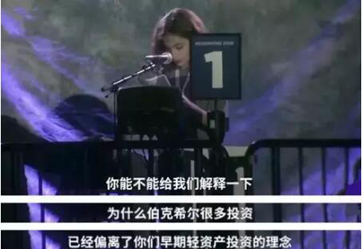
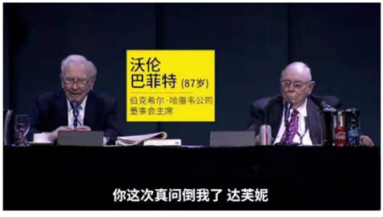
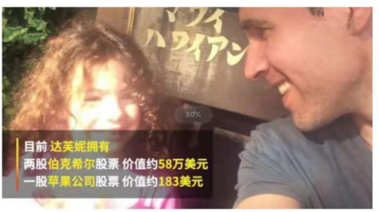
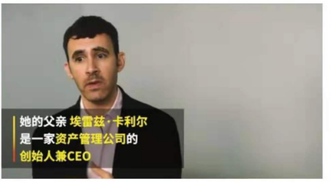
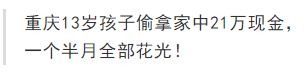
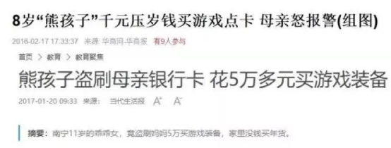
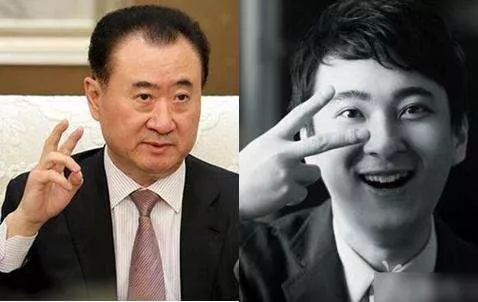
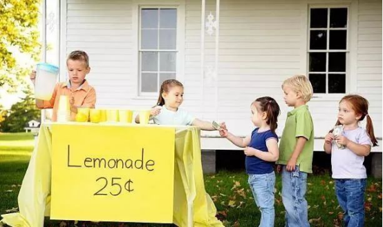
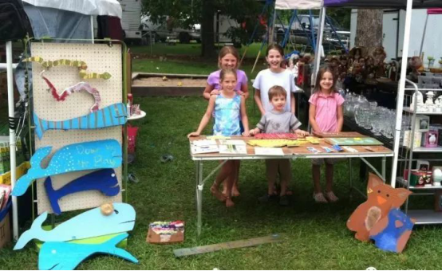
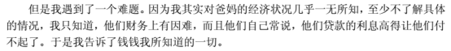

2018 年, 巴菲特股东大会吸引了全球超过 5 万名参会者, 其中来自中国的投资人接近四分之一. 在长达 5 个小时的提问环节, 巴菲特和芒格共回答了近 60 个问题. 在这些问题中, 巴菲特竟然被一个 8 岁的小女孩"问倒了"!

下面是小女孩儿的提问以及巴菲特的回答:

问: 我已经是伯克希尔-哈撒韦公司两年的股东了, 这是我第二次参加年度股东大会了. 巴菲特先生, 你能否向我解释为什么伯克希尔近期最大的投资背离了你以往有效的投资哲学, 为什么您投资了北柏林顿铁路公司, 而不是投资像美国运通这样有资本效率的公司.

答: 你的问题难道到我了, 庆幸她还没有长到 9 岁, 我坐在这只想一个问题, 明年我们要踢掉 6 位专门小组成员中的哪一位, 让你来替代他们的位置(哄堂大笑).

我的答案是, 我们总是更青睐有很高资本收益的生意, 比如喜诗糖果公司以及一系列有潜力的公司, 我们从资本密集型公司那里获取了相当不错的收益以合适的价钱购买了大多数公司的股票, 并且在投资之后这些公司运营的还不错.

我们仍然青睐那些投资少收益高的公司, 并且能一直发展而不需要很多的增量资金, 那些以合理的价格买入而有很高权益资本收益的公司, 这样的机会我们是不会放过的. 芒格对小女孩的说法表示赞同: "我很喜欢刚才那位年轻的女士的这种说法, 我觉得我们应该坚持这种理念(购买轻资产), 说得没错. 我觉得公共事业方面的回报铁路方面的回报, 其实是满令我们满意的. 虽然不是最好, 但是足够好."

巴菲特补充说, 轻资产的公司, 甚至价钱合理的话, 这种已经很难找到了. "像苹果这样的业务, 它其实不需要太多的资本投入, 但很少有这样的企业可以提供给我们这样的机会去做这样的购买. 因为现在这种高回报的公司, 已经很难找了."

他最后对小女孩笑说: "但是在我们资产配置部门, 肯定会有一个工作为你做好准备, 长大了就来吧." 这个 8 岁的小姑娘到底何方神圣呢? 居然能把身经百战, 神一样存在的股神巴菲特老爷爷问倒? 出于好奇, 有网友就扒一扒这位小姑娘的背景.

小姑娘名叫达芙妮, 小小年纪, 已是两家上市公司股东, 而且市值不低被誉"最牛小股东"

5 岁时, 她父亲就给她读巴菲特的传记《滚雪球》. 5 岁就开始财商教育了, 这比巴菲特还早好几年呢. 要知道巴菲特 11 岁才开始了人生的第一股票投资. 而且金额只有 114 美元.

这位叫达芙妮的小姑娘值得我们重点关注, 或许巴菲特之后的股神就是她了. 那么这位 5 岁开始学习财商知识, 8 岁问倒巴菲特小姑娘的爸爸是做什么的呢? 她爸是资产管理公司的创始人兼 CEO.

看来财商也会遗传的. 有这么一位高财商爸爸, 女儿财商想不高也难呢. 想想股神巴菲特老爷爷不也同样有一位股票经纪人爸爸吗? 突然我发现了一个真相: 父母的财商是孩子财商的起点. 要想让自己的孩子财商高, 最好的方式就是父母自己先提高自己的财商. 这样孩子一出生, 在财商方面就赢在了起步线上.

## 让孩子明白钱都去哪儿了

曾经看到过一个报道

孩子的"偷钱"行为、钱的数额之大、以及花钱速度都令人震惊~~通过新闻案例, 我们可以看到很多中国家庭在孩子的财商教育这方面都存在缺失.

相信大部分人也都看到过这样的场景: 一个七八岁的小孩子想要买玩具, 让妈妈给他买, 妈妈不情愿地瞪着孩子, 孩子不依不饶一定要买, 最后妈妈情绪爆发、歇斯底里: "你就知道花钱, 知不知道妈妈上班有多累? 赚的钱要给你交学费, 还要吃饭, 你怎么这么不懂事!" 这种家庭里长大的孩子, 有什么理财教育可言呢? 没有. 结果只有两种, 要么孩子听不进去继续哭闹, 要么孩子被吓得大气都不敢喘.

中国家长总是习惯性地跟孩子说: "这个太贵了, 别买了", "挣钱不容易, 爸妈上班很辛苦", 但却从来没想过, 孩子对钱是没有认知的, 不知道"什么是钱", "怎么花钱", 不明白金钱的利害关系, 也不知道钱对于整个家庭的意义.

有媒体曾经做过一个调查研究--"看看成绩优秀的小学生们都有哪些共同的特点?", 结果很有意思, 其中一点就是关于零花钱的--在优秀的小学生中, 有 53.3% 的孩子能够自主管理零花钱.

你能想到吗? 也就是说: 会管钱的孩子, 成绩不会太差(呱呱 OS: 我之所以是学渣竟然是因为不会花钱?!).

可以说, 懂得如何管理金钱, 在未来应该是每个孩子都不可或缺的能力, 懂得如何赚钱, 如何花钱, 如何理财, 无论是对孩子的成绩, 还是将来融入商业社会都有着很大的关系.

## 财商教育, 让你的孩子将来比你更有钱

财商, 简单地说就是一个人认识金钱和驾驭金钱的能力, 学会支配金钱是培养孩子财商的基础. "财商教育"并非简单的"理财教育", 而是要帮助孩子建立一整套面对物质生活的人生观、世界观和价值观.

美国第一女儿伊万卡, 她的人生可看作是一本行走的财商教科书.

大家对"王健林给儿子王思聪 5 亿元试错"的新闻也都不陌生. 通过投资, 这 5 亿元在"纨绔子弟"王思聪手里迅速升值, 达到了 8 倍以上的溢价.

李嘉诚每次给孩子零用钱时, 先按 10% 的比例扣下一部分, 名日所得税. 孩子上学后, 他为孩子专门设立了完成学业的基金账户, 孩子如果想用这个账户里的钱, 必须得写报告申请才可以. 这样, 孩子从小就懂得"贷款"的概念, 花钱时就要先仔细盘算, 做一个全盘和长久的打算.

诚然, 富裕家庭本身拥有更多资源, 但是真正对孩子未来起作用的却是思维和眼界.

## 如何进行财商培养

在北美, 每逢周末路过居民区, 你都能见到这样的景象:

孩子们在卖自制的柠檬水

女孩们卖唇膏

在家门口卖闲置的玩具和摆件

我们的孩子还只会缠着爸妈各种买买买

小狗钱钱里的主人公吉娅的故事, 还记得嘛?

她的父母就是财务上有困难, 贷款买房, 每月分期付款很高, 家里总捉襟见肘. 但吉娅遇到了钱钱, 遇到了金先生, 遇到了陶穆太太, 有心人不断点拨她帮助她, 给她正确的财商教育. 我们的孩子要靠谁来给他正确的财商引导? 唯有我们做父母的啦
