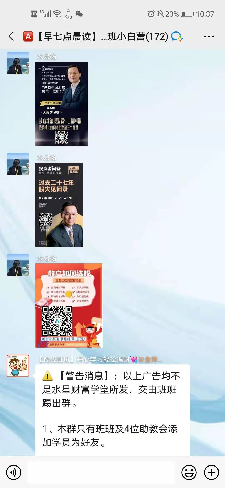

上面那些骗子发的所有的消息, 其实目的就是一个, 搞荐股群

那荐股群是怎么运作的呢?

现在我来给大家解密~

话说, 张三穷了大半辈子, 住 600 块的出租房, 吃 4 块钱的泡面

后来去学了理财投资, 又不肯吃苦, 不愿意学习, 浑浑噩噩好多年, 还是一无所成

偶然的机会, 从远在台湾的大爷那里继承了 1000 万资产. 张三有了本金, 突然发现, 自己的投资知识不够用了

你让他做价值投资, 分析公司, 太累了不想做.

有一天, 他看中一只烂股, 谁知手抖一不小心, 本来打算买 5 万的, 填成了 500 万. 亮点来了, 哗啦一下, 股票给他拉涨停了! ! !

张三一看, 好家伙: 原来, 我可以通过一己之力, 把自己看中的股票的股价抬起来

但是, 等他卖的时候, 又有点麻烦, 因为他一卖, 股价又跌回去了. 一来一回, 算上手续费, 一分钱没赚到

这时候, 他的狗头军师教了他一个暗黑招数~~

想赚钱是吧, 很简单呀, 你把你的股票会涨的消息提前卖给别人

比如, 每次 1 万块, 你卖给 100 个人, 就是 100 万. 你在股市里一来一回, 不赚不亏, 但是, 另外赚了 100 万的钱呀

你全身而退了, 当然, 买你消息的人, 那就看天意了. 张三一想, 对呀, 真是好办法! 那问题是, 谁来买我的消息呢?

这些人必须是:

1、贪婪, 想赚钱

2、懒惰, 不肯学习, 想不劳而获

3、觉得天下有这么好的事情

经过百般尝试, 他发现, 有一款叫做"喂喂喂"的聊天软件上, 有大量这样的人而且只要自己用个美女头像, 成功率会大大提升从此以后, 生意流程如下:

1. 挑中一只交易量小的股票, 如 xx 股份
2. 给"喂喂喂"里的蠢货放出去消息, 说 xx 股份, 明天会涨
3. 在早盘的时候, 用 500 万把股价抬起来. 一定是要在早盘集合竞价的时候, 股价就抬起来.
4. 那些人看到你的"预测"真的准, 就会相信你. 然后让他们掏钱, 少则两三万, 多则十来万. 捞到一个是一个
5. 收了钱之后, 就随便给他们推股票了. 反正涨不涨, 都不关我们的事情
6. 什么? 你怕被抓. 放心, 手机号和微信号都用假的呀, 根本查不到你~~
7. 对了有些小技巧要注意~比如:
   - 用美女头像, 大猪蹄子们超容易上当, 看到肤白貌美就走不动路
   - 朋友群经常更新, 发一些生活"自拍"啊
8. 还有, 挑股票的时候, 一定要挑那些市值不满 100 亿, 甚至 50 亿以下的股票~因为这种市值小, 交易量小, 才好拉升股价. 贵州茅台, 招商银行, 格力电器.. 这种蓝筹股, 绝对不要去试, 别说 500 万了, 5 个亿都不够你玩的...
9. 等未来你做大一点, 就不要自己去拉群了. 你卖给那些拉喂喂喂群的人, 你只卖消息, 批发价; 他们收会员费, 零售价; 这样, 你每个消息 10 万, 一次卖给 10 个经销商就赚 100 万. 你是上游, 他是下游, 韭菜们是消费者.

你们看, 产业链形成了~~

咳咳, 这些招数是内部绝密信息, 千万不要让其他人知道了

有不少人都栽在了这种骗局上, 被骗数万甚至数十万, 进而开始不相信投资, 厌恶理财

我想说, 这种学费交的太贵了~~愿认真学习的你们, 被世界温柔以待~
