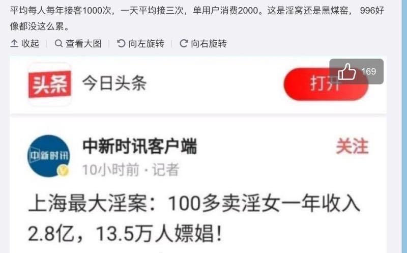

⼀篇有趣的⽂章分享给⼤家

我们看东⻄要看背后的本质

起因, 是某⼈发了这么⼀张图:

我们⽆论在⽣活还是理财, 量化分析是极其重要的. 所谓量化, 就是⽤数据来解析.

如果初看到这⼀则新闻, "100 ⼈, ⼀年收⼊ 2.8 亿, 其中 13.5 万⼈次交易", 很多⼈其实没感觉.

但是, 如果我们对数据再深⼊挖掘, "平均每⼈每年接客 1000 ⼈次计算, 平均每天 3 次, 单次消费 2000 元". 这样的描述, 会带给我们的感觉会更直接, 也更震撼.

这是写作上的⼀个要点, 太⼤的数据, 有距离感, 读者在阅读的时候, 很难留下深刻印象.

当然, 今天我们要讨论的不是写作, ⽽是闲扯淡.

很显然, 量化的思维很好, 但是数据分析有⼀个缺陷. 他忽略了⼥性有⽣理周期, 前后每次按照 7 天计算, 这⼀个⽉, 就要休息⼀周的时间.

所以每天的接客⼈数, 从 3 次提升到 4 次.

前前后后按照每次 2 个⼩时计算, 纯上班时间就是 8 个⼩时, 这不包括路上的出勤时间以及吃饭休息时间, 那⼏乎和码农的上班强度 ⼀样了.

差别在于, ⼩姐有⽉假, 码农没有.

第⼆个数据, 单次交易 2000 元, 据了解, 这个价格凸显出上海⼈⺠消费⽔平确实不低.(不要问我数据从哪来, 我是不会出卖我的线⼈)

根据营收定理, 收⼊=销售量\*销售单价.

那么⼀个⼩姐姐, 年收⼊=1000\*2000=200 万元, 这是营收.

营业成本, 包括哪些呢?

我觉得⼩姐⽣病治病的费⽤(设备维修), 以及买化妆品、 护肤品保养(设备⽇常维护), 这些算成本. ⼩姐姐⽇常吃饭, 维持身体正常机能, 这算成本.

化妆品和护肤品, 每年算 5 万; 吃饭开⽀, ⼀年 5 万; ⽣病这个, 可⼤可⼩, 属于⻛险因⼦, 我们暂时不要考虑, 在后期估值的时候, 考虑安全边际即可. 那么这部分开⽀, 10 万左右.

⾄于安全套, ⼀个 10 块钱, ⼀年 1000 次, 也就 1 万块, 可以忽略不计.

再严谨⼀点, 如果⼩姐买了⼀套房作为交易场所, 她可以资本化, 然后将这部分费⽤每个⽉折旧, 这也算作成本. 如果是租⽤的场地, 这部分费⽤就要计⼊管理费⽤, 必须费⽤化.

正常来算, 上海好⼀点的两居室, 不要太偏远, ⼀年的租⾦, 加上各类杂费⼤概 10 万.

此外, 要剔除⽼鸨的抽成, 据某⼈说, ⽼鸨⼤概拿⾛ 50% 的营收, 这部分抽成属于销售费⽤, 那就是 100 万.

那⼩姐姐核⼼利润(经营利润), 每年⼤概就是 80 万.

如果她还要名牌包包, 或者出去旅游, ⼀年算 30 万的开⽀. (这些⼈钱来的容易, ⼀般花的也⽐较⼤⽅) 那么每年可⽀配收⼊就 50 万左右, 这是⼀个平均值. ⽣意好的, 可能⼀年能存 100 万, ⽣意差的, 可能 50 万都存不到.

此外, 这是⼀个⻘春饭, 能⼲⼏年? 我们按 5-10 年计算, 那在这⻩⾦年⽉中, 她能存在的本⾦, 其实并不算多, 我们就按 500 万计算.

留给每个⼩姐姐的时间并不多, 除⾮她能在⽇常劳碌的⼯作中, 还来学习理财, 学投资. 在她功成身退的时候, 500 万本⾦, 也可以作为启动资⾦, 按照年化 10%的收益来计算, 她确实可以不⽤上班了.

但是, 如果这些钱, 被拿去投 P2P, 或者拿去开⽕锅店, 基本就是打⽔漂了. 有多少, 就能亏多少.

从职业发展的成⻓性来看, 这个⼯作其实是不断衰退、 贬值的, 没有⼀点成⻓空间. 除⾮, 通过其他技能的学习, 实现⼯作跃迁.

在投资中, 本⾦很重要, ⽅向和路径⼀样很重要.

写到这⾥, 我们再说职业⻛险.

上⽂留了⼀个悬念, 就是万⼀⽣病了, 费⽤开⽀的问题.

如果是⽇常感冒, 或者⼩问题, 那⼀年也就 1 万元的费⽤.

但是, 这个职业的⻛险很⼤, 每年交易 1000 ⼈次, 就有 1000 次的感染⻛险. 如果按照 5 年的⼯作时间, 5000 次感染⻛险.

如果是⼀般性病, 问题不那么⼤, 那治疗费⽤增加, ⽽且患病期间, 停⽌⼯作, 没有收⼊.

如果得了艾滋, 那就凉凉, 彻底 say goodbye.

⽬前国内艾滋病⼈数⼤概 150 万, ⽽且还在不断增⻓. 虽然放在 14 亿⼈当中, 这个⽐例还是⽐较低, 0.1%. 但是在⽆固定性伴侣中, 得病的概率肯定更⼤.

当然, 据说, 戴套能够防艾滋. 所以最终患病⼏率, 我们需要⽤感染概率乘以⻛险值. 这个, 我不擅⻓, 那么⽑估, 这 5000 次交易中, 是有 1 次以上的感染⼏率的.

从这个⻆度来看, 这 500 万本⾦的积累, ⾯临这么巨⼤的⻛险, 是⾮常不划算的.

其他⻛险, 包括⾮法性交易, 被抓之后的罚款等. 也许⾟苦⼯作⼀个⽉, ⼀个罚款化为零, 可悲, 可叹.

但是, 写到这⾥, 不知道有没⼈意识, 其实做⽼鸨, 其实性价⽐更⾼.

⾸先, 没有感染疾病的⻛险;

其次, ⽼鸨的⼯作时间是有复利效果. ⼩姐只能单身作战, 分身乏术. 但是⼀个⽼鸨⼿下管理 10 个⼩姐, 收⼊就可以乘以 10.

⾄于其他数据, 由于个⼈对⾏业不了解, 也挖掘不出来更多有内容的价值. 欢迎相关业内⼈⼠补充.

我不懂的太多了.

这就是说, 做任何事我们要拿出来量化一下算一算, 不能拍脑门硬上

我讲的通俗但是不低俗

好好学习, 理财思维可以用在方方面面
