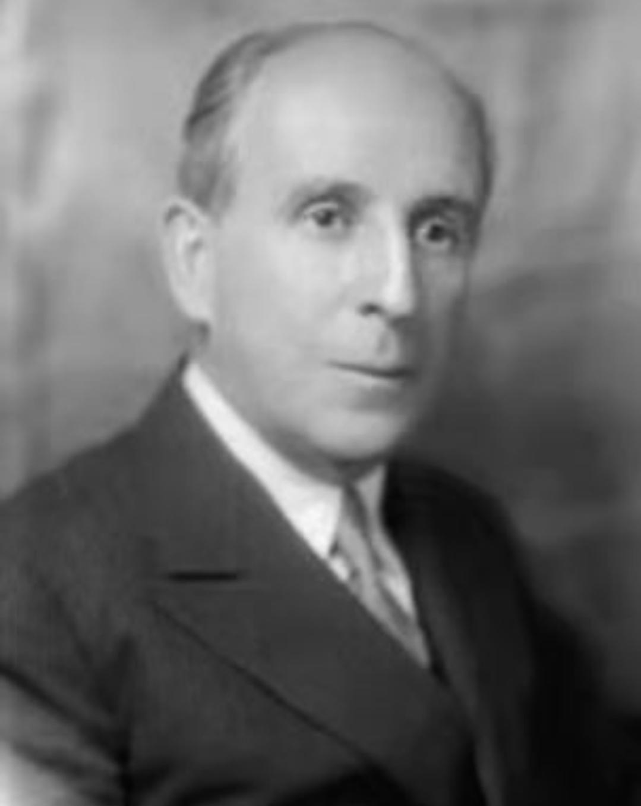
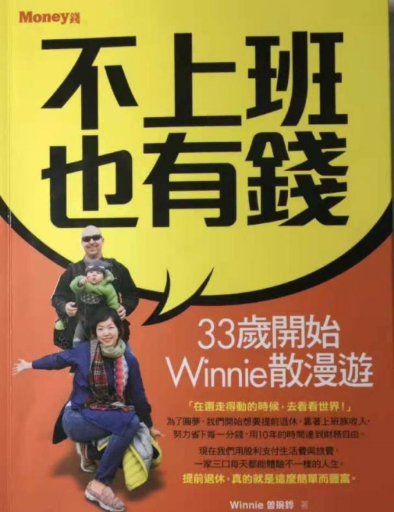
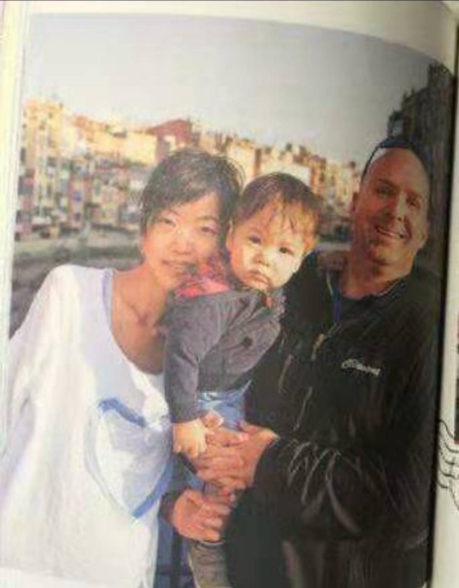
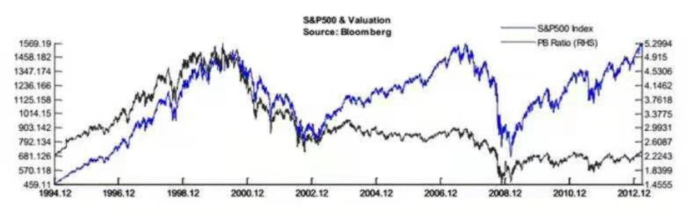
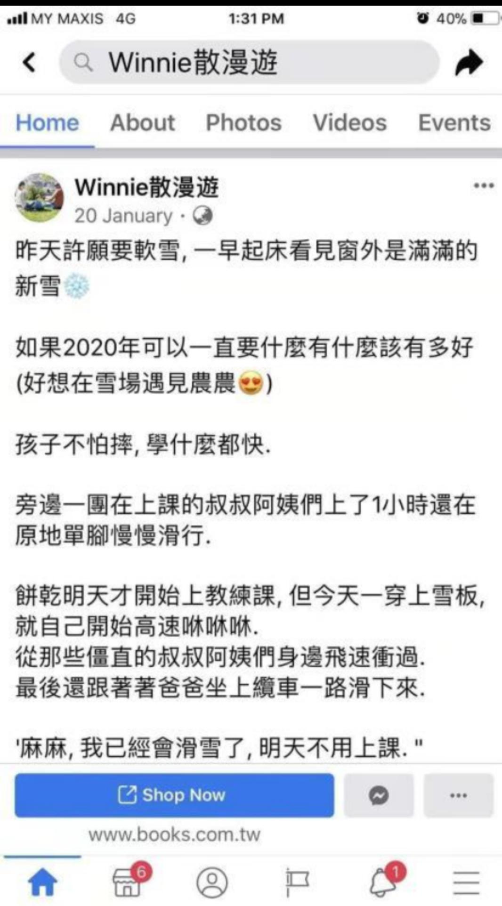

班班来给大家讲故事来啦

因为基金是个非常重要、非常基础、非常适合普罗大众的投资品, 所以我占用大家休息的时间给大家多讲一些

如果学习投资理财, 别的不学习, 但是基金课一定要学

因为这是可以让每个人都不影响工作, 而且又可以跑赢通货膨胀的一个投资品

我来分享两个故事, 让大家对基金定投有更深刻的印象

## 第一个故事: 最倒霉的定投者

话说, 在 1929 年的 6 月, 那是一个岁月静美的夏天, 美国通用汽车公司的高级财务总监拉斯科布, 就是这个中年大叔

在接受新闻采访时, 讲了一个非常大胆的观点

他说, 一个投资者只需要每个月往美股里定投 15 美元, 20 年后, 此人的财富有望稳步增长至 8 万美元.

我大概算了一下, 每月定投 15 美元, 20 年的本金是 3600 元, 要达到 8 万的终值, 需要有 45%的收益率.

如果这 20 年美国始终处在牛市, 是有可能实现的.

1929 年的美国经济发展势头非常好, 大家都以为这样美好的状态会持续下去, 却没有料到已经严重泡沫, 处在牛市末端.

在拉斯科布发表观点 7 周之后, 美股股市崩盘, 迎来了知名的"大萧条". 4 个月之后, 大盘市值蒸发了 89%, 数百万投资者的毕生积蓄化为乌有, 成千上万的融资客最终破产

大家如果有格外感兴趣的, 可以自己去搜索相关的资料

之前提倡"定投"的拉斯科布倒霉透顶, 他的言论遭到了无情的嘲讽和抨击.

不过呢, 如果真的有一个投资者听了他的意见, 傻傻地从 1929 年开始每个月定投 15 美元, 就算遇到大萧条也不退出

到 20 年后的 1949 年, 他的累计资金会达到 9000 美元, 年化收益 7.86%, 高出当时债券收益率两倍以上

如果他定投 30 年, 定投资产将达到 6 万美元, 年化收益率也上涨到 12.72%

尽管没有拉斯科布预测的那么高, 但也是同期债券收益的 8 倍. 12.72%这个数值, 在我们看来也是算是比较满意的了吧.

这就是第一个故事想要告诉大家的:

即使在股市估值最高点开始定投, 即使经历了有史以来最严重的崩盘, 但如果坚持定投下来, 仍然会取得不错的收益.

只不过, 这中间所需要的时间非常非常长, 恐怕没有几个人能耐得住性子, 也没几个人敢

而且也确实非常的不划算. 如果我们知道算法, 能从低点开始投资, 可能半年到 3 年就能取得年化 12%以上的收益, 那不是更好吗?

第一个故事, 说完了, 大家想到了什么呢?

## 第二个故事:《不上班也有钱》

给大家看下作者一家. 作者 Winne 是左边的女生, 中国台湾省人; 右边是她老公, 美国人.

夫妻二人在十年前去泰国穷游, 于是有了环游世界的梦想. 但是, 如果等到 60 岁退休再去环游世界, 可能很多地方都去不了, 很多苦都吃不了.

所以作者就给自己定了一个目标: 在 40 岁之前退休, 实现财务自由, 环游全世界

开始的时候, 作者是想"边旅游边打工"的形式实现, 她老公甚至想过当潜水教练、英语老师. 后来在查找资料的过程中, 两个人认识到, 可以通过投资来实现财务自由

通过作者的研究, 最后确定了一个路线, 那就是通过定投指数基金, 和"4%法则", 来实现财务自由

4%法则, 是麻省理工学院的学者威廉班根在 1994 年提出的理论.

"通过投资股票资产, 每年从退休金中提取不超过 4.2%的金额用来支付生活所需, 那到自己去世, 退休金都花不完的. 因为股票资产自己会增值."

换句话说, 如果一年需要开销 10 万, 那就需要: 10/4% =250 万. 把这 250 万投资到指数基金上, 就可以满足生活开销, 实现财务自由.

一定要注意, 这是美国的法则, 不完全适用于中国, 只是给大家一个参考

作者 Winne 觉得自己需要 3000 万台币, 也就是约 650 万人民币, 就可以实现财务自由的目标, 去环游全世界啦.

所以在大学毕业的那一天, 作者和他的老公, 就立下了"10 年内退休"的计划.

目标, 就是在 10 年内, 通过定投指数基金, 积累下价值 650 万人民币的指数基金资产. 之后每年从指数基金中提取不超过 4%的钱用来生活、环游世界.

(不过他们好像忘记了通货膨胀这件事.....)

Winne 是怎么做到的呢? 老一套: 节流、开源、依靠基金分红建立被动收入来源

这真的是我见过的最狠的节流

家庭开支最大的就是房租/房贷、伙食费、交通费. 如果要尽早实现定投的目标, 最快的方法就是把这 3 大项支出减少到最低.

房子住最便宜的学生公寓, 公寓旁有块空地, 自己种菜

车? 不要, 地铁都不坐, 自己踩脚踏车.

手机? 不要, 两人公用一部手机打电话就行了

结婚? 不买婚戒、不拍婚纱照、没有喜宴. 蜜月旅行是徒步穿越西雅图附近的雷尼尔山 10 天之旅, 只花了几百元.

他们每个月的收入, 至少存下 70%用于投资, 最高的时候甚至能达到 90%

为此省钱, 他们还自创了非常绝的一招——给消费贴上"生命标签": 比如说税后月收入 5000 元. 一个月工作 22 天, 每天 24 小时, 那么一小时价值 10 元左右

在消费前, 给这笔消费贴上生命标签, 看看值不值

比如说一杯星巴克咖啡= 3 小时生命. 一部新 iphone 手机= 800 小时生命. 问问自己这些真的值么?

开源的部分, 我觉得他们做得不是太好, 主要就是依靠工资

但是通过认真工作, 10 年后准备"退休"的时候, Winne 的工资收入已经是刚开始工作时的 3-4 倍了

作者的老公创立了自己的旅行博客, 接入广告, 每个月可以获得一定的被动广告收入(当时博客还比较流行, 就相当于现在的公众号吧).

好了, 接下来就是基金定投的部分了

Winne 两夫妇, 真的是非常狠. 我们资产配置里讲到啦, 要有四个账户, 但是她通通不要!

她把家庭中 99%的钱都放在指数基金中. 刚定投不久就遇到股灾, 一晚上 10 万美元就不见了, 吓得够呛

不过再后来发现, 股灾的时候往往是很好的投资机会. 这个时候很多指数基金股息率是很高的.(美国情况)

我们知道投资股票, 获取的收益是: 分红+低买高卖. 所以股票型基金也是一样的.

开始的时候分红金额很少, 但是慢慢的, 分红金额能抵得上很大比例的生活费, 最后生活费全部由基金分红负担. 财务自由也就实现了..

因为作者是在美国生活, 所以主要投资的是美股指数基金.

而他们的计划就是坚持持有指数基金 30 年以上, 因此只赚分后的钱, 不赚低买高卖的差价.(其实也就是我们说的傻傻定投, 无脑定投, 并不是最佳投资方式)

即使这样, 他们也真的用了 10 年的时间, 实现了自己"提前退休、环游世界"的梦想

别忘了这个时候他们的基金仍然在继续运作. 仍然在获取复利, 复利的图还记得吗? 是有时间魔力, 越往后越高的.

所以他们在做旅游计划的时候也有安排: 先去开销小的地区玩(中南美洲和东南亚), 再去开销大的地区玩(欧洲).

这一点大家也可以参考, 不要一开始就恨不得各种高大上, 要去欧洲、去美国, 其实没必要.

他们还有更狠的一招——去旅游之前把家里的东西都卖了, 换来的钱投资到指数基金里. 反正出去玩的时候这些东西都闲着, 不如投资到指数基金让它们复利滚动着.

同时他们也一直这样教育孩子, 孩子也跟着一起投资, 对孩子的财商培养也很到位.

所以说, 言传身教真的很重要

作者给了 10 个提前退休的小秘诀和七步规划财务自由的方法:

1.  立刻开始存钱. 哪怕是小钱.
2.  设立一个大目标. 有目标才有动力.
3.  享受不用随着收入升级.
4.  不关注涨跌、股评.
5.  学着骑自行车或公共交通上下班.
6.  在家做菜.
7.  别把黄金岁月献给房贷. 他们始终没有买房, 都是租房. 出去旅游就把房子给退了, 但是这一点我个人觉得中国国情内很难做到哇
8.  建立共同兴趣的朋友圈. 跟有同样价值观的人交往.
9.  培养有益身心的兴趣.
10. 心动就马上采取行动.

这个有点长哈, 感觉重要的小可爱们可以保存起来, 没事的时候看看, 激励一下自己

作者还给出了"七步规划财务自由":

第一步: 科学记账分析.

知道自己每一块钱花在哪里而不是流水账.

第二步: 推算财务自由需要多少钱.

作者用的是 4%法则. 比如说每年需要 10 万, 那就是 10/4%=250 万, 需要 250 万的资金来实现财务自由.

每个人的情况有差别, 这一点不确定是否适合中国国情. 大家可以自己算一算, 量化思维、目标导向嘛.

第三步: 至少存下 50%的收入.(作者达到了 70%-90%)

第四步: 减少三大支出. 也就是减少房租房贷、伙食费、交通费.

第五步: 认清必要想要和需要. 这也是我们在强调的.

第六步: 长期稳健的投资. 寻找稳健的投资方法, 例如定投指数基金.

第七步: 设法增加收入.

他们用极尽抠门、近乎自虐的攒钱方式, 用了 10 年时间, 从 2003 年到 2013 年实现了积累下 650 万元指数基金的目标, 开始环游世界.

其实从 2003 年到 2013 年, 美国股市整体收益非常一般般. 而且中间还经历了 2008 年的大股灾, 华尔街大批公司破产.

十年间, 美国最重要的指数之一, 标普 500 指数, 从 2003 年的 1000 点左右, 涨到 13 年的 2700 点左右. 涨幅并不怎么样.

请大家注意看 2008 年那么剧烈的震荡, 就算这样, 作者也是利用定投实现了财富自由, 这就是定投的好处..

美国标普 500, 牛长熊短, 其实并不利于定投

假设这个作者能懂得基金投资的策略, 能做到低买、高卖、和不定期置换更利于定投的基金, 用他们这种攒钱方式, 可以积累下接近 1000 万元指数基金的目标.

作者这么自虐, 我相信大部分人是没法完全学习的. 但是想通过这个故事告诉大家:

一、创造财富没有捷径, 开源节流始终是要点, 越是在早期, 越是要对自己狠一点.

二、基金定投是个很好的投资品, 坚持投资会给你很大的回报. 就怕有人看到跌了几天就受不了要割肉.

三、如果能懂得基金定投策略, 明白如何挑选基金, 明白怎么买、怎么卖、怎么换, 定投的收益率将是非常可观的.

坚持策略是非常重要的

现在, Winnie 一家人的生活就是旅行; 旅行就是他们的生活.

好啦, 分享内容就到这里
