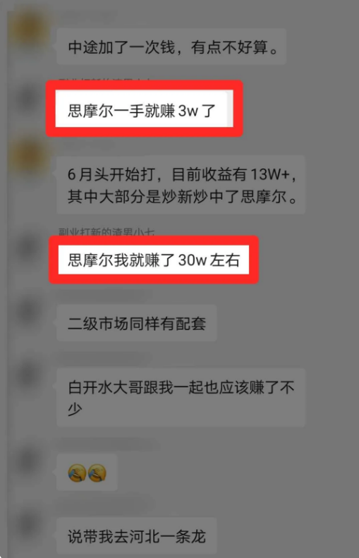
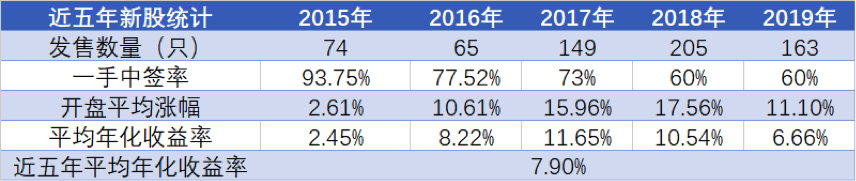
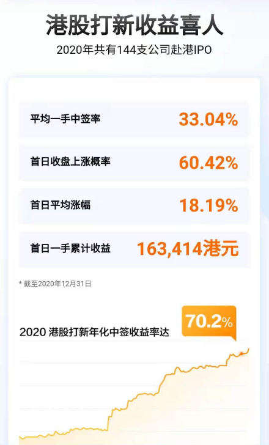
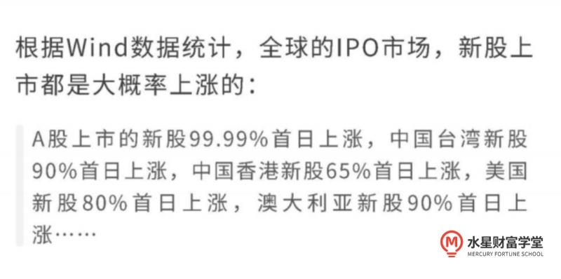
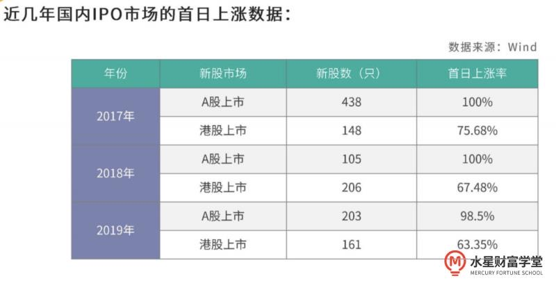
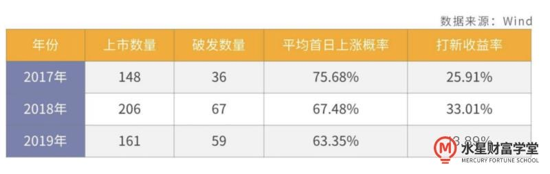

## 打新是什么?

港股打新是什么? 和 A 股打新差不多, 都是在股票市场上认购新上市的股票.

这些股票交易具有以下三个特点,

⼀、收益⾼. 30% 的收益率是常态, 更有冲破 100% 的可能.

⼆、盈利周期短. 每笔资⾦投⼊不超过⼀个⽉就可以获得收益.

三、投⼊成本低. 本⾦单笔交易成本很少有超过 1 万的.

更关键的是, 因为盈利周期很短, 盈利资⾦可以⽴⻢投⼊到下笔交易中重复使⽤

收益有多高呢?

比如去年 7 月上旬在香港上市的思摩尔国际, 是个做电子烟的公司, 开盘当天涨幅 150%;

当时我们社群里有好几个小伙伴中签, 中了一手, 至少就赚 1.9 万港币, 折合人民币 1.7 万左右;

这还只是一只股票, 一手的收益.

那会儿我们打新群里的助教, 一口气中了 10 手, 加上他的操作, 前前后后赚到了 30 万.

再看成本.

港股打新需要的资金量不多, 通常申购一手只需要 5K-1W.

比如火热申购的农夫山泉, 国名级的矿泉水品牌, 是明星上市股了吧, 但申购门槛只要 4343 港元, 成本非常低.

而且一次没打中, 下次还可以用这笔钱继续打, 资金是可以重复使用的.

因为这笔钱可以一直用, 所以打多支新股的额外成本, 基本可以忽略不计.

成本低, 收益高, 港股打新的平均回报率就非常高.

先给大家看一下 2016 年到 2019 年, 港股新股的平均涨幅和收益:

简单说, 哪怕你不做任何策略, 不挑不拣, 每个上市的新股都无脑盲打, 这 5 年的平均年化收益率也在 8%左右.

再看去年

2020 年共有 144 支公司赴港上市, 平均一手中签率 33.04%, 远远超过 A 股的 0.03%. 首日收盘上涨概率 60.42%, 平均涨幅 18.19%, 首日一手累计收益 163414 港元.2020 港股打新年化中签收益率达 70.2%.

那如果跟着我们的老师走, 有策略针对性地打新呢?

低调点说, 年化收益上 20%是很轻松的事.

## 为什么打新能赚钱?

我们先来思考⼀个问题, 为什么公司会上市发⾏股票?

公司上市发⾏股票募集到⼤量资⾦, 主要有 2 个⽤途,

第⼀、进⾏公司扩⼤经营和快速发展.

快速发展期的公司, 通常都会有⼀些好项⽬, 项⽬开展初期需要有⼤量资⾦投⼊, 因此募集资⾦可以投⼊这些项⽬中, 从⽽获得较⾼的回报.

第⼆、可以提⾼公司的知名度, 从⽽吸引更多的投资者.

上市后公司要定期的按照证监会要求公布公司财务状况, 也就是每季度每半年或每年发布的财务报表, 投资者可以通过这些报表来了解公司的经营状况.

如果说财务状况良好, 说明公司整个经营不错, 那就会受到投资者的⻘睐, 对品牌的宣传品牌有很好的⼴告宣传作⽤, 提⾼公司的知名度和信誉度. 那随着公司知名度和信誉度的提升, 上市公司竞争⼒就会更强, ⾃然就能够吸引更多的投资者加⼊.

⽆论如何, 上市都意味着公司会把⼀部分股份拿出来出售给投资者, 让更多的⼈成为股东. 公司⾸次将股份向公众出售的过程, 叫做⾸次公开募股, 这也就是我们经常听到的 IPO, IPO 顺利完成就代表着公司上市成功.

总的来说, 公司上市好处⾮常多, 所以说经营好的公司通常都⾮常愿意上市. 不仅如此, 上市公司能够受到市场和机构的监督, 不太敢有太多猫腻, 从⽽有利于企业更加规范管理和健康发展, 这是国家希望看到的. 因此国家也乐意公司能够上市, 从⽽能够带动经济增⻓, 带动就业率提⾼.

不过刚刚说到想要上市成功, IPO 是⾮常关键的, 如果没有⼈来买股票的话, 那么公司就没办法顺利上市了, 因此为了让公司能够顺利上市, 国家和公司都会给投资者⼀些优惠来吸引⼤家申购新股.

公司⼀般会把新股的发⾏价定得⽐市场预期低, 来吸引更多的⼈购买.

⽐如说, 本地⽣活上市招股时发⾏了以 40 美元每股的价格来出售新股, 100 股起购, 总计发⾏ 1 万股. 那么 40 美元的价格就叫做新股的发⾏价, 如果说市场上的投资者认为, 本地⽣活的股票价值要⾼于 40 美元每股, 那么对⼤家来说 40 美元每股的新股, 相当于买到打折商品, 买到是赚到了, 就会吸引更多的⼈.

更重要的是, 每个 IPO 市场都会出台有利于投资者的保护政策, 吸引⼤家参申购新股.

⽐如说在 A 股市场, 证监会要求公司不得以⾼于 23 倍的市盈率发⾏新股, 这啥意思? 在 A 股市场, 市盈率低于 23 倍, 代表公司普遍便宜, 这个政策能够⼏乎确保申购新股的投资者都能够盈利.

⽐如说港股的证监会同样出台偏向于中⼩投资者的新股分配制度, 简单来说, 就是申购⼀股新股, 公司会尽量的让所有⼈都能够分到⼀⼿, 不会因为有⼈钱多就偏袒谁, 将保证了很多的中⼩投资者能够在打新时分到⼀杯羹, ⽽不是让有钱⼈和⼤型机构抢占了所有赚钱机会.

总之不管是公司也好还是国家也罢, 都会给参与打新的投资⼈提供好处, 这也就是打新股为什么能够去赚钱的原因了.

听到这⾥, ⼤家可能发现, 打新能够赚钱的根本原因和⼤家所熟悉的投资股票赚钱的逻辑是不⼀样的, 投资股票是因为看好这家公司, 认为他之后能够发展的很好, 能够为我们创造收益, 本质上是属于价值投资. 打新呢, 是为了能够让这家公司顺利上市, 政府出台让利, 公司也参与其中, 吸引我们来申购股票, ⼀旦上市成功, 这样的优惠政策就会迅速消失, 所以打新本质上是⼀种套利⾏为, 它是属于投机⽽不是属于投资, 谈到投机⼤家可能会有先⼊为主的观念, 认为投机是不好的. 但打新这种投机⾏为, 如果我们运⽤得当, 其实是能够帮助我们赚不少钱.

## 打新⼀定能赚到钱吗?

从理论分析, 其实打新, 公司让利, 国家也出台优惠政策, 那参与打新的⼈是不是真能⼀定赚到钱?

其实不然.

即使⼤家对整体 IPO 市场乐观, 新股的上市仍然会受到很多其他因素的影响, ⽐如说, 公司丑闻, 或者政府政策变向, 或者上市时卖出新股的⼈太多. 这些都会对股价造成负⾯影响. 严重的话可能导致新股上市后就会跌破它的发⾏价, 这就是破发, 因此并不是所有的新股上市都会上涨.

但是好消息是, 新股破发的⻛险其实并不是很⾼.

我们来看⼀下⼀些数据,

怎么样? 有没有被震惊到? 我们再来看两组数据:

2017 年-2019 年三年间每年港股打新收益:

看到这样的收益, 是不是会⾮常激动能赚这么多钱, 这才是打新的众多优点之⼀, 打新除了收益率⾼, 盈利周期也⾮常短. 投⼊⼀笔资⾦去打新, 中签后⼀个⽉左右就能够盈利回收, 从公司公开招股到上市也就⼀个⽉左右时间. 相⽐于投⼊⼏年⼗⼏年的⻓期投资, 打新的盈利速度简直可以说迅雷不及掩⽿之势.

## 港股打新也有不少风险

其实港股打新也是有风险的.

最大的风险是: 懒惰、怕麻烦.

因为港股打新必须用港币, 所以开卡、入金(给券商打钱)是一个非常繁琐的过程.

尤其去年到现在这段时间, 疫情原因很难去香港, 管制又特别严格, 所以吓退了很多人.

不过正是因为这样的繁琐, 阻碍了绝大多数人, 让不怕麻烦的人有了套利的空间.

你想想, 如果赚钱都那么容易, 哪能轮得到你, 早就沦落到 A 股打新那样, 低于 0.03%了.

赚钱机会从来都是给勤快的人准备的.

不过这个繁琐有老师手把手带, 后面操作顺畅了跟国内 A 股没啥区别.

第二个风险在于港股是有可能破发的.

"破发"是指上市首日收盘价低于你的打新价格;

港股不像 A 股那样只要中签一定大涨.

如果你没看好公司, 或者坚持无脑盲打, 当天破发的概率还是有的, 会导致亏损.

所以为了收益最大化, 不建议盲打.

何况真的要盲打, 也无法保证账户里有足够的资金.

第三个风险, 港股是不设涨跌幅限制的.

这个对操作要求就很大了, 一天涨个 200%都有可能.

但也有可能像教育股那样, 来个黑天鹅事件, 暴跌 80%以上.

最后, 我还想强调一点:

"港股打新"和"炒港股"有很大的区别.

打新比较保守, 一般开盘第一天就拋售了, 如果这个股票涨得特别好, 可以多持有一段时间.,

而炒港股就比较激进了, 全看个人操盘能力, 对自己有信心的话也可以尝试.

对初学者来说, 先把打新弄明白再考虑炒港股吧.

## 如何开启打新⼤业?

打新的市场⾮常多, 除了我们所熟悉的 A 股, ⾹港股市, 台湾股市, 美国股市都是常⻅的打新市场. 我们来如何挑选打新市场呢?

考虑 3 个因素:

⼀、看上市当⽇上涨的概率.

⼆、看中签难度.

三、看⾃⼰有⽆申购新股的资格.

我们挨个来说,

第⼀, ⾸⽇上涨的概率.

A 股上市是 99.99%⾸⽇上涨, 中国台湾新股 90%⾸⽇上涨, 中国⾹港新股 65%⾸⽇上涨, 美股 80%⾸⽇上涨.

第⼆, 中签难度.

公司招股会有很多⼈申购, 但并不是每个⼈都有机会成为股东, 中签就⾮常重要了, 中签概率⼤, 意味着赚钱机会就多, 反之如果⼀年到头都没有⼀次机会, 那就直接弃疗吧.

⽐如⾸⽇上涨概率最⾼的 A 股, 中签概率之低, 数年如⼀⽇只有⼏万分之⼀, 这对投资者来说已是相当不友好了; 港股就不同了, 可是⾮常照顾中⼩投资者的, ⼀⼿的中签率从 1%~100%不等, 平均达 60%. 与 A 股的⼏万分之⼀相⽐, 可以说是新⼿投资界良⼼的扛把⼦. 美股中签, 通常是好股难中烂股易中. 台签中签难度也很⼤, 中签率平均 4%都达不到. 所以如果单看中签⼏率话, ⽐较下来还是港股会更优秀.

第三, 申购新股的资格.

要在股票市场上打新, ⾸先要开个账户, ⽬前除了 A 股国内还能够线上申请港股和美股账户, 台湾就不⾏了, 因为制度原因, ⼤陆居⺠是没法在台湾市场上直接来申购股票. 当然也不是开好账户就能有申购新股资格了. 现有的市场对我们持有市值还是有要求, ⽐如说 A 股市场得先持有 1 万元的股票, 超过 20 天才有资格打新, 这对于⽼⼿没什么影响, 但对于⼩⽩来说持有股票的⻛险是很⾼, 可能还没中签, 这 1 万块钱就已经亏不少, 那可就得不偿失. 除此之外, 港股和美股打新是没有市值要求的, 总的来说只要在 A 股美股, 港股能够开通市场, 就能够有申购新股的资格.

除此之外, 在港股打新还有⼀个 A 股不具备的优势呢, 就是⾹港交易所能够允许对公司炒作股价, 证监所通常是睁只眼闭只眼. 这听起来有些奇怪, 允许炒作股价, 听起来不是什么好事, 确实公司炒作股价有时候会让投资者损失惨重, ⽐如说在 A 股这么做, 是要坐牢的. 但对于打新来说, 是⼀件好事, 新公司当然是希望⾃⼰开⻔红⼀路涨才好, 但是为了防⽌上市下跌的情况, 不少公司还会悄悄地炒⾼股价, 营造⼀种我很好来买我的形象, 俗称炒新.

上市⾸⽇能够快速套利, 听到这⾥是不是觉得好处良多?

## 我为什么看好港股打新的收益?

打新收益好, 已经是一个事实了.

因为, 真的有很多厉害的企业准备 IPO 上市.

我先给你盘盘, 去年的时候, 咱们港股打新的前几批学员都赶上了哪些赚钱的大肉签:

欧康维视生物, 首日涨幅 152.39%;

思摩尔国际, 首日涨幅 150.00%;

康基医疗, 首日涨幅 98.85%;

祖龙娱乐, 首日涨幅 75%;

沛嘉医疗, 首日涨幅 67.97%;

快手, 首日涨幅 170.09%......

当然还有米国的神助攻, 2020 年 12 月 19 日米国总统特不靠谱签署了《外国公司问责法案》, 未来外国公司如连续 3 年未能通过米国会计监督委员会的审计, 将被禁止在米国上市

这意味未来将有很多中国公司被迫离开米国, 不少中概股也在积极筹备回港交所二次上市, 于此同时, 有些原本打算赴美上市的公司也将重新考量上市地, 这些都将为之后的港股市场增添活力.

## 回顾

内容就到这⾥了, 再来带⼤家回顾⼀遍,

今天我们认识了⼀个收益⾼、盈利周期短, 本⾦要求少的赚钱⼩妙招, 那就是打新.

申请购买上市公司的股票, 申购成功, 买到股票叫做中签, 公司上市发⾏股票可以投资, ⽤于扩⼤公司的经营规模, 还能够提⾼公司的知名度, 来吸引更多的投资者来参与, 因此很多经营好的公司是愿意上市, 国家也乐意公司上市, 是因为公司的上市带动资本市场的发展, 带动经济增⻓和就业率提升.

为了能够顺利上市, 公司会把新股的发⾏价定的⽐市场预期的低, 政策会给投资者⼀些优惠, 吸引⼤家来申购新股. 因此打新本质上是⼀种套利⾏为, 属于投机, 不是投资. 常⻅的打新市场有 A 股, 中国⾹港股市、中国台湾股市、美国股市, 根据⾸⽇上涨的概率、中签难度、申购新股资格, 这三项可以挑选出最适合我们开始打新⼤业的战场——中国⾹港股市.

最后我们还知道了港股市场允许公司炒新, 这对我们打新也是⼀个优势了.

经过今天的学习, ⼤家是否觉着港股之优秀, 让⼈⾮常激动⼈⼼? 不过不急, 先系统的学习⼀下再实操, 不然亏起来爹妈不认哈
