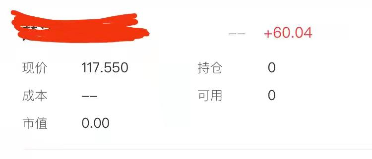
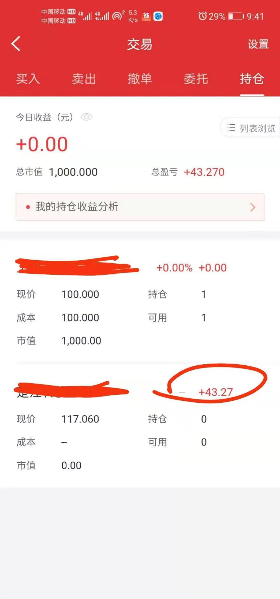
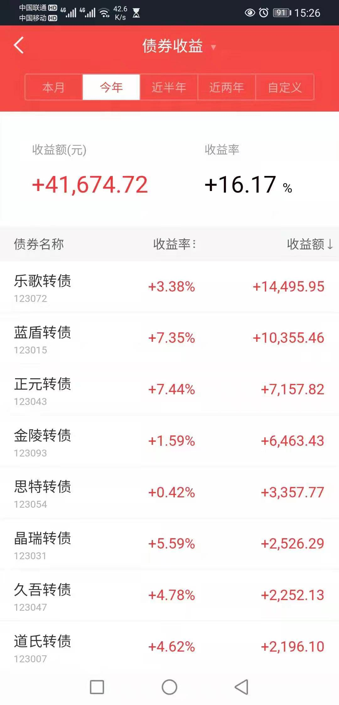

打新债班班是不是正式说过了呀?

再简单聊聊打新债吧

为什么分享打新债呢?

因为它投入门槛低、中签率相对低、且行情好的情况下收益率也相对更高

在开始今天的分享前, 班班给大家讲个小故事

"股市起起落落, 作为新手, 不敢买股票, 其他产品收益又不高, 我本金少, 1 万放银行 1 年才赚 200 块的利息, 心里每天都很想理财, 但一想到这个收益率, 瞬间感觉没什么动力了."

这是班班带过的小白营同学发来这样一段话, 描述自己迟迟不理财的心路历程

作为班班, 十分理解

不懂--不敢下手

能下手的利率低--没动力

胡乱下手的, 分分钟亏本--不如不理

那么, 有没有本金投入少、一次性收益高、即使亏损一点也能承受的"便宜"可以捡呢?

那就是可转债

这些转债不管盈利多少都是红的, 班班自打新以来在可转债上从来都没有亏过钱哦

持有天数 20 天左右就可以有几十到几百不等的收益, 每次仅仅是 1000 块对应的收益, 就是说, 20 天左右的时间, 你的 1000 块多的时候可以赚大几百块, 少的时候可以赚几十块

这收益率不低吧? 是不是比放银行和余额宝收益高多了, 最主要的是, 风险低

为啥这玩意儿又保本又赚钱?

真相是, 班班不敢懈怠, 专门请了好几顿大餐向熟悉可转债投资的"砖家"进行咨询

终于, 今天可以把一部分的投资方法分享给泥萌了, 是不是很开心?

首先承认个事实, 这名儿, 取得忒失败.(是的, 恐怕和"国债逆回购"这等不知所云的投资品, 不相上下)

可转债, 全称"可转换公司债券", 是指在一定时间内, 可按照特定的转股价格转换为指定股票的债券.

这就是它的定义......

班班用"人话"跟你说下前因后果:

第一, 公司经常缺钱, 你知道吧?

第二, 公司缺钱, 可以向公众借钱(也就是发"债券"), 你知道吧?

第三, 公司发了债券, 是要还钱的, 你知道吧?

辣么, 问题来了!

公司不想还钱, 咋办呢?

很简单: 把债主, 变成自己人(股东)呗!

怎么变呢?

只要这些"欠条儿"(债券), 变成股票, 那原来的债主, 不就变成了股东, 不就是自己人了吗?

所以, 敲重点!

对于公司来说, 发行可转债, 可以以便宜的方式, 向大众筹集资金(发了欠条, 又不想欠债还钱), 诱惑大大的.

那么, 对于投资者来说呢?

也是诱惑大大的.

其一, 投资者可以拿它当债券, 一直持有到期, 等公司还本付息

或者, 投资者可以转换成股票, 等公司股价上涨, 卖给下家, 赚取差价

这也是为什么, 总说可转债:"下有保底, 上不封顶"

下有保底, 意思是: 如果股市行情不好, 就持债到期收取本金和利息

上不封顶, 意思是: 如果股市行情变好, 就可以转换成股票, 享受股票价格上涨的高额收益

感觉是双赢?

班班的回答是: 是的, 但操作要稳.

跑题了我们今天主题是套利啊哈哈

这个世界永远都有空子的, 相信有过投资经验的人都知道投资市场有一个词叫"套利"

套利不是随时可套但是机会来了就可以套

如果我们不了解没有学过, 就根本不可能抓紧这样的机会

我给大家举例一个我之前的套利故事

还是和可转债相关的, 有一只可转债是深圳市场发行的, 大佬们和我对它的上市预估价都在 117-120 这一带

结果上市当天集合竟价第一分钟也就是 9: 15 分时, 这只转债是 110 元, 过了几秒变成了 102 元

如果你是中签了这只转债券, 你准备如何做呢

一般都是卖掉对吧

你想 110 卖还是 102 卖

或者是想着 130 卖

如果没有投资逻辑不知道会有 120 左右的区间价, 在 9: 15-9: 25 这十分钟时间你就是慌乱的

如果你出 110, 那好, 9: 25 分你直接被成交得 1100 元

你的收益率是 10%

1000 元赚了 100 元

但是大家知道最后这只转债当天涨到了多少吗

117.8 元左右, 也就是说可以 1000 元赚到 178 元

而不是只赚 100 元

我们是如何去套利的呢

当然看到 110 变 102 时我就知道, 有可能低开, 我预估 117, 如果能低开到 110, 那么我基本一手会有 70 元差价, 如果我在 110 元直接买入 10 手 11000 元, 我当天就可以获得 700 元

事实就是这样的

还有一波小粉丝也跟着买了, 一大堆人都买了

套利不是乱套是要有逻辑的

只买一手试水的人

行动有些晚的人

技术的东西学起来上手快的, 思维的东西, 如果没开窍, 人会一直停留在一个水平里

报名实操课的同学, 班班手把手教你们方法跟着班班

我提一下, 这种套利方法准确率高达 95%, 近最大化套利最高点

最后再酸你们一把
