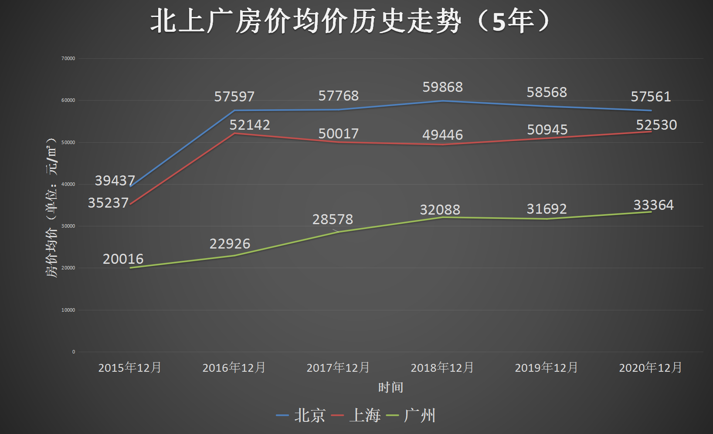
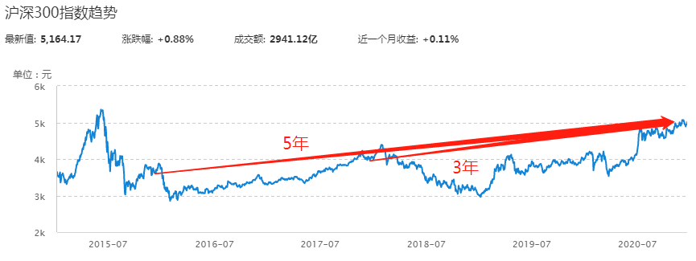
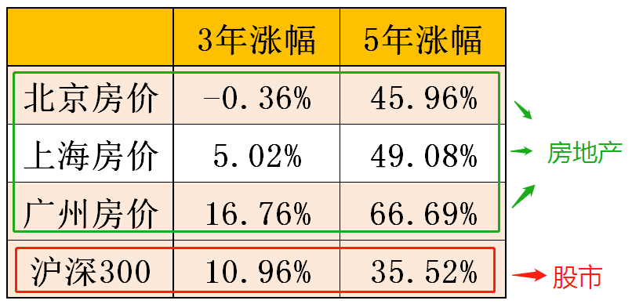
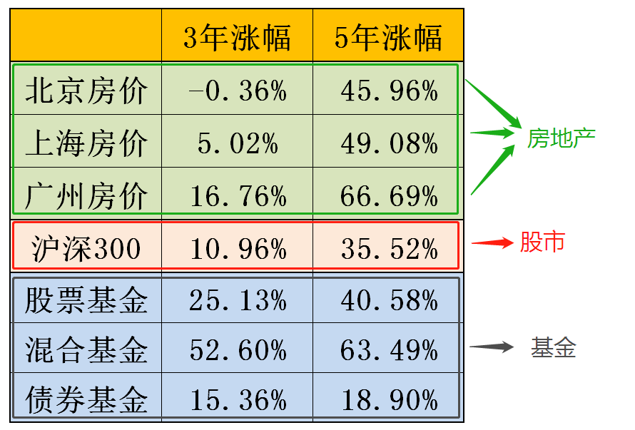
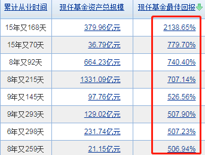

乍⼀听这个主题, 是不是有点反直觉?

房地产, 那可是中国⼈的"暴富神器"啊, 多少⼈靠着买房, 已经咸⻥翻身, 成了富翁富婆~

班班先来问个问题吧:

过去三年⾥, 买房、买股票、买基⾦, 哪个更赚钱?⼤家来排个顺序~

班班带了这么多班下来, 得到最多的答案是: 房产 > 股票 > 基⾦

少部分股⺠会说: 股票 > 房产 > 基⾦

总之不管怎么排, ⼤部分⼈都觉得基⾦应该排倒数第⼀.

理由很简单, 房产和股票动不动就价格翻倍, 但是基⾦收益呢, 很多⼈觉得能赚个 20%~30%就不错了.

为了搞清楚这个问题, 班班专⻔去做了做功课, 今天给⼤家看看结论, 可能会让很多⼈⼤跌眼镜~

都说⼀线城市的房⼦最值钱, 咱们就来看北上⼴的房价, 过去⼏年⾥是什么趋势, 到底能赚多少钱.

班班统计了北上⼴房价的均价⾛势, 已经做成了折线图. 数据都可以在"安居客"⽹站直接查到哦.

2015 年 12 ⽉—2020 年 12 ⽉, 5 年时间, 北京均价涨了 45.96%, 上海涨了 49.08%, ⼴州涨了 66.69%

5 年涨幅还算正常, 咱们再看⼀下 3 年涨幅:

2017 年 12 ⽉—2020 年 12 ⽉, 3 年时间, 北京均价跌了 0.36%, 上海涨了 5.02%, ⼴州涨了 16.76%

看 3 年, 涨幅严重缩⽔了! 最近 3 年房价调控, 住房不炒确实有效果~

咱们把这组数据留着, ⼀会跟股票、基⾦放在⼀起⽐⼀⽐~

接下来咱们再看股票.

股市⾥有"七亏两平⼀赚"的说法, 也就是说 70%的散户都是亏钱的. 咱们不看亏得最惨的, 也不看赚得最⾼的. 咱们就看平均⽔平.

怎么看呢? 咱们看"沪深 300".

沪深 300, 其实就是在国内市场挑了排名靠前的 300 只股票, 相当于股票界的"尖⼦⽣". 很多股⺠⽤它代表股市的总体⽔平.

咱们把沪深 300 拎出来看⼀下, 历史涨幅有多⾼, 能不能⽐得过房地产.

和房地产的统计同⼀段时期, 沪深 300 统计出来是这样:

3 年涨了 10.96%, 5 年涨了 35.52%~

和房地产放在⼀起对⽐⼀下:

5 年涨幅不如房地产. 但是, 3 年涨幅仅次于⼴州房价涨幅, ⽐北京、上海都⾼. 可以看出, 最近 3 年, 股市的表现嘛, 总体上是好于房地产的.

很多⼈专业分析都说, 房地产的⻩⾦⼗年结束了, 现在已经进⼊了权益类市场(股票、股票基⾦等)的⻩⾦⼗年.

这个说法呢, 咱们从数据上也能侧⾯印证.

数据留着, 等把基⾦分析完了, 我们全部放在⼀起对⽐.

最后要看基⾦啦.

很多⼈瞧不起基⾦的收益, 觉得不如玩股票刺激. 事实是什么样呢? 班班继续⽤数据说话~

班班扒了⼀遍券商的研究报告, 和房地产、股票的统计同⼀段时期, 基⾦数据如下:

看到了吗!5 年涨幅这⼀栏, 股票基⾦、混合基⾦的涨幅分别是 40.58%和 63.49%, ⼏乎跟房地产不相上下! 同样远超股票!

3 年涨幅呢, 股票基⾦ 25.13%, 混合基⾦ 52.60%, 全部跑赢北上⼴房价涨幅, 也跑赢股市平均⽔平(沪深 300)~

哪怕是最保守的债券基⾦, 3 年涨幅都有 15.36%, 超过沪深 300 涨幅, 超过北京、上海房价涨幅~ 最近 3 年, 买房不慎的话, 那还不如持有债券基⾦~

班班拿到数据的时候, 感觉也是认知被颠覆了. 有时候凭感觉是很不准的, 数据⾯前真相⼀⽬了然.

房地产、股市、基⾦放在⼀起对⽐, 基⾦完胜!!

可是为什么⼤家的感觉和实际有这么⼤的出⼊呢?

班班总结了三个原因:

⾸先, 房价已经涨了⼗多年了, ⼤家都已经形成思维惯性了, 感觉房价永远上涨.

但是, 天底下绝对不可能有永远上涨的投资品的.

⻛⽔轮流转, 投资品之间会有"轮动效应", 不同时期, 会轮到不同的投资品种"⼤放异彩", 主⻆⼀直在变.

其次, 对于股市, ⼤家都喜欢听"神话", 某某某靠炒股财产翻倍, ⼀夜暴富, 年⼊⼏⼗万, 等等.

很多⼈听了就觉得, ⾃⼰也可以.

⼤部分股⺠都觉得, ⾃⼰⽐其他选⼿更聪明, 收益会在中上游⽔平. 这个专业说法叫"优于平均效应".

曾经有个针对司机的⼼理学调查, 问题是: 你是不是⼀个⽐平常⼈更好的司机?

90%的司机都觉得, ⾃⼰⽐平常⼈的驾驶技术更好. 但我们知道这是不可能的, 优于平均的只可能是前 50%的司机, 不可能达到 90%~

90%这个统计结果说明, 绝⼤多数⼈都有错觉, 感觉⾃⼰优于平均⽔平. 同样, 股⺠也是如此.

觉得⾃⼰能够笑傲股市的⼈很多, 但结果就是"七亏两平⼀赚", 七成的⼈是亏的.

哪怕是达到平均⽔平, 咱们前⾯分析过了, 沪深 300 可以代表平均收益⽔平, 5 年也不过就是涨了 35.52%

这个平均⽔平, 恐怕低于很多⼈对股市的期待吧.

那么为什么股票基⾦、混合基⾦的上涨, 就能达到那么⾼呢?

这是因为, 股票基⾦、混合基⾦都是专业的管理⼈在运作, ⽽且有专业的研究团队, 天天都在研究选哪只股票, 什么价位买, 等等.

⼈家是⾏家出身, 持证上岗, ⽽且是团体作战, 所以能远远跑赢市场平均.⼤机构跟⼩散户们⽐, ⾼下⽴⻅.

买股票的时候, 你跟这帮机构投资者是对⼿. 买基⾦的时候, 相当于你雇他们帮你投, 你跟他们是队友. 这就是区别.

所以, 班班更加建议⼤家选择基⾦投资.

尤其是股票基⾦, 还有绝⼤多数混合基⾦, 其实成分⾥都是股票为主, 相当于间接投资了股市, 既能赚到股市的钱, ⼜不⽤⼀个⼈在股市独⾃闯荡, 省⼼, 还没少赚, 多好~

收益⽔平咱们前⾯也看到了, 5 年时间, 股票基⾦ 40.58%, 混合基⾦ 63.49%, 相当不错了.

还有些⼩伙伴可能想问: 为什么我之前买的股票基⾦/混合基⾦, 收益都没达到这么多呢?

其实很简单, 回想⼀下, ⾃⼰⻓期持有了吗?

这就是你感觉的收益⽔平和实际有出⼊的第三个原因, 那就是, ⼤部分⼈的投资期限太短.

混合基⾦ 5 年平均赚 63.49%没错, 但前提是能够拿住 5 年. 有多少⼈可以拿住 5 年不松⼿呢? 很少很少.

投资的世界, 想赚快钱的⼈太太太太多了!

快钱很难赚, 慢钱很好赚, 但是⼤家都缺少赚慢钱的耐⼼.

曾经有⼈问巴菲特: 你公开的投资体系那么简单, 为什么你成了世界上第⼆富有的⼈, 但是别⼈却没有复制你的⽅法赚到钱呢?

巴菲特的回答很简单: 因为没有⼈希望慢慢变富.

其实投资的⽅法很简单, 真的, ⼤家拿出两三个⽉集中学习⼀下, 很容易就能掌握⼀套体系.

⽐如前⾯提到的股票基⾦、混合基⾦, 其实你学会了筛选以后, 很多基⾦会超出你的预期的.

有些厉害的基⾦, 历史回报已经超过了 500%, 有的混合基⾦的回报甚⾄到了 2000%+

实操课会教给⼤家⼀套体系, 怎么筛选, 怎么建组合, 怎么买⼊卖出, 都会讲到.

等你本领学到了, 实操开始了, 就是坚持最"笨"的⽅式, ⻓期持有, 就⾏了.

基⾦没有多少花样, ⽐投股票、投房地产简单太多了.

投资真的没必要迎难⽽上, 并不是难度越⼤赚钱越多, 简单的⽅式照样可以躺赢.

不要为了炒股硬给⾃⼰上难度, 咱们的⽬标是赚钱, 基⾦本身就可以做到, ⽽且收益也不输股票.

好啦, 这次就先分享到这⾥了. 最后⼀起来回顾⼀下吧.

别的班我说了不算, 但是咱班同学可要记住这张图:

基⾦的收益, 并不输于股票和⼀线房地产, 甚⾄可以说, 最近 3 年, 选择基⾦具有更⼤的优势.

这个结果之所以有些反直觉, 主要有三个原因:

⾸先, 房价不可能永远上涨, 任何投资品都不可能.⻛⽔总是轮流转, 房地产的⻩⾦⼗年之后, 是权益类市场(股市、股票基⾦)的⻩⾦⼗年.

其次, 希望⼤家不要受到"优于平均效应"的⼲扰, 总感觉⾃⼰⽐其他股⺠更出⾊, 因为⼏乎所有股⺠都会这么想. 股市⾥七亏两平⼀赚, 赚钱的股⺠真的不多, ⽽且平均收益⽔平不如股票基⾦、混合基⾦⾼.

最后, 基⾦赚钱的奥秘其实很简单, 就是⻓期持有. 可惜没有⼈愿意慢慢变富, 所以基⾦可以达到很⾼的收益, 但是赚快钱的⼈达不到.

好好学习投资⾃⼰, 并且保持耐⼼吧, ⼩可爱们!

房地产政策总是"房"不胜防, 股市能跌得让你刻"股"铭⼼. 不如选择基⾦吧, 未来⼗年"基"不可失呀!

本次分享到此结束.
