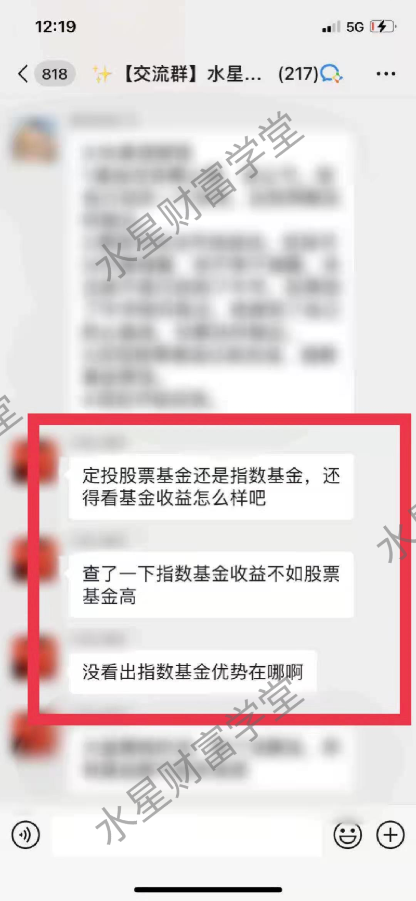
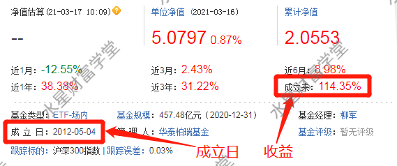
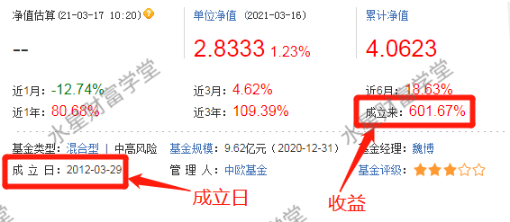
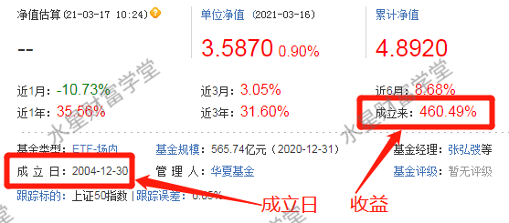
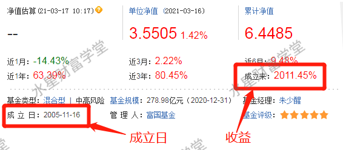
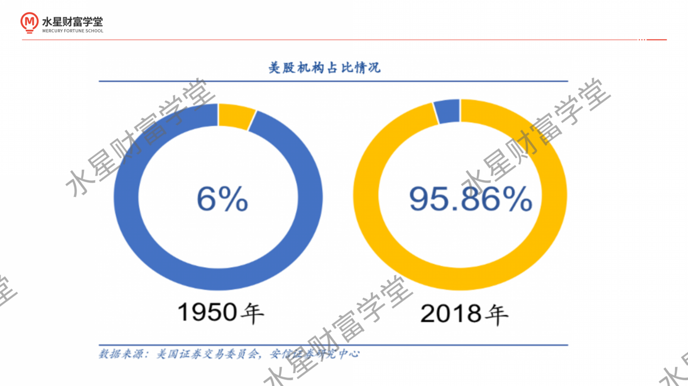
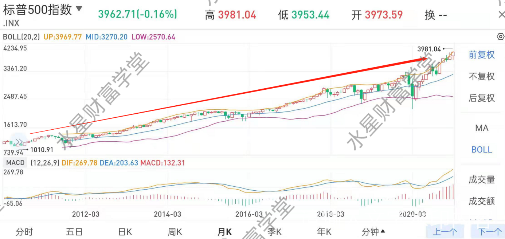
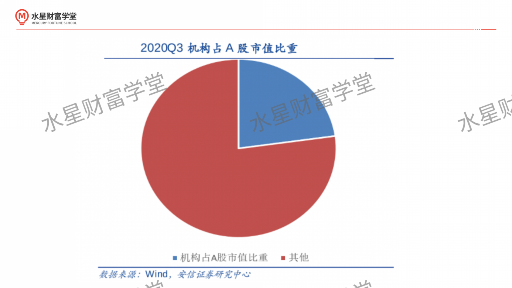
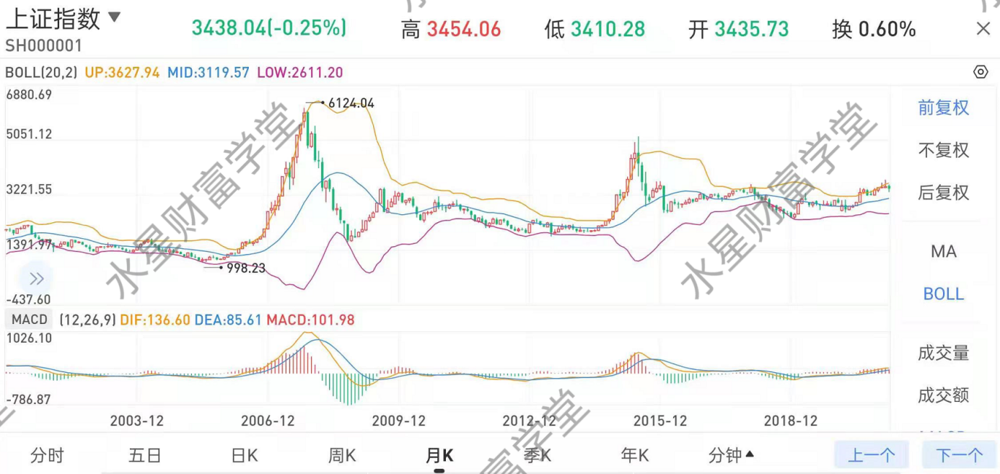

为了避免有些⼩伙伴遗漏知识点, 我们先简单总结⼀下两种基⾦是啥意思:

主动型基⾦, 就是基⾦经理主动选择投资品, 进⾏各种各样的投资, ⽬的是跑赢市场, 超越市场平均收益.

指数基⾦, 也叫被动型基⾦, 就是基⾦经理不主动了, 改成被动复制了, 指数⾥有啥成分, 基⾦经理就原样照抄, 不要最⾼收益, 也不要最低收益, 保持平均⽔平就⾏.(指数可以代表市场平均⽔平)

⼀般讲到这⾥, 接下来都会是讲巴菲特的 10 年赌约, 巴菲特⽤指数基⾦战胜了主动型基⾦, 巴拉巴拉. 然后就会有个结论:⻓期来看, 指数是没法战胜的, 基⾦经理想要⻓期战胜市场⼏乎不可能.

这个结论有没有道理呢? 很有道理. 但是如果你在国内投资基⾦的话, 可能会⽐较迷惑. 你会发现, 国内很多主动型基⾦, ⻓期来看确实已经跑赢指数了, ⽽且有些基⾦可以说是远远跑赢指数, 收益甩指数基⾦⼋条街.

在班班过去带的班级⾥, 就有同学提过这⽅⾯的问题.

这位同学⾮常优秀, 应该是之前⾃⼰投资过基⾦, 才能提出这个层⾯的问题. 不过有个⼩错误哈, 指数基⾦其实属于股票基⾦的⼀种, 只不过分类⽅式不⼀样.

指数基⾦是按照班班开头说的基⾦经理主动、被动来分类的. 被动选择, 照抄指数的成分, 就是指数基⾦.

股票基⾦是按照基⾦成分是什么来分类的, 意思是基⾦经理选择的成分 80%以上是股票.

不管他是主动选的, 还是照抄的指数, 只要满⾜这个 80%⽐例是股票, 就算股票基⾦.

截图⾥这位同学想问的应该是, 那种基⾦经理主动选择的股票基⾦(主动型), 去和指数基⾦⽐收益, 竟然把指数基⾦⽐下去了.

说好的指数没法战胜呢? 说好的基⾦经理跑不赢指数呢? 怎么不灵了呢?

没投过基⾦的同学可能不了解, 没关系, 班班给⼤家看两组例⼦就知道了:(提前说好, 下⾯班班会提到具体的基⾦名字, 是随便拎出来的, 为了⽅便⼤家理解知识点, 只作为教学案例哦, 不代表投资建议!)

上⾯这只是华泰柏瑞沪深 300ETF, 是⼀只指数基⾦, 跟踪的是沪深 300 指数. 我们着重看看它的收益. 它是 2012 年 5 ⽉成⽴的, 绝对算是⻓期了, 成⽴以来的收益是 114%.

上⾯这只是中欧盛世成⻓混合, 是⼀只主动型基⾦.2012 年 3 ⽉成⽴, 和上⾯的指数基⾦⼏乎同时成⽴, 前脚后脚. 它成⽴以来的收益是 601%.

⼏乎同样的时间跨度, 指数基⾦ 114%, 主动型 601%, 主动的基⾦经理肯定是跑赢了沪深 300 指数.

再来看⼀组:

这只是华夏上证 50ETF, 是⼀只指数基⾦, 跟踪的是上证 50 指数. 它是 2004 年底成⽴的, 绝对算⻓期. 成⽴以来的收益 460%, 挺⾼了吧.

这只是富国天惠成⻓混合, 是⼀只主动型基⾦, 2005 年底成⽴, ⽐华夏上证 50ETF 晚了⼀年. 它成⽴以来的收益是 2011%!!!

本⾦翻 20 倍还要多!!! 基⾦经理远远跑赢上证 50 指数!!!

咦, 说好的 10 年赌约, 说好的⻓期来看指数⽆法战胜, 到了我们这⾥怎么不灵了呢?⼤家先简单猜⼀下可能的原因是什么.

班班来揭晓答案了吧

这是我国股市的散户太多导致的. 估计有⼩伙伴想问, 我们⼀直在说基⾦的事⼉, 怎么就和股市的散户有关了? 班班仔细说说哈~

专业的基⾦经理们, 管理着庞⼤的资⾦规模(也就是咱们投资者的钱哈), 去到股市⾥投资赚钱, 赚到钱以后, 回来再分给我们.

那么问题就很清楚了, 咱们赚不赚钱, 赚多少钱, 是跟基⾦经理投资股票的⽔平直接挂钩的.

⼤家可能都有所⽿闻, 股市⾥⼤部分⼈都是不赚钱的. 那么凭什么基⾦经理进去了, 就能赚钱呢?

这是因为, ⼤家说的⼤部分⼈不赚钱, 说的都是冲到股市⾥单打独⽃的⼩散户哈. 基⾦经理可不是散户!

在股市中参与投资的, ⼀⽅⾯是个⼈, 叫"个⼈投资者", 俗称"散户"; 另⼀⽅⾯还有很多机构, 叫"机构投资者", 通常就简称"机构".

"个⼈"都知道什么意思, 班班说⼏个机构投资者的例⼦.

⽐如我们国家的社保基⾦, 社保的钱是要拿去投资增值的.

再⽐如基⾦公司也是机构, ⼤家买基⾦就相当于把钱交给机构管理, 机构再去股市⾥配置股票.

最后再⽐如, 很多保险公司都有⾃⼰的资产管理机构, 有专⻔的投资团队, 这也属于机构投资者.

我们⽔星财富学堂的⺟公司⾦斧⼦, 有运营⾃⼰的私募基⾦, ⼏百亿的资⾦规模哟, 所以其实也属于机构投资者.

两种投资者最⼤的不同, 在于专业度. 散户⼤部分都不够专业, 投资⾮常情绪化, ⽽且情绪在市场⾥会被放⼤, ⼀涨就嗨到⻜起来, ⼀跌就怕, 甚⾄睡觉都睡不⾹了. 追涨杀跌其实就是情绪化交易.

但是机构不⼀样. 机构还是⽐较专业的, 毕竟管的都是⼤钱, 操作会⾮常冷静和谨慎, 不然操作失误让买基⾦的⼈吃亏了, 可少不了去挂横幅要钱, 国家的证监会也会盯上. 所以机构不会像散户那么随⼼所欲的买卖.

⽽且机构有专⻔的团队负责, 前⾯有经理下场排兵布阵, 后⾯还有专业的研究团队⽀持他. 经理任何⼀次买⼊、卖出都要经过深思熟虑, 不会轻举妄动.

所以, 从专业性的⻆度, 机构是⾼过散户的. 两者 PK, 结果通常是机构薅散户的⽺⽑, 薅到秃.

散户经常吐槽炒股不赚钱, 其实亏的钱很⼤⽐例被机构投资者赚⾛了. 散户越多, 机构越容易薅到好处.

那么散户有多少呢?

不同国家的市场, 参与者不⼀样. 也就是说散户和机构的占⽐不⼀样. 这就导致了不同市场的表现相差很多.

⽐如说美国市场, 是公认的成熟市场. 成熟市场的⼀个典型的特征, 就是机构投资者占绝⼤多数. 根据券商研究报告, 2018 年的时候, 美股的机构投资者就已经超过 95%了.

因为机构投资者⾮常冷静, 不会经常受情绪影响导致股市⼤起⼤落, 所以美股表现⾮常稳.

⽐如咱们看⼀下, 巴菲特 10 年赌约⾥选择指数基⾦所跟踪的"标普 500"指数, 过去 10 年的历史表现是这样的:

放在⻓期看, 基本是⼀条直线上涨的.

因为在美国市场⾥, 每⼀家机构的交⼿⽅, 基本都是其他机构, 聪明的和聪明的玩, 很难说谁玩过谁. 今年你跑赢指数, 我跑输; 明年我跑赢指数, 你跑输.

结果就是, 拉⻓时间⼀看, 谁也没法⼀直跑赢指数, 能达到和指数同样的收益, 就已经⾮常⾮常难得啦.

这就是为什么, 巴菲特就认这个理⼉, 他说指数⽆法战胜. 因为他⽣活在美国呢.

但是中国就不⼀样了.⼤陆市场还很年轻, 属于不成熟的市场. 典型特征就是散户占多数. 下⾯这张图是机构研究报告⾥的, 2020 年 Q3(第三季度)统计出来的, 机构占 A 股市值⽐重.(A 股就是⼤陆股市)

蓝⾊的部分是机构占⽐. 看到了吗?⾮常⾮常少⼀部分. A 股还是散户占⼤头.

散户们情绪⼀上来, 那可就没个准了, 反映到股市表现上, 就是⼤起⼤落. 这也就是为什么, 在国内炒股的⼈, 经常碰上⼤涨⼤跌.

⼀起来看⼀下 A 股"⼤盘"的表现吧:

看⾛势很直观, 起起伏伏, 多少股⺠在这条曲线⾥浮沉!

但是注意, A 股的机构占⽐少, 不代表机构不聪明啊. 机构再少, 和散户 PK 那还是⼩菜⼀碟.

这就是为什么中国⼈都有种直观感受, 就是股市⾥⼤部分⼈都不赚钱. 因为⼤部分⼈进去孤军奋战, ⽃不过机构啊……

散户以为⾃⼰⽜ X 的像⽼⻁, 没想到机构是武松, 哈哈~

恰恰因为散户太多, 给了我们国家的机构太多机会, 可以薅散户们的⽺⽑, 赚取超额收益.

这就能解释, 为什么国内主动型基⾦这么给⼒了. 因为主动型基⾦的基⾦经理, 是代表基⾦公司、作为机构参与投资. 咱们花钱买了主动型基⾦, 让基⾦经理主动到股市⾥布局, 有很多机会赚取超额收益, 跑赢指数.

这就是买基和买股的本质区别, 买基是跟着机构赚钱, 站队⽅⾯就有优势; 买股是作为⼩散户赚钱, 和机构是对着⼲的, ⼤部分⼈不占优势.

到这⾥, 估计⼤部分同学都懂了: 哦, 原来指数⽆法战胜是针对美国市场来说的, 在中国市场应该买主动型基⾦.

那么. 指数基⾦是不是就扔了不管了呢? 也不是, 班班的建议是, 主动基⾦要配, 指数基⾦也要配.

为什么指数基⾦在国内跑输了, 但是也要配呢? 班班解释⼀下:

相信经过前⾯的分析, ⼤家基本理解了, 主动型跑赢了, 主要是占了 A 股市场不成熟、散户多的便宜.

短时间内, 保守来说 3~5 年吧, 散户仍然是主导, 主动型基⾦还是很有机会赚更多钱的.

但是哦, A 股不成熟, 不可能永远不成熟, 它也是要向成熟发展的嘛.⻓期来看, 机构投资者的占⽐⼀直在上升, 未来也会⼀直上升.

等到市场成熟, 投资者都觉醒了, 都选择跟在机构后⾯⼀起赚钱了, 机构投资者占⽐绝⼤多数了, 那时候, 主动型基⾦也就像在美国⼀样, 没有什么获取超额收益的机会了. 跑赢指数会越来越难.

划重点: 主动型基⾦跑赢指数, 三五年没问题, 未来会越来越难~

咱们把眼光放的⾜够⻓远, 未来的王者, 仍然会是指数基⾦, 成为像美国现在那样.

所以, 班班给⼤家的建议是: 主动型基⾦和指数基⾦, 都配置⽐较好.

要想未来实现收益的指数型、爆炸式增⻓, 必须给够指数基⾦⾜够的利滚利时间. 所以指数基⾦的配置必须要早, 不能因为主动型基⾦临时性的优势就不配置指数基⾦了.

总结起来就⼀句话: 主动型是三五年的优势, 指数型是⼗年、⼆⼗年甚⾄是⼀辈⼦的好处, 咱们都配置, 都要~

顺带说⼀下, 咱们的实操课⾥⾯, 不会只讲某⼀类. 进阶课主要讲解债券基⾦、指数基⾦, 会精讲指数基⾦的筛选和定投.⾼阶课会进⼀步讲⼀些进攻性⽐较强的指数基⾦, 同时会讲如何筛选优质的主动型基⾦.

其实分享到这⾥, 关于主动型基⾦和被动型基⾦的选择就讲完了. 不过班班还想给⼤家拓展⼀下知识⾯⼉:

从美股的现在, 可以看出 A 股的未来. 未来的市场肯定是由机构投资者主导的, 散户想赚钱, 最合理的姿势是跟着机构⼀起赚钱, ⽽不是和机构博弈.

美股发展 200 多年了, 美国⼈从最开始绝⼤多数⼈⾃⼰炒股, 到现在都跑去让机构"代理", 不是没有道理的. A 股发展还不到 50 年, ⼤部分投资者还没有意识到这个道理, ⼤家及时认清局势, 不要做"最后⼀个聪明⼈".

这也是为什么, 班班建议⼤家从基⾦开始, 因为买基⾦的时候, 你是跟着机构投资者⼀起赚钱的, 机构考虑的远⽐散户⾃⼰考虑的要更多, 更理性.

⽽且很多⼩伙伴应该能够感觉到, ⾃⼰从⼊群时对基⾦什么都不懂的⼩⽩, 到现在知道了基⾦是什么, 知道了主动型、指数型, 知道了定投操作, 已经有了⾮常⼤的进步.⼏天的时间就⾜以让⼀个⼈获得思维的升级.

这就是投资⾃⼰的⼒量, 学习就是投资⾃⼰. 巴菲特曾经说过⼀句话, 班班特别认可. 他说: 世界上最好的投资是投资⾃⼰.

你会发现, 当初⼊群花的报名费, 只是个位数, 但是你收获的远远⽐这个要多. 可惜绝⼤多数⼈是不愿意做这件事的, 因为看到要花钱, 还不如省下来买俩包⼦, 所以就放弃了学习.

省钱买包⼦的⼈得到的只有俩包⼦, 吃了就没了; 但是咱们花钱投资⾃⼰的同学, 得到的是可以⼀辈⼦反复⽤的知识. 这不是表⾯上⼏块钱的问题, 背后是穷富思维的本质区别.

还有⼈不学习, 不投资⾃⼰, 总是说⾃⼰没时间. 但是咱们得意识到, 投资⾃⼰其实也是有复利效果的, 今天多花 1 个⼩时的时间学习, 短期内未必能看到差别, 但是未来你会感谢这 1 个⼩时的学习. 运⽤这 1 个⼩时学到的知识, 可能让你成功跃迁, 省出了⼀个⽉, 甚⾄⼀年的时间, 让你去做更多⾃⼰想做的事.

学习是要花钱的, 也是要花时间的, 都是反⼈性的事情, 所以很多⼈不愿意做. 但是我们要记得, 今天你不理财, 明天可就轮到财不理你了!

其实学习投资理财这件事, 就是课程⾥讲过的管道思维, 就是⽤空余时间给⾃⼰修⼀条输⽔管道, ⼀开始你⽐别⼈多付出⼀些时间, ⽐不学习的⼈更忙更累了, 但是管道建好以后就不⽤那么累啦.

有能⼒修管道的⼈很多, 但是真正付诸⾏动的⼈很少. 所以, 成功路上并不拥挤, 就看我们能坚持到哪⼀步了

投资机会转瞬即逝, ⼈⽣机会也是如此, 能否把握住就看⼤家⾃⼰的选择~

最后提醒⼀下: 本次分享中提到的具体基⾦, 只是为了教学, 不作为投资建议.⼤家可不要看到具体的名字, 就去搜索买⼊了, 那班班可负责不了哈. 先学习再投资, 实操功夫学到家, 再考虑上战场呀.

本次分享就到这⾥了, 恭喜跟着班班学完分享内容的各位⼩伙伴, 在理财学习之路上⼜前进了⼀步!
