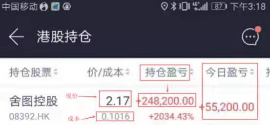
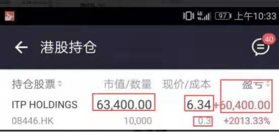
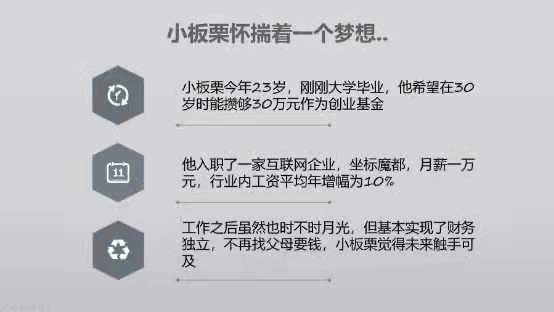
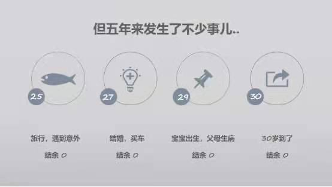

今晚我们来量化⼀下职场与学习.

⼤家知不知道"卖命"这个词语, 有没有深⼊地思考过这个词语的意思呢?

虽然我们都说⽣命⽆价, 但是每天我们上班⼯作本质上就是在出售我们⽣命的若⼲分之⼀.

然后⽤⼯资就能反推出我们"命"的"市价", ⼤家可以算算其实我们的"卖价"都不怎么⾼.

虽然很残酷, 但是你要知道, 时间就是我们⽣命的若⼲分之⼀.

所以, 别轻易的把时间卖掉, 但是反过来说我们花钱去买别⼈的时间某种意义上就是延⻓了我们⾃⼰的⽣命哦!

⽐如⼀个作者花费⼀⽣写了⼀部巨著, 我们花 100 元买了他的书回来看, 其实某种意义上我们是买到了他⼀⽣的⽣命成果, 然后按在了我们的⼤脑⾥其实就是变相的给我们⾃⼰"续命"

这就是学习的意义, 学习的意义就是"续命", 当然有些⼈也说成是"站在巨⼈的肩膀上"其实本质上是⼀样的.

所以下⼀代⼈⼀般都会⽐上⼀代优秀就是因为上⼀代给下⼀代做了"续命", 这也是⼈类进化的动⼒, 所以, 你看, 学习是多么重要.

从价值上来看, 时间是远远⼤于⾦钱的, 花钱买别⼈的时间是⾮常值得的.

这就是为啥富⼈能⽤钱解决的问题都⽤钱去解决, 然后他还变得更有钱的原因.

穷⼈啥都⾃⼰⼲, 啥都省, 然后越来越穷.

道理就在这⾥富⼈⽤钱买了穷⼈的时间.

对于年轻的我们来说, 时间是最⼤的财富, 投资⾃⼰算不算投资?

有的⼈投资⾃⼰投资的是脸蛋, 有的⼈投资是投资的脑袋. 其实都可以, 要看这⼀切给你带来多⼤的满⾜感, 还有这种满⾜感持续的时间

之前星⼤⽼师说过, 账户上的数字对他来说不是钱, 是⾃⼰对⾃⼰的肯定, 是成就感

想知道星⼤⽼师的收益率有多少吗?

第⼀张 0.1016 买⼊, 卖出的价格 2.17, 多少倍?

收益⽇⼊ 55200, 总收⼊ 248200 元

第⼆张⼀个星期赚了 6 万多

看到这些图我们圈⼦⾥的⼈炸了, 深深被扎⼼

所以你说学习不重要么, 当然重要啦, 我要的就是这么⽜逼哄哄的收益率啊.

虽然我们可能还没有达到这种程度, 但是⾦钱确确实实能给我们带来勇⽓和底⽓, 能够实实在在的改善我们的⽣活

有了⾦钱, 我们才有更多机会去做⾃⼰想要的事情

很多⼈经常抱怨⼯作累, ⼯资低, ⽼板总是压榨⾃⼰的时间. 作为打⼯者往往都是这样的.

但是当我们切换个思维, 你会发现⽼板和你的思维是不⼀样的, ⽼板当然希望能⽤请⼀个⼈的钱⼲三个⼈的活.

因为如果我们去投资, 也会喜欢讲究成本控制的公司. ⼀家不注重成本控制的公司, 我会在⼼⾥默默认为这是⼀家差公司.

⽼板的⼼⾥其实给每个员⼯都估了⼀个价, ⼤家算过⾃⼰在职场上的价格吗?

时间其实就是我们的成本, 我们来量化计算⼀下.

假如, 我们⽉收⼊是 5000, 公司给你缴纳的五险⼀⾦⼤概就是 1500, 公司为你这个⼈⽀出的成本就是 6500. 那么你每⼩时的收⼊是多少呢?

⼀个⽉⼤概 23 天, 每天 8 ⼩时, 6500/23/8=35.32, 四舍五⼊算作 40 吧.

⼤家也可以算下⾃⼰的时薪哦, 这个就是我们在职场上的价格.

我们提⾼⾃⼰的收⼊, ⼀个是提⾼单位时间的收⼊, 另⼀个就是让劳动持续为⾃⼰赚钱.

⽐如你写⼀本书⽤了 1000 个⼩时, 版权卖了 100 万, 那么你的单位时间就价值 1000 元.

⽐如咱们⾦斧⼦的实操课, 五⻔ 2598, 平均每⻔课⼏百块, 但是只要⽼师把⾃⼰的经验总结出来, 制作成课程, 就会成为⼀份被动收⼊, 把⾃⼰的知识转化成⾦钱.

就像⼤家关注的⼀些公众号也有付费课程, 其实都是⼀样的.

现在知识付费已经是互联⽹获取知识的常态, ⼤⽜们都在追求知识变现, ⽽知识确实也像劳动⼀样可以卖出, 毕竟传播知识和经验的⼈也付出了巨⼤的努⼒.

⾦斧⼦的⼀个前辈在总结出⾃⼰的投资⽅法时, 光笔记都写了 30 多本, 书不知道看了多少本.

星⼤⽼师在总结出⾃⼰的投资⽅法前, 也不知道在股市栽了多少跟头, 花了多少时间.

⽽现在我们其实是通过⼏⻔实操课就省掉了这些时间, 并且避免了⼀些弯路, 直接学到了实战的⽅法和经验.

也有⼈会说, 我的时间没那么值钱, 我就喜欢免费的东⻄

不知道⼤家想过没有, 赚到钱并不是最重要的, ⽐这个更重要的, 是会赚钱、能赚钱.

然后, ⽐会赚钱、能赚钱, 更重要⼀些的, 是你⾃⼰的⼈⽣视野和能⼒圈⼤⼩.

如果你只想⾛⼀条免费的道路, 需要极⼤的毅⼒, 付出⼤量的时间, ⾛很多弯路.

并且不知道⼤家想过没有, 在付费的⼤背景下, 免费的东⻄质量只会越来越差.

星⼤⽼师也跟同学们分析过其中的道理, 很简单.

在信息⼤爆炸的时代, 信息已经让整个世界扁平化了, 信息已经成为信息掌握者的⽣产⼯具.

所谓"共享经济时代", 为什么现在公众号这么流⾏, ⽐较好的公众号主⼈⼤多全职, 甚⾄能够⽀撑起⼀个团队的⽣存.

其实就是⼤家在共享和出租⾃⼰的知识和能⼒, 换取粉丝和经济回报, 知识付费将会越来越普及.

⽽我们要做的, 就是思考怎么利⽤好信息⽣产者提供的便利, 进⽽武装⾃⼰.

当然我们在学习的同时, 也要尝试去转换思维, 等到有⼀天, 可能你⾃⼰也会成为信息的制造者和分享者.

就像我们训练营的学姐和和助教⼀样, 在分享和输出的过程中, ⾃⼰也会不断成⻓.

我们还年轻, 我们甚⾄很贫穷, 但是我们拥有⼤量的时间, 怎么把握眼下的⼗年, 让这⼗年的时间为⾃⼰的未来创造更多的财富, 是我们现在的重要课题.

⼗年后, ⼩伙伴们, 如果我们还能在⼀起相聚, 那个时候的你会不会感谢现在努⼒付出的⾃⼰呢?

说到打开眼界, 很多⼩伙伴也确实做到了, 每天疯狂的看各种信息, 就是时下最流⾏的⼀种学习⽅式叫"碎⽚化学习".

那么这样的碎⽚化学习到底对我们个⼈有多⼤帮助?

在正式回答题⽬所提出的问题之前, 我们先来看⼀个故事.

故事的主⼈公就是"薛神医", 可能很多⼈对这个⼈物有没有印象

但是⼀提这本⼩说的名字估计都看过, 这本⼩说叫《天⻰⼋部》. 想必没⼈不知道吧?

《天⻰⼋部》⼩说中有⼀段聚贤庄英雄⼤会, 乔峰带阿朱前往治伤, 求的就是这位薛神医.

薛神医是当世医中第⼀圣⼿, 只因「神医」两字太出名, 连他本来名字⼤家也都不知道了……

这薛神医不但医道如神, 武功也颇了得.

他爱和江湖上的朋友结交, 给⼈治了病, 往往向对⽅请教⼀两招武功.

对⽅感念他活命之恩, 传授时⾃然决不藏私, 教他的都是⾃⼰最得意的功夫.

他不肯另投明师, 便别出⼼裁, 以治病与⼈交换武功, 东学⼀招, ⻄学⼀式, 武学之博, 可说江湖上极为罕有.

但坏也就坏在这个「博」 字上, 这⼀博, 贪多嚼不烂, 就没⼀⻔功夫是真正练到了家的.

他医术如神之名既彰, 所到之处, ⼈⼈都敬他三分.

他向⼈请教武功, 旁⼈多半随⼝恭维, 讨好于他, 往往⾔过其实, 谁也不跟他当真.

他⾃不免沾沾⾃喜, 总觉得天下武功, ⼗之⼋九在我胸中矣.

直到有⼀天, 遇⻅乔峰和群雄搏⽃, 出⼿之快, 落⼿之重, 实是⽣平做梦也意想不到, 不由得脸如死灰, ⼀颗⼼怦怦乱跳, ⼀句话也说不出来, 更不⽤说上前动⼿了.

看了这样的描述, 可能你觉得薛神医是个很可笑的⼈

但是转眼⼀想你会发现, 在当下这个互联⽹时代, 许多⼈不都是薛神医吗?

薛神医在江湖漂泊, 四处学到各种武功, ⽽且是「传授⾃然决不私藏, 教他的都是⾃⼰最得意的功夫」.

⼤家有没有觉得, 这跟我们去知名的公众号、刷⾖瓣、 微博、 朋友圈的时候四处学「⼲货」的场景很像?

今天从哪个公众号⾥看了⼏篇⼲货, 明天在哪个在线学习平台看了⼏堂公开课.

于是我们感觉到我真爱学习, 我真充实, 我真是嗷嗷⽜逼, 然后是不是也像薛神医⼀样沾沾⾃喜.

其实⾃我感觉的"⼗之⼋九在我胸中矣"往往是⼀种⾃欺欺⼈的表现.

因为四处得来的碎⽚化知识, 经常带来两个弊端.

第 1, 丧失深度思考能⼒.

我们习惯在碎⽚时间获取⼀些信息, 既然是碎⽚时间, 那么都不会很⻓, 所以能够看的篇幅也不会很⻓, 所以习惯了看⼀百多字的微博微信, ⼏秒钟就读完了.

⽽恰恰由于其篇幅有限, 所以⼤多都是阐述⼀个现成的结论或者逻辑简化后的信息.

时间久了就养成了这样 ⼀种思维: 「因为 A 所以 B」、「只要 C 就能 D」、「有了 E 才能 F」、「出现 G 即说明 H」……

就这样渐渐变得狭隘独断, 没有逻辑, 难以深⼊思考.

第 2, 知识的使⽤效率下降.

单独的⼀个知识点⾮常容易获取, 尤其是现在的互联⽹时代, 获取信息短平快.

但由于碎⽚化的特点, 导致脑海⾥的知识点经常是孤⽴的, 像⼀盘散乱的珠⼦.

你每⼀次只能拎出「⼀个」即⽌, ⽽不是连续的「⼀串」, 于是只能处理浅维度的信息.

所以虽然⼈们获取信息的渠道多了, 但使⽤信息的效率反⽽下降了.

以学习投资为例, ⼤家有⼀个爱好, 就是⼀上来就说, 你给我介绍⼏个⼈的微博吧, 或者⼏个公众号吧.

不可否认, ⼤家确实能从中学到不少绝对的⼲货, 篇篇经典. 不然他们也不可能⼴为⼈知, 对吧?

但是, 不知道你有没有注意到, ⼏乎所有的微信公众号更新的特点就是, 很难是⼀个完整的、循序渐进的知识体系.

为啥呢? 因为更新内容是随着原创者的灵感或者突然发现了⼀个新的功能、神器时得到的选题.

如果⼤家在学习过程中只是单独学习⼀个个技巧或操作, 纵然学习信息摄⼊量很⼤, 确实也可以拓展了⼀部分视野.

但是如果没有条理的消化以及迭代⾃⼰的框架, 只是⼀味往你脑⼦⾥塞东⻄, 想要应⽤的时候发现把⾃⼰的知识点串不起来, 那这知道太多跟知道太少⼜有什么区别?

不要总盯着套路, 套路是学不完的, 要研究思路, 思路是最精华的.

所以, 如果在学习⼀⻔知识的初期, 能建⽴⼀个全⾯的、体系化的认知是很重要的.

在随后的学习中将新的知识点纳⼊⾃⼰已有的知识体系内, 重新消化理解, 能将与之⽭盾的内容排出体外, 才可以进⼊⼀个良性循环.

所以真的想跟⼤家说, 如果⾃⼰某⼀领域才刚刚⼊⻔, 还是不要轻易尝试去⾃学.

因为没有对错的分辨能⼒, 很容易让你在将来的某个时刻因为从前吸收的错误知识⽽栽跟头.

就像很多⼈想学习股票, 买回来的书籍绝⼤部分是看 K 线追涨杀跌的炒股书籍, 这是投机, 但不懂的⼈还以为这就是投资股票的正确⽅式, 从⽽误导了⾃⼰~

由于互联⽹的普及, ⽬前越来越多的⼤⽜在⾃⼰的领域已经有了相当的深度积累和经验总结.

他们愿意化知识为财富, 出售⾃⼰的知识和经验, ⽅便了我们这些⼊⻔者可以站在前⼈的肩膀上前进.

现在⽹上免费信息泛滥且质量参差不⻬, 同时⼈们迫切需要【快速获取】对⾃⼰有价值或⾃⼰感兴趣的信息.

知识付费产品将成终身学习渠道, 也就是说会有越来越多⼈选择这种模式.

这也就意味着我们能免费获得的信息质量也会越来越差.

我们常说理财不要贪⼩便宜, 投资⾃⼰的⼤脑就更是如此了.

做⼀个终身学习者, 武装⾃⼰的⼤脑, 不要把⾃⼰的思维被碎⽚化的信息击碎.

这其中很重要的, 就是要培养⾃⼰的量化思维.

前⾯我们讲了职场和学习上的量化思维, 下⾯学姐想给⼤家讲⼀个故事.

⼩板栗是⼀个有志⻘年, 看上去他的整体情况还蛮不错, ⼿上拿了⼀幅不错的牌.

可是, 拿了不错的牌不代表会赢牌, 接下来我们看看他是怎样出牌, 是否能达成他这个时候所许下的创业愿望?

23 岁的时候⼩板栗开始⼯作了, ⼀开始能拿⼀万块钱, 听起来还不错哦.

初步实现了⾃⼰的财务独⽴, 这个时候他就开始了各种⼿⾥有钱的年轻⼈享受的事项

做了很多的事情

做了⽉光群(可能和我们中的很多⼈⼀样)

24 岁呢开始谈恋爱, 为了让⼥朋友开⼼呢, 开始咔咔咔的⽤信⽤卡, ⽽且还循环借贷

25 岁的时候关系稳定⼤家说出去玩, 但是旅⾏中发⽣意外, 这个时候他有 6 个⽉的时间躺在医院⾥没有收⼊, 他就要把他投资的钱都要取出来.

可是因为他的投资全部放在股票中, 都被套牢了, 亏损中, 怎么办?

没办法也得拿呀, 5 万块钱买的股票变成 4 万, 也不得不割⾁取出来.

⽤这 4 万块钱度过了这 6 个⽉, 付了医疗费等等.

身上⼜⼀分钱没有了.

度过了这个坎之后呢, ⼩板栗 27 岁时和⼥朋友修成正果, 他们决定结婚了, 办了很不错的婚礼.

他收到的礼⾦和发出去的钱差不多能够持平.

结婚以后觉得⾃⼰有家庭了, 考虑要不要买辆⻋扩展⼀下⾃⼰⾏动的范围?

然后看上了⼀辆奔弛⼀辆基本款, ⾸付得⼗⼏万, ⽉供 8000 多.

想了想⼀咬⽛就买了, 买了之后发现⾃⼰存的钱⼜没剩多少了.

最后 29 岁的时候宝宝出⽣了, 每年⼜多出了三万块钱⽀出.

再加上这个时候⽗⺟⽣病, ⾃⼰身体也不太好, 这些⽀出导致⼜多出了 5 万的花费.

到这个阶段⼩板栗还没有发现有什么不对.

但是等到他 30 岁⽣⽇那天, 拿出存折去对⽐曾经⾃⼰许下的那个宏伟的⽬标和⾃⼰的现状, 差别真的是很⼤.

其实这是我朋友真实的故事, 对于他本⼈其实有点懵, 恍恍惚惚的, 不知不觉就到了三⼗⽽⽴的年纪.

虽然⽇⼦还过得去, 可是曾经的壮志雄志、梦想转眼间就变得更加遥远了

⽽且年纪也更⼤了, 很多时候就会让⼈产⽣⼀种⽆⼒感

其实我想说的是⼩板栗不是⼀个⼈, 在过去的⽇⼦⾥学姐接触过很多训练营的⼩伙伴, 像⼩板栗的情况其实特别多.

因为⼀开始缺乏对⽣活和财务的规划, ⼀眨眼的时间就过去了

或者⽣活中遇到了意外发⽣的事情, 就会让⼈觉得⾮常的⽆⼒, ⾃⼰⼿上的钱跟之前预期的美好愿望差的特别远.

在训练营⼀年多的时间⾥我接触了上千⼈, 但是真的讲到能把握机会, 能坚持⾏动的却很少, 可能不到 10%

很多⼈会说, ⾃⼰每天都好忙、没时间, 今天加班、明天聚餐、三个⽉后考试.

扪⼼⾃问, 真的那么忙吗? 真的没时间吗?

⼀天 24 ⼩时, 如果⼯作按 12 个⼩时来说, 睡觉按 8 个⼩时来说, 还有 4 个⼩时的时间去哪⾥了

我记得⾦斧⼦有个师兄讲过⼀句话: 你连你⾃⼰的时间都控制不了, 那你凭什么说你能够掌控你的⼈⽣

哪怕真的有机会摆在⾯前, 很多⼈也会有各种理由

我平⽇的经常举的⼀个例⼦就是欢乐颂⾥的曲筱绡

在春节全国⼈⺠都关⻔不⼯作在休息的时候, 富⼆代曲筱绡⼀个⼈趁国内不⼯作就去国外找⽣意

这是⼀种什么精神?

这就是传说中的⻅钱眼开啊!

⼀年 365 天, 哪⾥有钱, 曲筱绡就往哪⾥钻, 不放过任何机会, ⾃问我肯定还做不到这样的程度.

⽽反观王柏川却对曲筱绡送上⻔的⽣意推三阻四

其实王柏川就是⼀年多以前的我和我们⽣活中⼤多数⼈的写照

表⾯上想要钱, 想赚钱, 也肯下功夫, 但遇到困难想的不是如何解决, ⽽是能不能躲过去

那些赚钱的⼈, 成功的⼈⽐我们更多⼀点的仅仅是, 他们把⾃⼰想做的每件事, 都⽤尽全⼒, 只这⼀点, ⾼下⽴现

这其中的区别只有⼀个: 你是不是真的想做, 还是只想给⾃⼰的失败找个好理由

⼤多数⼈其实还是⾛不出⾃⼰的舒适区罢了

更有甚者, 需要班主任每天跟着后⾯天天哄着劝着, 班级群不看, 楼也不爬, 却理直⽓壮的说⾃⼰什么都没学到

你凭什么要求我写作业要求我学习

以前看到⼀句话, 真的特别想跟⼤家分享

如果连挣钱都要别⼈开导, 都要⼈盯着, 看着, 哄着, ⿎励着, 劝你还是别⼲了, 你就应该穷

很多事情是谁做谁⽜逼, ⽽不是谁⽜逼谁做

⼏年后拉开巨⼤差距的⼈, 不是因为我们⽐他们优秀多少倍, ⽽是因为我们⾏动了, ⽽她们还停留在⾃⼰的舒适区.

所以, 不管是已经升学了实操课继续学习的⼩伙伴, 还是暂时分别的⼩伙伴

我都希望⼤家能够在理财的道路上, ⾏动起来, 坚持下去, 时间会帮你⼲掉其他对⼿

2021 年已经过去⼀半了, 今年的⽬标实现多少了? 你们⾛出舒适区, 去争取⼀个你想要的未来了吗?

希望⼤家⼀年后都能收获属于你们的精彩, 今晚的分享结束啦~
