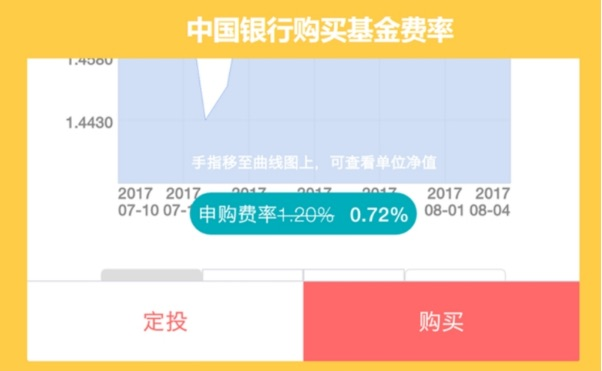
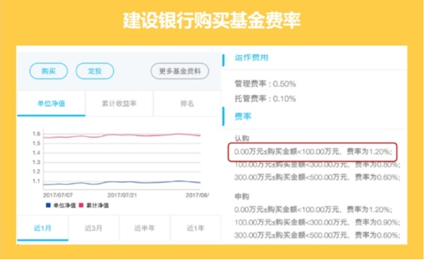
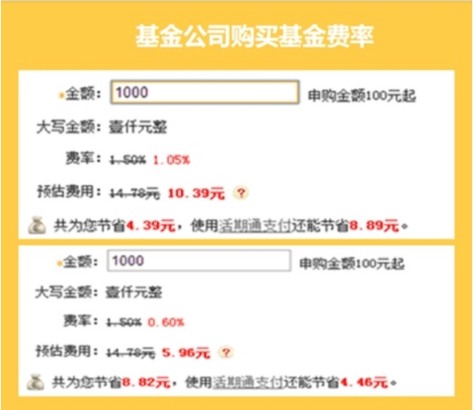
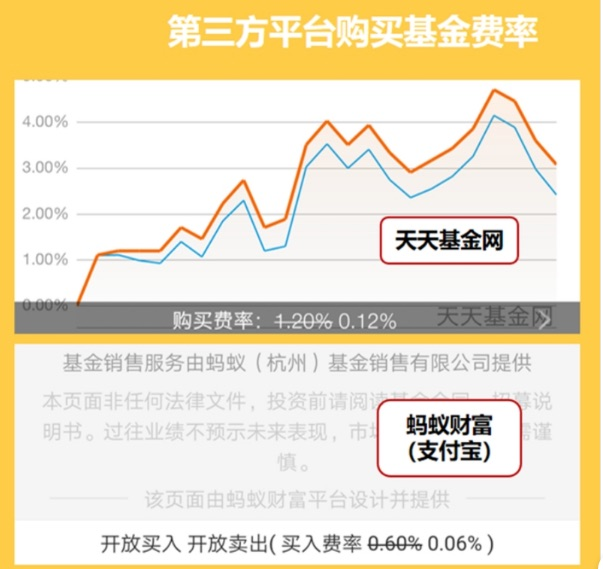

昨天有同学问场内和场外有啥区别, 那咱们今天来说道说道

通过之前的学习, ⼤家都了解了和定投, 很多同学都对定投基⾦感兴趣, 进⽽想⽤这种⽅式来养鹅、下⾦蛋, 对吧

## 什么是场内和场外?

在讲具体渠道之前, 丸⼦给⼤家普及⼀下, 场内, 场外的概念～

什么是场, 所谓的场, 就是证券交易市场, 也是我们平时所说的股票交易市场～

股市不仅可以交易股票, 还可以交易债券, 期权等其他有价证券

明⽩了什么是场, 就可以很轻松地理解什么是场内和场外了

我们把通过证券市场(股票市场)进⾏的交易统称为场内交易, 把通过这个渠道之外的进⾏的交易统称为场外交易～

就像批发商和零售商的区别⼀样

所以两个地⽅汇率不⼀样: 场内是批发所以费⽤便宜, 场外是零售商所以贵

## 基⾦投资的具体渠道

接下来再说说投资的具体渠道:

我们买⼀共有 4 种渠道:

1、证券公司, 这就是场内渠道

2、银⾏

3、基⾦公司

4、第三⽅代销平台, 如天天基⾦, 蚂蚁聚宝, 京东⾦融等

来咯, 问⼀下学霸们~

这⾥ 4 种渠道, 哪个是场内, 哪个是场外呢?

2, 3, 4 都是场外哦

## 场内场外的渠道有什么区别呢

先来看银⾏

这是中国银⾏的费率, 这个是有折扣的, 1.2%的基础上打 6 折, 就是 0.72%, 万分之 72

这是建设银⾏的费率, 这个是没有折扣的, 1.2%, 万分之 120

再来看基⾦公司 , 基⾦公司官⽹通常也会打折, 不过只有他⾃⼰家的

⼤家是不是以为在基⾦公司买基⾦是最便宜的?

现在⼤家可以看到, 即使使⽤有优惠的银⾏卡买, 费率也最低到 4 折 , ⽤他们的活期通的话, 最低 1 折.

我们不对⽐ 4 折的, 选最低的折扣 1 折, 1 折后多少?0.15%, 万分之 15

再来看第三⽅代销平台

天天基⾦平台, 费率打⼀折, 万分之 12. 蚂蚁财富平台, 费率是打 0.5 折, 万分之 6.

丸⼦个⼈总结了⼀下:

基⾦公司, 第三⽅平台和银⾏, 他们仨的关系, ⼤概就是专卖店, 爱打折的百货商场和加价不加量的国营⼩卖部的关系 ~

最后来说说【场内基⾦】

我们来对⽐⼀下, 银⾏申购费万分之 72, 第三⽅平台万分之 6, 场内交易⼀般万分之 3, 钱哥⼉为⼤家争取到的券商万 1

惊不惊喜, 意不意外?

现在, ⼤家知道场内基⾦的最⼤的好处是什么吗

场内的⼀⼤好处就是便宜!

插⼀句:

场内的交易叫买卖, 对⼿都是其他交易者.

场外的交易叫申购赎回, 对⼿就是基⾦公司

⼤家理解就好啦

我们算⼀下, 假如我们买⼀万元, 通过银⾏申购, ⼿续费 72~120 元

三⽅平台 12 元, 场内交易 1~3 元, 看到这个差距没

如果我们定投, 通过银⾏定投产⽣的⼿续费和通过场内定期交易, 最多能差 100 倍!

我们在复利⼀节中讲过, 投资的最⼤成本就是⼿续费, 同样的, 同样的时间和本⾦, 差距⾮常⼤!

所以, 在投资初期, 选择低佣⾦的券商, 是⾮常必要的

总结⼀下:

场外的优势:⽅便, 不⽤开股票账户, 操作⽐较简单.

场内的优势: 佣⾦⼿续费低, 便宜, 便宜, 便宜.

便宜最重要

其实还有⼀点是, 场内中的交易是实时的, 也就是⼀天的价格会有波动, 你可以买卖在最⾼点!

⽽场外的是以天为单位的, ⽆法实时交易, 也就是, 你很有可能错过很多时机

好了, 场内外就分享就到这⾥啦~

⼤家要好好学, 怎么买卖, 如何买, 最⼤化的让⾃⼰投资的收益⾼⼀点

不要⾛丸⼦以前的⽼路, 亏钱了才知道学习
