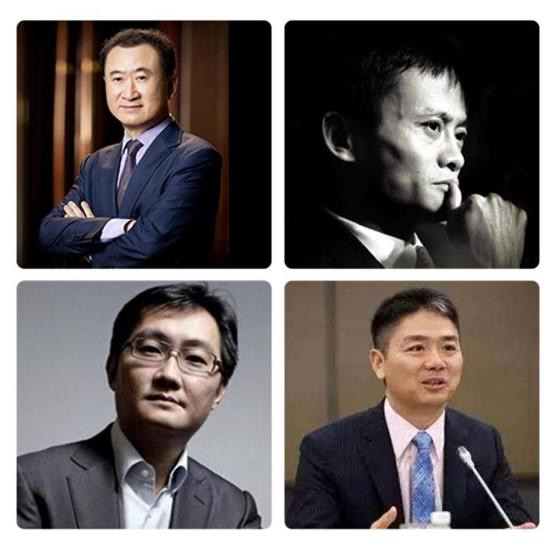

学姐想问下, 你有劝过⾃⼰身边的⼈理财吗? 或者当别⼈告诉你要理财的时候你是怎么想的?

如果你跟身边的⼈提起过理财, 你可能得到的是如下反应:

1、 理财? 你觉得我很缺钱吗? 不理财我就赚不了钱了?

2、 ⽼公(婆)不让学, 爸妈说没⽤, 安安⼼⼼存银⾏吧!

3、 我最近要忙⼀个考试, 我最近要出差, 没有时间, 以后再说吧

4、 钱少能理什么财?! 巧妇难为⽆⽶之炊

5、 要是这理财课程有⽤, 那⼤家都发财了! 理财就没有亏钱的了吗?

6、 我对股票、基⾦、数字看⻅就头晕, ⽂凭也不⾼, 也不聪明, 估计学也学不会, 算了还是不要学了

7、 我现在负债很多没有钱, ⽉光没有钱.... 要不攒两⽉钱再谈理财...

8、 我没有理财, 现在也有房有⻋了, 我⾃⼰研究吧, 再等⼀等吧

9、 我⾃⼰已经买了某某股票或基⾦, 有没有想过这样不懂实质分析的投机, 迟早亏钱

10、 我担⼼我害怕, 没⾃信, 学历低没⽂化, 很笨~

找借⼝不学习的理由动⼒这么强, 就好像跟钱没啥缘分, 这就是我穷的理由等等太多

现实结果可能⽐上⾯还惨烈, 很多⼈都会碰⼀⿐⼦灰, 出现这种情况的原因往往是:

1、 穷⼈思维, 没钱就不⽤理财, 意识不到是思维限制了⾃⼰

2、 ⾃⼰或身边⼈亏钱了, 于是总结出所谓的理财都是不靠谱的, 在⾃⼰的认知舒适圈停滞不前

3、 觉得理财得到的收益少看不上, 越是看不上越是毫⽆任何⽣钱资产⽽⾔, 傲慢看待

4、 不相信会有有效的理财⽅法存在, 就算看⻅了也还是鸡蛋挑⻣头的怀疑⼼态, 本质还是不相信⾃⼰能理好财, 会富有

5、 不相信⾃⼰能学会, 可以掌握有效的理财⽅法, 本质是不相信⾃⼰有能⼒把控⾃⼰的⼈⽣, 穷⼈思维的⾃卑⼼态

6、 穷⼈思维限制, 害怕改变, 不敢去追求, ⼜嘴上说着平平淡淡, ⾃满⾃⾜

学姐之前给⼤家讲过, 更多⼈没钱的深层原因, 是意识不到是⾃⼰的思维限制了⾃⼰. 意识不到问题本身, 才是最可怕的问题. 不过, 话说回来, 你想让那些打⼼⾥, 打底层思维意识⾥就不重视理财、对理财有偏⻅的⼈, 去接受理财, 确实是个热脸贴冷屁股、好⼼碰⼀⿐⼦灰的活.

⼈们坚信⾃⼰是对的, ⾃⼰看到的才是事实

更有⼈, 看到了都难以去⾏动起来, 因为⼈常常做出熟悉的选择, ⽽不是应该的选择

好像道理都懂, 但就是没有⾏动, 思想的巨⼈⾏动的矮⼦, ⼀旦到了⾏动就会开始有各种理由在前抗拒拖延了

成功的⼈往往是先相信后看⻅, 思想变、⾏动变. 普通⼈是先看⻅才相信, 甚⾄有的⼈看⻅都不相信, 尤其是先天怀疑⽓质多、相信⼒弱的⼈.

思维改变, 才能⾏为改变, 才能境遇改变, 很多⼈没有真正意义上的思维改变在先, 你跟他⼜谈何理财呢.

当然理财不是唯⼀的致富途径, 也有⼈不理财就发达了的.⽐如他们:

但是他们也是创造了企业【创造了⽣钱资产】!

层次再低⼀点, 像中国上市公司的那些创始⼈和原始股东, 也成为了富豪. 如果你能创⽴伟⼤的事业, 那么理财那点"⼩钱"确实⽆⾜挂⻮.

但话⼜说回来, 这些创⽴了⼤事业的⼈, 不仅有过⼈的才⼲, 付出了超越常⼈的努⼒, 他们还有承担创业⻛险的魄⼒和实⼒. 更重要的是你很难学到他们身上开创的思维, 敢于尝试新事物新领域的魄⼒和勇⽓.

这帮"天⼦骄⼦"的数量级⼤约是 4 万⼈, 占⼈⼝⽐例 0.0029%. 你能成为这 0.0029%的原始⼤股东吗?

这其中包含反对你学习的⼈吗? 如果不包含, 敢问, 他们是以"贫穷"的经验在反对你进步吗?

相信⼤家不会的, 学习就是为了跳出现有的圈⼦, 解决财务问题, 经济危机创业困难, 实现最终的财务⾃由.

物以类聚⼈以群分, 如果你在拿现有的圈⼦或者⽐你层次低的圈⼦寻求答案, 那你永远不会成功.

都说股市【七亏⼆平⼀赚】, 还有说: 我⼆叔的⼤舅的三表哥炒股亏了⼏百万那些⼈. 他们说的也许是真的是他⼆叔和⼤舅. 是的, 这种情况在不学理财技能, 就冲进股市乱投的⼈身上经常发⽣.

但是相信经过我们⼩⽩营学习的⼈, 已经知道他们为什么亏, 是什么原因导致的了.

对于理财投资做决策不过⼤脑⼀拍脑⻔、不做任何的分析, 这样的投机赌博⾏为, 市场上称为"博傻"

学习游泳, 有教练; 开⻋上路, 有驾校; 职业技能, 有技校; 就连找对象都得找个有经验的前辈讨教⼀下. 为什么到了理财投资上, 这种事关⾃⼰钱的问题上, 真⼑实枪上的时候却如此轻率呢?

【理财的姿势不对】是普通投资者亏损的主要原因. 赚钱的是少数, 你要思考的应该是, 如何让⾃⼰成为这这些赚钱的⼈中的⼀员?

要想赚到之前没有赚到的钱, 就要学会之前没有的技能. 要想增加财富, 必先增值⾃⼰. 让⾃⼰的认知, 匹配得上想要拥有的财富.

投资的路上, 不要单打独⽃. 单打独⽃这意味着你看不⻅的⻛险会很⾼. 要学会看到圈⼦带给⾃⼰的价值, ⽤好圈⼦的复利价值, 借⼒增值!

理财路上, 与谁同⾏, 决定了你能⾛多远!
