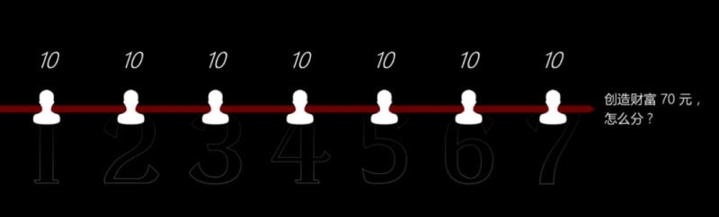
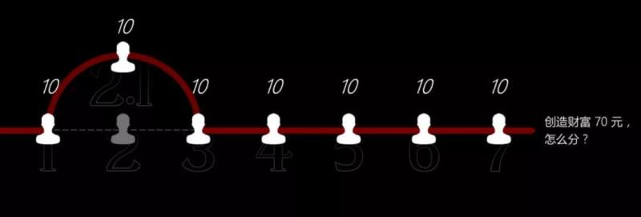
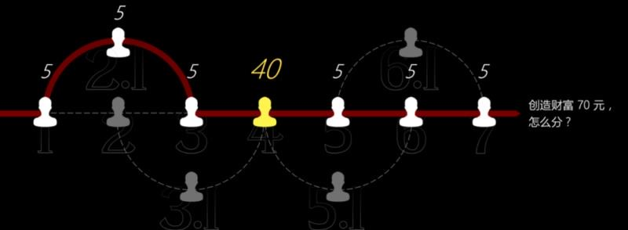

我们经常说, 勤劳致富.

但是, 你有没有想过, 勤劳就真的能致富吗?

不⼀定.

勤劳, 能够创造财富.

但是, 勤劳者, 未必能够分到财富.

为什么?

要回答这个问题, 我们⾸先要理解财富的本质.

## 财富的本质

财富到底从哪⾥来?

很多⼈说, 从劳动中来.

没错, 劳动可以创造财富.

只有通过劳动才能把产品创造出来, 换取财富.

假如你每天劳动 8 个⼩时, ⼀年能种 200 ⽄⼤⽶, 那么你的财富就是 200 ⽄⼤⽶可以换来的东⻄.

你勤奋⼀点, 每天劳动 12 个⼩时, ⼀年能种 300 ⽄⼤⽶, 你的财富就是 300 ⽄⼤⽶可以换来的东⻄.

这个时候, 财富 = 劳动.

那么, 是不是财富就完全等于劳动呢?

不⼀定.

财富跟劳动⾮常相关, 但并不完全等于劳动.

⽐如, 你买了播种机⾃动播种, 买了农药机⾃动喷洒农药, 买了收割机⾃动收割.

你的⽣产率⼤⼤提⾼, 你每天只需要劳动 2 个⼩时, 就能种 500 ⽄⼤⽶.

那么你的财富就是 500 ⽄⼤⽶可以换来的东⻄.

你的劳动变少了, 但是财富却增加了.

这个时候, 财富 = 劳动 \* ⽣产率.

⽣产率取决于很多因素.

⽐如知识、科技, ⽐如⼯具、机器, ⽐如流程、⽅法……

这些东⻄, 共同决定了你创造财富的⽣产率.

那么, 是不是财富就完全等于劳动\*⽣产率呢?

不⼀定.

你今天在中国⽣产⼤⽶, 卖得很好, 因为⼏乎每家每户都要吃⼤⽶.

但假如你在美国⽣产⼤⽶, 卖得可能就不如在中国好, 因为美国⼈并不是每家每户都吃⼤⽶.

⼤⽶在美国的价值, ⽐在中国要⼩⼀点.

所以⽣产同样多的⼤⽶, 你在美国获得的财富, 就要⽐在中国少⼀点.

同样的商品, 因为不同客户群体对它的需求不同, 它所产⽣的效⽤就不同.

所以, 除了劳动和⽣产率, 财富还取决于效⽤.

财富 = 劳动 \* ⽣产率 \* 效⽤.

这就是财富的本质.

如果把三个因素对应到这个时代的基本资源, 那么劳动就代表⼈⼝资源, ⽣产率就代表科技资源, 效⽤就代表商业价值.

理解了这个逻辑, 你也就理解了:

我们国家前期经济⻜涨, 得益于我们拥有⼈⼝优势.

美国能够⼀直稳坐国际⽼⼤, 得益于他们科技发达.

⽽对于个⼈来说, 劳动代表着你能投⼊的时间.

⽣产率代表着你的杠杆, ⽐如知识、⼯具、团队、资⾦等等.

效⽤代表着你的劳动能创造的单位价值.

这三个因素, 共同决定了你能创造的财富.

虽说劳动、⽣产率和效⽤, 共同决定了财富的多少.

但是财富最基本的来源, 还是劳动.

劳动是 1, ⽣产率和效⽤是后⾯的很多个 0.

没有劳动, 就没有财富.

劳动, 创造了财富.

## 但是, ⽤劳动来创造财富, 有两个⾮常⼤的问题.

### 第⼀个问题, 就是劳动创造财富的天花板很明显.

你看上⾯这张图.

在早期的时候, 你每增加⼀个单位的劳动时间, 所创造财富的总量会上升得⾮常快.

但是慢慢地, 创造财富的增速开始放缓了.

再往后, 就算你再增加劳动时间, 所创造的财富总量⼏乎就不增⻓了.

这就到达了⼀个天花板.

以我⾃⼰为例. 我不管再怎么努⼒, 也不可能做到⼀年讲课 367 天.

这是我⾃⼰劳动创造财富的天花板.

再以公司为例.

做任何⼀件事, ⼀开始你投⼊ 2 个⼈, 能做 3 个⼈的事.

慢慢地, 投⼊ 10 个⼈, 能做 10 个⼈的事.

再往后, 投⼊ 100 个⼈, 可能也只能做 50 个⼈的事.

你投⼊⼈⼒的边际效益是递减的.

就像有⼀块农⽥, 你让⼀个农⺠来种, 他⾟⾟苦苦劳作⼀年, 发现并不能充分利⽤这块农⽥. 他所创造的财富受⾃⼰的体⼒所限.

好, 那就让 10 个⼈来种.

你发现所创造的财富⼏乎增⻓了 10 倍.

那让 100 个⼈来种呢? 会有 100 倍的增⻓吗?

不会. 你发现只有 50 倍的增⻓.

因为农⽥已经达到饱和.

这个时候, 你投⼊再多的⼈, 也不可能创造更多的财富.

这就是劳动创造财富的天花板.

⽤劳动来创造财富, 天花板是⾮常明显的.

这是劳动创造财富的第⼀个问题.

### 劳动创造财富的第⼆个问题更为关键, 叫做: 劳动能够创造财富, 但是劳动本身并不分配财富.

什么意思?

创造财富就等于赚钱吗?

并不是.

创造财富不叫赚钱.

分配财富, 才叫赚钱.

为什么很多⼈⼀年⼯作 365 天, 勤恳劳动创造财富, 最终却没有获得很多财富?

就是因为他并不拥有财富的分配权.

我举个例⼦.

假如创造⼀件商品, 需要 7 个步骤. 每⼀个步骤, 都分别由⼀个⼈完成.

(1、 2、 3、 4、 5、 6、 7, 我们⽤数字来代表完成每个步骤的⼈.)

最终, 这个商品卖了 70 块.

如图:

那么问题来了.

7 个⼈, 创造了 70 块钱的财富, 这 70 块应该怎么分?

按每个⼈创造的价值来分吗?

可是, 每个⼈到底创造了多少价值?

你很难衡量.

那按照最简单的办法, 平均分配吧?

7 个⼈, 每个⼈分 10 块钱.

这个时候, 就有⼈不答应了.

2(第 2 个步骤的⼈)跳出来说: 我的⼯艺⾮常复杂, 我每天⼲ 18 个⼩时, 特别⾟苦, 应该给我分 15 块.

那应不应该给他分 15 块呢?

这就看其他 6 个⼈答不答应了.

其他 6 个⼈⼀合计, 不⾏, 给他分 15, 我们分到的就少了, 凭什么? 我也很⾟苦啊.

那怎么办呢? 有没有其他⼈, 也能⼲ 2 的这件事?

这 6 个⼈跑到市场上, 吼了⼀嗓⼦: 10 块钱, 有谁能做这件事?

这时, ⻢上有个叫 2.1 的⼈跳出来说: 我愿意⼲我愿意⼲.

于是, 原来的 2 就被⼲掉了.

每个⼈还是分到 10 块钱.

这个时候, 2 着急了: 还是我来吧, 还是我来吧, 我不要 15 了, 我也不要 10 块了, 我只要 8 块.

其他 6 个⼈说, ⾏啊, 那你回来吧.

2 回来之后, 分 8 块钱, ⽽其他 6 个⼈, 每个⼈分 10.33 块.

所以你看, 2 这个⼈, 虽然很勤劳很⾟苦, 他具备创造财富的能⼒.

但是, 他不具备分配财富的能⼒.

那谁才具备分配财富的能⼒?

那就看整个链条上, 有谁真的不可替代.

假如, 1、2、3、4、5、6、7 中, 1、2、3、5、6、7 都有可以替代他们的⼈.

只有 4 不可替代.

这个时候, 4 跳出来说, 10 块钱太少了, 我要 20 块.

其他 6 个⼈很⽣⽓. 2 要 15 块我们都没同意, 凭什么给你 20, 我们找个⼈把你⼲掉.

于是, 这 6 个⼈跑到市场上, 吼了⼀嗓⼦: 10 块钱, 有谁能做这件事?

……

没⼈理.

这 6 个⼈有点懵, 他们咬咬⽛, ⼜吼了⼀嗓⼦: 15 块钱. 有谁能做这件事?

……

还是没⼈理.

这 6 个⼈惊呆了, 内⼼在滴⾎, ⼼⼀横, ⼜吼了⼀嗓⼦: 20 块钱.

有谁能做这件事?

……

吼破嗓⼦, 依然没⼈理.

最后, 他们悻悻⽽归.

算了, 就给他 20 吧.

给他 20, 我们 6 个⼈每⼈能分 8.33, 总⽐没有强.

4 拿到了 20 块, 很⾼兴. ⼼想, 原来还能这么⼲啊.

那我再多要点, 我要 40 ⾏不⾏?

其他 6 个⼈昏过去. 给他 40, 我们每个⼈只能分 5 块了.

可是, 市场上⼜找不到可以替代他的⼈.

算了, 5 块就 5 块吧, 反正在其他地⽅⼲活也是 5 块.

6 个⼈虽然咬⽛切⻮, 但最终还是接受了.

4 尝到了甜头, ⻢上再次要价: 那我要 50 ⾏不⾏?

其他 6 个⼈⼀听, ⻢上跳起来⼀拍桌⼦, 散伙.

为什么?

给 4 分 50 块, 其他 6 个⼈每⼈就只能拿 3.33 块, 那他们还不如去别的地⽅⼲活呢, 还能拿 5 块.

所以你看, 在这个链条中, 4 拥有着从 10 块到 40 块之间的财富分配权.

10 块到 40 块之间, 4 要多少都⾏.

⽽其他⼈没有分配财富的权⼒, 就只能被动接受.

拥有还是不拥有财富分配权, 是完全不⼀样的.

你没有财富分配权, 你想拿 20, 就是贪⼼.

⽽ 4 拥有财富分配权, 他想拿 20, 就是舍满取半.

但是, 4 拥有分配财富的权⼒, 就⼀定意味着他创造的财富更多吗?

不⼀定.

这只意味着, 4 更稀缺.

就像我们很难衡量⼀个体⼒劳动者, 和⼀个脑⼒劳动者谁创造的财富更多.

我们只能说, 脑⼒劳动者分配财富的权⼒更⼤.

因为他们更稀缺.

所以, 勤劳未必能致富.

致富的本质, 并不是创造财富, ⽽是分配财富.

创造财富靠能⼒.

⽽分配财富, 靠稀缺.

你想要拥有更多的财富, 你就要在整个交易链条⾥, 变得更加稀缺.

同样的道理.

连锁餐厅的同样⼀碗⾯, 在家⻔⼝吃只要 20 块, ⽽在机场吃却要 99 块.

为什么? 凭什么在机场就这么贵?

你很⽣⽓, 跑去问机场的连锁餐厅: 你凭什么收我这么多钱, 你也太⿊⼼了吧.

餐厅⻢上解释说, 不是不是. 我收这么多钱, 是因为房租太贵, 其实我并没有赚很多钱.

⼤多数钱, 其实都被机场的店铺出租商赚⾛了.

机场的店铺出租商为什么能收这么贵的租⾦?

因为他掌握着稀缺资源, 所以拥有分配财富的权利.

什么稀缺资源?

⼤⼀点的机场, 每天的⼈流量能达到⼏⼗万. ⽽且选择坐⻜机的⼈群, 相对⾼端.

所以, 机场可以规模化触达⾼端⼈群.

这个资源可太稀缺了. 品牌商愿意为此付很多钱.

很多⼤牌, ⽐如爱⻢仕, LV, 卡地亚等等, 都愿意付很⾼昂的租⾦, 在机场开店.

今天你嫌租⾦太贵, 没关系. 后⾯还排着⼀⼤堆品牌商, 想要⼊场.

掌握稀缺资源, 就拥有财富分配权.

所以, 你在机场吃⼀碗⾯ 99 元, 这个价格由谁决定?

不由你决定.

也不由餐厅决定.

⽽是由机场的店铺出租商决定.

因为他拥有财富分配权.

最后的话

劳动可以创造财富, 创造财富很重要.

但是最终财富怎么分配, 谁应该⽐谁更有钱这件事, 并不是由创造财富的⼈决定.

⽽是由掌握稀缺资源的⼈决定.

谁掌握稀缺资源, 谁就拥有财富分配权.

所以, 如果你想要拥有更多财富, 就应该想尽⼀切办法, 提⾼⾃⼰的稀缺性.

⽐如, 对于个⼈来说, 你要思考的问题应该是:

我是否拥有⾮常稀缺的能⼒?

我是否在公司最稀缺的部⻔?

我是否在部⻔最稀缺的岗位?

我是否拥有最稀缺的资源?

我现在拥有的稀缺性, 未来还能继续稀缺吗?

为什么⼀些岗位的员⼯, 年轻的时候能赚很多钱, 35 岁以后就容易被裁员?

因为这些员⼯, 体⼒和学习能⼒都没有年轻⼈强, 要价还⽐年轻⼈⾼, 他们已经变得不稀缺了.

慢慢地, 就容易被淘汰.

所以为了避免被淘汰, 你就要提前去思考, 怎么提⾼⾃⼰未来的稀缺性.

⽽对于公司来说, 你要思考的问题应该是:

我是否拥有⾮常稀缺的能⼒?

我是否拥有最稀缺的资源?

我是否处于最稀缺的⾏业?

我是否在⾏业中处于最稀缺的节点?

我现在拥有的稀缺性, 未来还会继续稀缺吗?

只有不断让⾃⼰变得稀缺, 你才能拥有财富分配权, 获得更多财富.

祝: 稀缺.
