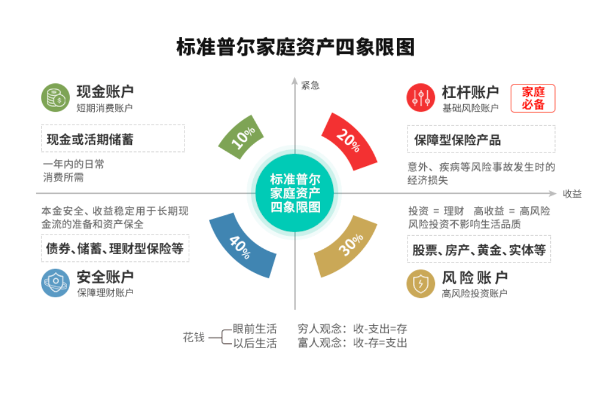
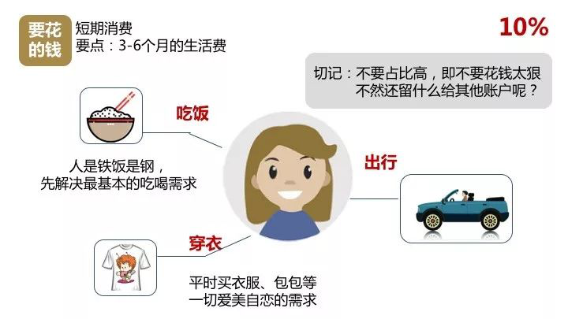
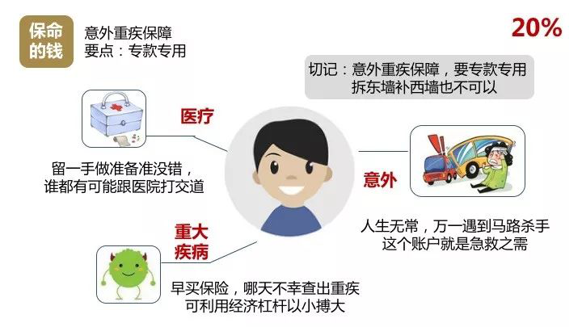
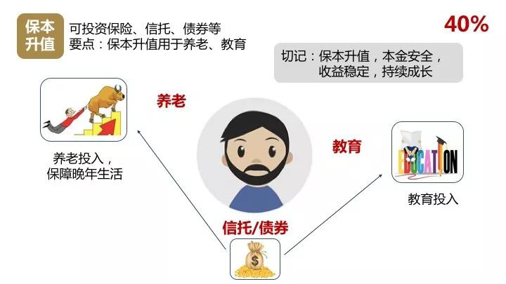
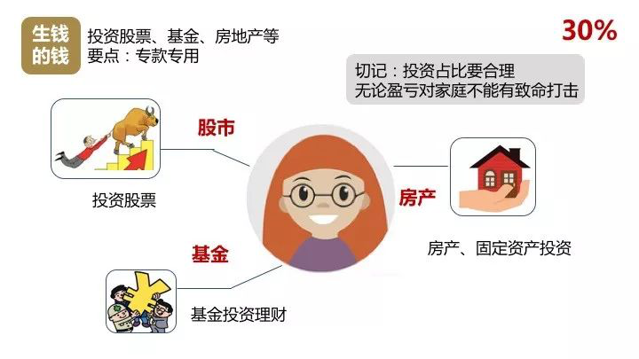
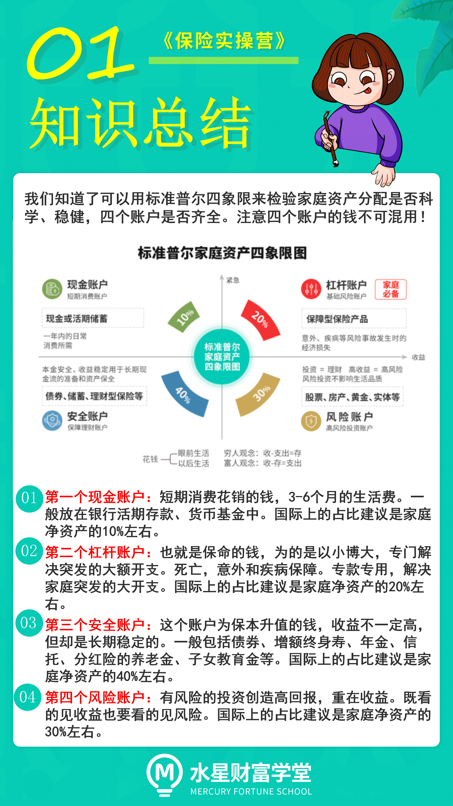

各位小伙伴们, 大家好.

欢迎来到《保险实操营》. 懂原理, 不踩坑; 少花钱, 买对险.

从今天开始, 我们将陪着大家一起学习关于保险的知识. 包括从资产配置角度看保险规划, 保险的分类, 保险配置的正确思路, 以及买保险中有哪些坑, 出险后如何理赔等.

如果认真学完这门课, 相信有关保险的基本问题就基本不会难倒你了, 也不用担心在配置保险的时候入坑了.

更重要的是你会清晰地知道如何在不花冤枉钱的情况下, 让自己和家人拥有适合的保障, 才能在风险来临的时候真正起到规避的作用.

好啦, 那下面我们将正式进入今天的课程一《 你不得不了解的资产配置知识》.

看到今天的标题, 不知道大家会不会疑惑, 保险怎么是从资产配置开始讲起呢?

这就不得不提到我们大名鼎鼎的标准普尔四象限图啦.

那什么是标准普尔四象限图呢?

标准普尔是全球最具影响力的信用评级机构调研全球 10 万个资产稳健增长的家庭, 分析总结出他们的家庭理财方式, 从而得出了一套被公认为最合理、稳健的家庭资产分配方式. 简单来讲就是按照这种方式配置, 是可以使得家庭资产持续稳健有效增长的.

大家学习保险和理财知识, 也是希望自己的家庭资产可以稳定的增长, 收获稳稳的幸福. 那么标准普尔四象限就给了我们一个明确的方向啦.

从图中可以看出, 标准普尔四象限把我们的家庭资产分为了四个账户. 保险占据了杠杆账户和安全账户两部分.

接下来一一向大家解读下四个账户. 在老师分析过程中, 小伙伴们可以把小本本拿出来分析下自己家庭的资产情况, 看下咱们辛苦赚的钱是否有进行科学规划哦.

## 一、现金账户

这个账户可以理解为日常花销账户, 也就是要花的钱. 一般为家庭 3-6 个月内的生活费.

这笔钱我们一般放在活期储蓄的银行卡或货币基金中.

这个账户保障家庭的开销、日常生活、买衣服、美容、旅游等都应该从这个账户中支出.

这个账户小伙伴肯定有的, 但是我们最容易出现的问题是占比过高, 很多时候也正是因为这个账户花销过多, 而没有钱准备其他账户.

国际上的占比是建议在家庭净资产的 10%左右, 当然这个比例只能作为一个参考, 不同家庭结构占比略有区别.

现金账户要点总结: 短期消费, 3-6 个月的生活费. 一般放在银行活期存款、货币基金(余额宝, 微信零钱通等)中.

## 二、杠杆账户

杠杆账户也就是保命的钱, 为的是以小博大, 专门解决突发的大额开支.

这个账户可以说是"家庭必备", 保障突发的大额开销, 一定要专款专用, 保障在家庭成员出现意外事故、重大疾病等风险时, 有足够的钱来保命.

这个账户主要是人身保险, 因为只有保险才能以小搏大, 平时不占用太多钱, 用时又有大笔的钱. 我们一生之中会有各种各样的风险, 有些我们想得到, 有些想破脑袋也想不到, 这么多风险, 我们每一种都要用保险来保障吗? 没那个必要, 也不现实.

我们只要能够将人生中一些可以预见的重大风险引起的损失转移嫁接掉就好了. 都有哪些重大风险呢? 我们给风险归个类, 总的来说, 无外乎这三种: 死亡, 疾病和意外.

我们通常所说的保险, 无非也是针对这三个风险给与我们相应的保障. 其中死亡可以由寿险保障, 疾病可以由医疗险和重疾险保障, 意外则由意外险保障, 即我们常说的四个人身保险.

这个账户平时看不到什么作用, 但是到了关键的时刻, 只有它才能保障小伙伴不会为了急用钱卖车卖房、基金低价套现、到处借钱.

如果没有这个账户, 咱们的家庭资产就随时面临风险, 所以叫保命的钱. 想一下, 你现在有这个账户了吗?

杠杆账户的国际参考占比家庭净资产的 20%左右.

杠杆账户要点总结: 死亡, 意外和疾病保障. 专款专用, 解决家庭突发的重大开支.

## 三、安全账户

这个账户为保本升值的钱, 一定要保证本金不能有任何损失, 并要抵御通货膨胀的侵蚀, 所以收益不一定高, 但却是长期稳定的.

这个账户最重要的是专属: 不能随意取出使用. 养老金说是要存, 但是经常被买车或者装修用掉了. 每年或每月有固定的钱进入这个账户, 才能积少成多, 不然就随手花掉了. 要受法律保护, 要和企业资产相隔离, 不用于抵债.

我们常听到很多人年轻时如何如何风光, 老了却身无分文穷困潦倒, 就是因为没有这个账户.

其实我们大部分资金, 应该放入安全账户当中. 它既可以帮我们准备未来孩子的教育金、自己的养老金, 也可以成为家庭理财的安全垫, 对冲投资风险;

或者只是单纯留一笔钱, 给自己未来买房换房、回校深造、创业, 甚至留给孩子等各种人生可能性作准备.

这个账户对我们至关重要, 里面的钱是我们对未来的规划, 所以必须保证收益确定、本金安全.

安全账户的国际参考占比家庭净资产的 40%左右.

安全账户要点总结: 保本升值、本金安全、收益稳定、持续成长. 债券、增额终身寿、年金、信托、分红险的养老金、子女教育金等.

## 四、风险账户

这个账户顾名思义用有风险的投资创造高回报.

这个账户为家庭创造高收益, 往往是通过小伙伴的智慧, 用你最擅长的方式为家庭赚钱, 包括你投资的股票、基金、房产、企业等. 这个账户你肯定有的, 相信以你的智慧收益也很高.

不过值得注意的是, 这个账户关键在于合理的占比, 也就是要赚得起也要亏得起, 无论盈亏对家庭不能有致命性的打击, 这样我们才能从容的抉择.

风险账户的国际参考占比是占家庭净资产的 30%左右.

风险账户要点总结: 重在收益. 这个账户最大的问题是偏向性, 投资 ≠ 理财, 既看的见收益也要看的见风险.

在这个账户里话题度比较高的是基金和股票, 关于这部分课程咱们会在水星财富学堂系列课程讲到.

这四个账户就像是桌子的四条腿, 少了任何一个就随时有倒下的危险. 大部分的小伙伴都有第一个现金账户和第四个风险账户, 但是缺少了第二个杠杆账户和第三个安全账户. 如何搭配, 下节课开始我们就一一带大家学习.

好啦, 今天的课程到这里了, 我们来一起总结回顾一下:

