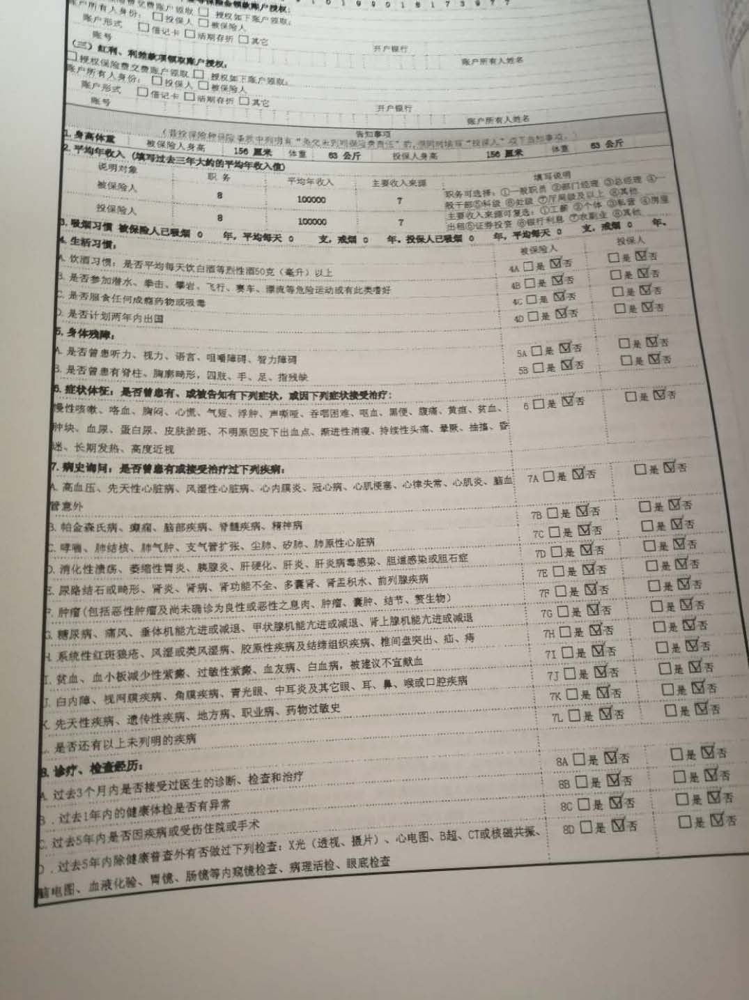

我们知道, 大多数保险公司用的都是代理人制度. 直到今天, 几乎每个人身边, 都有一个保险代理人.

啥叫代理人制度?

其实代理人制度, 并不是保险特有的, 这种营销模式在很多行业都可以看到, 实际上就是一种"代理商制度".

小伙伴们大家好, 大家是不是都有一种相同的感觉, 一听到"保险"这个词, 就觉得是骗人的, 有多远走多远.

其实班班非常理解大家这种感觉, 包括班班最开始的时候也是, 一听到保险就赶紧把小棉袄裹得紧紧的, 生怕上当受骗.

究竟是哪里出了问题呢? 班班今天就和大家一起来找找这种"骗人"的感觉.

保险对于大多数人而言, 觉得可能赔也可能不赔, 为一个"可能性"买单, 其实并不是件容易的事.

也正是因为这种对于理赔的不确定性, 所以大家才会觉得被欺骗.

那么为什么我们会觉得在发生风险后保险公司不会理赔呢?

有一部分是历史原因导致的.

## 一、代理人制度

就是保险公司招收一大批人, 来做保险公司的代理商, 负责把保险卖出去, 卖出去, 就有销售提成, 也就是佣金, 卖不出去, 自然渐渐淘汰.

在刚刚改革开放的时候, 虽然没几个人知道保险是什么玩意儿, 但是大家都知道能赚钱. 在那个时候, 代理人是黄金职业, 一般人月薪几百块, 而一些做得好的保险代理人, 就可以拿到几千佣金, 让人羡慕不已, 于是纷纷进入.

到了 90 年代, 又赶上了一波下岗浪潮, 保险业狂飙突进, 至今许多家庭仍保留那时候买的保单.

代理人制度, 在那个时候, 是符合保险市场的现状的, 极大地宣传了寿险、推动了寿险, 让广大人民群众认识到了保险, 但是, 制度本身的问题, 和保险市场的不健全, 却让保险本身, 背上了骂名.

代理人制度在实践中就会存在不少问题:

### 1．代理人本身素质问题

在那个时候, 人民群众对于保险是没有什么认知的, 中国讲一个人情, 哪怕现在, 也有不少保险代理人的促成签单, 也不是靠专业, 把保险讲透, 而是讲人情.

所以, 当时代理人的素质可想而知, 基本都是拿着一套话术, 翻来覆去地背诵, 实际上一派胡言.

而保险市场, 又养不起专业的保险从业者队伍, 毕竟培训成本就惊人, 保险公司能够用廉价的代理人, 干嘛费尽心思去培训呢?

而保险公司招收代理人, 基本上没有什么门槛, 初高中学历的比比皆是, 全是靠忽悠身边亲戚朋友, 拉过来听保险公司的产说会, 利用从众心理促单.

买保险, 其实是一个专业度很高的事儿, 虽然不比律师医生, 需要多年科班培训, 但也不是随便一个人拉过来教几个月话术就搞定的.

### 2．代理人纯业绩指标考核

保险公司招收代理人, 实际上是一种鸟枪法, 反正不怎么花钱, 你卖出去了, 拿到提成, 我自己得更多, 所以肯定是赚的. 卖不出去, 业绩一考核, 要么给自己买, 给身边亲戚朋友买, 要么就滚蛋, 简单粗暴.

这种情况下, 保险代理人制度比传销稍好的就是, 保险产品本身, 是无害的, 一般情况下也没有传销的暴利, 当然确实会导致有很多垃圾产品就是了.

都是奔着提成去的, 没办法.

代理人其实也是受害者, 被剥削人脉, 还落一个"一人卖保险, 全家不要脸"的名声

说到底, 在中国的保险市场, 说保险都是骗人的, 某种程度来说也没错, 因为忽悠太多.

但是班班还是要为保险说一句: 保险本身并不是骗人的

而且现在新的制度在不断发展, 信息透明度也在不断提高, 很多线上保险就突显出优势了. 大家觉得保险骗人, 除了历史制度的原因, 还有没有其他什么原因呢?

有的, 而且是更重要的原因.

## 二、人们通常没搞清楚理赔的条件就投保了

### 1 是否如实做好健康告知?

我们来看看下面的对话:

王小虎: xxx, 这上面的 xx 病我是有的, 是不是投保不了了?

业务员: 不会啊, 你直接填否就好了, 不会有人查的.

王小虎: 可是我好像有甲状腺结节啊

业务员: 你这是小毛病而已, 没事的, 再大的问题只要熬过两年没事, 保险公司就必须要给你赔钱的, 到时候出事了你找我, 我帮你搞定!

这就是在投保做健康告知的时候, 业务员忽悠你啥都没问题、不要怕的典型例子了.

### 2 返佣是违法的

再比如, 还有下面这样的对话.

王小虎: 可是你推荐的这个保费好贵啊!

业务员: 亲爱的, 你今天要是在我这投保, 我得的佣金分你一部分好了.

这就是利用了人爱占小便宜的心理进行推销, 实际还是羊毛出在羊身上.

还没完, 还有下面这种的.

### 3 业务员夸大其词、乱给承诺

王小虎: 我给孩子买了这个保险, 等孩子 80 岁的时候, 真的可以领到 800 万吗?

业务员: 绝对可以领, 你放心买.

800 万? 反正班班我是不信的, 要有这种好事你咋不多买几份?

上面几句话, 业务员均做出了不切实际的承诺:

① 误导用户违反如实告知义务并错误解读两年不可抗辩条款(实际上, 虽然可以熬过 2 年, 但保险公司有拒赔的权利);

② 违反了保监会规定的不得返佣金相关规定;

③ 夸大其词, 不按条款说话.

很多代理人连自己都不熟悉他们的产品的本质, 而为了自己的销售业绩和提成也不择手段的去误导投保人.

所以, 买保险, 掌握主动权很重要.

自己什么情况, 什么需求, 得先明确好, 别被人家不切实际的承诺带着跑, 不然到头来哭的还是你自个儿!

这还是被业务员误导的情况, 有些人就比较马大哈了, 明明自己身体不符合健康告知的要求, 还假装不知道, 或者直接略过, 以为投了保就可以理赔了.

保险公司当然不是那么好忽悠的啦, 在需要理赔时可以把你的过往病历查得一清二楚, 如果发现当初投保时没有如实告知, 自然可以不理赔的啦.

所以如实告知很重要, 健康告知问到的老实回答, 没问题不要额外补充.

大家要记住啦, 这很重要, 如实告知, 更不要不做健康告知就投保.

健康告知是投保环节中最重要的事, 班班在这里敲黑板划重点啦.

同时呢, 也会涉及到比较专业的问题, 搞不定及时找班班, 毕竟班班背后有专业的规划师, 他们可专业多了.

### 4 保障内容你都清楚了吗?

很多人买保险, 连自己买的是什么保险, 保障什么都不知道, 结果生病了找保险公司理赔, 结果自己生的病根本就不在保障范围之内, 保险公司怎么可能赔呢?

比如生重病了, 拿着保单找保险公司理赔, 保险公司果断拒赔,

自己还特气愤, 说保险都是骗人的, 不靠谱. 却不知道自己手里的那份是理财型的保单, 压根儿不是保重疾的, 保险公司怎么可能赔呢?

其实这样不能解决问题不说, 还是对自己最大的不负责.

所以在投保之前, 真的要好好了解一下保障内容. 当然了, 有些内容比较专业, 条款有比较难找, 最好的办法就是找班班给你们申请规划师, 这些专业的问题让规划师去解决就好了, 然后让规划师给我们讲解重点条款就好, 这样大家就可以节省很多时间了.

班班再强调一下哦, 咱们实战营期间申请规划师名额是免费的, 但规划师承接的数量比较有限, 因为每个人的健康情况、家庭情况都各不相同, 所以免费名额是有限的, 申请到名额的小伙伴一定要珍惜哦

### 5 免责条款你都清楚了吗?

什么是免责条款, 就是发生什么情况保险公司是不赔的, 这点常常容易被大家忽略.

班班归纳了一下, 保险免责可以大致可以分为两部分:

【显性免责】: 在合同上有一个固定的格式位置, 只要看过合同, 就不会错过.

【隐性免责】: 散落分布在合同各个地方, 例如免赔额、病种定义、特别约定、名词释义等等.

这些就需要规划师专门为大家讲解了, 因为毕竟保险合同里还是有很多专业术语的, 不太好理解. 不懂就要及时求助班班哦.

好了, 今天的内容就到这里啦, 买保险, 实际上不是保险公司在骗人, 人家白纸黑字在保险合同上写得明明白白, 并没有藏着掖着, 我们总不能说看不懂合同上的中文吧.

所以保险并没有骗人.

而我们总骂着保险公司骗人

一是部分保险业务员的不专业, 对我们这种 0 基础消费者的销售误导, 最后真出事儿了, 没办法理赔.

二是我们自己不具备基本的保险知识, 无法一定程度上识别保险业务员的推销是否专业.

三是我们投保前不够重视、马大哈, 风险发生后自然问题就多啦.

所以我们才会觉得, 交了一堆钱最后被保险公司坑了! 这个大猪蹄子就是来骗我钱的!

## 小知识: 保险代理人和保险经纪人的区别

简单来说, 我们生活中常见的某家公司的销售人员, 是保险代理人, 代表的是保险公司, 他们只代理一家的业务.

保险代理人代表的是所服务的保险公司的利益, 只推荐本公司的产品;

而我们水星的规划师, 是保险经纪人

根据《保险法》第 118 条: 保险经纪人是基于投保人(客户)的利益, 为投保人与保险人订立保险合同提供中介服务, 并依法收取佣金的机构.

保险经纪人代表的是投保人的利益, 也就是根据投保人的自身情况, 为投保人量身定制一套属于自己的保险配置方案.

我们可以做这样一个假设, 如果小伙伴们去找某 A 大公司代理人买保险, 他肯定会说自家产品好, 自家产品是最棒的

这时候小伙伴肯定要懵了, 到底哪家好? 到底哪款更适合我?

同样情况下, 如果是保险经纪人又会怎么样呢?

保险经纪人要面对非常多的同类保险产品, 这些产品来自不同的保险公司, 为了能够满足客户的需求, 维护客户的利益, 经纪人会在产品库中挑选最适客户的产品

毕竟只有客户满意了, 保险经纪人才完成了自己的使命~

我们的规划师作为保险经纪的从业人员当中的一员, 一定会站在咱们小伙伴的立场上为大家提供更专业的服务, 帮助大家不吃亏、不被坑, 最大程度的满足小伙伴们的保障需求.
