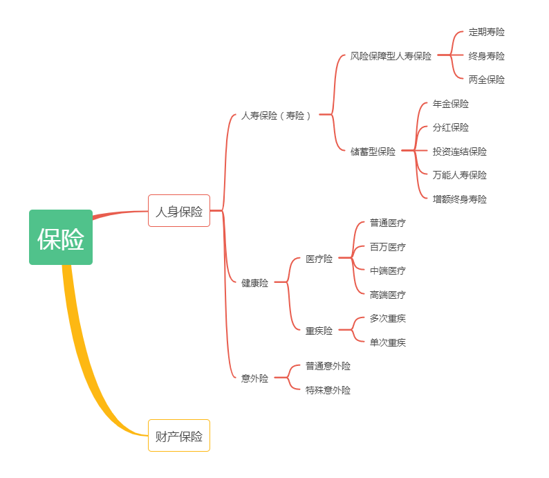

各位小伙伴们, 大家好.

欢迎来到《保险实操营》. 懂原理, 不踩坑; 少花钱, 买对险.

上节课我们一起了解了标准普尔四象限. 知道了家庭资产配置应该由现金账户、杠杆账户、安全账户、风险账户四个账户组成. 这里特别注意: 四个账户缺一不可, 各有所用, 不同账户的钱切记不可混用.

现金账户即日常开销账户, 这个账户一般大家都有, 要注意占比不要太高.

杠杆账户即保命账户, 这个账户主要用于抵御人生三风险, 意外, 疾病和死亡. 可以由三大人身保险意外险、健康险和寿险来保障.

安全账户即保本升值账户, 这个账户主要要保障咱们资产的安全和稳健增长. 可以利用理财型保险实现我们的目标.

风险账户即投资创收账户, 这个账户主要是用有风险的投资博取高回报, 可以利用基金股票等风险与收益并存的投资品博取高收益.

知道了家庭资产如何合理科学分配后, 这节课我们将会带大家详细了解杠杆账户中的四个人身保险具体种类和责任.

我们平时总会听到保险从业人员说什么重疾险、年金险、两全险、医疗险啊等等, 听得头都大了, 就像我们考试做选择题一样, 感觉每个选项都对, 又说不出它们之间的区别, 只能靠蒙.

所以, 今天我们就从保险的分类开始, 看看这个大家族里面究竟有哪些成员, 它们分别能提供什么保障? 篇幅原因, 它们的挑选原则我们下节课再开讲, 敬请期待.

我们先来看看这张图:

图中可以看出, 保险可以分为两大类, 一类是人身保险, 一类是财产保险, 这两者有什么区别呢?

其实这两者最大的区别就是保险标的不一样, 也就是保障的对象不一样.

人身保险以人的生命或身体为保险标的, 财产保险则是以财产及有关利益为保险标的的保险.

听起来有点拗口, 我们举个例子:

水小星买了份重大疾病险, 这份保险合同的保险标的就是水小星的健康, 那这就是一份人身保险; 如果水小星为她们家的房子买了一份保险, 这份保险的标的是房子, 那这就是一份财产保险.

我们接下来的课程中, 主要讲的是人身保险, 因为人身保险我们接触得最多也是最优先需要的.

那么在人身保险中, 根据保障内容风险对象的不同, 可以分为意外伤害险、健康险、人寿保险, 分别对应我们前面说到的意外、疾病、死亡三种风险.

我们先从最简单的意外险说起:

## 1. 意外险保什么

顾名思义, 意外险保的是意外. 可什么是意外, 里面可大有讲头. 所谓意外, 一定要满足: 外来的、突发的、非本意的非疾病客观事件.

1)意外需要是突发的, 所以中暑之类的不赔. 中暑在一定程度上认为是可避免的, 不是突发的.

2)意外需要是外来的, 所以猝死之类不赔. 猝死是疾病, 是由于自身身体机能变化造成, 属于内因.

3)意外需要是非本意的, 所以自杀自残不赔. 像有个新闻的骗保案, 有意开车掉到河里, 保险公司发现也肯定是不赔的.

说清楚了啥不赔, 那么意外险赔啥呢? 那可就多了. 大到交通事故、台风地震、溺水触电; 小到跌打损伤, 猫抓狗咬、割伤烫伤. 都在意外险的射程范围以内.

尤其像是跌打损伤, 猫抓狗咬、割伤烫伤这种, 太常见了, 基本上每个人身边每年都会有人遇到这些情况, 生活中, 意外险派上用场的概率就很高, 所以咱们说意外险是居家必备之良品.

而且呢, 意外险价格特便宜, 保额又高. 往往不到 200 块就能买到 50 万的保额, 堪称保险界清流.

## 2. 意外险的分类

从类型上看, 意外险分成两种: 普通意外险和特殊意外险.

普通意外险承保在保险期限内发生的各种意外伤害, 大多数意外伤害保险属于此类, 比如个人人身意外伤害保险、团体人身意外伤害保险等.

特殊意外险是承保特定时间、特定地点或特定原因发生的意外伤害的一类业务.

像我们所熟悉的公共交通意外险, 短期的境内外旅游险等都属于特定意外伤害保险的范畴. 这类保险的保费较低, 但保额很高. 购买这类产品的客户一般都是有特定需求, 如经常乘坐飞机、正在计划旅、参加户外运动等等.

不过, 在生活中我们听得最多的是综合意外险, 它既包含了普通意外险也包含了特定意外以及意外医疗. 提高了保障范围和保障额度, 可以保障各种意外造成的身故、全残以及意外伤害导致的医疗费用支出等, 适用性还是比较广的.
