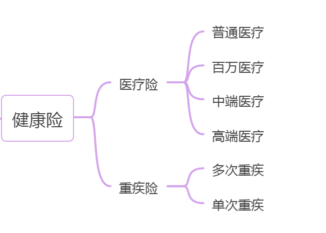

健康险保的是健康, 从小病小灾到重疾癌症, 它都能覆盖.

它分为两种: 重疾险和医疗险.

我们先来给大家区分下两个健康险的区别, 再分别和大家介绍下这两个保险的分类.

## 1. 医疗险和重疾险的区别:

医疗险是报销型, 看病花了多少报多少.

重疾险是给付型, 也就是只要患了重疾, 重疾险会一次性把钱给你.

举个例子, 水小星分别买了一份 100 万的重疾险和一份 100 万的医疗险.

如果水小星不幸罹患了重症, 即使手术费用只有 5 万. 只要符合合同规定, 重疾险保险公司也会赔付 100 万, 这多出来的 95 万就可以用来补偿工作收入损失费, 住院期间生活费, 房贷支出等等, 甚至想要拿去旅游放松身心都是可以的.

而医疗险的报销和社保有一点相似. 按照免赔额和赔付比例的约定, 对所花费用进行报销. 说人话就是水小星的医疗险报销费用不会超过 5 万这个数. 至于理赔多少要看实际花销, 跟保多少, 花多少, 花到哪里都有关.

## 2. 重疾险和医疗险的分类

先说重疾险, 目前市场上的消费型重疾险可以分为单次赔付重疾险和多次赔付重疾险

单次重疾险就是说如果发生一次重大疾病, 理赔后合同就会终止.

而多次赔付重疾险是第一次出险理赔之后, 合同仍然有效, 下次如果得了其他重大疾病还能赔付.

一般情况下, 多次重疾险的费用高于单次重疾险, 如果我们预算充足的话, 可以优先考虑多次赔付重疾险.

不论单次重疾险还是多次重疾险, 一般都有一项"霸王条款", 叫做: 保费豁免.

就是在保障期内, 如果被保险人生病出险了, 无论是发生轻症(程度较轻的重大疾病)、中症或重疾, 后面剩余的保费就都不用再交了.

医疗险的类别就比较多了, 我们可以称它们为医疗四兄弟. 具体区别如下, 大家可以学习了解.

这里和大家解释一个概念, 免赔额. 顾名思义就是免赔的额度. 损失额在免赔额之内的, 保险公司是不负责赔偿的, 需要被保险人自行承担.

这四兄弟各有所长. 比如高端医疗险看起来很不错, 可是确实是贵. 比较适合保障预算较高, 同时对就医体验要求比较高的用户, 比如在就医时需要享受 vip 待遇, 不想排队、需要专门服务等这种需求的人.

如果财务状况比较有限, 选择一款性价比比较高的百万医疗险或者中端医疗险也就够用了.

重疾险和医疗险一个是在确诊的时候就给付的, 可以缓解一部分没钱治病的困境, 一个是在治疗后实报实销的, 它们互为补充就像是一对搭档.
