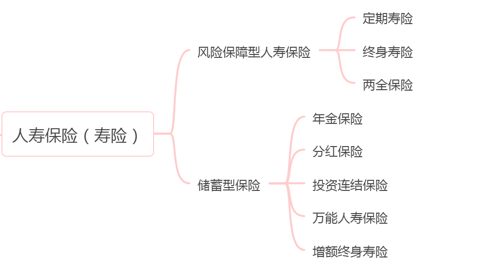
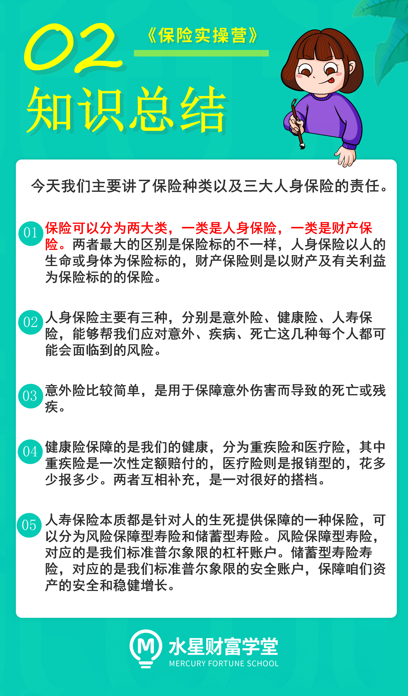

寿险是以人的生死作为保障对象的保险, 可以分为风险保障型寿险和储蓄型寿险.

其中, 风险保障型寿险可以分为定期寿险、终身寿险和两全保险. 对应的是我们标准普尔象限的杠杆账户, 抵御的是人生三个风险之一的死亡风险.

储蓄型寿险则分为年金保险、分红保险、投资连结险、万能人寿保险和增额终身寿险五种. 对应的是我们标准普尔象限的安全账户, 保障咱们资产的安全和稳健增长. 所以这个部分我们会在后面的课程为大家详细讲解.

老师来举个例子, 帮大家区分下三种风险保障型寿险.

比如王小保在自己 28 岁这一年给自己买了份缴费 20 年, 保障 30 年的定期寿险, 那么在这 30 年间, 不管他是因为车祸、意外、飞机失事还是其他原因挂掉了, 就能获得保险公司的保险金赔付. 但是, 如果 30 年 58 岁后, 他还活的好好的, 那和保险公司的合同就会终止, 即定期寿险只保障一定时间内的身故风险.

同理如果他买的不是定期而是终身寿险, 保障期限就由定期延长到了终身.

再比如王小保也给自己买了一份 30 年期的两全保险, 那么同样的, 30 年他因种种原因不幸离世, 都会获得一笔赔偿金. 但是如果他生命力十分顽强, 活到了 30 年保险期满, 保险公司还是得给他一笔钱 .

一句话总结就是定期和终身寿险只管死, 而两全险是既管生也管死的.

好啦, 今天的内容就到这里, 一起来总结下吧.

