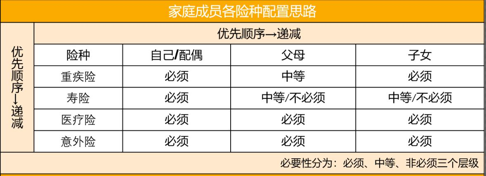

各位小伙伴们好呀, 欢迎大家进入今天晚课的学习啦~

大家都准备好笔记本和自己的小脑袋哦.

好啦~话不多说, 咱们直接进入正题.

刚来到实战营的小伙伴, 大都想用【最少的钱】, 买到【性价比最高】的产品, 给自己【最全的保障】.

毕竟都是拥有理财思维的人, 要把每一分钱都花在刀刃上~

不过那么多产品, 那么多责任条款, 那么多投保须知, 简直看到怀疑人生……

不过别担心, 其实没那么复杂, 班班今晚就带大家理一下保险配置思路~

保险的本质是为我们转移风险.

因此, 需要配哪种保险、按什么优先顺序配, 基本上取决于我们面临的风险种类、大小.

如果把风险比作窟窿, 配置保险的思路就是: 先看有哪些窟窿要补, 再看哪个窟窿又大又急, 就哪个先补.

具体怎么做呢? 大家跟着班班一步步来看～

## 第一步, 列出自己可能遇到的风险种类

这个咱们音频课也强调了, 我们可能遇到的风险通常有:

1、死亡

2、疾病

3、意外

提到受伤/残疾, 很多小伙伴会问, 那这种属于啥范畴? 其实这一部分已经包含在意外中啦, 比如被高空坠物砸中、打篮球骨折等等, 都是意外受伤的.

## 第二步, 找到可以转移这些风险的保险种类.

1、死亡——死亡都可以由【寿险】保障, 其中因意外死亡还可以由【意外险】保障;

2、疾病——重疾由【重疾险】与【医疗险】组合搭配保障, 小病可以用【社保】保障或者自费;

3、意外——由【意外险】保障.

总结来说, 寿险、重疾险、医疗险、意外险这四大险种, 都是我们需要的.

那句话怎么说来着, 小孩子才做选择, 成年人当然是全都要~

理清了我们需要哪些保险, 接下来, 也是最重要的一步——

## 第三步, 给需要配置的保险排个优先顺序

OK, 弄清楚配置的优先顺序呢, 就能让我们有限的保费, 合理分布, 发挥最大的价值~

那么, 要怎么排保险的优先顺序呢?

我们都知道, 保险的作用就是转移带来巨大损失、甚至无法承受的一些风险, 所以风险带来的损失大小, 是在我们配置保险时首先考虑的因素.

那风险带来损失的大小如何评估呢?

我们可以将损失量化, 说白了, 就是看发生风险后需要花的钱.

比较一下每种风险发生后我们需要多少钱, 就能知道哪个风险发生后, 我们的损失最大.

那带来损失最大、我们最承担不起的风险, 肯定就得先用保险来转移.

大家跟着班班逐一来分析一下～看看哪种风险发生后, 需要的钱最多.

这里班班就王小保举例子吧.

### ① 死亡

假如王小保不幸身故, 他的父母就会面临无人养老的风险, 而且家中的主要经济来源也断了, 房贷更是没人还.

如果王小保这个阶段有了孩子, 孩子未来的教育支出、生活费, 更是没着落.

因此, 对于王小保来说, 就需要寿险为他解决这些后顾之忧.

需要解决的损失有: 父母的养老金、生活费、负债、孩子的教育金.

### ② 疾病

假如王小保得了重疾, 需要大笔的钱来治病、康复, 不仅会掏空家里的积蓄, 甚至会因为借钱治病产生新的负债.

更不用说父母没了养老金、家中断了收入来源、没钱还房贷的情况了.

因此, 如果得了病, 需要的资金不仅有父母的养老金、生活费、负债、孩子的教育金, 还有大笔的治疗费用.

针对疾病风险的转移, 有【给付型的重疾险】和【报销型的医疗险】.

医疗险的覆盖范围广, 只要是住院产生的合理且必要的费用, 扣除免赔额后, 符合合同保障责任的均可报销.

不过医疗险是报销制度的, 花多少, 报多少.

举个例子, 之前有个小伙伴来问班班一款 600 万的医疗险怎么样, 怎么说呢, 大家不要被数字蒙蔽了眼睛, 先不说 600 万的医疗险好不好, 咱们得先确保需要拿出 600 万来看病呀, 所以, 这个维度来说, 作为一年期的医疗险, 百万医疗的补充是足够的了.

知道了医疗险的前提是实报实销后, 重疾险一次性给付的保险金额就显得尤为重要了, 就能用作康复费、生活费、支付贷款等, 帮助家庭度过其他方面的经济风险.

因此, 从弥补损失大小的角度来说, 重疾险的功能强于医疗险.

那和寿险比较的话, 重疾险、医疗险的情况如何呢?

从弥补损失大小的角度, 其实我们可以排出优先顺序的:

重疾险>寿险>医疗险

医疗险只能报销医药费, 和寿险比起来, 能提供的经济支持有限.

而相比较寿险, 重疾险还得承担额外的治疗、康复费用, 帮助更大.

我们再来看最后一个险种——

### ③ 意外

意外所涵盖的风险跨度很大, 小到骨折, 大到死亡, 都可以获得赔付, 赔付金额也可以从几千到几十万不等.

因此, 单纯从弥补损失大小的角度来看, 我们没办法把它和其他三个险种比较, 只看发生概率就好啦~

因此, 从弥补损失大小的角度来看, 保险配置的优先级顺序是: 重疾险>寿险>医疗险>意外险.

当然, 这是以王小保的情况来排的, 是家庭经济支柱配置保险优先级的示例.

如果是给孩子配保险, 那寿险就属于最后的了, 因为孩子没有收入、不承担家庭经济责任, 所以没有必要配置寿险.

那么, 综合一下, 就可以得出家庭支柱的优先配置顺序了, 那就是: 重疾险>寿险>医疗险>意外险.

如果说配置保险是一件铠甲, 能够帮我们转移风险, 那么, 重疾险就是护在胸前最重要的那一块, 寿险是后背的那一块, 医疗险和意外险则是四肢上的护甲.

我们在给自己锻造铠甲时, 一定要把最坚固的材料用在胸前的那块护甲, 也就是重疾险上, 把最大的风险转移掉, 再配上寿险、医疗险和意外险, 给自己全面的防护.

千万不能只配意外险、医疗险就觉得万事大吉了. 因为如果这时候敌人一刀捅入你的胸口, 四肢上的铠甲再厚也没有用处.

有了保险配置的优先顺序, 是不是我们所有人都按照这个顺序呢?

当然不是~

不同人生阶段, 每个人面临的风险和承担的家庭经济责任都不同.

因此也要区别考虑. 参考下图:

保费的预估, 需要大家根据家庭经济情况和家庭风险值来计算一下哦～

需要再次提醒的是: 以上方案仅供参考, 切勿直接模仿

因为投保是件严谨的事情, 要有专业的理财规划师结合个人实时的年龄、职业、健康等情况, 配置方案并协助投保, 以避免后期理赔纠纷.

半年内(尤其是临近生日)有配置保险需求的小伙伴, 可以从现在开始, 通过私聊班班申请【水星的专业理财规划师】进行协助.

实战营期间限额免费, 不要太感动哦~

接下来, 我们还要考虑两件事:

### 1. 确认预算

如何用 5%-15%的家庭年收入, 尽可能买到全面的保障. 这里, 5%-15%的年收入就是我们购买保险的预算.

中国保险监督管理委员会北京监局也曾发过一篇文章, 提及到:"一般来说, 保费支出在年收入的 5%-15%之间为宜".

如果简单地划分, 可以先以家庭或个人年收入的 10%为标准, 进行整体保费测算.

当然, 实际情况中也会有上下波动的幅度, 很正常. 比如说班班, 在一开始的时候就用 10%的年收入作为保险预算.

在实际配置的时候, 如果费用稍微超出了一点, 占到了年收入的 12%. 不过班班觉得, 这 12%花的很值, 配置的保障很全面, 未来收入也会增长, 而且也没有超过 15%, 还能接受, 于是就按照 12%来配置啦~

小伙伴们也可以像班班这样, 按照实际情况以年收入的 10%~15%为基础来灵活调整, 具体配置还是因人而异哦

### 2. 确定好每个险种的保额

保额没买够, 出事了就起不到转移风险的作用, 或者效果甚微.

想一想, 太薄的盔甲, 可抵御不了敌人的刀剑攻击呀!

因此, 四大险种的保额买多少非常重要哦~

大家知道怎么计算自己/家人的保额吗? 两个公式帮你搞定

1. 重疾险保额合理建议—— 常规建议 30 万(治疗费用)+3 年年收入(收入补充)

首先我们要了解重疾险保额应该涵盖的内容:

第一类, 也是最容易理解的, 罹患重大疾病所面临的相关医疗费;

第二类是间接相关的营养、护理费用, 患重大疾病经过合适的治疗还是可能较长期生存的, 那么身体恢复的营养费用, 治疗期间的陪护费用(无论是家人亲自陪伴还是请护工家政), 都会让家庭面临经济风险;

第三类是因病不能工作, 家庭收入的损失, 覆盖这部分费用是个人生活品质的保障, 也是对家人的责任.

同时考虑到抵御通货膨胀, 合理的重疾险保额规划建议为: 短时间, 假设有社保(如无社保需再加社保覆盖的部分), 基础保额是 30 万; 理想保额在 30 万的基础上加上个人年收入的 3.5 倍.

2. 寿险保额=未来 10 年的⽀出+未来 10 年的负债+⽗⺟赡养费⽤+⼦⼥教育费⽤-现有流动资产

结合上文, 寿险需要解决的损失有: 父母的养老金、生活费、负债、孩子的教育金.

将这些风险量化就是寿险的保额啦~

3. 医疗和意外险

因为目前市面上的医疗险都是百万医疗, 动辄几百万保额, 完全够用啦. 所以医疗险的保额咱们不用额外去计算.

而意外险, 因为意外险我们最经常用的的是意外医疗部分, 不同于重疾和寿险, 买多份可以叠加赔付. 意外医疗部分不管咱们买几份都是只报销一份的, 所以通常情况下咱们买意外险的时候选择一个合适的意外医疗报销额度就可以了, 不用单独计算保额.

好啦, 以上就是咱们今天课程的全部内容啦~

最后, 班班再强调一下:

今天的分享, 主要是保险配置方案中最重要的思路梳理. 大家一定要好好吸收, 把它都掌握.

保险配置是个动态的过程, 随着人生阶段的变化, 我们的保险需求会随之变化.

那时候, 就需要增加、补充保险, 以适应新的风险和需求.

但是, 无论需求怎么变化, 配置保险的思路和原理是不变的.

即根据我们面临的风险的紧急程度, 和带来损失的大小, 决定保险的配置顺序.

因为, 掌握这套思路才最关键, 它会让我们终身受用.

同时有任何问题, 也可以咨询我们的理财规划师哦~

最后, 班班再强调一下: 保险也不是一个产品适合所有人, 每个人的健康情况、家庭经济情况、职业情况也都是不一样, 适合的产品自然也不一样.

总之呢, 专业的事儿还是得找专业的人儿, 我们背后有强大的理财师天团, 有配置需要的小伙伴一定要抓紧时间私聊班班, 排队申请理财师以免后期队伍拥挤哦, 不要害羞, 名额很难得.

今天的晚分享就到这里啦~小伙伴们有问题记得群内【提问】哦~
