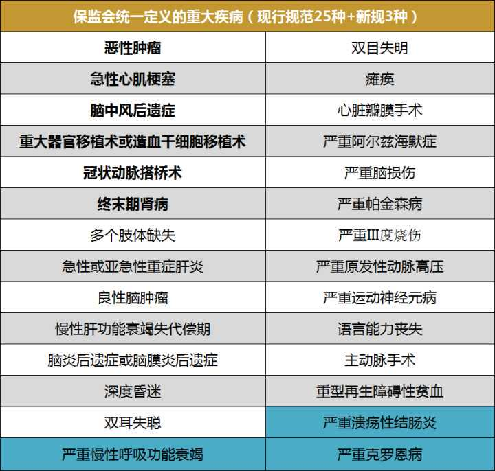
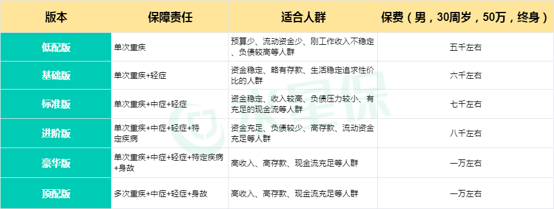
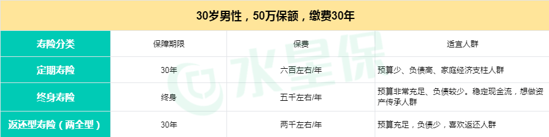
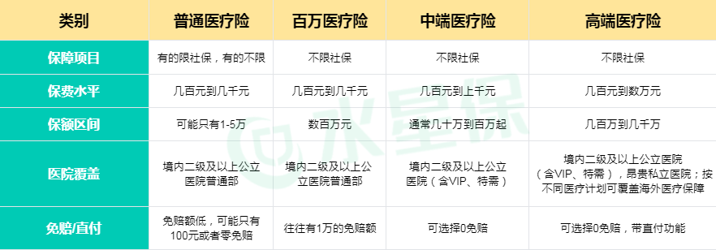
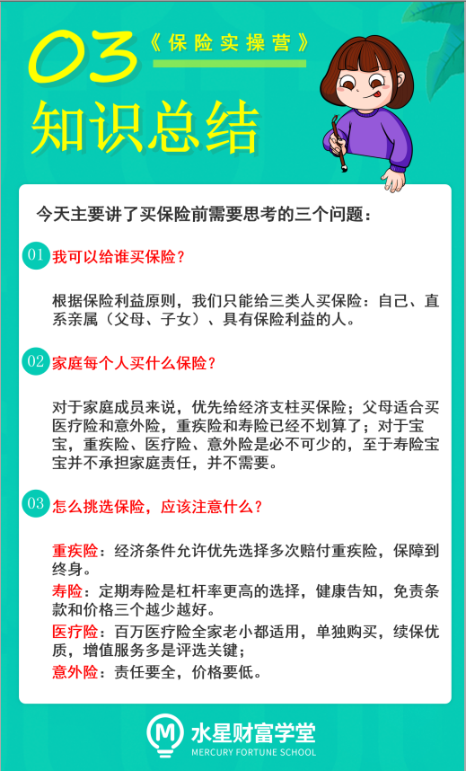

各位同学们, 小伙伴们大家好.

欢迎来到《保险实操营》. 懂原理, 不踩坑; 少花钱, 买对险.

上节课咱们一起了解了保险的种类和三大人身保险的保障内容. 理论基础打好了, 这节课就给大家上实操知识了.

我们要怎么结合家庭实际情况为自己挑选最适合的保障呢? 且听这回分晓. 全程高能, 大家一定要跟上节奏.

开始之前, 我们先思考一个问题, 大家平时去买菜的时候, 是习惯先列好清单, 按清单一个个买, 还是到菜市场之后看上哪个买哪个呢?

相信这两种习惯的同学都有. 但是咱们买保险呢, 并不是像买菜一样买一次吃几天, 像长期保险如重疾险和寿险, 那是买一次保终身或者几十年的事. 肯定要认真对待, 所以在开始买菜, 哦, 不是, 买保险之前. 我们要先列好适合自己的清单.

买保险第一步-列清单

1. 我可以给谁买保险?
2. 家庭每个人买什么保险?
3. 怎么挑选保险, 应该注意什么?

小伙伴们拿出自己的小本本, 我们一起来依次梳理下这三个问题.

## 我可以给谁买保险?

正所谓保险不是你想买, 想买就能买. 根据保险利益原则, 我们只能给三类人买保险: 自己、直系亲属(父母、子女)、具有保险利益的人.

什么是具有保险利益的关系呢? 比如自己、配偶、子女、父母, 或者与投保人有抚养、赡养或者扶养关系的家庭其他成员、近亲属; 还有与投保人有劳动关系的劳动者, 这些都是具有保险利益的人.

总结下, 我们可以给自己、子女、父母、员工以及与我们有抚养、赡养或者扶养关系的家庭其他成员、近亲属的人买保险. 如果想给这些以外的人买保险, 一般需要证明具有保险利益才可以的哈~

## 家庭每个人买什么保险?

有的小伙伴可能会疑问, 每个人不是都会面临生老病死这些风险, 那不是三个人身保险都需要吗?

是的, 生老病死是我们每个人都会面临的. 但是保险不能减低风险的发生概率也不能减少风险带来的心理和生理打击. 它唯一能做的, 只有减少风险带来的经济损失.

所以, 理智一点想, 谁发生风险后对家庭带来的经济压力越大, 就应该给谁优先配置保险. 所以在优先顺序上家庭支柱优先, 非经济支柱次之.

### 1、经济支柱

对于家庭成员来说, 经济支柱最重要的是活着. 而且必须是健康地活着, 这样才能保障必要的经济收入和持续的运转.

所以对于经济支柱来说, 寿险、重疾险和医疗险、意外险这四个保险是必不可少的, 预算充足的可以买终身重疾+定期寿险+医疗险+意外险.

还有一点要说明的是, 虽然全职妈妈和全职爸爸在经济上看起来好像没有明显贡献, 但是别忘了, 正是因为他们集中一方对家庭的照顾, 另一方才有足够精力出去打拼. 如果同样的活儿请人来做且要做的还不错的话, 也是一笔不小的开支.

所以, 预算不是特别紧张的, 全职爸爸和全职妈妈的保障尽量也按照经济支柱的标准来.

### 2、父母

很多小伙伴会很关心父母的保险配置, 他们年龄大了, 身体抵抗力不如年轻人. 如何给他们配置呢?

一般市面上适合父母购买的保险产品比较少, 因为保险公司会根据大多数人的发病几率来经营保险, 把风险控制在可预测的范围内. 而父母年龄大了, 风险相对高, 尤其是到了 60 岁以后, 生病的情况会比较多.

所以虽然我们比较有孝心, 也知道父母年龄大了容易生病, 保险公司也知道, 没办法. 保险还是有门槛的, 不是说有钱就能买到. 那么我们要怎么做呢?

我们可以在买寿险的时候, 给自己买, 但是受益人写成父母. 其次, 可以给父母再配上医疗险和一年百来块的意外险, 重疾险一般就不必了, 健康状况门槛高不说, 就算配上了也划不来.

### 3、子女

那么对于宝宝来说呢? 很多人在宝宝一生下来就想给宝宝买个保一辈子的寿险. 可怜天下父母心, 但是其实这样性价比并不高.

宝宝面临的主要的问题, 其实就是健康的长大. 生了病一定要有钱去治疗, 其次宝宝还容易可可磕磕绊绊, 重疾险、医疗险、意外险是必不可少的.

至于寿险, 宝宝并不承担家庭责任, 所以并不需要.

## 怎么挑选保险, 应该注意什么?

刚才我们提到了好几种产品, 有重疾险、定期寿险、医疗险、意外险. 那么这几种险我们分别该怎么挑选, 应该关注的重点在哪呢?

### 1、怎么挑选重疾险?

重疾险, 顾名思义, 保的是重大疾病. 比如常见癌症、脑血管疾病, 我们身边亲戚朋友里, 或有遭此不幸. 一旦身患重疾险, 不仅治疗需要高昂的费用, 而且可能几年无法工作, 给家庭造成很大损失.

随着现代医疗的进步, 得了大病, 不等于判了死刑. 但高昂的治疗费, 30 万~50 万起.

癌症, 如果用到先进的靶向治疗、质子重离子治疗, 费用突破百万也有可能. 而且一病三五年, 康复护理需要钱, 而且生病期间的房贷, 怎么办?

这就不得不说起重疾险, 一旦得了某些理赔标准的疾病, 重疾险会把钱一次性给你.

在 2007 年, 中保协会制定了初版的重疾定义标准, 规定 25 种常见高发的重疾, 一律采用统一定义, 各家保司理赔一样. 而这 25 种重疾, 实际占到了理赔的 95%以上.2021 年, 保险新规发布, 在原来 25 种疾病上又增加了 3 种.

既然理赔概率高的种类每个上架的重疾险都包含了, 那我们挑选重疾险还应该看什么呢? 给大家三个筛选标准:

筛选标准 1: 看轻症、中症是否包含

轻症和中症是重大疾病前期较轻的疾病, 没有达到重疾的理赔标准, 但也是重大疾病早期病变了导致的, 重疾中有轻症和中症的话, 也是可以减轻我们的经济压力的.

并且重疾是有包含轻症、中症豁免(即我们上节课说的霸王条款), 当发生轻症或中症以后, 如果还有保费没有交, 那后续的保费就不用交了同时保障继续有效.

筛选标准 2: 看重疾中是否强制绑定身故责任, 优先选择身故责任可选的产品.

目前常见的重疾产品将身故责任做为可选责任附加在重疾当中, 一般是建议大家重疾和寿险(身故险)分开选产品进行保障.

因为重疾当中有身故责任一方面保费会高于不含身故的重疾险. 同等保费下, 含有身故责任的重疾, 保额会少; 另一方面重疾中包含身故责任, 重疾赔付和身故赔付只能二选一, 当发生重疾理赔以后, 身故责任就不再进行赔付. 所以如果强制绑定的话, 对于消费者来说性价比确实不高.

对于一般家庭来说我们首要做的是保额优先原则, 选择不含身故的重疾, 在同等保费下选择更多的保额, 在遇到重大疾病的时候更能解决实际的经济问题. 那对于身故责任我们可以用寿险来覆盖.

筛选标准 3: 多次重疾尽量选择不分组的产品.

单次和多次重疾险上节课我们介绍过, 区别主要是重疾赔付一次还是赔付多次. 预算不是很紧张的情况下, 优先选择多次赔付重疾险.

分组也很好理解, 就相当于把不同的疾病装进一个篮子里, 有多少个篮子就相当于多少个组. 如果一个篮子里
面的某一种疾病赔付过了, 那这个篮子里的其他疾病也无法获得理赔了.

所以不分组的重疾险产品赔付概率是优于分组产品的, 咱们首选多次不分组赔付的产品.

那如果因为身体等原因无法配置多次不分组的, 那么多次分组的重疾险咱们也要注意. 最好赔付概率最高的恶性肿瘤是单独分组的.

除了三个筛选原则, 还给大家整理了个表格, 是不是很贴心. 咱们可以作为参考, 但是实际配置的时候建议还是咨询下专业的理财规划师的意见哦~

### 2、怎么挑选寿险?

上节课我们说到, 风险保障型寿险可以分为定期寿险、终身寿险和两全保险.

(1)定期寿险: 咱们利用保险做杠杆账户, 就是想用非常少量的资金, 抵御最大的风险. 而定期寿险作为消费型的产品, 保障是十分丰厚的. 所以在杠杆账户中, 会更推荐大家选择性价比最高的定期寿险抵御身故风险.

(2)终身寿险: 保障期限为终身. 人固有一死, 所以终身寿险是百分百可以赔付保额. 比较适合做资产传承. 保费价格也比较高.

(3)两全保险: 保生也保死. 看似是两全其美, 但是因为它的保障年限通常比较短, 对于我们来说其实是花比定期寿险高几倍的钱获得的是一样的保障, 所谓的返还只不过是羊毛出在羊身上.

对比三种寿险的不同特征, 定期寿险综合杠杆率是最高的, 接下来我们来总结下定期寿险的筛选标准, 一共三个筛选标准:

筛选标准 1: 保费是否更低?

定期寿险的保障责任都是相同的, 保障身故和全残, 所以定期寿险要关注相同责任下, 哪一款的价格更低.

筛选标准 2: 健康告知是否宽松?

健康告知内容越多, 对我们身体情况的要求也越高, 所以定期寿险的健康告知, 咱们可以关注哪一款的健康告知内容更少.

筛选标准 3: 免责条款内容是否更少?

免责条款的内容就是保险不赔偿的部分, 当然是不赔偿的情况越少, 对我们越有利. 银保监会规定的定期寿险的免责条款有以下三条. 如果某款定期寿险的免责只有这三条, 那么可以认为它的免责条款内容是很少的.

怎么样, 有了三条标准再也不用担心我的寿险买坑. 当然啦, 实际配置的时候建议还是咨询下专业的理财规划师的意见哦~

### 3、怎么挑选医疗险?

上节课我们为大家介绍了医疗险四兄弟. 这里简单复习下这几种产品分别的适合人群.

对于小孩子来说呢, 因为身体抵抗力差, 经常会有小感冒发烧, 去个门诊可能也要花费个几百上钱快, 那么普通(小额)医疗险对他们来说就比较实用. 一年几百元, 一般是 0 免赔额. 门诊住院都能报. 再搭配一款百万医疗险, 齐活了.

对于成年人来说, 市面上的普通(小额)医疗险几乎没有, 那么一款价格低廉, 保障全面的百万医疗险是个很好的选择. 当然对就诊有更高需求的小伙伴也可以考虑中、高端医疗险, 价格也会更高.

对于老人来说, 他们的身体情况如果允许, 买百万医疗险是最经济实用的. 但是不少老人因为三高, 心血管疾病等原因被医疗险拒之门外. 这时候他们可以考虑缩小版的医疗险-防癌医疗险. 从字面上理解, 就是只保恶性肿瘤产生的住院医疗费用. 特点是投保年龄范围广、健康告知宽松、价格便宜.

知道了不同医疗险适合的人群, 接下来我们来总结下医疗险的筛选标准

也是三个筛选标准:

筛选标准 1: 是否不需要搭配主险就可单独投保.

有些医疗险它是需要搭配终身寿险或者终身重疾险才可以购买, 这种我们尽量避开. 虽然看起来好像省事了, 给咱们一键打包四个产品, 但实际上更像是流水线工业, 样板化严重, 价格还高昂. 还是结合咱们自己家庭情况的 DIY 组合产品更私人订制, 量体裁衣.

筛选标准 2: 续保时是否要做健康审核

这条只针对百万医疗险. 其他医疗险一般是一年一保的. 其实最早期的百万医疗险也是一年一保, 第 2 年如果产品下架或停售, 我们就需要重新投保其他百万医疗险, 但随着年龄增长健康问题增加, 我们不一定可以再买到百万医疗险产品.

所以现在市面上也出现了承诺可以连续 5 年、6 年、20 年续保的百万医疗险. 此类产品不同于一年期的百万医疗险, 他们在合同中明确标明不会因为健康状况发生了变化或因产品停售而无法继续投保. 显然保障续保的百万医疗险是当下更适合我们选择的百万医疗险类型.

筛选标准 3: 是否有增值服务

一些百万医疗险会有支持院外购药、是否支持绿通、住院垫付这些加分项, 有的话最好. 因为一旦发生的大病, 我们都想要有更好的药品来进行治疗, 如果医疗险不支持院外购药, 那进口药、特效药都需要我们自费, 压力会很大, 所以在挑选时, 所以尽量选择支持院外购药的百万医疗险.

### 4、怎么挑选意外险?

上节课咱们了解了意外险是居家旅行必备之良品. 那怎么来挑选呢, 相信已经有小伙伴抢答了, 我知道, 老师, 有三个筛选标准! Nonono, 买意外险这件事太简单了, 咱就不上标准了, 上顺口溜.

一个不能少, 两个加分项.

不到三百块, 能买五十万.

不买长期型, 不买返还型.

我们来一句句拆解下, 一个不能少指的是意外险的三个基础责任缺一不可.

(1)意外身故: 和寿险类似, 保障的是身故责任, 区别在于意外身故责任只保障意外原因导致的身故, 非意外原因只能靠寿险来保障.

(2)意外伤残: 指因为意外残疾了, 保险公司按照保额乘以伤残等级, 赔付一笔钱. 一级残疾最严重, 赔付保额 100%, 三级残疾赔付 80%, 以此类推. 举个栗子, 杨过杨大侠, 一肢完全断裂, 属于 5 级伤残, 假设他穿越买了一份 100 万的意外险, 那么能赔付 60%保额, 即 60 万.

(3)意外医疗: 这个责任就很实用了, 平时咱们小意外比如猫抓狗咬, 跌打损伤. 需要去门诊或者医院治疗. 这时候意外医疗就派上用场了.

两个加分项指的是猝死责任和医疗津贴.

猝死大多数是因为本身有心脏方面问题导致的, 责任界定上来说不属于意外. 但是部分意外险公司会把它作为吸引客户的责任加到意外险中来, 带上猝死责任, 996 加班更安心.

而住院津贴就是住院补助, 比如骨折了保险公司按天给咱们发一笔几百元补助费, 可以抵扣咱们住院期间伙食费. 怎么样, 是不是很心动!

那么责任这么多这么实用的意外险费用如何呢? 不用 998, 不用 888, 只要 300 块, 50 万保额就能带回家.

有的同学可能会说了, 老师, 为什么我买的意外险一年要大几千块, 还只保身故呢! 有这样疑惑的同学, 大概率是入了长期型意外险和返还型意外险的坑了.

用你们聪明的小脑袋瓜算下, 把买长期意外险和返还型意外险的钱放在余额宝, 它不香吗?

好了, 以上就是这节课的全部内容了, 一起来总结一下.

这节课内容全程重点, 希望大家全篇通读三遍. 当然专业的事情找专业的人, 大家也可以预约理财规划师进行交流, 他们对于市场上保险产品和适合人群有着丰富的配置经验, 相信可以帮助到大家. 好了, 我们下节课见呀.
