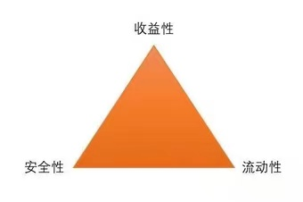

各位同学们, 小伙伴们大家好.

欢迎来到《保险实操营》. 懂原理, 不踩坑; 少花钱, 买对险.

我们一起简单回顾上节课内容, 上节课一起了解了四个人身保险的筛选原则:

可以给谁买保险? 自己、子女、父母、员工、以及与我们有抚养、赡养或者扶养关系的家庭其他成员、近亲属的人.

家庭每个人买什么保险? 家庭经济支柱, 四个人身保险都需要; 老人可以配置医疗和意外险; 小孩重疾医疗意外险必不可少.

怎么挑选保险? 重疾险: 经济条件允许优先选择多次赔赔付重疾险, 保障到终身. 寿险: 定期寿险是杠杆率更高的选择, 健康告知, 免责条款和价格三个越少越好. 医疗险: 百万医疗险全家老小都适用, 单独购买, 续保优质, 增值服务多是评选关键; 意外险: 责任要全, 价格要低.

通过前面两节课的讲解, 咱们对于撑起杠杆账户的四个人身保险都已经熟悉完啦(还不熟悉的小伙伴多复习几遍哈)

接下来两节我们将会带大家详细规划存放着我们大多数钱的安全账户.

这个账户对我们至关重要, 里面的钱是我们对未来的规划, 包括养老, 子女教育等刚性需求, 所以一定要保证本金不能有任何损失, 并要抵御通货膨胀的侵蚀. 也就是安全理财, 实现财富稳稳增长.

在前面课程中我们提到过, 具有投资理财属性的储蓄险是个很好的工具. 包括四种投资理财险以及新品种增额终身寿险. 这节课我们会带大家对比分析多种储蓄险, 从投资品角度分析储蓄险的独特价值. 并且详细讲解五种理财型保险, 做到优中选优.

说到理财, 就不能不提理财的"不可能三角"

理财的不可能三角: 没有任何一个活动, 可以同时兼顾流动性、安全性、收益性, 这三者往往此消彼长, 无法兼得.

① 如果安全性很高, 流动性也很好, 那么收益率就会比较低;

② 如果收益率不错, 流动性也不错, 那么风险就会很大;

③ 如果收益率不错, 安全性也很高, 那么流动性就比较差, 需要长期持有;

也就是说如果有人说一款产品它收益率很高, 安全性很高, 流动性更高. 那么你要小心, 很有可能是新版 p2p.

而我们对于安全账户资金的要求是安全性要很高, 流动性要不错, 可以牺牲一点收益率, 不用太高, 但是一定要稳定.

带着这个标准, 我们来看看市面上的投资理财产品, 做个横向对比, 把低风险资产进行对比.

首先先排除掉高风险的基金和股票. 它们的收益伴随着一定的风险, 属于咱们第四个风险账户适配的产品.

再排除掉房地产, 具备资产升值价值的房产需要动辄几百万的投入, 资金投入大不说还有很多购买门槛: 比如户口、限购各种政策卡着. 而且现在的局势也很明朗了: 房住不炒, pass.

现在只剩下四种低风险的资产: 银行存款、国债、货币基金和储蓄险. 安全性上, 银行存款、国债和保险都是事关民生的问题, 不用太过担心. 而余额宝和零钱通等货币基金咱们可以说是天天见了. 那我们就来对比下它们的流动性和收益性.

## (1)储蓄险收益率更高

不用多说, 储蓄型保险可以说是秒杀了其他三种低风险资产的收益率.

这里再和大家举个栗子解释下单利和复利的区别. 别看只有一字之差, 同样 10 万元进行储蓄, 5%的复利相比单利:

10 年后, 可以多拿 12, 889 元, 相当于 6.3%的单利;

20 年后, 可以多拿 65, 329 元, 相当于 8.3%的单利;

40 年后, 可以多拿 403, 999 元, 相当于 15.1%的单利.

所以大家千万别小看几个投资品之间零点几的利率差, 加上复利的发酵, 理财型保险几十年的收益率竟然可以高达十几个百分点. 而且小伙伴们请注意, 这个稳定利率是锁定利率, 保单成立后一直到合同结束可以一直保持利率增长.

## (2)储蓄险还可以锁定高收益

这意味着什么, 咱们举几个栗子你就知道了.

先来看看中国央行定期存款的走势变化, 你敢相信吗?

在 1993 年的时候, 我们的一年期银行利率还高达 10.08%, 而在 2015 年的时候这个数字已经降到了 1.5%.

而从全球视角来看, 利率下降更是很正常: 从 14 世纪初期到现在, 利率已经持续了 700 多年, 一直保持着稳定的下降趋势. 发达国家的基准利率都在 2%以下, 像日本实行的是零利率, 欧洲一些国家实行的是负利率, 也就是存钱不仅没利息, 还得给银行交一笔"管理费" .

借用前银行行长周小川的话, 十年后想买一款年化收益率在 3%的理财产品可能要像汽车牌照一样靠运气了.

我们再看看天天接触的余额宝, 七年前余额宝刚成立时, 年华收益最高达到 6.8%, 一时成为人人疯抢的香饽饽.

而最近一年里, 余额宝的收益已经跌破 2%, 大部分时间内都在 2.5%左右波动. 而今天, 余额宝的收益只有 1.9%.

那么储蓄险呢? 保险是唯一不受经济周期干扰, 长期稳定地复利的理财产品.

上个世纪 90 年代, 中国平安发行过一款预定利率 8%的年金险, 而当时的银行的存款利率达到了 10%左右. 换了是你, 会如何选择?

30 年后再来看一下, 银行的存款利率一路降到了 1.5%.

当时买银行存款的人, 现在只能拿到 1.5%的利率, 而当时买了年金险的人仍然享受着每年 8%的复利. 保险公司估计结果亏得裤衩都要没了: 投资收益下降, 到手赚的钱比白纸黑字承诺给投保人的还少, 只能自己掏钱补, 这就形成了巨大的利差损. 导致了平安每年因为这个产品的利差, 估计亏损达几百亿.

怎么样, 听到这里你是不是恨不得穿越回去买它几十万 8%复利的年金, 狠狠薅一笔保险公司的羊毛? 别想了, 过去的已经过去, 我们只能把握现在, 利用投资型保险锁定收益, 让 10 年后的自己笑看风云.

分析到这里, 相信大家已经很清晰了, 储蓄型保险是我们规划第三个账户, 实现资产稳定增值的不二之选. 那么五种储蓄险, 都适合规划养老、子女教育等刚性需求吗? 并不是的. 下一节让我们来一一分析看看~
