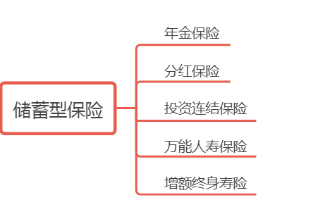
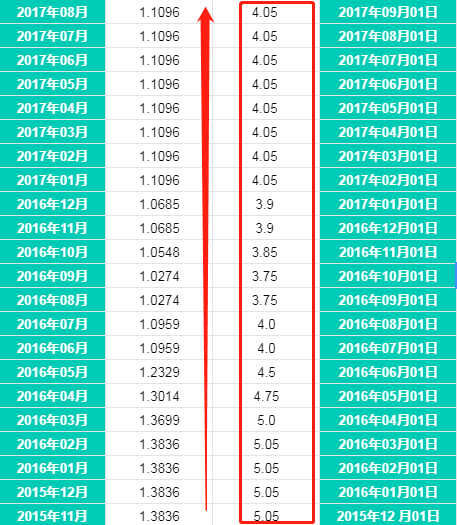
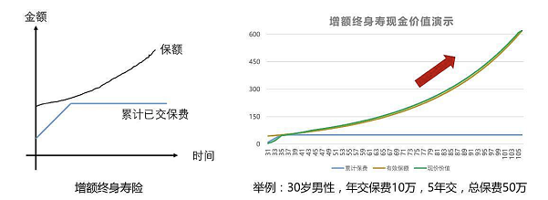
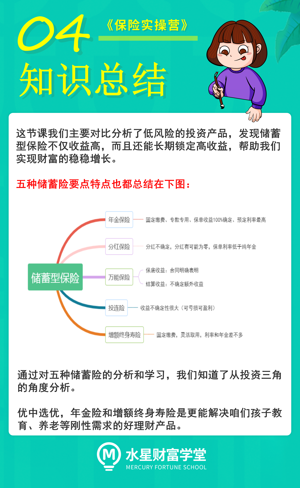

## 1、年金险

先说年金险. 按照合同规定, 你每年要交多少钱、交几年, 这些钱会在年金账户里按照预定利率进行复利增长. 到了领取年龄后, 可以按月、按或按季度, 领取一笔固定的钱.

从这个角度来说, 年金险相当于是一只可以超长待机的老母鸡, 可以一直给我们下蛋.

要想鸡下蛋, 我们得喂养. 可以选择一次性喂饱(一次缴费), 也可以选择定时投喂(按年缴费). 到了约定后的若干年, 母鸡就开始下蛋. 把这些蛋在不同的时间吃, 就有不同叫法.

大学时吃叫"教育金", 结婚的时候吃就叫"婚嫁金", 退休后吃就叫"养老金".

要点: 年金险的预定利率水平是四种投资理财型寿险中最高的. 保单利益 100%确定, 其主要特点就是固定交费, 专款专用. 这款很符合咱们第三个账户的的原则, 利率稳定, 锁定收益.

## 2、分红保险

分红险, 保险公司会根据分红保险业务的经营情况, 给大家分配红利. 不过, 保险公司会给一个保底的收益(很低)

很多人想当然的以为, 买了分红型年金险, 我就是保险公司的股东了, 以后可以共享保险公司的发展成果. 还是想的太简单了. 关于分红型年金险, 只提示一点: 分红是不确定的, 在部分年限可能为零.

实际上关于分红, 保险公司想怎么分就怎么分, 不给你分, 你也说不出毛病.

要点: 分红险的保单利率会低于年金险的收益率. 虽然有保底收益, 但是比较低而且分红收益取决于保险公司. 收益稳定性和收益率都低于年金险, OUT.

## 3、投资连结险

投连险是一种长期的理财型保险, 但实际上不确定性很大, 没有保底收益, 收益与风险都由用户自己承担.

这个投连险之于保险, 就像是山东、河南之于高考, 属于保险中的 Hard 模式. 投连险只适合能承担一定风险的人, 而无法实现安全账户的"安稳需求".

要点: 投资连结险不确定性太大, 更像是股票和基金, 用高风险博取收益. 不适合咱们低风险稳定收益的需求, pass.

## 4、万能人寿保险

所谓万能险, 你可以把它理解为保险公司的理财账户.

这个账户会有一个保底收益(保监规定最高不得超过 3%, 明确写在合同里) +结算利率(不确定的额外收益)

保底收益相当于保险公司承诺, 将来不管出现什么情况, 给你实际结算的收益, 一般都是白字黑字写进合同, 赖不掉的.

而看了那么多万能险, 我们发现, 某世界 500 强的大公司的万能账户的保底收益率可能只有 1.75%. 同样都是约定好 100%给付的, 那你为什么不直接选择一款保底收益高的产品?

别傻傻为品牌溢价付费. 而我们到手的结算收益又是多少呢? 根据各家公司投资能力的不同, 目前为 4%~7%不等.

但是请注意, 结算收益只能作为参考, 并不是确定的, 每月都会更新.

比如某世界 500 强的这款万能险:

(前 5 个月的销售季之后再也没有上过 5%的收益了)

咱们买产品的时候, 业务员一般会用中档收益(4.5%), 甚至高档收益(6%)来给客户做演示. 你看看就好, 不要太当真.

凡是高于保底收益的部分(结算收益), 未来都有无法实现的风险.

如果你的万能险到期开始返钱, 这笔钱你暂时又用不到, 可以选择让它进入万能账户, 继续涨利息, 但是前提是要先交一点管理费.

要点: 万能险既有保底收益也有结算收益. 但是和分红险一样, 这个结算收益有无法实现的风险. 总的来说收益率上年金险>万能险>分红险. 万能险不是最优选.

## 5、增额终身寿险

增额终身寿险, 顾名思义是一个保额不断递增的终身寿险.

它以人身寿命为标的物, 以被保险人死亡或全残为给付保险金条件, 且保险期间为终身. 区别于普通终身寿险的最大特点是保额随着时间变化而复利增长, 而且资金取用很灵活.

上面一段话看不懂没关系, 我们来拆解下. 看到复利和灵活两个词, 机智的小伙伴应该已经联想到了理财三角中的收益性和流动性两个特点.

收益性: 不同于传统的终身寿险. 增额终身寿险的身故保额比较低, 所以我们交给保险公司的钱, 不会消耗在保障成本上.

那我们交的钱在哪里呢? 会以现金价值的方式存在保单中, 并且每年以一定的复利增长. 它的复利利率和年金保险不相上下. 这个特性使得增额终身寿险摇身一变, 也变成一只可以一直生蛋的鸡.

流动性: 那么我们怎么取用? 我们来对比下年金险. 年金险的取用时间是买保险时就已经固定好了, 必须严格按照约定时间按时取用;

而增额终身寿险并没有规定固定的取用时间, 所以理论上我们随时可以通过"减保"的方式进行领取现金价值, 直到现金价值账户变为 0 为止.

当然我们都知道, 时间是复利最好的朋友, 只有够长时间的复利, 现金价值账户里的钱才会像雪球一样越滚越大, 太早开始取用就杀鸡取卵了.

总的来说, 可以看出, 增额终身寿的流动性比年金还要强.

要点: 增额终身寿险的复利利率和年金险利率不相上下. 而流动性会比年金险更灵活. 对比年金险的专款专用. 增额终身寿更像是在保险公司开了个身故保障+储蓄账户, 复利增长, 随取随用. 有了它我们就像有了一张灵活取用、以固定利率不断复利增长的大额存单.

通过对五种储蓄险的分析和学习, 我们知道了从投资三角的角度分析. 优中选优, 年金保险和增额终身寿险是更能解决咱们孩子教育、养老等刚性需求的好理财产品.

年金险和增额终身寿它们具体怎么利用呢? 我们下节课来给大家梳理.

在这节课的最后, 还想和大家分享一句话: 有规划的人生是蓝图, 没有规划的人生是拼图. 希望大家知行合一, 你越早的开始准备, 越能从容的过上安逸的生活.

咱们下节课见呀~
