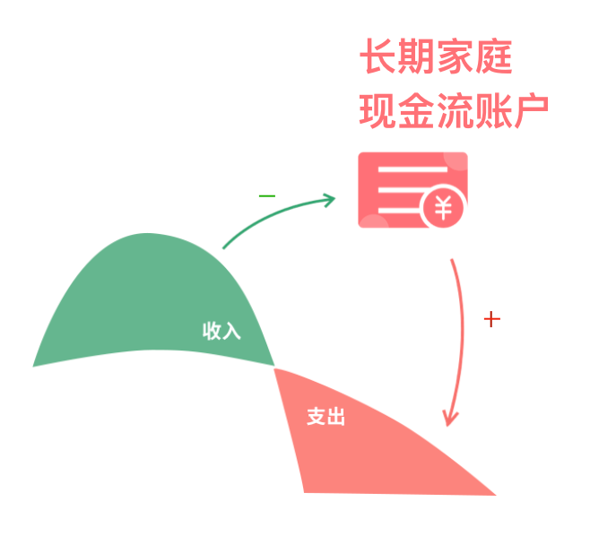

各位同学们, 小伙伴们大家好.

欢迎来到《保险实操营》. 懂原理, 不踩坑; 少花钱, 买对险.

上节课咱们一起分析了对比了低风险的投资产品, 发现储蓄型保险不仅收益高, 而且还能长期锁定高收益, 帮助我们实现财富的稳稳增长.

而我们进一步分析发现年金险和增额终身寿险是更能解决咱们孩子教育, 养老 等刚性需求的好理财产品.

这节课我们就来大家详细扒一扒这两款产品. 看下他们分别好在哪里, 以及两者的区别和对比.

上节课我们说到, 年金险相当于是一只可以超长待机的老母鸡, 可以一直给我们下蛋. 这其实是因为年金险可以根据与保险公司的约定, 提供任意时长的现金流.

除此以外, 年金险作为一种功能性很强的金融工具, 它的功能每一项都与家庭财富息息相关, 在我们管理家庭财富时优势明显.

整体来看, 目前市面上的年金险, 主要有以下五大功能, 我们逐一来看:

## 1、给孩子一个确定的未来

### (1)作为教育金

年金作为教育金, 可以为孩子储备未来上大学、读研、考博, 甚至创业的启动金, 说白了就是为孩子存一笔钱, 可读书可创业.

假设每年储蓄 5 万元, 连续十年, 通过时间的力量, 20 年左右的时间里, 帮助你顺利完成孩子的教育金和婚嫁金, 50 万变 100 万.

而如果咱们平时没有准备, 等孩子急需用钱时, 我们是否能轻易拿出上百万的资金呢?

年金险作为强制储蓄教育金的理财产品, 能给孩子未来提供稳定的现金流, 确保孩子未来教育不会因为父母的任何财务问题受到影响.

### (2)财富传承

对于一些家庭较为富裕的家庭, 年金险还可以作为财富传承的工具.

子女不一定能复制父母的创富技能, 作为父母的我们, 希望我们的子女生活越来越好, 那么必然会将一部分资产转移给子女, 却又不希望孩子因为过早拥有财富而败家.

此时可以利用年金险将财富逐步转移给子女, 因为年金险以分期交费的方式建立专门门账户, 父母拥有账户所有权, 孩子同时拥有所有权和使用权. 钱怎么传承给子女, 怎么花, 依然由父母决定.

而且这是专属子女的钱, 不会因为婚姻而改变. 通过合理合法将资产过渡到下一代, 规划好遗产税、赠与税等重税对传承的影响.

## 2、源源不断的养老金

一个人的收入不是一直增长的, 到了一定年限之后, 劳务性收入就会下滑, 到了老年之后, 基本没有劳动收入, 只有支出.

运用年金的转换功能, 把当下的收入锁定预留至未来, 建立家庭长期的现金流账户, 随时可以支出的现金账户.

那你可能还会问了, 为什么有了社保养老, 还要另外买养老年金呢? 原因有二:

(1)补充社保养老金不足

目前, 部分省市已经出现了养老金缺口, 在未来, 养老金缺口问题会越来越严重, 养老质量难以保障.

目前中国的人口结构出现了纺锤形, 老人越来越多, 年轻人越来越少.

2015 年, 我国老年人口突破 2 亿, 到 2030 年的时候, 中国预计进入超级老龄社会, 老年人比例超过 20%, 到 2050 年的时候, 预计有 4.5 亿老人.

根据目前测算, 我国的养老金在 2035 年就会达到入不敷出的阶段. 因此非常有必要给自己准备额外的养老资金.

(2)人口长寿化, 年金可以提供与生命等长的现金流

一百年前, 人均寿命只有 30 岁左右, 随着医学的进步, 中国人均寿命已经从 1981 年的 67 岁, 提升到 2010 年的 75 岁, 未来中国人均寿命还会继续增加, 达到发达国家的人均 80 岁寿命水平.

根据《中国人身保险业经验生命表(2010-2013)》数据, 现在 30 岁的女性, 有 45%可能性寿命超过 90 岁, 有 9.7%可能性寿命超过 100 岁.

寿命不断增加, 但是没有赚钱的能力, 就可能出现人活着, 钱没了的情况.

而终身型的年金险可以平衡我们一生的收支, 当年富力强时, 为年老时做储备. 养老年金, "活多久、领多久", 提供"与生命等长"的现金流.

## 3、锁定无风险高利率

年金能确保绝对稳健的前提下提供锁定长期复利. 而这个功能在全球利率下行的时代显得非常重要.

8 月 21 日, 德国发行零票息 30 年国债, 市场反应积极, 大量机构购买, 最低市场利率触底-0.272%.

9 月 12 日, 欧洲央行降息至-0.5%, 实行负利率.

目前全球主要地区央行一年利率, 除了中国, 普遍处于低位, 未来大概率还要继续走低.

而我国的一年期定存利率也从 1993 年的 10.98%降低到 2015 年的 1.5%.

各国金融市场从来不是一个孤立的个体, 在这种全球化背景之下, 我国作为世界第二大经济体, 无风险投资收益也会越来越低.

利率高低跟社会平均回报率的高低密切相关, 因此未来市场的投资回报也会逐渐下降.

银保监会正是看到了利率下行的趋势, 为了降低保险公司未来保单的兑付压力.

因此 2019 年 8 月 30 日, 银保监会发文, 要求长期年金责任准备金评估利率上限由年复利 4.025%降低至 3.5%.

而目前一些市面上预定利率 4.025%的年金险, 就可以终身锁定将近 4%的复利, 不管未来投资回报如何变化, 我们的保单都不受任何经济波动影响.

有人会说, 那 4.025%的预定利率也不高啊, 也许你忽略了这是复利.

以一款 4%复利的年金险产品来举例, 如果生息周期是 20 年, 则相当于单利是 6%, 如果生息周期是 40 年, 则相当于单利是 9.6%.

## 4、投资风险对冲

年金长期持有的特点, 能穿越经济周期, 确保绝对稳健的前提下提供锁定利率的复利, 在低息环境中也能提供长期稳定的收益, 这是其他金融资产难以做到的.

首先我们来看 2007 年~2017 年这十年间各类资产的表现, 除了保险, 没有任何资产是常胜将军.

专业的金融从业者都不能保证每年的资产收益为正, 何况普通家庭非金融从业人员.

而年金固定收益的特点, 非常适合用于做高风险投资的对冲.

从资料我们可以看到, 2013 年至 2018 年这 5 年, 100%的资金投资于沪深 300, 跑不过 50%投资于沪深 300, 另外 50%投资于固定收益 4%的年金.

投资高风险高收益理财产品, 虽然收益可能很高, 但亏损也同样也高. 投资 10 次, 只需要亏损 3 次, 就跑输给年化只有 4%复利的稳定增长.

我们再来看投资上证指数的周期和收益, 无论是过去 5 年, 还是 10 年, 甚至是 20 年的周期, 此类高风险投资的收益都难以令人满意.

我们追求更高的收益, 但高收益必然伴随高风险, 在做好安全垫的基础上追求高收益的风险投资, 可以让整个家庭的财富形成良性稳定的增长, 风险可控.

所以, 年金非常适合作为投资的风险对冲工具, 构建家庭底层资产.

## 5、强制储蓄

现在有很多年轻的朋友都是"月光族", 管不住自己"买买买", 能赚钱不代表能存下钱, 大部分人辛辛苦苦很多年, 却没有多少的积蓄.

甚至更常见的是, 经常有亲戚朋友找各种理由向你开口借钱, 那么必然会影响你的资金规划, 而且能不能拿回来也不知道.

此时把非必须花的钱投保年金, 不仅有较高收益, 还有个人财富的保护伞.

年金是把一部分钱变得没那么灵活, 前几年的现金价值没有回本, 退保会造成损失. 恰恰是这种不能轻易取现的特点, 不知不觉你就存下了一笔钱.

通过长期获得锁定利率保障, 来实现较高的稳定收益, 像滚雪球一样, 随着时间的累积和复利效应, 对我们的储蓄进行长期稳定地累积生息, 将是一笔很大的财富.
