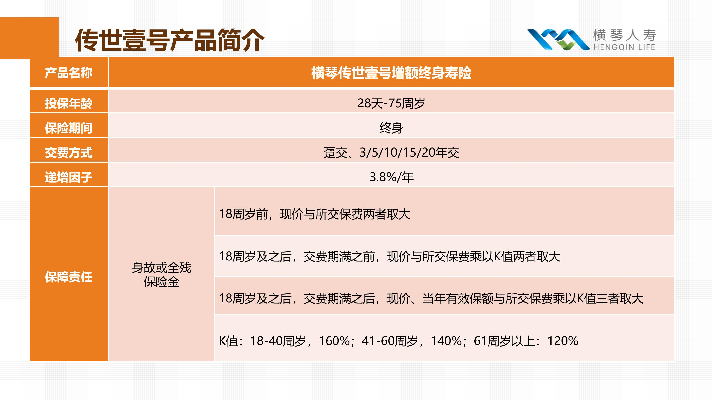

中午好, 我是"小财迷"班班. 作为一名资深"韭菜", 班班一直热衷于研究各式各样的"钱生钱"技巧.

从浩浩荡荡入场基金, 到现在股市里忙着买进卖出……一波操作之后, 真的有点儿累了.

现在, 让账户自己长大, 成了我最真实的愿望.

万万没想到, 这个愿望实现了, 甚至让资深"咸鱼"的我, 有了成为"富一代"的可能(想想就赤鸡).

那帮我实现心愿的到底是谁呢?

下面就请出今天的重磅嘉宾——增额终身寿险吧!

以下是来自嘉宾增额终身寿的自述:

我们是谁?

我们的优点有什么?

拉一个家族成员出来溜溜

## 一、我们是谁?

大家好, 我们是保险界的"新秀"——增额终身寿险, 属于寿险大家族的一员.

现在, 越来越多的人喜欢我们了, 我们甚至被一些粉丝当做是个人的"印钞机", 也许大家喜欢的, 就是我们的这种默默"钱生钱"的感觉…….

说实话, 如果把我们和基金、股票等等几位理财大哥相比, 我们可能只是一个小弟, 毕竟我们只能给你稳稳的幸福.

举个例子吧, 比如我们家族某个成员的年度有效保险金额是以 3.6%复利增长, 这些都是明明白白写在合同中的, 未来保单就会按照这个规则不断长大.

这里复利的威力不用我说了吧, 巴菲特称它为世界第八大奇迹. 大家看看下面巴菲特的资产增值情况就知道了.

"优秀的人往往相似", 这是我们的复利增长情况:

我们就是这样, 给我们一些"阳光与滋养", 终会长成"参天大树".

并且, 我们能"长大"多少, 这些数额都明明白白的写在了合同中, 受到银保监会"爸爸"及相关法律法规的监督管理.

所以, 大家几乎不用担心我们"长不大"的问题~

## 二、我们的优点是啥?

当然了, 除了给大家稳稳的幸福. 出道以来, 我们收获了很多粉丝, 尤其是我们具备的锁定收益属性, 受到了大家的追捧.

除次之外, 我们还有稳健增值、灵活存取、规避税务风险、平衡保障、储蓄和投资等诸多优点. 让我来给大家一一说道说道.

### 1. 稳健增值

我们的保额是按照固定利率逐年递增的, 当前市面上我们的预定利率是 3.5%左右, 保障终身.

大家不要看利率 3.5%觉得少, 现在银行 3 年期存款的利率 2.75%, 余额宝的利率从 7%到跌破 2%, 我们的 3.5%利率是保终身的, 是不会随着大环境的变化而降低的, 这样一看是不是就觉得, 这 3.5%简直有点良心!

### 2. 灵活存取

我们不像其他的保险一样, 我们是可以灵活支取的, 可以通过减保取现的功能支取部分的现金价值, 然后剩余的现金价值会按照合同约定的利率继续增长, 就跟在银行取现一样. 所以你也可以称呼我们为"保险界的取款机".

### 3. 可以规避税务风险

交税大家都不陌生吧, 但是随着不动产统一登记、个税、金税的不断展开, 未来可能还会征收房产税和遗产税, 而这些税种对于你们人类富人来说简直就是杀手一般的存在, 可能要交很大一笔税款.

但是我们不同, 我们赔付后就直接把赔偿金给到受益人, 不用你们交税, 这样就帮你们起到了一定规避税务的作用.

### 4. 保障、储蓄和投资三者平衡

购买我们你会相应获得身故/全残保障, 这起到了保障的作用; 我们每年复利增额起到了投资作用; 你们每年交的保费还可以以减保取现的方式提取出来, 这又起到了储蓄的作用. 我们集保障、储蓄、投资为一身, 所以当之无愧的成为了粉丝心目中理想的保险之一.

## 三、拉一个家族成员出来溜溜

接下来, 我就来跟大家详细说说我们家族其中一位优秀代表: 传世壹号增额终身寿

下面先看看它的保障内容:

它的预定利率是 3.8%, 保身故/全残责任, 支持减保、保单贷款, 可选投保人豁免的一款产品.

接下来就说一下它的优点在哪里?

### 1. 收益高, 每年 3.8%增长, 终身保证

过去粉丝常常爱购买收益较高的年金险, 但是自从去年 4.025%年金险退市后, 粉丝渐渐把目光放在了我们身上.

3.8%的利率在我们家族里算得上优秀, 并且这是白纸黑字写在合同中的, 受到法律的保护, 不受市场利率波动的影响, 保终身, 还有一定抵御通货膨胀的作用哦~

### 2. 支持减保取现、保单贷款, 比较灵活

我们家族的这位成员, 支持减保、加保、保单贷款, 非常灵活.

你们可以用于孩子教育费用、结婚资金或者是自己养老金的补充, 支取后, 剩余的保额还是可以继续 3.8%复利增额.

如果你短时间内需要大笔的资金, 这款保险还支持保单贷款, 可以贷款不超过现金价值的 80%, 按照合同约定的保单贷款利率, 每半年一个周期.

### 3. 权益变更、随心随意

基本保额变更: 在合同有效期内, 可以申请变更本合同的基本保险金额.

年金转换权: 这位优秀成员还支持年金转换, 你可以向保险公司申请, 按转换的年金合同约定给付年金

### 4. 投保门槛低

这位成员的投保门槛相比起其他产品来说比较低, 趸交 50000 元起投, 期缴 10000 元起投. 同类保险如信泰人寿的如意尊趸交要 100000 起投, 期缴要 50000 起投.

怎么样, 听完我们嘉宾的自述, 小伙伴们是不是已经非常心动的想要把它带回家了? 心动不如行动. 赶紧联系你的理财师帮你结合家庭资产情况设计个最适合你们家的稳稳变富计划吧~

## QA

【提问】增额终身寿险部分, 举了两个案例. 用增额终身寿险可以做教育金、做养老金.

但具体是怎么做我没有理解.

是不是说传世壹号这个产品, 可以有两种提取方法: A 教育金: 孩子 17-21 岁提 29 万, 28 岁提一部分; B 养老金:60 岁开始每年取 5 万?

还是别的意思?

【回答】增额终身寿险可以通过"加保"和"减保"的方式存取资金, 领取保单的现金价值, 可以年年领, 也可以某几年领一次. 并且它的现金价值回本快, 可随时进行教育金、养老金、婚嫁金的规划, 因此相较于年金险而言, 我们有更高的掌控度.

所以这是两种不同的领取方式

【提问】我理解是说: 增额终身寿险很灵活. 在保单的价值内, 可以取钱. 也可以往里存钱.

增额终身寿险本质上有点类似于一个利率较高的活期存款.

你看对吗?

【回答】增额寿险存取灵活, 可以根据自己的情况加保减保, 但你说的本质等同于一个活期存款还不太认同, 因为它本质其实是一个长期的存款

【提问】我这样理解是否可以:

用增额终身寿险, 在孩子出生的时候, 连续十年每年存 10 万, 就可以达成两个目标:

A 孩子上高中, 大学的时候, 每年取一部分钱, 用于孩子教育

B 一直等到孩子 60 岁, 每年领 5 万

【回答】

看这个图, 孩子可以从上高中时候就可以领取教育金或者之后领取创业金

等到 60 岁也可以开始领取养老金, 具体多少钱需要根据现金价值和自己情况待定

这个是每一个产品不同, 是需要仔细算的.

增额终身寿险这种保单, 是最狭义意义上的长期人寿保单, 所以是长期的呢, 等于在保险公司开了一个身故保障+储蓄账户, 投保人把钱放在里面以固定利率增长, 要用的时候再领取, 合同现金价值按照一定复利滚存生息, 放得时间越久, 增值越多.

【提问】增额终身寿和四大金刚里的寿险有什么联系?

【回答】增额终身寿险, 虽然名字里带有「寿险」二字, 但保障功能其实不强, 更像一个储蓄账前期把钱投入之后, 现金价值按照合同约定的收益率增值.

后期需要用钱的时候, 可以按合同约定的情况, 取出部分钱来使用, 剩余的钱还可以继续按约定的收益率增值.

最大的优势在于: 可以锁定终身收益, 不受市场利率波动的影响.

这类产品适合用来打理家庭的兜底资产, 不会有任何波动风险.

再进一步了解一下: 所谓的增额, 指的是年龄越大, 保额以固定利率增长, 保额会越来越多.
