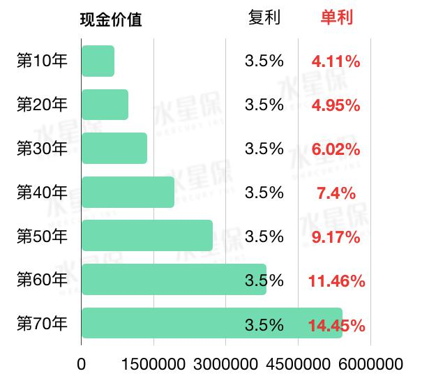
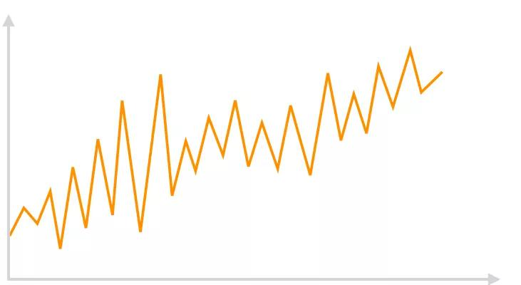
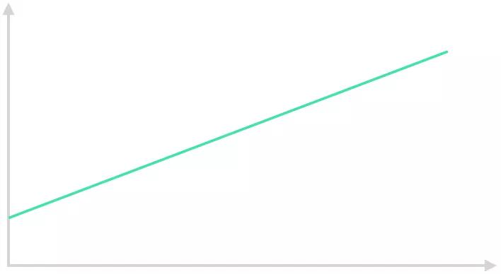
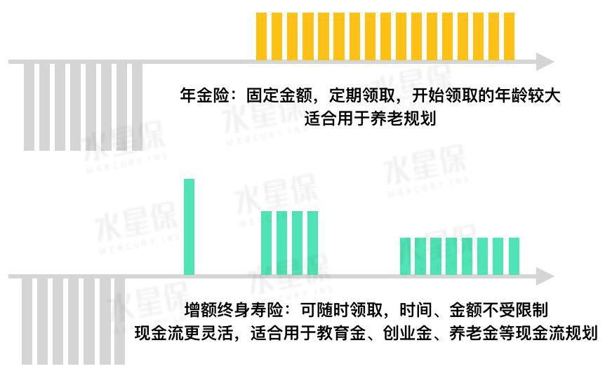
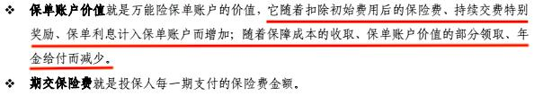
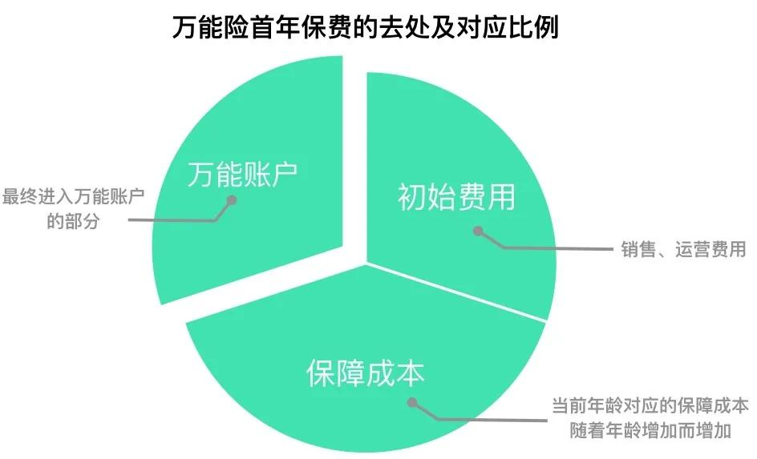

在高预定利率的年金险逐渐淡出市场之后, 一种名为增额终身寿险的品类突然火了起来.

不少业内人士表示, 增额终身寿险将代替年金险, 成为消费者安全理财的新选择.

今天我们就来聊聊这种保险, 主要内容包括:

一、增额终身寿险是什么?

二、增额终身寿险和年金险的区别?

三．万能险和分红险也能用来理财吗?

## 一、增额终身寿险是什么?

增额终身寿险, 是一个保额不断递增的终身寿险, 光听名字容易让人以为它和终身寿险差不多, 可以用来提供身故保障和财富传承.

实际上, 增额终身寿险是一个"另类", 由于具备回本快、资金取用灵活等特点, 更多被认为是一种"现金流规划工具".

这类寿险进行增额的具体表现是: 在缴费期完成之后, 保单的现金价值和身故保额开始以固定利率进行复利增长, 一直持续终身.

由于增额终身寿险的身故保额比较低, 一般只有现金价值的 1.6 倍, 所以我们交给保险公司的钱, 更多是以现金价值的方式存在保单中, 不会消耗在保障成本上.

保单中的现金价值, 是我们可以领出来的钱, 可以通过"减保"进行领取.

因此, 增额终身寿险, 我们其实可以把它理解为在保险公司开了一个身故保障+储蓄账户, 也可以理解为一张灵活取用、以固定利率不断复利增长的大额存单.

### 增额终身寿险的特点

### 1. 减保灵活

如果把增额终身寿险理解为一个复利增长的活期账户, 那么"减保"就是从这个账户里面"取钱".

减保没有时间和金额限制, 只要现金价值不是 0, 任何时候都可以减保. 现金价值就是我们可以减保的总金额.

### 2. 现金价值稳定复利增长

在缴费期完成后, 保单的现金价值和身故保额就会开始以每年 3.5%的复利进行递增. 每年复利 3.5%, 从长期来看影响是非常大的.

把复利 3.5%换算成单利, 也就是国债、银行理财、定期存款的计息方式, 前者收益率远远超过其他.

把一笔钱放入复利 3.5%计息的产品当中, 10 年后相当于获得了单利 4.11%, 20 年后就等于买了 4.95%的理财产品, 60 年后这个收益率甚至超过 11%.

(不同持有年限复利 3.5%折算后的单利收益)

与银行理财不同的是, 增额终身寿险已经把这个收益写进合同当中, 无论未来发生任何变化, 这笔钱都会稳定增长.

而在资管新规出台后, 银行理财已经不再保本保收益了, 净值跟随市场波动. 因此, 银行理财的净值变动是类似于这样的:

而增额终身寿险的现金价值变化是这样的:

由于保险公司具备非常强大的风险管理能力, 因此也只有它能够提供长期稳定增长、保本保收益的产品, 增额终身寿险便是其中之一.

## 二、增额终身寿险和年金险的区别

### 1. 资金使用灵活度

增额终身寿险: 只要保单中的现金价值不为 0, 里面的钱随时都可以拿出来, 对于金额、领取次数都没有限制. 只要现金价值一旦变成 0, 这份保单就会失效.

年金险: 灵活性相对弱一些, 只有到了约定时间才开始返还, 而且返还的金额以及频率都是在投保时约定好的, 不能再改变. 但这个钱活到老领到老, 无穷无尽.

具体的现金返还区别, 可以用这张图来表示:

### 2. 现金价值回本速度

增额终身寿险: 回本速度比较快, 一般在交费期刚结束, 或在交费期之前, 现金价值已经超过已交保费了.

年金险: 尤其是返还时间比较后的养老年金保险, 回本速度相对较慢, 一般要在交费期结束后, 现金价值才开始逐步增长.

考虑到两者的流动性不一样, 回本速度存在差异也是可以理解的.

增额终身寿险减保变现的灵活度比较高, 如果现金价值不能快速回本, 就会影响减保的金额.

养老型年金的返还时间比较长, 即使一开始现金价值比较低, 在开始返还前不断增长, 未来金额也会变得非常可观.

有些灵活性稍微高一点的快返型年金, 从交费期结束后第五年开始返还, 回本速度也很快, 和增额终身寿险差不多.

现金价值决定了这份保单值多少钱, 也决定了我们保单贷款可以借出多少钱.

我们手上没有太多现金时, 可以利用保单贷款功能借点钱来周转, 不仅贷款利息非常低, 而且不会影响到里面的现金价值继续增长.

### 3. 使用功能

增额终身寿险: 侧重于现金流规划, 可以年年领, 也可以某几年领, 适合用作未来的教育金、创业金、养老金等财务规划.

年金险: 在于防止"长寿"风险, 能为我们提供一辈子源源不断的现金流, 适合用于养老规划.

## 三、分红险、万能险也能用来理财吗?

有不少朋友会问, 分红险、万能险也有理财性质, 难道我的财务规划, 不能通过它们来实现吗?

首先我们需要知道, 分红险和万能险是什么?

### 1. 分红险

分红险, 除了重疾和身故保障以外, 还能在会计年度结束后, 根据保险公司的经营状况, 得到一定的分红.

这里的分红, 可以是直接给钱, 或者存入保单, 变成保额.

分红一共有三档, 分别是低档收益、中档收益和高档收益. 不过要注意的是, 无论是低档、中档还是高档, 都不是确定的收益, 保险公司承诺的, 只有分红险的保底收益, 通常为 1-2%.

分红险的分红, 主要是为了缓解保额跟不上通胀的问题. 我们国家对保险公司赋予的投资自由度比较低, 低风险、低收益的固收类资产占据大头, 而风险回报率比较高的权益类资产占比很小.

如果期望通过分红险进行投资理财, 获得比较理想的收益, 是不太现实的.

### 2. 万能险

"既保障又理财"是业务员推销万能险的黄金话术, 实际上万能险是一个非常复杂的品类, 可能有些业务员自己也搞不清楚.

万能险可以看作一个余额宝+消费型重疾险的组合. 我们交进去的钱, 扣掉当年的保障成本和初始费用后, 剩余的会放进万能账户收利息.

由于我们每年交的保费都是一样的, 但保障成本会逐年递增. 当保障成本高于年交保费时, 这中间的差额便要从万能账户中扣除.

由于万能账户的收益很难跟上逐年上涨的保障成本, 以及初始费用非常高, 所以在前几年, 只有一小部分保费能够真正进入万能账户增值.

(首年保费最终只有一小部分进入万能账户)

所交保费中大部分用于支付当年保障成本和初始费用, 只有较小一部分进入万能账户当中, 导致万能账户价值增长得非常缓慢, 而且很容易在中老年时期耗尽.

如果不继续往里面存钱, 保单便会失效.

所以, 万能险不能保终身. 考虑到未来有一天万能账户价值会耗尽, 即使里面的钱以较高利率结算, 我们还是要继续往里面存钱, 更不要说投资理财了.

想要同一份保险, 既能理财, 又要保障, 往往是不现实的.

所谓"集理财与保障于一身"的万能险满足了很多人"用一张保单解决多个问题"的懒人心理, 可是和钱相关事情, 往往没有捷径.

写在最后

无论是教育金规划、养老金规划, 还是中短期理财, 增额终身寿险都是一个很好的选择.

【提问】增额终身寿, 存取灵活, 是不是代表我买个 100w 的年金 / 10 年交, 第一年交 10w 块钱, 第二年如果需要 9w, 就可以直接拿出来?

【回答】从资金使用灵活度来看, 增额终身寿险只要保单中的现金价值不为 0, 里面的钱可以随时支取, 我们可以用来买房买车(但一般情况下, 班班不建议大家在缴费期还没结束就领取, 这样损失会有点儿大).

这里要提醒大家, 在买理财型的储蓄险前一定要想好, 这笔钱是不是未来比较长的一段时间内不会用到, 储蓄计划是通过时间来换取回报, 而最大的风险就是提早领取资金可能引致损失.
