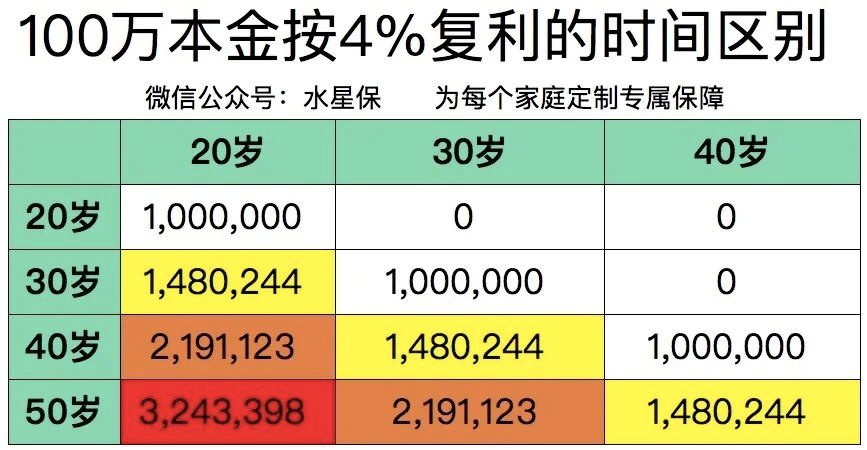

更重要的是小伙伴一定要记住无论是增额终身寿险还是年金险, 都是靠时间实现复利价值. 所以越早规划对我们的资产增长是越有利的.

我们可以看一下, 同样是 100 万本金, 分别在 20 岁、30 岁、40 岁开始, 以 4%收益率, 做一个固定增值的储蓄计划, 到 50 岁的时候, 分别能获得多少收益.

100 万按 4%固定利率复利滚动:

20 岁开始, 到 50 岁, 我可以得到 324 万;

30 岁开始, 到 50 岁, 我可以得到 219 万;

40 岁开始, 到 50 岁, 我只能得到 148 万.

只要我们选择了这个投资品类, 它赚取的就是时间钱.

它不像股票涨涨跌跌, 股票不仅不是收入, 还是支出.

真正的被动收入, 不会占用我们的体力、脑力. 它只跟时间做朋友, 时间越长, 收益越大.

越早开始规划, 复利的增长效应越明显.

好啦, 以上就是这节课的全部内容啦, 咱们一起来总结下

到这节课为止, 我们对于杠杆账户和安全账户的规划已经基本完成啦.

这意味着无论是规避风险的四个人身保险还是资产保值增值的储蓄型保险我们都已经学会如何给自己规划啦.

当然, 别忘了, 如果具体到个人的规划问题上大家还是有这样那样的疑问, 都可以联系我们专业的资产配置专家替你解答哦.

很高兴大家坚持到这里, 后面的课程, 我们主要集中讲下买保险大家会关心的问题. 比如合同怎么看? 以及怎样才能避免理赔纠纷? 大家一定要坚持到最后哦. 咱们下节课见呀~
