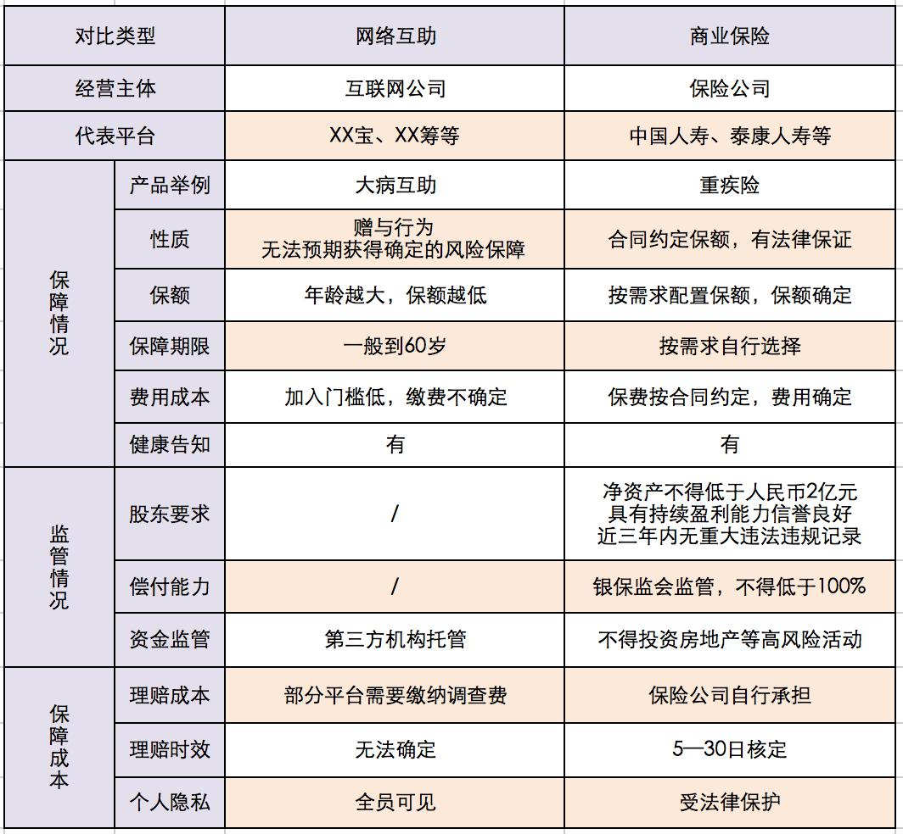

小伙伴们中午好呀, 今天的午间课堂马上就要开始啦! 大家的小板凳都准备好了吗?

今天是午分享的第四天, 班班也知道大家刚学过小白理财训练营, 对理财有了清晰的认识, 大家在小白营中也学过不少与保险有关的知识, 所以相信咱们对保险也有了一个基础的认知.

俗话说: 小病输掉一头牛, 大病卖掉一栋楼; 辛辛苦苦几十年, 一病回到解放前. 一场大病, 往往能够摧毁一个家庭.

所以我们会对保障越来越重视. 可是随着互联网的发展, 就连生病也要先问问百度, 在忐忑中战战兢兢去医院.

于是许多网络互助平台应运而生, 比如现在网络上流行的"大病必备": XX 筹、XX 宝, 当大病到来时, 到底哪种靠谱呢?

估计大家都在朋友圈里, 看过别人发"请大家帮帮忙"的捐款链接, 也许真给经济困难的家庭带来了一丝希望.

所以, 渐渐地就有不少人会认为网络互助平台更优于有各种条款限制的商业保险, 是大病来临的首选.

那么这些网络互助平台, 真的比商业保险要好吗? 今天班班就来跟大家探讨一下.

## 一、网络互助平台真的可信吗?

XX 宝、XX 筹, 它们是近几年兴起的网络互助平台代表, 是一种为广大民众打造的低门槛大病保护计划.

为什么这么多人加入它们?

原因 1: 门槛相比较低

只要符合健康告知的条件就可 0 元加入, 先保障, 后期再分摊费用. 比如 XX 宝的健康告知相比商业保险产品就会较为宽松一些.

原因 2: 费用分摊少

截止到目前, XX 宝近期分摊的费用维持在一月两期, 一期三元左右. 比起商业保险的保费, 每次投入的还是相对比较少一点, 保障杠杆还是挺高的.

原因 3: 覆盖疾病全

XX 宝保障恶性肿瘤+99 种重症疾病, 覆盖疾病还算全面.

但是大家有没想过一个问题, 大病降临时, 这些大病筹款靠得住吗?

众筹其实就是很多人在走投无路时, 发起求助, 大家通过网络进行无偿捐款, 并没有范围限制.

就像我们在朋友圈看到的一样, 把病人的身份信息和病例证明放到筹款平台上, 生成一个链接, 通过微信、QQ 等社交媒体传播来筹集捐款.

一场大病治疗费用一般在 20-50 万之间, 对于一般的家庭难来说, 负担还是不轻的, 所以大病筹款对于一些真正需要帮助的人来说, 确实是一种办法.

只不过, 这种办法一定行得通吗? 我们来看看这组网络上的数据:

我们可以看到"253 万个家庭, 筹集善款总额超过 255 亿", 其实平均下来每个家庭也就 1 万左右.

筹资目标总额:2105 万. 实际筹资总额:600.3 万.

由上图可见, 筹资的成功率只有 29%, 筹款缺口还是不小的, 能不能筹到还要看自己的人脉、人品及身边人的经济水平.

XX 筹实质上是大病众筹, 是种慈善行为而非商业行为. 在 XX 筹平台获得帮助的人群也很多, 但是当善意逐渐"商业化"时, 背后的不少不尽人意也不可忽视.

前段时间有一则新闻, 关于 XX 筹医院扫楼筹款引发舆论热议.

其中工作人员自称"志愿者", 按单提成, 对募捐金额填写随意, 对求助者财产状况不加审核甚至有所隐瞒, 对捐款用途缺乏监督.

当公益沦为商业, 善意被欺骗, 信任便产生危机了. 由此产生的后果是没人愿意捐款, 筹不到钱, 真正需要钱治疗的人得不到钱进行后续治疗, 只能拖延病情.

所以众筹是大病之时的最后一道屏障, 是无奈之选, 不能把它作为保障.

很多人认为 XX 宝是保险, 其实不是的, XX 宝是一种网络互助计划, 在他人患病产生赔付时才参与费用分摊, 自身患病则可一次性领取保障金, 保障包括恶性肿瘤在内的 100 种大病.

本来初衷是挺好的, 但是近段时间, XX 宝也出现了不少的争议, 主要来自以下方面:

方面 1: 用户分摊金额快速上涨, 从几分钱到几块钱, 涨幅还是很大的;

方面 2: 高发重疾调低互助金甚至除外, 比如确诊的轻度甲状腺癌互助金调低至 5 万元, 最终被移出保障范围;

方面 3: 互助金发放时效长, 有的甚至从确诊到收到互助金时间长达半年之久.

值得关注的是, 40 岁前赔 30 万, 40 岁后赔 10 万, 60 岁自动退出, 而重疾高发年龄在 40-60 岁, 如果单纯靠 XX 宝的 10 万保障真的够吗?

从长期来看, 这些不确定因素从某种程度上来说就像一颗颗定时炸弹, 说不定哪一天就会爆炸. 因为病可不会等到你有钱了再发作.

XX 宝只能作为家庭保障规划中的"小菜", 更全面的风险保障规划才是"主菜".

## 二、它们和保险的区别是啥?

网络互助在我国刚刚兴起, 事物的发展都是过程性的, 我国网络互助目前还处于不断探索的阶段.

网络互助跟商业保险还是有所不同的:

### 区别 1、保障范围不同

互助计划以 XX 宝为例:

大病互助计划对于 39 岁以下的用户, 保障额度为 30 万;

40-59 岁的用户, 保障额度为 10 万;

针对 60-70 岁人群推出的老年防癌计划, 保障额度为 10 万;

简单来说, 年轻时加入保障额度是 30 万, 等上了 40 岁, 保障额度就会自动下降到 10 万. 随着年龄的增长, 重疾患病率上升, 保额反而急剧下降成 10 万. 而且在 60 岁这个退休节点上自动退出, 这时正属于疾病高发年龄段, 已经很难再买重疾险.

像肺癌、肝癌和胃癌三大疾病排名居首, 治疗费用平均 50-60 万元. 所以 10 万明显是不够的.

我们再来看看商业保险, 以 50 万保额重疾险为例, 比起互助的优势在于什么:

优势 ① 年轻及时配置长期重疾险, 老了依旧有保险保障;

优势 ② 保额也不会随着年龄的增长而改变, 达到重疾条件即可获赔;

优势 ③50 万保额既可用于高额的医疗费用, 又可弥补治疗期间的收入损失;

优势 ④ 只要你身体健康, 年龄在 55 周岁以下, 会有很多重疾险产品供你选择, 而且可以选择保障终身.

当然啦, 预算足够的话, 还可以选择配置更高保额, 保障更有力.

### 区别 2、理赔过程不同

在互助计划中:

要把我们个人情况和隐私在平台公示 7 天, 发起求助之后个别平台需缴纳 2500-4000 元调查费, 不管项目能否通过, 都不退还.

因需要调查、个别需要赔审团决议, 所以理赔耗时不确定, 如果真生病了, 谁耗得起啊.

对于商业保险来说:

所有理赔服务都是隐私保密的, 理赔调查费由保险公司承担, 我们不需要自己缴纳调查费用.

而且《保险法》中对保险理赔有明确时间限制, 通常保险公司不论在什么情况下进行理赔, 从报案材料审核到给出理赔结果的时间不能超过 30 天.

其实说实话, 很多人用网络互助平台也是无奈之举, 说句不为过的话, 这等于把命交给别人手里没什么区别. 因为实在没有提前给自己做好保障.

如果有条件, 只要不是极度贫困的话, 班班还是建议大家首选商业保险, 把握主动权.

而在监管方面, 保险公司、保险产品受到银保监会严格监管, 发现任何违规行为, 可以向银保监会投诉, 银保监会调查后予以惩罚.

很多人在买保险时会犹豫:"这个保险是不是假的?"、"保险公司倒闭了我的保单怎么办?"有保单合同、国家兜底呢, 不用担心.

说实话, 在保障方面, 可能没有比保险更全的了.

承担意外伤害的意外险、承担医疗费用的医疗险、补偿收入损失重疾险、身故即赔的寿险......

这四大基础险种作用不同, 但分工明确, 共同构成一个完善的家庭保障体系.

最重要的是, 大家要根据家庭的具体需求和条件, 选择适合自己的产品, 这样才能做到性价比最高, 不花冤枉钱哦!

保险作为现代金融的三大支柱之一, 历经几百年的发展, 保障、理赔、运营和监管体系非常完善, 成熟度远非大病互助和众筹可比. 所以我们还是在力所能及的情况下配置好适合自己的保险更有保障

互助是古老的风险共担机制, 互联网让它重新开始焕发, 但实际上, 互助只是互助, 是风险共当, 互助不是保险, 互助会关闭, 互助有风险, 给客户提供持久保障的, 还是保险

前几天, 又一家网络互助平台宣布关停了, 这次是新浪, 2020 年 1 月 9 日上线至今, 仅有一年半时间, 这已经是第 8 家关停的网络互助平台了.

最近, 2021 年 12 月 28 日, "相互宝"公告称, 自 2022 年 1 月 28 日 24 时起停止运行.
