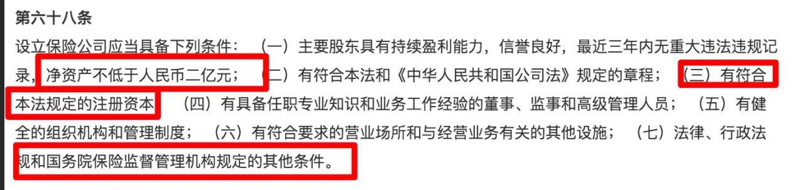
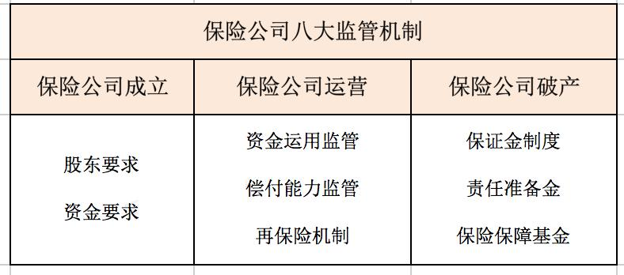
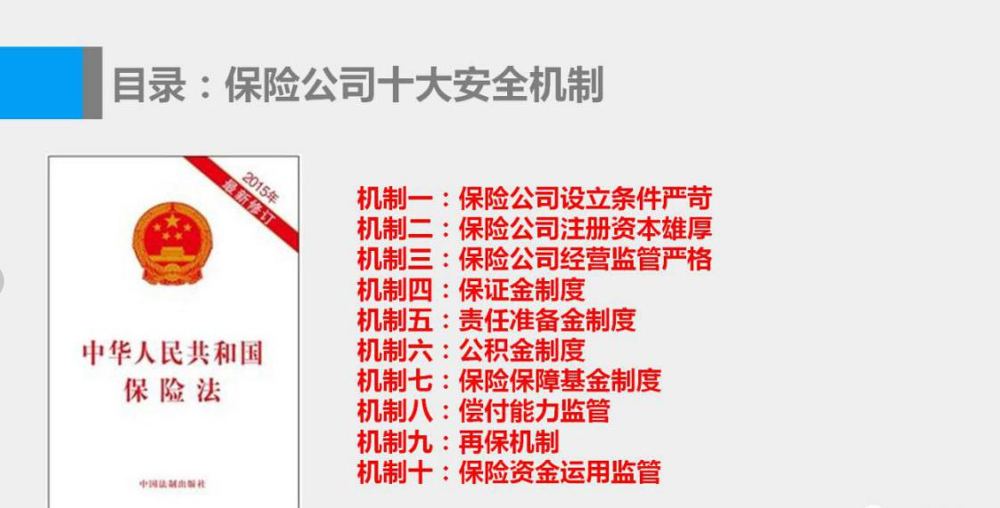
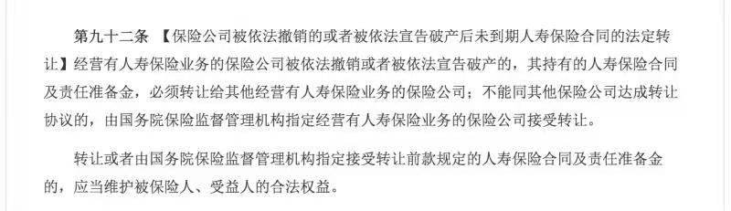
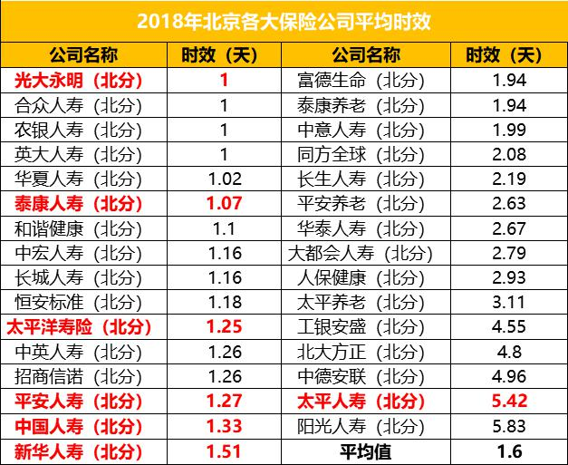

小伙伴们大家好呀, 今天我们来讲一个常人难以判断的问题, 那就是: 买保险到底要不要纠结保险公司大小的问题.

在班班的学员中, 有很多小伙伴在购买保险的时候, 经常会纠结一个问题, 那就是"这个保险公司名气够不够大?"总觉得一些保险公司没听过, 不放心.

会纠结这个其实很正常, 因为在纠结保险公司大小问题的背后, 困扰他们的实际都是这些担忧:

这个保险公司都没听说过, 是不是很小?

万一小公司倒闭了怎么办?

小公司耍赖不赔怎么办?

到时候小公司会不会跑路找不到人?

……

这么多问题怎么解决啊, 那么买保险, 真的要在乎保险公司大小吗? 答案是: 完全没必要

为什么? 别着急, 现在班班就带着大家一条一条击破, 解开最终谜题.

其实说到底我们真正关心的是: 买的保险靠不靠谱? 真出事了能不能赔? 这里班班想给大家两个关键词:【安全性】和【理赔】

今天我们就从五大方面, 全方位剖析给大家看.

## 一、保险公司靠什么赚钱?

在很多人的眼里, 保险公司就是靠着拒赔赚钱, 发生保险事故后, 保险公司故意不赔从而赚着黑心钱.

事实上, 这种理解大错特错.

保险公司不是福利机构, 所以目的当然是为了赚钱, 这点无可厚非. 保险公司又是靠着什么赚钱呢?

保险公司的利润来源于风险差(发生率差)、利差、费差.

① 风险差, 比如少人死亡, 自然少赔付;

② 利差, 保险产品都有预定利率, 比如预定利率是 4%, 但是实际上保险公司投资后回报是 5%, 那么自然赚钱了;

③ 费差, 运营一款产品的费用本来准备 200 万, 最后只花了 150 万, 自然也是赚钱.

这三差之和就是保险公司的主要利润来源, 所以冒着声誉被毁就为了少赔付几单, 冒着监管的高压就为了省那么点钱, 犯不着.

保险理赔其实很简单, 就是看合同条款, 符合就赔, 不符合就不赔, 只要你当初填写健康告知的时候是如实告知的, 那么保险公司很乐意赔.

同时, 保险公司这样做, 既可以改变社会对保险的误解, 也可以获得更好的知名度.

## 二、保险公司的门槛到底有多高?

保险公司成立的标准, 保险法明确规定净资产不低于人民币二亿元, 管理层选拔非常严格, 每一家保险公司成立都要经过银保监会一系列审核.

很多人判定是否大公司, 往往依靠直觉, 看看周边人是否听过, 广告多不多, 名气大不大等等.

但名气不代表实力, 比如有个叫众安保险的, 名气不算高, 但说起股东你们都会知道, 马云和马化腾.

你要知道目前国内也不过 200 多家保险公司, 现在在银保监会排队等牌照的公司的起码上百家!

保险法规定开一家保险公司注册资本起码有 2 亿元人民币实缴资本, 并且保监会对出资方的政治审核更是严厉到极致, 保险牌照也是相当难拿的.

所以无论是从资金上还是从制度上来说, 只要是保险公司就不存在是小公司. 记住啦, 大小公司不是看名气的哦, 不要凭直觉拍脑袋了哦

## 三、保险公司会破产倒闭吗?

很多线下保险业务员会跟客户宣传, 保险公司都是不能倒闭的, 不允许破产的.

班班在这里有一说一, 这大概是保险行业里最大的谎言之一. 保险公司是允许破产的, 但不会倒闭.

而且保险公司情况跟一般公司不一样, 实际上目前国内没有一家保险公司破产过.

因为注册资金、股东实力都只是初始设置, 保险公司的稳健运行, 还有各种监管制度把关.

日常监管:

保险公司每季度末/年末向监管部门报送偿付能力报告、财务会计报告、精算报告、合规报告等, 一旦不达标, 就会被立即勒令更改.

以此来确保保险公司有能力在 99.5%的概率下, 无论发生任何事件都不会倒闭.

除此之外, 还有各种制度托底

比如保险保障基金, 是由保监会、财政部和人民银行共同发起设立, 保险公司每收一笔保费, 就要拿出 0.05%-0.08%的比例缴纳基金, 一旦发生极端风险, 就会用这支基金进行救助.

在这种先进的全面的监管下, 咱老百姓持有的保单是世界所有国家最安全的. 就算万一有天发生极端情况, 中国保险保障基金公司也会提供救助.

另外银保监会也会将保单转移到另一家保险公司承保, 所以完全不用担心哪一家保险公司不给理赔的问题.

保险公司可以破产, 但不会突然解散.

公司解散就是说走就走; 公司破产, 就是资不抵债, 不得不走.

两个还是稍微有些区别的. 除非银保监爸爸撤销, 保险公司是不能说走就走的; 而资不抵债, 不得不走的话, 需要先清还债务.

不论是被依法撤销, 还是被依法宣告破产, 我们的保单权益是不会受到任何损失的.

这是因为:

所以说, 即使保险公司破产, 我们的保单合同依然有效, 大家完全不用担心.

## 四、大公司的理赔速度比小公司的快?

这样的顾虑很多人都会有, 其实大家不用担心, 理赔效率跟公司大不大没有任何关系.

我们来看看一组北京的保险公司的理赔速度:

从上图看, 各家公司理赔平均时效在 2 天左右.

光大永明(1 天)与平安(1.27 天)、国寿(1.33 天)、太平人寿(5.42 天)的理赔数据对比, 也说明了并不是保险公司越大, 理赔就越快.

## 五、大公司的服务就更好?

与理赔不同, 服务是用户的主观体验, 很难量化.

上淘宝买个东西人家回的稍微慢些, 都能引起投诉, 客服电话接通不及时、报案未及时响应、客服人员态度一般, 都可能导致用户投诉.

这些具体的事情, 不要说不同保险公司会有差别, 即使是同一家公司, 不同时间提供的服务也会有差别.

所以, 服务水平真的和保险公司大小没有关系, 主要还是看能否满足用户的需求.

那么买保险, 如果不用在乎保险公司大小, 真正要在意的又是什么呢?

我们记住三看一问: 看保障范围, 看合同条款, 看保费性价比, 以及问问自己, 这份保险是否适合你.

比如你是家里的经济支柱, 有房贷、车贷, 那么建议买一份重疾险和寿险, 保障周全的同时选择价钱便宜的即可.

关于费用班班这里再啰嗦两句, 有人说大公司产品好, 贵的就是好的, 这种想法要不得, 是不够理性的.

作为一个学过投资理财、能够看清问题本质的小伙伴.

班班提醒大家: 购买保险时, 我们更应该关注保险产品本身, 看看它的保费是不是便宜、保障是不是全面、能不能满足自己的需求, 以此决定要不要配置这款产品~

所以, 重要的事情说三遍!

最最重要的, 还是要看这款保险产品本身适不适合自己!

最最重要的, 还是要看这款保险产品本身适不适合自己!

最最重要的, 还是要看这款保险产品本身适不适合自己!

要记住, 要认清我们买保险的本质哦, 否则在认知起点我们就输了. 毕竟我们是买的是保险产品, 而不是保险公司!

比如:

【1】过了生日保费会上涨, 即将过生日的小伙伴.

【2】保险意识很棒, 原先配置过部分, 但需要调整和补充的.

【3】虽处在人生重要阶段, 尤其是家庭经济支柱, 保障还不完善的.

【4】初入社会的小白(熬夜党、加班狗等), 还处于裸奔状态的.

等等......
